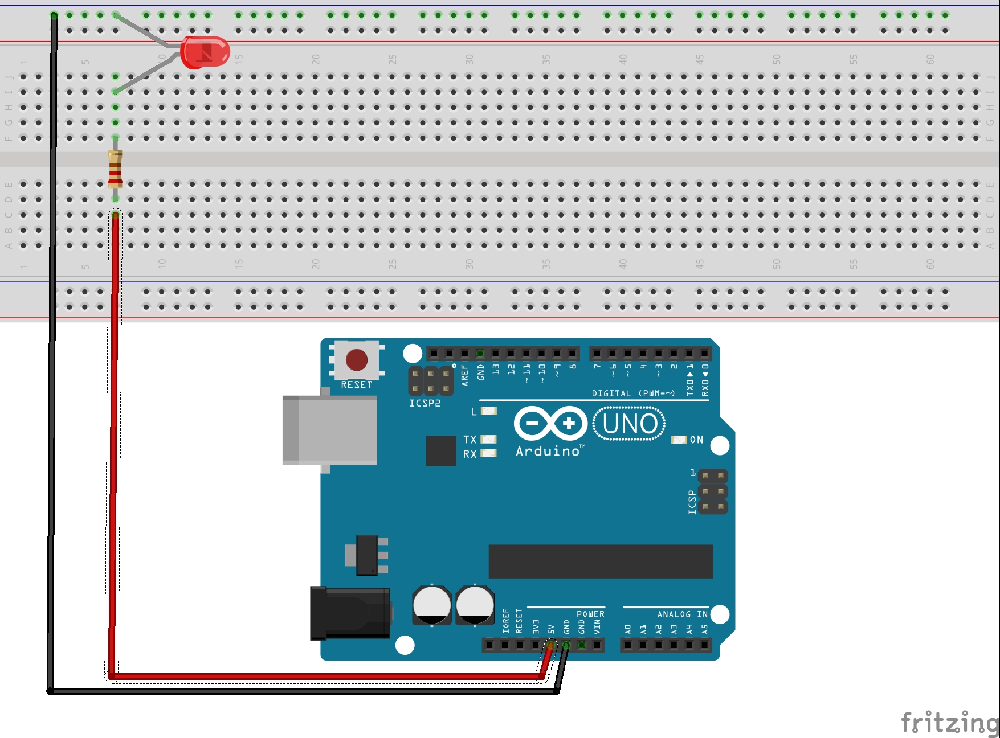
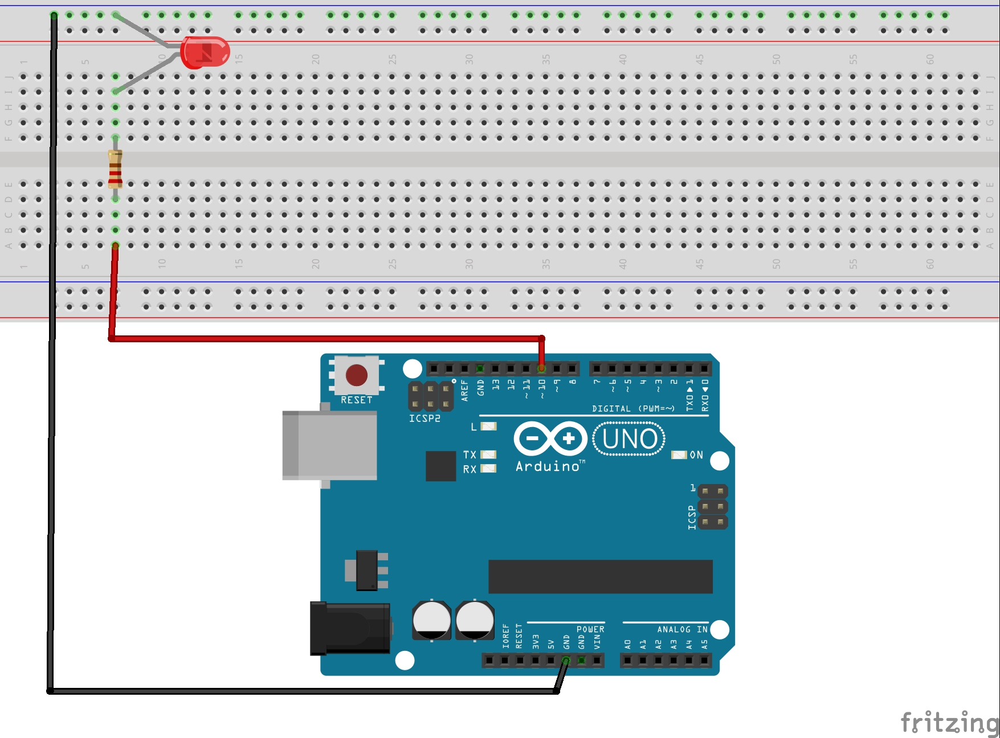
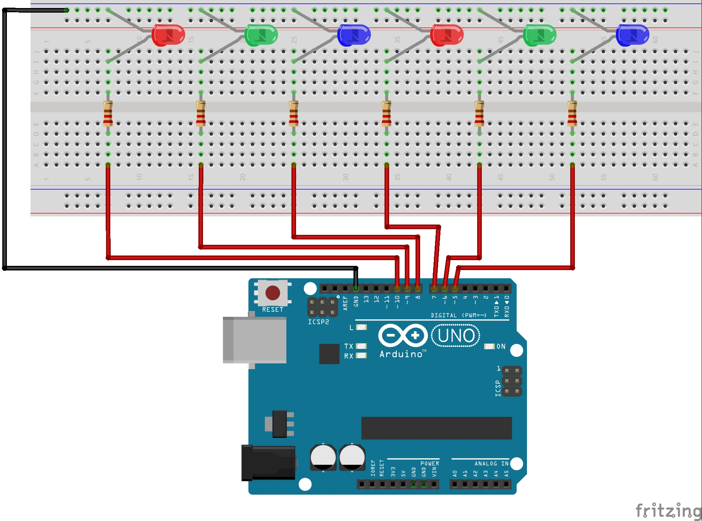
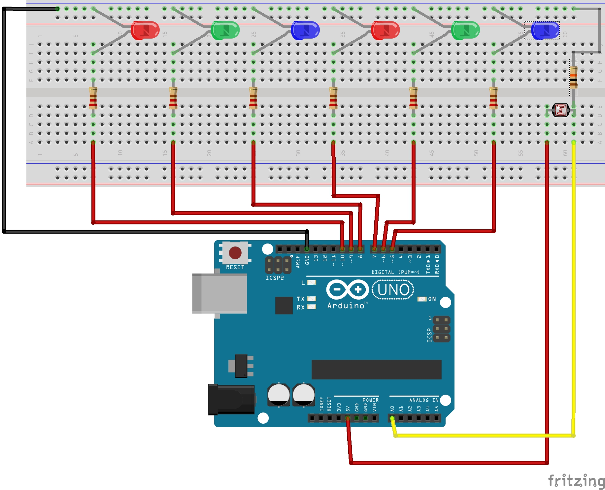

# Arduino


### Lista Functiilor:

#### \*pinMode(pin, mode)

pin: the number of the pin whose mode you wish to set

mode: INPUT, OUTPUT

#### \*digitalWrite(pin, value)

pin: the pin number

value: HIGH or LOW

#### \*delay(ms)

ms: the number of milliseconds to pause

#### \*Serial.begin(speed)

speed: in bits per second

#### \*Serial.println(val)&#x20;

val: the value to print - any data type

#### \*analogRead(pin)

pin: the number of the analog input pin


### Exercitii:

#### &#xD;Ex.1 Cum aprindem un led.

Pentru acest circuit arduino va avea rol de sursa de alimentare (baterie).




#### Ex.2  Cum controlam comportamentul unui led cu arduino.

Folosim arduino pentru a controla comportamentul unui singur led.



```
#define led1 (10)
#define timp (250)



void setup() 
{

pinMode( led1,OUTPUT);
}


void loop() 
{
digitalWrite(led1,HIGH);
delay(timp);
digitalWrite(led1,LOW);
delay(timp);
}
```


#### Ex.3 Cum contrololam comportamentul unei fasii de led-uri .



```
#define led1 (10)
#define led2 (9)
#define led3 (8)
#define led4 (7)
#define led5 (6)
#define led6 (5)
#define    timp (250)

void setup() 
{
pinMode( led1,OUTPUT);
pinMode( led2,OUTPUT);
pinMode( led3,OUTPUT);
pinMode( led4,OUTPUT);
pinMode( led5,OUTPUT);
pinMode( led6,OUTPUT);
}

void loop() 
{
digitalWrite(led1,HIGH);
delay(timp);
digitalWrite(led1,LOW);
digitalWrite(led2,HIGH);
delay(timp);
digitalWrite(led2,LOW);
digitalWrite(led3,HIGH);
delay(timp);
digitalWrite(led3,LOW);
digitalWrite(led4,HIGH);
delay(timp);
digitalWrite(led4,LOW);
digitalWrite(led5,HIGH);
delay(timp);
digitalWrite(led5,LOW);
digitalWrite(led6,HIGH);
delay(timp);
digitalWrite(led6,LOW);
delay (timp);
digitalWrite(led6,HIGH);
delay(timp);
digitalWrite(led6,LOW);
digitalWrite(led5,HIGH);
delay(timp);
digitalWrite(led5,LOW);
digitalWrite(led4,HIGH);
delay(timp);
digitalWrite(led4,LOW);
digitalWrite(led3,HIGH);
delay(timp);
digitalWrite(led3,LOW);
digitalWrite(led2,HIGH);
delay(timp);
digitalWrite(led2,LOW);
digitalWrite(led1,HIGH);
delay(timp);
digitalWrite(led1,LOW);
delay (timp);
}
```


#### Ex.4 Cum folosim un sensor pentru a controla comportamentul fasiei de led-uri.



```
#define led1 (10)
#define led2 (9)
#define led3 (8)
#define led4 (7)
#define led5 (6)
#define led6 (5)
#define timp (250)

void setup() 
{
pinMode( led1,OUTPUT);
pinMode( led2,OUTPUT);
pinMode( led3,OUTPUT);
pinMode( led4,OUTPUT);
pinMode( led5,OUTPUT);
pinMode( led6,OUTPUT);
Serial.begin(9600);
}

void loop() 
{
cutie= analogRead(A0);
Serial.print("intensitate lumina ");
Serial.println(cutie);
delay(200);

if (cutie <500)
{
digitalWrite(led1,HIGH);
delay(timp);
digitalWrite(led1,LOW);
digitalWrite(led2,HIGH);
delay(timp);
digitalWrite(led2,LOW);
digitalWrite(led3,HIGH);
delay(timp);
digitalWrite(led3,LOW);
digitalWrite(led4,HIGH);
delay(timp);
digitalWrite(led4,LOW);
digitalWrite(led5,HIGH);
delay(timp);
digitalWrite(led5,LOW);
digitalWrite(led6,HIGH);
delay(timp);
digitalWrite(led6,LOW);
delay (timp);
digitalWrite(led6,HIGH);
delay(timp);
digitalWrite(led6,LOW);
digitalWrite(led5,HIGH);
delay(timp);
digitalWrite(led5,LOW);
digitalWrite(led4,HIGH);
delay(timp);
digitalWrite(led4,LOW);
digitalWrite(led3,HIGH);
delay(timp);
digitalWrite(led3,LOW);
digitalWrite(led2,HIGH);
delay(timp);
digitalWrite(led2,LOW);
digitalWrite(led1,HIGH);
delay(timp);
digitalWrite(led1,LOW);
delay (timp);
}
}
```

#### Exemplu de cod in care este implementat ciclul FOR:

```
#define led1 (10)
#define led2 (9)
#define led3 (8)
#define led4 (7)
#define led5 (6)
#define led6 (5)
#define timp (250)
int nr_repetari=4;
int contor=0;
int cutie;

void setup() 
{
pinMode( led1,OUTPUT);
pinMode( led2,OUTPUT);
pinMode( led3,OUTPUT);
pinMode( led4,OUTPUT);
pinMode( led5,OUTPUT);
pinMode( led6,OUTPUT);
Serial.begin(9600);
}


void loop() 
{
cutie= analogRead(A0);
Serial.print("intensitate lumina ");
Serial.println(cutie);
delay(200);


if (cutie <500)
{
for(contor=0;contor<=nr_repetari;contor++)
{
digitalWrite(led1,HIGH);
delay(timp);
digitalWrite(led1,LOW);
digitalWrite(led2,HIGH);
delay(timp);
digitalWrite(led2,LOW);
digitalWrite(led3,HIGH);
delay(timp);
digitalWrite(led3,LOW);
digitalWrite(led4,HIGH);
delay(timp);
digitalWrite(led4,LOW);
digitalWrite(led5,HIGH);
delay(timp);
digitalWrite(led5,LOW);
digitalWrite(led6,HIGH);
delay(timp);
digitalWrite(led6,LOW);
delay (timp);
digitalWrite(led6,HIGH);
delay(timp);
digitalWrite(led6,LOW);
digitalWrite(led5,HIGH);
delay(timp);
digitalWrite(led5,LOW);
digitalWrite(led4,HIGH);
delay(timp);
digitalWrite(led4,LOW);
digitalWrite(led3,HIGH);
delay(timp);
digitalWrite(led3,LOW);
digitalWrite(led2,HIGH);
delay(timp);
digitalWrite(led2,LOW);
digitalWrite(led1,HIGH);
delay(timp);
digitalWrite(led1,LOW);
delay (timp);
}
}
}
```
