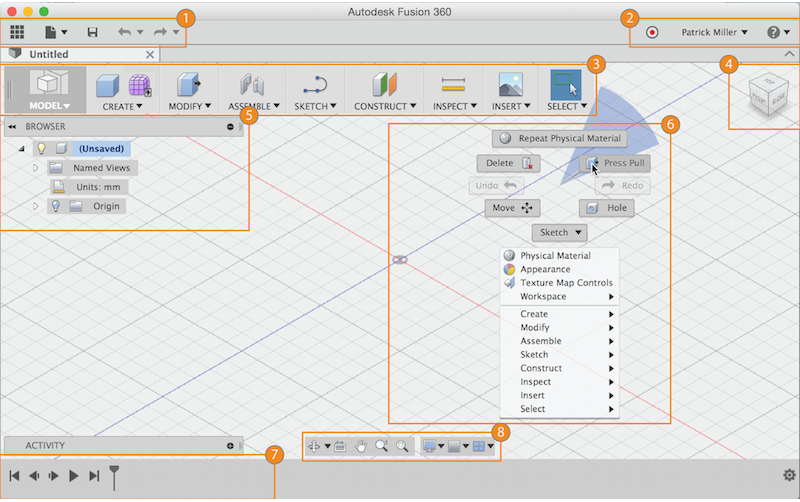

# Fusion 360 Intro

## What is Fusion 360

F360 este un produs CAD (computer aided design), pentru începătorii și entuziaștii în modelare 3D - pentru fabricare pentru modelare parametrică sau free form. F360 folosește resursele calculatorului dar și rulează procese în cloud (rendering, simulare).

## User Interface

1. **Application bar:** Access the Data Panel (that allows quick access to your design files), file operations, save, undo and redo.
2. **Profile and help:** In profile you can control your profile and account settings, or use the help menu to continue your learning or get help in troubleshooting.
3. **Toolbar:** Use the Toolbar to select the workspace you want to work in, and the tool you want to use in the workspace selected.
4. **ViewCube:** Use the ViewCube to orbit your design or view the design from standard view positions.
5. **Browser:** The browser lists objects in your design (everything from planes and sketches to parts and assemblies). Use the browser to make changes to objects and control visibility of objects.
6. **Canvas and marking menu:** Left click to select objects in the canvas. Right-click to access the marking menu. The marking menu contains frequently used commands in the wheel and all commands in the overflow menu.
7. **Timeline:** The timeline lists operations performed on your design. Right-click operations in the timeline to make changes. Drag operations to change the order they are calculated.
8. **Navigation bar and display settings:** The navigation bar contains commands used to zoom, pan, and orbit your design. The display settings control the appearance of the interface and how designs are displayed in canvas.
9. In preferences check the&#x20;


More explanaition on F360 Learn page


## First steps

### Setup

1. In „Preferences” under „Preferences controlling general UI behavior” change „Default modeling orientation” from „Y up” to „Z up”.
2. In „Preferences” under „Default units” make sure the „Default units for new design” are in mm.

### First design

Design process in F360 could be optimized to use the software's most strong points. In this order, the following process it is proposed as an ritual or routine before starting each new project.

1.  **Save file**

    F360 auto-saves automatically your design on cloud only after it is saved. As the software is in constant improvement, sometimes crashes happen. To prevent data loss, first step for each design - save your file.
2.  **Create new component**

    In the "browser" hit right click on your mouse on the main component that has the name you put for your file and create a new component. Each new part in your design is a different component. Later when you will send the file to 3D printer or Laser cutter, it will ease your work.
3.  **Sketch**

    In the  "Sketch" menu, select Create Sketch. Good parametric design starts with sketching.
4.  **Select a plane**

    By default you have 3 planes to choose from: XY, YZ, XZ. Depending on the real positioning of your future object. Try to choose one plane which suits better.
5.  **Start from 0,0,0 point - Origin**

    Having your design linked with one fixed point (origin) will help define your sketch later.
6.  **Use construction lines**

    Use construction lines to have a better orientation with next steps in your design.
