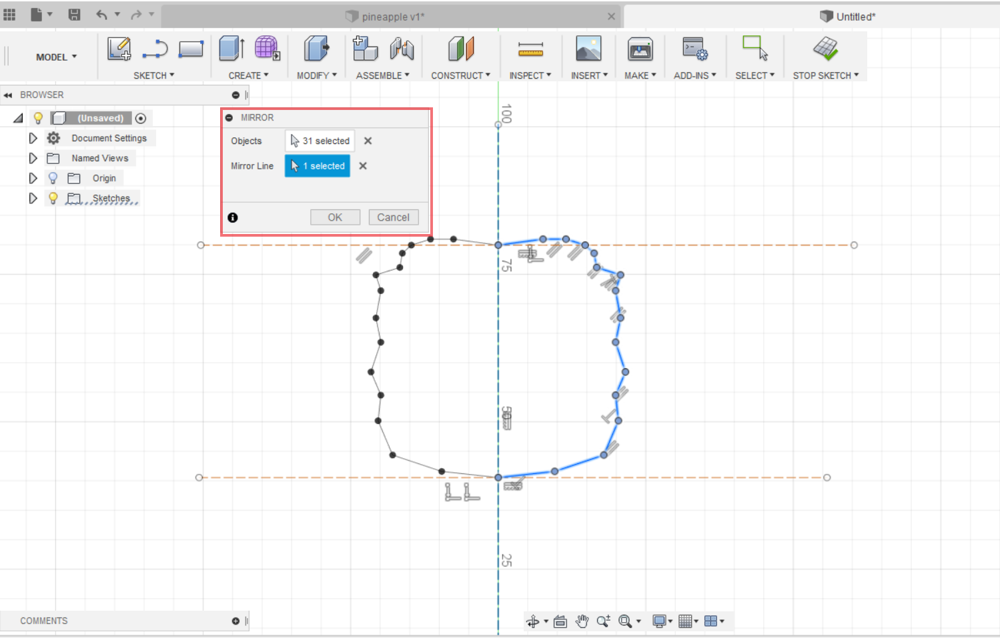
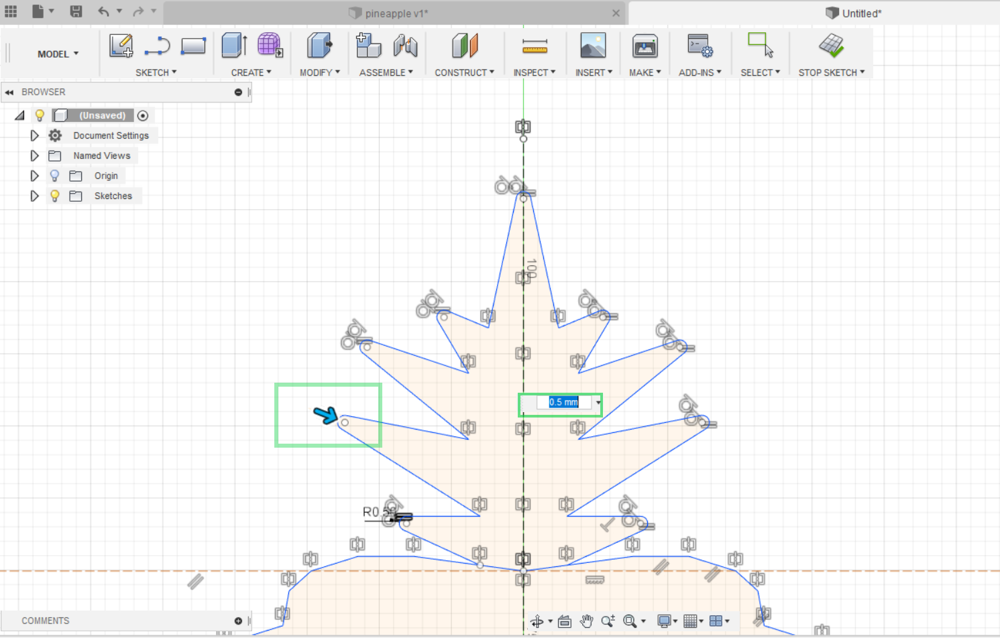
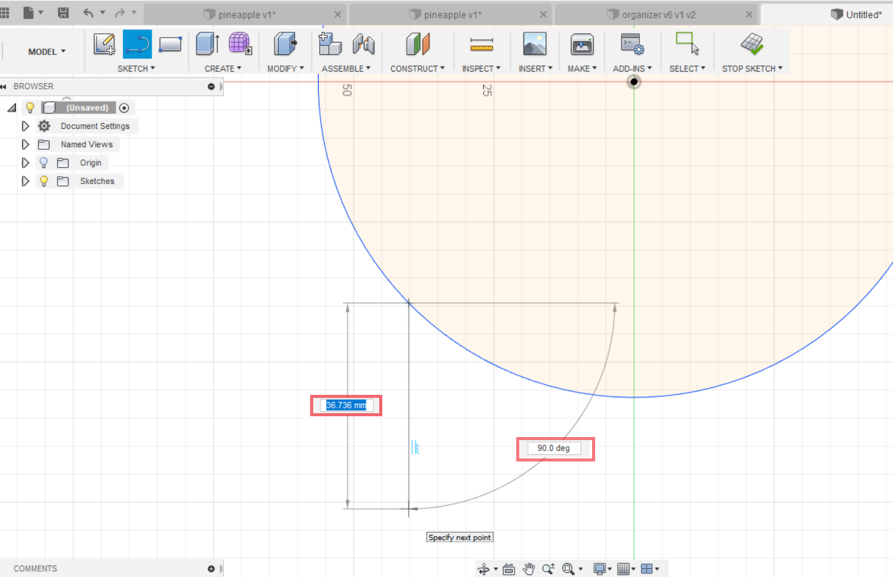

# Sketch

## Your first design

.png>)

1. Save your design
2. Create a new component
3. Create sketch
4. Select a plane

.png>)

5\. In the "Sketch" menu select command "Line"\
6\. Start always from origin\
7\. First click puts the first point of your line. Release the left click and move the cursor in the desired direction. Second click sets the length and orientation of your line. Hit "Esc" button to exit the "Line" command.

.png>)

8\. In the "Sketch" menu select "Sketch dimension" to give dimension to the lines. Dimension of the line is determined by the distance between its points. Select two points of the line, release the left mouse button, move your cursor aside, at a distance of 5-10 mm, so it is not intersecting any other objects or lines, and dimension is visible.\
9\. Exist sketch

.png>)

10\. From the menu "Create" select "Extrude" command. A dialog will appear on the right which will guide you in the operations of the command. Extrude command "grows" a closed profile into a 3D body.\
First, you have to select your profile and then you indicate the distance or height for the profile to be extruded. After you decided the dimension, hit ok. Now you have your first 3D body created.

## Pineapple paperclip

Urmatorul exercitiu este introductiv in Fusion 360 in care invatat cum sa incepem o schita. Care sunt pasii importanti cu care incepem si cum modificam schita noastra in 3 dimensiuni.

Vom invata functii ca :

* **Line** - trasam o linie
* **Constraction** - constringere care face linia intrerupta (linii ajutatoare, orientative)
* **Mirror** - oglindirea elementelor selectate pe partea opusa a axei
* **Trim** - taierea liniilor&#x20;
* **Fillet** - rotungirea unghiurilor
* **Offset** - copierea liniilor la o distanta anumita
* **Extrude** - cresterea profilului in inaltime

1. Ducem liniile orientative.\
   Sketch> Line si incepem linia din punctul de origine si trasam in sus.\
   Apoi o sa ducem urmatoarele 2 linii orizontale.

.png>)

2\. Selectam toate liniile si din submeniul Sketch Palette facem click pe constringerea Constraction. In asa fel liniile noastre au devenit constructive. Pastrind liniile selectate la fel din Sketch Palette facem click pe constringerea Horizontal/Vertical pentru a seta liniile orizontal, si respectiv vertical.

3\. Dupa ce am impartit obiectul nostru in 3 parti incepem cu modelarea pineapple-ului. Vom modela doar jumatate din el, Sketch>Line si incepind din punctul de intersectia a axei verticale cu cea orizontala si finisind in al doilea punct de intersectie ducem o serie de linii formind o linie frinta.

4\. Sketch>Mirror  ne ajuta sa oglindim in partea opusa. Apare o fereastra mica, selectam toate liniile care trebuie oglindite si Mirror line selectam axa verticala.

5\. In acelasi mod cream si frunzele pineapple-ului si le oglindim cu functia Mirror.

.png>)

6\. Pentru a rotungi unghiurile selectam functia Fillet apoi selectam liniile care formeaza unghiul sau selectam punctul lor de intersectie. Raza fillet-ului o fixam de 0.5mm

7\. La fel ducem o linie pentru clamele paperclip-ului. Folosind functia Offset din meniul Create, selectam liniile duse pentru clame si setam o distanta dintre copie si original.La fel cream inca 2 copii. In total sa avem 4 linii care formeaza clamele.

.png>)

8\. Selectam functia Trim din meniul Create si taiem liniile din interiorul pineapple.

.png>)

9\. Create>Extrude crestem obiectul nostru in inaltime de 5mm.

.png>)

Obiectul final.&#x20;

.png>)

## Breloc Batman

În acest exercițiu vom face un breloc în formă de Batman folosid "**Line**" , "**Fillet**" ,"**Extrude**" și "**Mirror**" . &#x20;

.png>)

\
Hai să o facem pas cu pas.

1. Save
2. New component
3. Create sketch
4. Select plan

.png>)

5\. Sketch ->Line -> Creem o schiță ca în modelul de mai sus  cu dimensiunile:

* Partea de mijloc **până** la ureche  25mm, 2.5mm.
* Urechea - 2.5mm x 112 deg, 5mm x 95d eg.
* Partea de sus a aripei - 8mm x 150 deg, 10mm x 150 deg.
* Partea din stânga - 12.5mm x 116 deg, 12.5 x 64 deg.
* Partea de jos - 16 mm x 39 deg.
* Gaura brelocului 3mm.

6\. Sketch -> Fillet  -  11mm x 12mm x 5mm.

.png>)

7\. Oglindim modelul  prin : Sketch -> Mirror&#x20;

.png>)

8\. Sketch -> Extrude  - Distance - 2mm

.png>)

Bravo ! Ai realizat propriul tău breloc, învățând astfel să folosești comenzile "**Line**", "**Fillet**", "**Mirror**" și "**Extrude**" .

## Organizer pentru caști in forma de craniu

Încă nu te-ai plictisit de sketch?\
Dacă nu atunci mergem mai departe la urmatorul exercițiu.                                                                                             Cred că nu numai odată te-ai confruntat cu descîlcirea caștilor.

In continuare vom modela un organizer drăguț in forma de craniu.

1. Trasam 2 axe Constraction, setam sa fie Orizontal/Vertical. Ca să le setam sa treaca prin punctul de origine facem click pe constrîngerea **Sketch Palette>Coincident** apoi selectam axa si punctul de origine.
2. Ducem un Cerc din punctul de origine cu diametrul de 35mm.
3. Ducem alt cerc mai mic in interior cu diametrul de 8mm si setam distanta de 9mm pina la axa Y, si selectam constringerea **Sketch Palette>Tangent** selectam cercul apoi  axa X.In asa fel cercul este tangent axei.
4. Trasam 2 linii orizontale care sa uneasca cercul din interior cu cercul mare cu distantele dintre ele dupa dimensiunile din imagine.

5\. Cu ajutorul functiei Trim stergem liniile nefolositoare dupa imaginea data&#x20;

6\. Folosim Mirror pentru a oglindi in a 2 jumatate

7\. Daca ati urmat pasii precedent corect, vedem ca partea de sus a cercului a devenit de culoare albastra, ceea ce inseamna ca nu mai este fixata de nimic.\
Pentru a evita eventualele probleme facem urmatorii pasi:

* Tastam combinatia Ctrl+D
* Selectam partea de sus a cercului
* Tastam Enter

Acum semicercul este fixat, daca nu este de culoare neagra repetati din nou.

8\. Ducem iarasi o axa ajutatoare cu distanta de 148^ de la axa X.

9\. Ducem cite un cerc in fiecare parte de axa,respectiv cu diametrul de 7mm si 8 mm.&#x20;

10\. Setam distanta dintre cercuri si axa ajutatoare dupa dimensiunile din imagine.

11.Cu ajutorul a 2 linii unim cercurile cu cercul nostru mare .

12\. Setam ambele linii sa fie paralele cu axa la distanta de 2.5 ambele si setam lungimile de 4.5mm ambele.

13\. Sketch> Trim stergem liniile inutile dupa imagine.

14\. Sketch>Mirror oglindim pe partea opusa.

15\. Sketch>Mirror selectam ambele capete ce oase si le oglindim in partea de jos.

Facem o pauza de 5 minute ...

16\. Acum vom invata o tehnica mai usoara de a duce linii si a defini totodata lungimea lor si unghiul dintre ele.  Cind ducem o linie dintr-un punct vedem 2 casuțe unde putem seta dimensiuni. O casuta este pentru a seta lungimea si una pentru a seta unghiul.                                                                                                                                                                                                                                                                                                                                                               _Dupa ce dam dimeniune la lungime apasam pe Tab si dăm dimensiune la unghi._

Sketch>Line primul punct il selectam de la intersectia dintre cerc si os. Cu mouse-ul direcționăm linia in jos si setăm dimensiunea de :                                                                                                                                        - 15mm si unghiul de 95 grade,                                                                                                                                        - urmatoarea de 5mm si unghiul de 90,                                                                                                                         - o linie in sus de 10 mm si unghiul de 90,                                                                                                                   -linie de 3 mm si unghiul de 5,                                                                                                                                                                 -linie in jos de 9mm la unghiul de 90,                                                                                                                                                           -linie de 5 mm orizontala si apoi una verticala de 8 mm.

17\. Sketch>Fillet cu raza de 1 si 2.                                                                                                                                                 18. Sketch>Mirror&#x20;

19\. În mijloc facem nasul in forma de triunghi cu dimensiunile respective din imagine.

20\. Sketch>Trim taiem liniile din interior pentru a avea un profil.

21\. Create>Extrude de 5mm.

\
