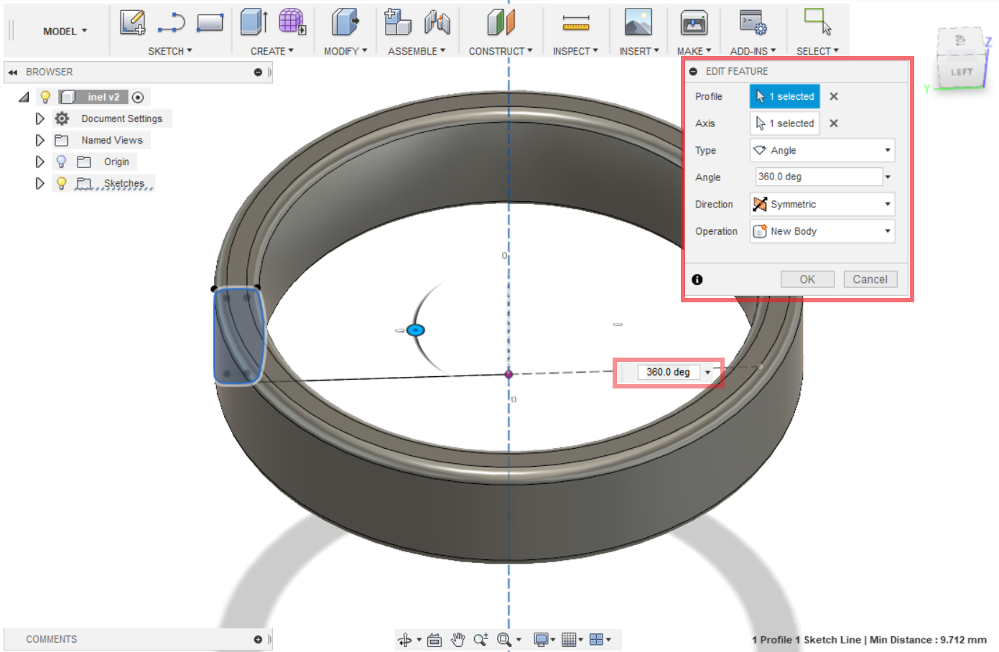

# Solid body

## Inel

Dacă ați urmarit tutorialele pentru Sketch sunteți experimentați si gata pentru a învăța lucrurile cu corpurile solide, dacă nu atunci va sfătui sa o faceți.                                                                                    Modelul inelului este un exercitiu simplu de a invata functia **Revolve - c**reaza obiectul in 3D si il invirteste la 360 grade.

1. Modelăm schița dupa modelul de mai jos.

2\. Create>Revolve  selectam profilul și axa in jurul carui se va roti.

3\. Pentru a face mai draguț inelul o sa modificam putin design-ul, adaugind careva elemente pe partea exterioara. Pentru asta avem nevoie ca sa schimbam pozitia workplane-ul .                                                              **Construct>Offset plane**  selectam planul paralel cu inelul si deplasam planul pe partea exterioara a inelului.

.png>)

4\. Sketch>Create sketch si selectam planul nou creat. Si aici adaugam dupa dorinta elemente pentru inel.

.png>)

5\. Create>Extrude si deplasam spre interiorul inelului astfel facind gauri.

.png>)

Modelul este gata pentru imprimare. Vedeți nu a fost atît de greu, dacă ați urmărit cu atenție.

.png>)

## Model de vază

.png>)

Acest exercițiu este pentru a invata cum **Planul** ne ajuta sa facem mai ușor obiecte neobișnuite si cum am putea implementa mai mult design in obiectele noastre.

1. O sa avem nevoie de 3 planuri sau mai multe daca doriti forma mai neobișnuită.\
   **Construct>Offset plan** selectam planul de jos si construim unul nou setînd o distanta spre ex. de 50mm dintre ele.

.png>)

2\. Create>Create sketch selectam primul plan pentru a face schița.

.png>)

3\. Dupa ce finisam schita facem click pe **Stop Sketch** din meniul de sus si facem schita noua pe fiecare plan Create>Create sketch.

.png>)

4\. Pentru schița anterioară am folosit functia Spline folosita pentru a desena linie curbă.

.png>)

5\. Acum folosim functia **Create>Loft** pentru a combina proflurile noastre si a crea modelul 3D                              &#x20;

.png>)

6\. Pentru a face interiorul gol folosim functia **Modify>Shell,** selectam fata de sus si setam grosimea peretilor de 2mm.

.png>)

Daca dorim sa modificam obiectul nostru putem sa editam orice schita. Gasim meniul de jos **Timeline** facem click drept pe schita care dorim sa o modificam si selectam **Edit sketch**.

**1 Plan - dreptunghi                                                                                                                                                          2 Plan - cerc                                                                                                                                                                      3 Plan - hexagon**

.png>)

## Model Felinar

Urmând instrucțiunile din acest acest model, vei învăța despre cum să lucrezi cu mai multe componente într-un design, vei învăța despre comenzile „**Sweep**” și „**Circular Pattern**”

.png>)

1. Save
2. New component
3. Create sketch
4. Select plane

.png>)

5\. Sketch -> Rectangle from center point -> dimensions 35 x 35 mm\
6\. Create -> Extrude -> Distance 10 mm.

.png>)

7\. Modify -> Shell (selectați fața de jos) -> Inside Thickness - 1.6 mm

.png>)

8\. Create sketch -> Sketch -> Circle D=5 mm -> Offset D=0.8 mm -> Exit sketch

.png>)

9\. Selectează cercul interior -> Modify -> Extrude -> Select profile -> Extent (select "to Object") -> selectează fața opusă pentru a avea o „tăiere” până la fața selectată

.png>)

.png>)

10\. Schița a devenit invizibilă. Pentru a vedea schița, în browser apăsați pe triungiul din față, va apărea un drop down, găsește acolo sketches și repetă aceeași acțiune. Fă click pe beculețul din fața schiței 2, aceasta va făcea vizibilă schița.\
11\. Selectați profilul între cercurile create anterior -> Create -> Extrude d=10 mm.

12\. În browser fă click dreapta pe componenta principală care are numele fișierului salvat. Selectați „Activate”. Aceasta vă întoarce la lucrul cu componenta principală.\
13\. Creează o componentă nouă cu „New component”. Componenta precedentă a devenit transparentă.\
14\. Create sketch, selectează fața de sus a bazei ( componenta 1)

.png>)

15\. Pentru a crea o relație parametrică între componente, selectăm Sketch, „Project / Include” -> Project -> Selectăm cercul exterior a barei din prima componentă. \
16\. Sketch -> Offset -> Selectează linia proiectată în pasul 15, d=0.3mm\
17\. Sketch -> Offset -> Selectează linia proiectată în pasul 15, d=1.5mm\
&#x20;

.png>)

18\. Create -> Extrude, d=120mm\
19\. Creăm următoarea componentă repetând pașii 12-13.

.png>)

Pentru a începe următoarea componentă vom crea un plan ajutător

20\. Construct -> Offset Plane -> Selectăm planul de pe fața de sus  barei create în componenta 2 -> D= -7mm\
21\. Create sketch -> Selectează planul construit la pasul 20.

.png>)

22\. Proiectează liniile de bară din componenta 1, din pasul 11.\
23\. Create -> Extrude d=7mm\

.png>)

24\. Create Sketch -> Selecteaza fața da sus a cilindrului creat în pasul 23. -> Sketch -> Rectangle d=13 x 13 mm -> Exit Sketch -> Create -> Extrude d=1mm.

.png>)

25\. Construct -> Offset plane -> Selecteaza fata de sus pentru corpul creat în pasul 24, d=20mm.

.png>)

26.Create sketch  -> Rectangle d - 25 x 25 mm -> Stop sketch -> Create -> Extrude 4mm, Taper Angle -45deg.

.png>)

27\. Modify -> Shell d=1.1 mm

.png>)

28\. Create sketch -> Selecteaza fața cu ajutorul căreia a fost făcut Shell -> Sketch -> Rectangle -> din dialogul Sketch palette bifează „3D sketch” -> Sketch -> Line -> Unește vârfurile cu o linie ca în imaginea de mai sus.

.png>)

29\. Create -> Sweep -> Profile (selectează profilul din pasul 28) -> Path (linia creată în pasul 28 care unește vârfurile) ->  Operation -> New body

.png>)

30\. Create - Circular Pattern -> Pattern type -> Bodies -> Objects - Selectează corpul creat în pasul 29 -> Axis - selectează aza Z -> Quantity - 4.

Felicitări! Ai lucrat deja cu mai multe componente, ai învățat cum operezi cu mai mult obiecte într-o componentă și am învățat 2 comenzi noi - **Sweep** și **Pattern**.

