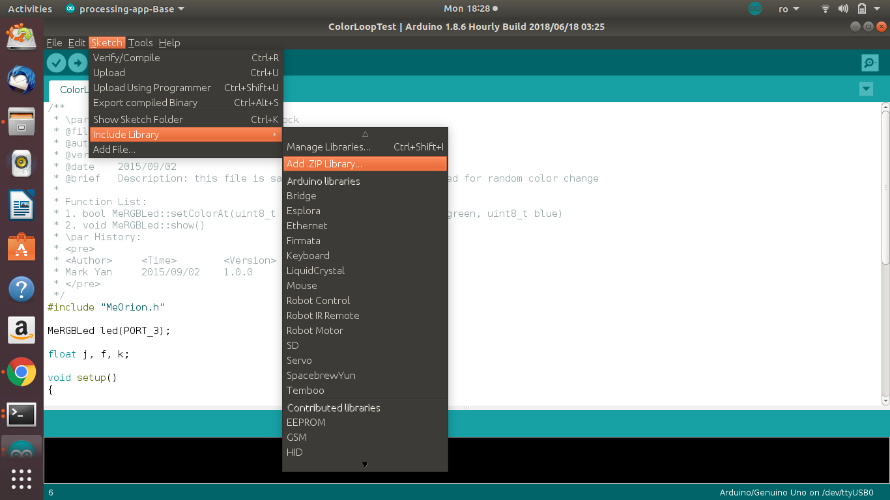
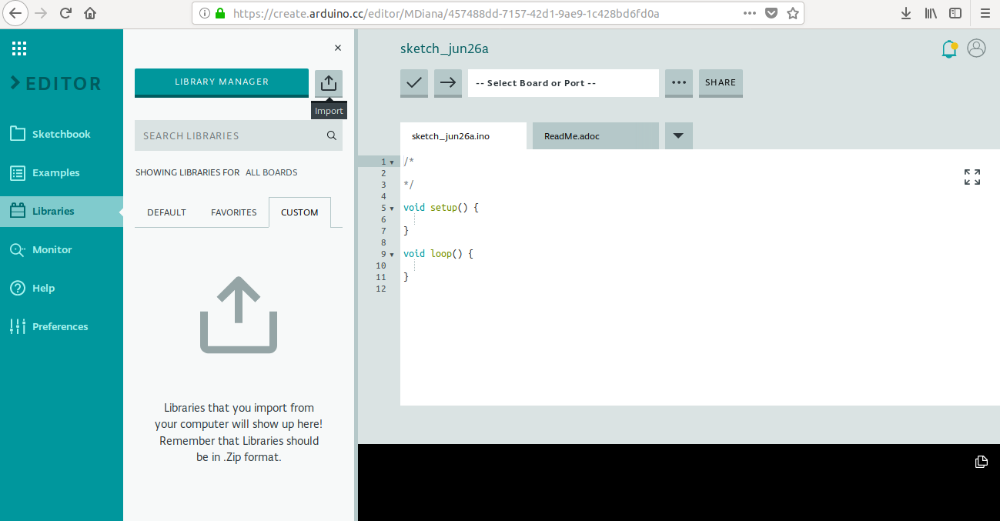
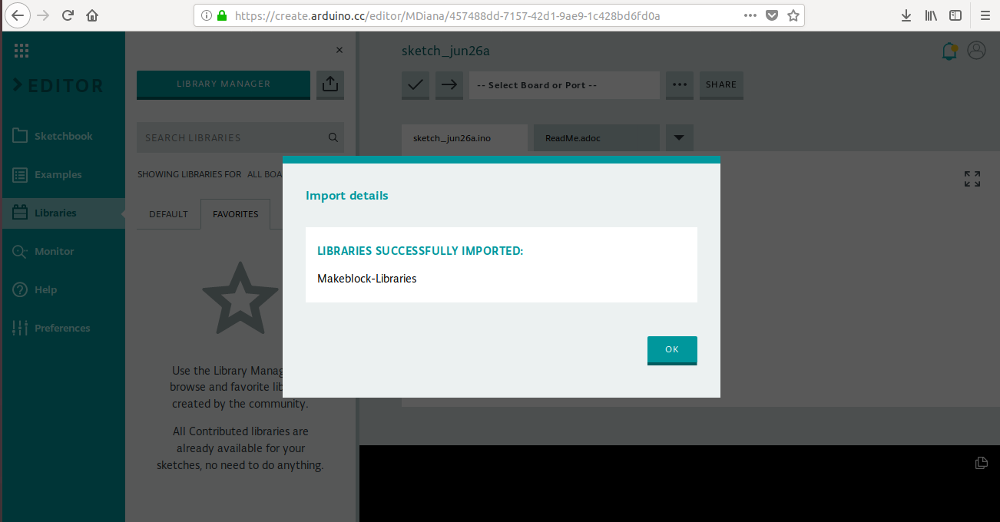

# 3.1 Configurare Arduino IDE

Pentru a folosi editorul Arduino cu roboții mBot, va trebui să descărcăm o librarie special concepută pentru acești roboți. 

In domeniul IT, o **bibliotecă \(librărie\)** este o colecțe de resurse \(cod scris deja\) utiliă pentru dezvoltarea de software.

În cazul nostru, roboțeii au la baza o placă bazată pe tehnologia Arduino, dar nu este chiar o placă standarda Arduino. De aceea, modul în care se programează este puțin diferită de modul în care funcționează plăcile standard. Pentru ca roboțeii noștri să funcționeze, câțiva programatori, au scris deja cod special pentru configurarea și lucrul cu roboțeii și plăcuțele speciale folosite de aceștia. Noi vom folosi acest cod ca să nu stăm să configurăm noi manual toți senzorii, motoarele etc. 

## Cum descărcăm și includem biblioteca în Arduino IDE

Descarcă fișierul de pe link-ul [https://codeload.github.com/Makeblock-official/Makeblock-Libraries/zip/master](https://codeload.github.com/Makeblock-official/Makeblock-Libraries/zip/master)

### Arduino IDE \(desktop\)

În proiectul în care lucrezi \(sau creează un fișier sketch nou File-&gt;New\),  
accesează din meniu opțiunea Sketch-&gt;Include library -&gt;Add .ZIP library și selectează fișierul pe care tocmai l-ai descărcat.

### Arduino IDE Web

Site-ul oficial [https://github.com/Makeblock-official/Makeblock-Libraries](https://github.com/Makeblock-official/Makeblock-Libraries)

## Ce biblioteci \(librării\) utilizăm?

| _**Robot**_ | _**Placă**_ | _**Librărie**_ |
| :--- | :--- | :--- |
| **mBot** | mCore | MeMCore.h |
| **Ultimate** | MegaPi, \* Boards &gt; Arduino/Genuino Mega or Mega 2560 | MeMegaPi.h |
|  | Orion |  MeOrion.h  |
|  | BaseBoard | MeBaseBoard.h |
|  | Shield | MeShield.h |
|  | Auriga | MeAuriga.h |

