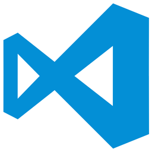
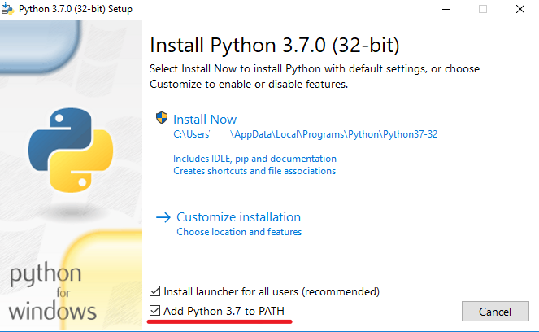
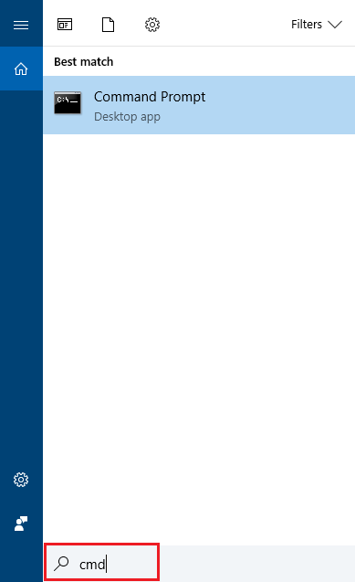
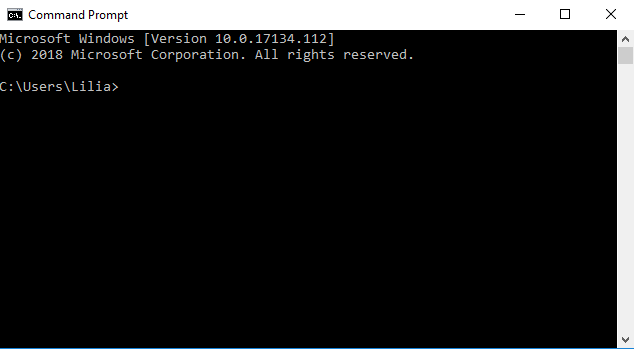
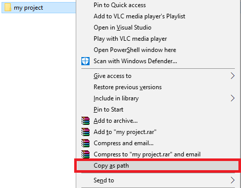
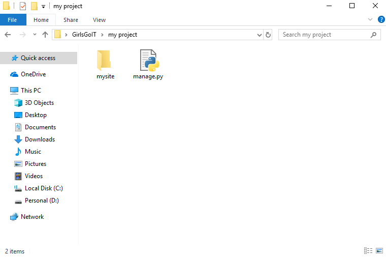
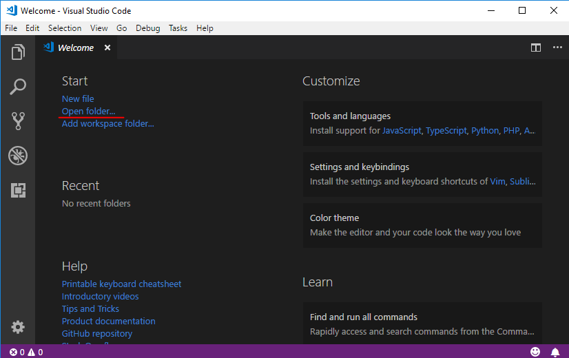
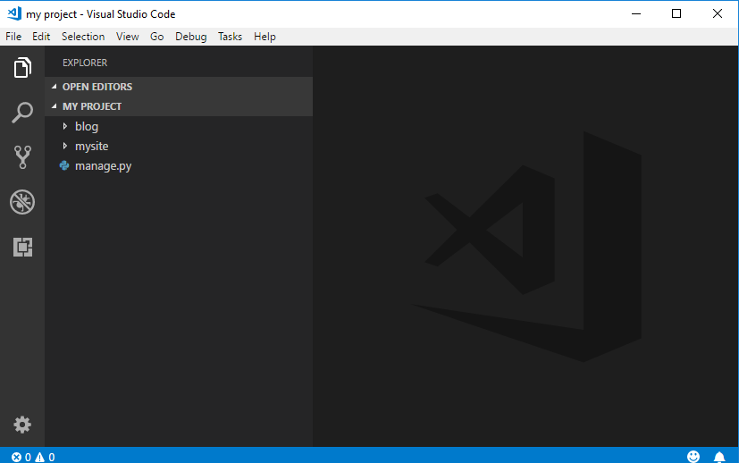
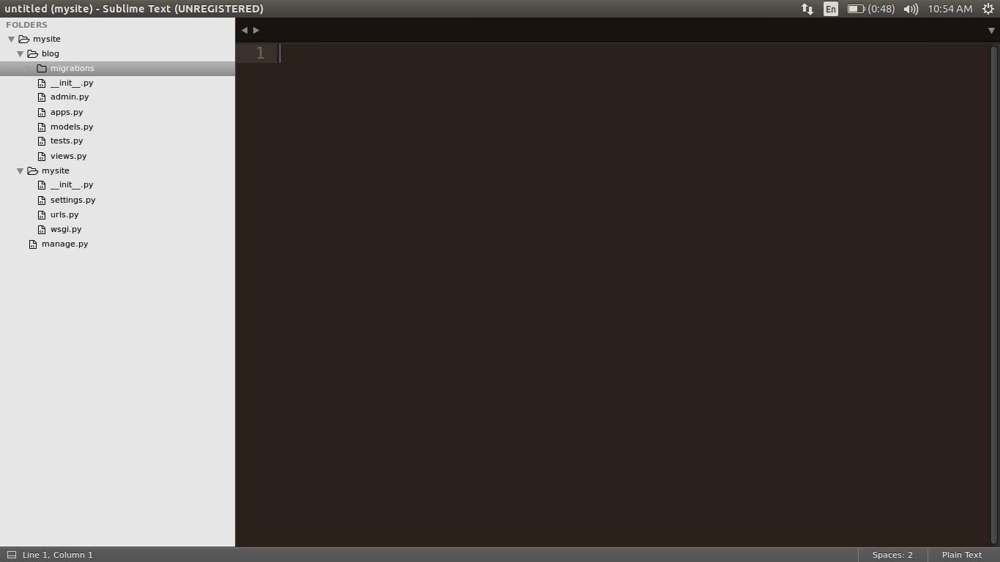
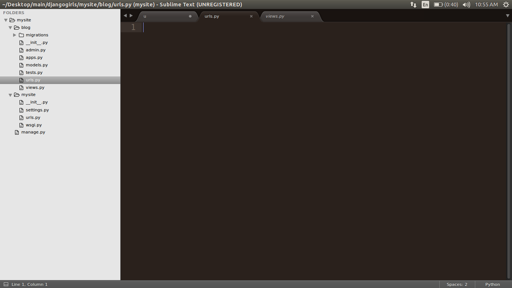

# Django Intro

## Setarea Mediului de Lucru

### 1. Instalarea Visual Studio Code 



**Visual Studio Code** este un editor de text dezvoltat de Microsoft pentru Windows, Linux și MacOS. Acesta include suport pentru depanare, sintaxă evidențiată, completare inteligentă a codului. De asemenea, este personalizabil, astfel încât utilizatorii pot schimba tema editorului, comenzile rapide de la tastatură și preferințele. Pentru descărcarea acestuia urmați link-ul :[https://code.visualstudio.com/](https://code.visualstudio.com/) ,descarcațil și instalațil ca și pe oricare alt program.

### 2. Instalarea Python

    


**Python** este un limbaj de programare foarte popular care poate fi folosit pentru crearea de site-uri web, jocurilor, aplicațiilor software științifice, grafică și multe altele.

Este un limbaj de programare la baza căruia stau principiile ca codul scris sa fie unul lizibil si ușor de invatat.

    Pentru instalare accesam linkul: [https://www.python.org/downloads/](https://www.python.org/downloads/) si alegem versiunea **3.7.0**\(cea mai actuala\). Dupa descarcare deschidem fisierul si al instalăm, dar, înainte de a apăsa **Install Now**, pe prima pagină a instalării trebuie să fim siguri ca bifăm **Add Python to Path**



    Apoi astemptam sa se finiseze instalarea.

### 3. Instalarea Django


**Django** \(/ dʒæŋɡoʊ / jang-goh\) este _framework_ web gratuit și open source, scris în Python. Un **framework** este un set de componente care vă ajută să dezvoltați site-urile web mai repede și mai ușor.

Când creați un site web, aveți întotdeauna nevoie de un set similar de componente: o modalitate de a gestiona autentificarea utilizatorilor \(înscrierea, conectarea, deconectarea\), o modalitate de a încărca fișiere,  formulare, etc. .

Din fericire pentru dvs., alți oameni au observat demult faptul că programatorii se confruntă cu probleme similare atunci când construiesc un web site nou, așa că au colaborat și au creat _framework_-uri \(Django fiind unul dintre ele\) care vă oferă componente gata de utilizat.

Există framework-uri pentru a vă scuti de necesitatea de a reinventa roata și de a vă ajuta la micșorarea necesităților atunci când construiți un site nou.

Pentru a instala **Django**, apasam Start si in search scriem “**cmd**”, pentru a deschide Linia de Comanda.



   **Linia de Comanda** \(Command Prompt\) este o unealtă care interacționează cu utilizatorul prin linii de text \(comenzi\), folosită încă de la începutul dezvoltării calculatoarelor.



In linia de comandă scriem **`pip install django`** si asteptăm ca instalarea să se termine , ultima linie afișând : "**`Successfully Installed Django`**"

## Crearea Proiectului Django

    Pe Desktop sau în orice alt directoriu creați un folder cu denumirea dorită a proiectului. În cazul nostru va fi **my project.**

Tinind butonul **shift** apasati **click dreapta** pe folderul creat. Veti vedea o optiune **Copy as Path**, selectați.



Deschideți din nou **Linia de comanda ,** și scrieți următoarea comanda:

cd \(_aici folosind Ctrl+V , scrieți adresa directoriului copiată anterior_ \), 

Astfel sunteți siguri că orice comenzi rulate prin consolă vor acționa asupra fișierului cu care lucrați.


Pentru a crea proiectul, rulam urmatoarea comanda in Linia de Comanda: `django-admin.exe startproject mysite .` , unde ultimul cuvint **mysite** este denumirea proiectului. Punctul `.`  la sfârșitul comenzii este crucial, deoarece indică ca proiectul Django să fie instalat in directoriul curent.

Aceasta comanda automat va genera toate fișierele necesare noua ca să lucrăm în continuare la proiectul nostru.


Dupa rularea acestei comenzi, deschideți directoriul in care lucrați, dacă totul a decurs bine, folderul trebuie să conțină urmatoarele fisiere.



`manage.py` ne va ajuta la gestionarea site-ului. Cu aceasta vom putea \(printre multe altele\) să pornim un server web pe calculatorul nostru fără a instala altceva.

Pentru moment deschideti editorul **VSCode**. Folosind opțiunea `Open folder...` 



Gasiti folderul `My Project` care contine proiectul si deschidețil în VSCode

Dupa cum observati in stinga editorului sa deschis un tab unde este afișat conținutul folderului care a fost selectat. Acesta ne ajuta mai ușor să ne orientăm în fișierele noastre fără ca să părăsim editorul.



## Obiecte

Există un concept în programare numit _programare orientată pe obiecte_. Ideea este că, în loc să scriem totul ca o secvență plictisitoare de instrucțiuni, putem modela lucrurile și putem defini modul în care interacționează între ele.

Deci, ce este un obiect? Este o colecție de proprietăți și acțiuni. Sună ciudat, dar vă vom da un exemplu.

Dacă vrem să modelăm o pisică, vom crea un obiect `Pisica` care are anumite proprietăți precum `culoarea, vârsta, dispozitie` \(cum ar fi `somnoroasă, flămândă` \) și `proprietarul` \(care ar putea fi atribuit un obiect `persoană` - sau poate , în cazul unei pisici rătăcite, această proprietate ar putea fi goală\).

Apoi, `Pisica` are unele acțiuni:  `toarce, zgârâie, hrănește` \(în acest caz, vom da pisicii `mâncare`, care ar putea fi un obiect separat cu proprietăți, cum ar fi `gustul`\).

#### Pisică

* culoare
* vârstă
* dispoziție
* toarce\(\)
* zgârâie\(\)
* hrănește\(mâncare\)

#### Mâncare

* gust

Pentru a fi mai aproape de proiectul nostru luăm ca exemplu o postare, `Post` și ce proprietăți poate avea aceasta .

```text
Post
--------
title
text
author
created_date
published_date
publish()
```

Un **model** în Django este un tip special de obiect - este salvat în `database`\(baza de date\). O bază de date este o colecție de date. Acesta este un loc în care veți stoca informații despre utilizatori, postările de pe blog etc. Puteți să vă gândiți la un model din baza de date ca o foaie de calcul cu coloane \(câmpuri\) și rânduri \(date\).

## Partea de applicatie


Pentru a păstra totul ordonat, vom crea o aplicație separată în cadrul proiectului nostru. Pentru a crea o aplicație, trebuie să executați următoarea comandă în consolă, 

\*aveți grijă ca directorul sa fie `my project`

```bash
python manage.py startapp blog
```

**blog** este denumirea applicatiei, puteti sa o schimbati

Acesta commanda va crea applicatie in proiectul dorit, aici se vor contine toate fisierele care vor fi direct responsabile de site-ul care il creati\(URL’uri, imagini, text etc\)

In urma executarii acesteti comande , in folderul proiectului trebuie sa apara un nou folder. 


Analizam urmatorul rind de cod

```python
url(r'^admin/', admin.site.urls)
```

Acesta va analiza tot ce noi introducem in Browser si daca va gasi cuvintul cheie `admin` acesta va rederectiona spre URL-urile ale admin

Adaugam urmatorul rind de cod

```python
from django.conf.urls import url
from django.contrib import admin
urlpatterns = [
    url(r'^admin/', admin.site.urls),
    url(r'',('blog.urls'))
]
```

Dar daca ne uitam in folderul **blog** sau mai general folderul applicatiei in proiect



Observam ca fisierul **urls.py** lipseste din folderul applicatiei blog. Inseamna ca trebuie sa il adaugam

Apasam **Click Dreapta** pe folderul applicatiei, in cazul dat **blog** si dam click la  **New File**

Apoi mai jos dam denumirea fisierului **urls.py**. Asa am creat un fisier python. 

Deschidem fisierul **urls.py** din folderul **mysite**, apasam **ctrl-A** si apoi **ctrl-C** pentru a copia continutul fisierului. In **urls.py** din folderul applicatiei\(blog in cazul dat\) apasti **ctrl-V** pentru a insera continutul in fisierul nou. Apoi **ctrl-S** pentru a salva fisierul.

Si incepem sa editam acest fisier pentru ca sa cream URL-lul a aplicatiei noastre

Stergem

```python
from django.contrib import admin
```

si adaugam in locul ei

```python
from . import views
```

Stergem

```python
url(r'^admin/', admin.site.urls)
url(r'',('blog.urls'))
```

In locul lor adaugam

```python
url(r'^denumirea_urlui', views.blog_page)
```

Dar totusi aplicatia noastra nu stie de nici o pagina cu denumirea **blog\_page** in cazul dat.

Observam ca inainte de **blog\_page** avem **views** urmat de un punct. Prin asa metoda noi chemam o functie sau alte componente dintrun fisier, in cazul nostru **views**.

Dechidem fisierul **views.py** din folderul applicatiei\(blog\), aici noi declaram orice pagina in felul urmator

```python
from django.shortcuts import render

# Create your views here.
```

Pentru moment noi dorim ca pagina noastra sa ne afiseze un text, pentru aceasta trebuie sa importam o nous librarire `HttpResponse`, pe ea o vom folosi pentru ca sa putem afisa textul.

```python
from django.shortcuts import render
from django.http import HttpResponse

def blog_page():
    return HttpResponse("You are Awesome")
```

salvam fisierul

La final lansam serverul local. Ne intoarcem la linia de comanda si introducem urmatoarea comanda

```bash
python manage.py runserver
```

Asigurativa ca linia de comanda este deschis din folderul proiectului.

pentru inceput introduceti 127.0.0.1:8000, in browser, apoi 127.0.0\`.1:8000/url in cazul dat **blog**. Pagina trebuie sa afiseze stringul care lati introdus in views.py

