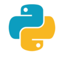
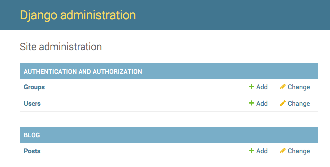
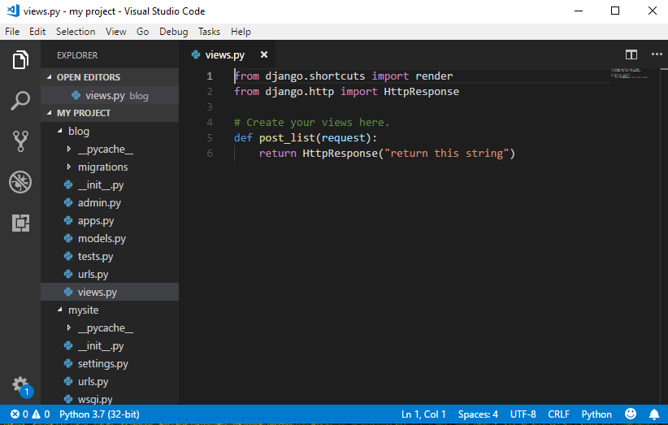

# Django Intro

## Setarea Mediului de Lucru

### 1. Instalarea Visual Studio Code 


    **Visual Studio Code** este un editor de text dezvoltat de Microsoft pentru Windows, Linux și MacOS. Acesta include suport pentru depanare, sintaxă evidențiată, completare inteligentă a codului. De asemenea, este personalizabil, astfel încât utilizatorii pot schimba tema editorului, comenzile rapide de la tastatură și preferințele. Pentru descărcarea acestuia urmați link-ul :[https://code.visualstudio.com/](https://code.visualstudio.com/) ,descarcațil și instalațil ca și pe oricare alt program.

### 2. Instalarea Python



    **Python** este un limbaj de programare foarte popular care poate fi folosit pentru crearea de site-uri web, jocurilor, aplicațiilor software științifice, grafică și multe altele.

    Este un limbaj de programare la baza căruia stau principiile ca codul scris sa fie unul lizibil si ușor de invatat.

    Pentru instalare accesam linkul: [https://www.python.org/downloads/](https://www.python.org/downloads/) si alegem versiunea **3.7.0**\(cea mai actuala\). Dupa descarcare deschidem fisierul si al instalăm, dar, înainte de a apăsa **Install Now**, pe prima pagină a instalării trebuie să fim siguri ca bifăm **Add Python to Path**


    Apoi aștemptăm să se finiseze instalarea.

### 3. Instalarea Django


    **Django** \(/ dʒæŋɡoʊ / jang-goh\) este _framework_ web gratuit și open source, scris în Python. Un **framework** este un set de componente care vă ajută să dezvoltați site-urile web mai repede și mai ușor.

    Când creați un site web, aveți întotdeauna nevoie de un set similar de componente: o modalitate de a gestiona autentificarea utilizatorilor \(înscrierea, conectarea, deconectarea\), o modalitate de a încărca fișiere,  formulare, etc. .

    Din fericire pentru dvs., alți oameni au observat demult faptul că programatorii se confruntă cu probleme similare atunci când construiesc un web site nou, așa că au colaborat și au creat _framework_-uri \(Django fiind unul dintre ele\) care vă oferă componente gata de utilizat.

    Există framework-uri pentru a vă scuti de necesitatea de a reinventa roata și de a vă ajuta la micșorarea necesităților atunci când construiți un site nou.

    Pentru a instala **Django**, apasam Start si in search scriem “**cmd**”, pentru a deschide Linia de Comanda.


   **Linia de Comanda** \(Command Prompt\) este o unealtă care interacționează cu utilizatorul prin linii de text \(comenzi\), folosită încă de la începutul dezvoltării calculatoarelor.


    In linia de comandă scriem **`pip install django`** si asteptăm ca instalarea să se termine , ultima linie afișând : "**`Successfully Installed Django`**"

## Crearea Proiectului Django

    Pe Desktop sau în orice alt directoriu creați un folder cu denumirea dorită a proiectului. În cazul nostru va fi **my project.**

    Tinind butonul **shift** apasati **click dreapta** pe folderul creat. Veti vedea o optiune **Copy as Path**, selectați.


    Deschideți din nou **Linia de comanda ,** și scrieți următoarea comanda:

cd \(_aici folosind Ctrl+V , scrieți adresa directoriului copiată anterior_ \), 

    Astfel sunteți siguri că orice comenzi rulate prin consolă vor acționa asupra fișierului cu care lucrăm.


    Pentru a crea proiectul, rulam urmatoarea comanda in Linia de Comanda: 



```text
django-admin.exe startproject mysite .
```



 unde ultimul cuvint **mysite** este denumirea proiectului. Punctul `.`  la sfârșitul comenzii este crucial, deoarece indică ca proiectul Django să fie instalat in directoriul curent.

    Aceasta comanda automat va genera toate fișierele necesare noua ca să lucrăm în continuare la proiectul nostru.


    Dupa rularea acestei comenzi, deschideți directoriul in care lucrați, dacă totul a decurs bine, folderul trebuie să conțină urmatoarele fisiere.


`manage.py` ne va ajuta la gestionarea site-ului. Cu aceasta vom putea \(printre multe altele\) să pornim un server web pe calculatorul nostru fără a instala altceva.

Pentru moment deschideti editorul **VSCode**. Folosind opțiunea `Open folder...` 


Gasiti folderul `My Project` care contine proiectul si deschidețil în VSCode

    Dupa cum observati in stinga editorului sa deschis un tab unde este afișat conținutul folderului care a fost selectat. Acesta ne ajuta mai ușor să ne orientăm în fișierele noastre fără ca să părăsim editorul.


### Baza de date a proiectului 

    Pentru a crea o bază de date pentru proiectul nostru,  trebuie executată următoarea comandă în consola:



```text
python manage.py migrate
```



\*\(trebuie să fim în directorul **My Project** care conține fișierul **manage.py**\). Dacă merge bine, ar trebui să vedeți ceva de genul:


## Obiecte

    Există un concept în programare numit _programare orientată pe obiecte_. Ideea este că, în loc să scriem totul ca o secvență plictisitoare de instrucțiuni, putem modela lucrurile și putem defini modul în care interacționează între ele.

    Deci, ce este un obiect? Este o colecție de proprietăți și acțiuni. Sună ciudat, dar vă vom da un exemplu.

    Dacă vrem să modelăm o pisică, vom crea un obiect `Pisica` care are anumite proprietăți precum `culoarea, vârsta, dispozitie` \(cum ar fi `somnoroasă, flămândă` \) și `proprietarul` \(care ar putea fi atribuit un obiect `persoană` - sau poate , în cazul unei pisici rătăcite, această proprietate ar putea fi goală\).

    Apoi, `Pisica` are unele acțiuni:  `toarce, zgârâie, hrănește` \(în acest caz, vom da pisicii `mâncare`, care ar putea fi un obiect separat cu proprietăți, cum ar fi `gustul`\).

#### Pisică

* culoare
* vârstă
* dispoziție
* toarce\(\)
* zgârâie\(\)
* hrănește\(mâncare\)

#### Mâncare

* gust

    Pentru a fi mai aproape de proiectul nostru luăm ca exemplu o postare, `Post` și ce proprietăți poate avea aceasta .

```text
Post
--------
title
text
author
created_date
published_date
publish()
```

    Un **model** în Django este un tip special de obiect - este salvat în `database`\(baza de date\). O bază de date este o colecție de date. Acesta este un loc în care veți stoca informații despre utilizatori, postările de pe blog etc. Puteți să vă gândiți la un model din baza de date ca o foaie de calcul cu coloane \(câmpuri\) și rânduri \(date\).

## Partea de applicatie


    Pentru a păstra totul ordonat, vom crea o aplicație separată în cadrul proiectului nostru. Pentru a crea o aplicație, trebuie să executați următoarea comandă în consolă, 

\*aveți grijă ca directorul sa fie `my project`



```bash
python manage.py startapp blog
```



**blog** este denumirea applicatiei.

   Acesta commanda va crea o applicație in proiectul dorit, aici se vor contine toate fișierele care vor fi direct responsabile de site-ul care il creăm\(URL’uri, imagini, text etc\)

In urma executarii acesteti comande , in folderul proiectului trebuie sa apara un nou folder `blog` . 

    După crearea aplicației, trebuie să-i comunicăm proiectului că ar trebui să o folosească. Facem asta în fișierul `mysite / settings.py`, deschis cu aplicația **VSCode**. Trebuie să găsim INSTALLED\_APPS și să adăugăm o linie care conține "blog".



```python
INSTALLED_APPS = [
    'django.contrib.admin',
    'django.contrib.auth',
    'django.contrib.contenttypes',
    'django.contrib.sessions',
    'django.contrib.messages',
    'django.contrib.staticfiles',
    'blog',
]
```



și salvați fișierul.

   În fișierul `blog / models.py` definim toate obiectele numite _Models_ - acesta este un loc în care vom defini postarea pe blog.

   Hai să deschidem `blog / models.py`, să eliminăm totul din el și să scriem următoarele linii:



```python
from django.db import models
from django.utils import timezone


class Post(models.Model):
    author = models.ForeignKey('auth.User', on_delete=models.CASCADE)
    title = models.CharField(max_length=200)
    text = models.TextField()
    created_date = models.DateTimeField(
            default=timezone.now)
    published_date = models.DateTimeField(
            blank=True, null=True)

    def publish(self):
        self.published_date = timezone.now()
        self.save()

    def __str__(self):
        return self.title
```



    Toate liniile care încep cu `from` sau `import` sunt linii care adaugă informații din alte fișiere. Deci, în loc să copiem și să lipim aceleași lucruri în fiecare fișier, putem include unele părți cu `from... import...`

`class Post (models.Model)`: - această linie definește modelul nostru \(este un obiect\).

`class` este un cuvânt cheie special care indică faptul că definim un obiect. 

`Post` este numele modelului nostru. Îi putem da un nume diferit \(dar trebuie să evităm caracterele speciale și spațiul alb\). Porniți întotdeauna un nume de clasă cu o literă mare.

 `models.Model` înseamnă că Post este un model Django, astfel încât Django știe că ar trebui salvat în baza de date.

Acum definim proprietățile despre care vorbeam: `title, text, created_date, published_date , author.` Pentru a face acest lucru trebuie să definim tipul fiecărui câmp \(Este text? Un număr? O dată calendaristică ? O relație cu un alt obiect?\)

* `models.CharField` –așa definim un text cu număr limitat de caractere.
* `models.TextField` – acesta este pentru un text lung, fără limită.
* `models.DateTimeField` – așa definim o dată calendaristică
* `models.ForeignKey` –  ForeighKey face legătura cu alt obiect.

    Ultimul pas aici este să adăugăm noul nostru model la baza noastră de date. Mai întâi trebuie să-l facem pe Django să știe că avem unele modificări în modelul nostru.  Mergeți la fereastra consolei și tastați `python manage.py makemigrations blog`. Acesta va arata astfel:


* _Aveți grijă să salvați mereu fișierele în care faceți modificări pentru a nu opține erori ulterior._

    Următorul pas ar fi să transmitem modificările create și pregătite de django bazei de date prin următoarea comandă:



```text
python manage.py migrate blog
```




Astfel Modelul nostru `Post` este transmis bazei de date.

### Pornirea unui webserver

In linia de comandă scrieți următoarea comandă:

```bash
python manage.py runserver
```

Asigurativa ca linia de comanda este deschis din folderul proiectului.


Deschideți pagina [http://127.0.0.1:8000/](http://127.0.0.1:8000/) unde ulteriorul nostru proiect ar trebui să opereze. 

[http://127.0.0.1:8000/](http://127.0.0.1:8000/) este cunoscut ca _localhost_ ceea ce înseamna că proiectul nostru ruleaza doar pe calculatorul nostru și nu este încă online.


_În linia de comandă nu puteți scrie o altă comandă cât timp lucrează serverul. Pentru a întrerupe serverul folosiți combinația CTRL+C._

### Django admin

    Fiecare pagina web are nevoie de cel puțin un administrator care să editeze postări, să șteargă sau să publice elemente pe pagina. Pentru aceasta vom folosi _**Django admin.**_

    Pentru inceput deschidem fișierul `blog/admin.py`  și înlocuim compenentele acestuia cu liniiile de mai jos. 



```python
from django.contrib import admin
from .models import Post

admin.site.register(Post)
```



    După cum puteți vedea, vom includem modelul Post definit în precedent. Pentru a face modelul nostru vizibil pe pagina de admin, trebuie să înregistrăm modelul cu `admin.site.register (Post)`. Reporninnd serverul cu comanda `python manage.py runserver`   in consolă și accesând pagina [http://127.0.0.1:8000/admin/](http://127.0.0.1:8000/admin/) ar trebui să obțineți următoarea fereastră.


    Pentru a ne autentifica avem nevoie de un _superuser  ,_ utilizatorul ce va avea acces la toata pagina. Pentru aceasta ne reântoarcem la Linia de comanda, și scrim următoarea comanda  

```text
python manage.py createsuperuser
```

Urmați prin a introduce numele de utilizator \(în litere mici, fără spații\), adresa de e-mail și parola. _Nu vă faceți griji că nu puteți vedea parola pe care o introduceți - așa este din motive de securitate_. Doar tastați și apăsați pe Enter pentru a continua. Rezultatul ar trebui să arate astfel:



```text
Username: admin
Email address: admin@admin.com
Password:
Password (again):
Superuser created successfully
```



Reporniți serverul din nou și autentificațivă. Pagina ar trebui să arate cam așa.



Acum puteți explora puțin pagina, adaugând chiar și unele postari.

### Django url's

    O adresă URL este pur și simplu o adresă web. Puteți vedea o adresă URL de fiecare dată când vizitați un site web - este vizibil în bara de adrese a browserului dvs.Fiecare pagină de pe Internet are nevoie de o adresă URL proprie. În acest fel, aplicația dvs. știe ce ar trebui să arate unui utilizator care deschide acea adresă URL. În Django, folosim ceva numit URLconf \(configurație URL\). URLconf este un set de modele pe care Django va încerca să le corespundă adresei URL solicitate pentru a găsi vizualizarea corectă.

În fișierul `mysite/urls.py` observăm un URL deja setat care este responsabil de pagina de admin 



```python
url('admin/', admin.site.urls)
```



Pentru a păstra fișierul `mysite/urls.py`  cât mai simplu și curat vom importa adresele din aplicația `blog` pentru aceasta vom adauga linia 



```python
url('', include('blog.urls')),
```



 observați că am folosit funcția `include`  deci ea trebuie importată. Fișierul nostru trebuie să arate așa:



```python
from django.conf.urls import include
from django.conf.urls import url
from django.contrib import admin

urlpatterns = [
    url('admin/', admin.site.urls),
    url('', include('blog.urls')),
]
```



    Deoarece în aplicația **blog** nu avem un fișier responsabil de URLs, acesta trebuie creat sub numele `urls.py` in directoriul **blog,**  iar în interiorul acestuia adaugați următoarele linii:



```python
from django.conf.urls import url
from . import views
```



Acum este timpul să adăugăm primul URL. Adăugați următoarea linie.



```python
urlpatterns = [
    url('', views.post_list, name='post_list'),
]
```



    După cum puteți vedea, acum atribuim un `view` numit `post_list` la adresa URL.  Acest model îi va spune lui Django că `views.post_list` este locul potrivit pentru a merge dacă cineva intră pe site-ul dvs. web la adresa "[http://127.0.0.1:8000/](http://127.0.0.1:8000/)".

    Ultima parte, `name = 'post_list'`, este numele adresei URL care va fi folosit pentru a identifica un `view`. Aceasta poate fi identică cu numele unui `view`, dar poate avea și alt nume. Vom utiliza URL-urile numite mai târziu în proiect, deci este important să denumim fiecare adresă URL din aplicație. De asemenea, ar trebui să încercăm să păstrăm numele de URL-uri unice și ușor de reținut.

### Django `view`

    Un `view` este un loc în care punem "logica" aplicației noastre. Acesta va cere informații din `models` pe care l-ați creat înainte și îl veți transmite unui `template`. `Templates` sunt pagini HTML create. `View` sunt doar funcții Python care sunt puțin mai complicate decât cele pe care le-am scris în capitolul Introducere în Python.

`Views` sunt plasate în fișierul `views.py`. Vom adăuga `view` -urile noastre în fișierul `blog / views.py.`

Adăugați următoarele în fișier:



```python
from django.shortcuts import render
from django.http import HttpResponse

# Create your views here.
def post_list(request):
    return HttpResponse("return this string")

```





    După cum puteți vedea, am creat o funcție \(def\) numită post\_list care ia cererea\(request\) și returnează `render` a funcției care va pune la un loc `template-ul` nostru `blog / post_list.html`

Deoarece post\_list.html nu este creat încă pagina noastră va avea o eroare. Creați o pagină folosind HTML numită `post_list.html`  în fișierul `blog`  pentru a elimina eroarea.

### Django ORM 

    Una dintre cele mai puternice caracteristici ale lui Django este _Object-Relational Mapper_ \(ORM\), care vă permite să interacționați cu baza de date. 

    Un QuerySet este, în esență, o listă de obiecte ale unui model dat. Seturile QuerySets vă permit să citiți datele din baza de date, să le filtrați și să le comandați.

Pentru a folosi Django ORM rulăm următoarea comandă în Command Prompt

```text
python manage.py shell
```


Vă aflați acum în consola interactivă Django. Ca să putem folosi modelul `Post` acesta trebuie importat folosind următoarea comandă:



```python
>>> from blog.models import Post
```



Folosind comanda următoare vom afișa toate postările create anterior folosind interfața Django admin.

```python
>>> Post.objects.all()
<QuerySet [<Post: my post title>, <Post: another post title>]>
```

Tot în consola dată putem lucra cu utilizatorii. 

```text
>>> from django.contrib.auth.models import User
```

```text
>>> User.objects.all()
```

Care va avea următorul rezultat. 

```text
<QuerySet [<User: ola>]>
```

Putem atribui utilizatorii unor variabile.

```text
>>> me = User.objects.get(username='ola')
```

La fel cât și să creem postări noi 

```text
>>> Post.objects.create(author=me, title='Sample title', text='Test')
<Post: Sample title>
```

Adăugați cat mai multe postări pentru a avea cu ce lucra în continuare.

    O mare parte din importanța  QuerySets este capacitatea lor de a se filtra. Să presupunem că vrem să găsim toate postările pe care le-a scris autorul. Vom folosi `filter` în loc de`all` în `Post.objects.all ()`. În paranteze, menționăm ce condiție trebuie să se întâlnească într-o postare de blog pentru a ajunge în queryset-ul nostru. În cazul nostru, condiția este ca autorul să fie egal cu `me`. Modalitatea de a scrie în Django este `author=me`. Acum, codul nostru arată astfel: 

```text
>>> Post.objects.filter(author=me)
<QuerySet [<Post: Sample title>, <Post: Post number 2>, <Post: My 3rd post!>, <Post: 4th title of post>]>
```

Altă modalitate de filtrare a informației este :

```text
>>> Post.objects.filter(title__contains='title')
<QuerySet [<Post: Sample title>, <Post: 4th title of post>]>
```


Există două caractere de subliniere \(\_\) între `title` și `contains`. ORM-ul lui Django utilizează această regulă pentru a separa numele câmpurilor \("title"\) și operațiile sau filtrele \("contains"\). Dacă utilizați doar o subliniere, veți primi o eroare ca "FieldError:  Cannot resolve keyword title\_contains".


  Seturile QuerySets vă permit, de asemenea, să ordonați lista obiectelor. Să încercăm să le ordonăm după câmpul `created_date`:

```text
>>> Post.objects.order_by('created_date')
<QuerySet [<Post: Sample title>, <Post: Post number 2>, <Post: My 3rd post!>, <Post: 4th title of post>]>
```

Putem la fel ordona descrescător prin plasarea simbolului `-`   în fața criteriului.

```text
>>> Post.objects.order_by('-created_date')
<QuerySet [<Post: 4th title of post>,  <Post: My 3rd post!>, <Post: Post number 2>, <Post: Sample title>]>
```

Pentru a închide shell-ul, tastați:

```text
>>> exit()
```


