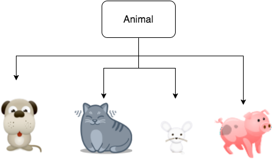

# Python OOP

După o abatere de la Python, am revenit la această temă. Sper că lucrurile pe care le-ați învățat până acum au fost interesante și practice. Mai sper că vi s-a făcut dor de Python-el. ❤️

## Warmup \(Mai ții minte?\)

Iubești listele din Python așa cum le iubesc eu? Atunci te rog să-mi răspunzi ce va afișa fiecare linie:

```python
numbers = [42, 21, 1, 13, 1, 34, 2, 3, 5, 8]

print(numbers[3])
print(numbers[-1])
print(numbers[0:6])
print(numbers[6:])
print(numbers[5:-1])
print(numbers[:3])
```

Splendid! Te provoc să mai experimentezi cu aceste structuri de date, în timpul liber, după această prezentare.

## Programare orientată pe obiecte \(OOP\)

Programarea orientată pe obiecte este o paradigmă de programare care folosește concepte abstracte \(sub forma de clase și obiecte\) pentru a crea modele bazate pe elemente din lumea reală. Obiectele sunt definite cu propriele lor variabile, numite _atribute_ și careva funcțional reprezentat prin _metode_. Metodele de obicei operează cu datele interioare ale obiectului, care, la dorință pot fi făcute inaccesibile direct utilizatorului. Mai multă teorie găsești pe [Wikipedia](https://en.wikipedia.org/wiki/Object-oriented_programming). Toate aceste noțiuni pot părea la prima vedere foarte complicate pentru un programator care nu a mai lucrat cu conceptele OOP, doar cu programarea procedurală\(Pascal, C\) . Totuși cu ajutorul exemplelor practice pe care urmează să le prezint sper ca aceste concepte să devină mult mai simplu de înțeles.

#### NB: Mini-ghid de utilizare

În această lecție voi scrie codul de bază în fișiere, însă voi experimenta în python shell. Un fișier `.py` poate fi încărcat în shell, la deschidere în felul următor:

```text
python -i <nume_fișier.py>
```

Și ca rezultat, în loc de `$` în terminal, vom avea: `>>>`. Suntem într-un interpretator Python.

### Clase, obiecte, instanțe

O **clasă** este o **colecție de obiecte** care au proprietăți, operații și comportamente comune. O clasă este o combinație de caracteristici \(atribute\) și de comportamente \(metode\). Se poate spune că o clasă este schița care descrie natura unui lucru. De exemplu, clasa `Câine` va conține caracteristicile tuturor câinilor, precum rasă sau culoarea părului \(caracteristici\), precum și capacitatea de a lătra și de a sta \(comportament\).Clasele poartă nume generice, pe când obiectele se numesc specific de obicei. Spre exemplu clasa se numește `Cat` iar un obiect al acestei clase e denumit `eddy`, probabil numele pisicii date.

Hai să scrim împreună prima noastră clasă:

```python
class Animal:
    pass
```

Asta e tot! Avem o clasă "goală" cu numele `Animal`. Cuvântul pass este adesea folosit ca substituent care indică unde va merge în cele din urmă codul. Acest lucru vă permite să rulați acest cod fără ca Python să arunce o eroare.

Având definiția clasei, putem instanția primele obiecte:

```python
>>> first_animal = Animal()
>>> second_animal = Animal()
>>> type(first_animal)        # Verificăm tipul variabilei
<class '__main__.Animal'>
>>> type(second_animal)
<class '__main__.Animal'>
>>>
```

Felicitări! Ai creat prima ta clasă și ai mai și creat obiecte cu acea clasă. Bravo! Acum hai să îmbunătățim această clasă.

După cum am zis mai sus, clasele au atribute și metode. Metodele sunt funcții definite în corpul unei clase. Sunt folosite pentru a defini comportamentele unui obiect. Hai să adăugăm niște date și niște metode clasei noastre.

```python
class Animal:
    def say(self):
        print("Hello world!")
```

NB: Ca să executăm metoda `say()` a unui obiect `a`, vom scrie `a.say()`.

Acum putem crea un obiect nou a acestei clase și putem invoca metoda `say()`. Ai observat probabil că funcția `say` are un parametru numit `self`. Încă nu-ți explic ce înseamnă, însă tu scrie-l, ca totul să funcționeze.

NB: Dacă nu punem parametrul `self` în declarația metodei, vom avea așa o eroare la încercarea de a invoca această metodă:

```python
>>> a = Animal()
>>> a.say()
Traceback (most recent call last):
  File "<stdin>", line 1, in <module>
TypeError: say() takes no arguments (1 given)
>>>
```

În câteva momente voi explica și semnificația acestei convenții.

Haideți să creăm un obiect de tip `Animal` și să executăm metoda `say()`. Să aplicăm în mod practic:

```python
>>> a = Animal()
>>> a.say()
Hello world!
>>>
```

Perfect! Acum clasa noastră are o metodă care mai și funcționează. Și totuși, probabil te întrebi de ce a fost nevoie de `self` ca parametru al funcției și de ce la executarea metodei nu am specificat niciun parametru. Curiozitatea ta e foarte actuală.

### Self. Pentru ce ne trebuie el?

Convenția de a plasa `self` ca parametru formal al metodei este una istorică și e strict în conformitate cu Zen-ul limbajului de programare Python, documentat în [PEP 20](https://www.python.org/dev/peps/pep-0020/) și anume "Explicit is better than implicit". În plus, chiar și [Guido van Rossum](https://en.wikipedia.org/wiki/Guido_van_Rossum) a scris o notiță cu argumentele necesare pentru `self`: [Why explicit self has to stay](http://neopythonic.blogspot.com/2008/10/why-explicit-self-has-to-stay.html).

Eu însă nu am să intru în detalii prea mult, dar am să-ți explic în ce constă convenția dată, pentru ce se folosește și cum am putea beneficia de ea.

Aici am creat din nou clasa `Animal` și i-am definit atributul `name`. Metoda `info()` va prezenta obiectul dat utilizând atributul `name`

```python
class Animal:
    name = "I don't have a name yet :("

    def info(self):
        print("My name is %s." % name) # Eroare pentru că nu utilizăm self
```

Încercăm în practică ceea ce am scris:

```python
>>> a = Animal()
>>> a.name = "Tobby" # Setăm numele animăluțului nostru
>>> a.info() # Testăm metoda noastră
Traceback (most recent call last):
  File "<stdin>", line 1, in <module>
    print("My name is %s." % name)
NameError: global name 'name' is not defined # Eroare
>>> a.name # Însă putem accesa atributul name din obiectul nostru!
'Tobby'
```

Nu lucrează cum ne-am fi așteptat! 😞

Totuși, vezi că suntem apți să accesăm atributul `name` al obiectului nostru. Hai să beneficiem de această facilitate și să rescriem metoda noastră:

```python
    def info(self):
        print("My name is %s." % a.name) # Incorect!
```

Hai să vedem ce ne-a ieșit:

```python
>>> a = Animal()
>>> a.name = "Tobby"
>>> a.info()
My name is Tobby.
>>>
```

Yay! Merge! Însă, e incorect pentru că facem referință la un obiect cu un nume exact în cadrul metodei noastre și anume:

```python
>>> bob = Animal()
>>> bob.name = "Bob"
>>> bob.info()
My name is Tobby.  # Greșit! Totul e din cauza că în info() facem referire la obiectul a.
>>>
```

Aparent lucrurile au luat o întorsătură neașteptată.😕 Însă, nu te întrista! Totul e mai simplu decât te așteptai!

Probabil ți-ai dat seama unde vreau să ajung. Exact, înapoi la `self`. Acest parametru formal al metodelor ține în interiorul său referința spre obiectul curent. Utilizând-ul vom scăpa de ambiguitatea în care am intrat în exemplele precedente. Hai să vedem ce ne-a ieșit:

```python
    def info(self):
        print("My name is %s." % self.name)
```

Atâta tot, să vedem în practică:

```python
>>> tobby = Animal()
>>> tobby.name = "Tobby"
>>> tobby.info()
My name is Tobby. # Perfect, așa cum așteptam
>>> bob = Animal()
>>> bob.name = "Bob"
>>> bob.info()
My name is Bob. # Din nou, lucrează perfect!
>>>
```

Acum totul lucrează exact așa cum doream. Mă bucur că ai înțeles semnificația convenției de a utiliza `self`

NB: În repetate rânduri am pomenit că `self` este doar o convenție. În alte limbaje de programare, cum ar fi Java sau C++ poți întâlni o situație similară, doar că pentru acele limbaje cuvântul cheie este `this`. Comportamental este cât de cât similar, însă, în Python el este declarat explicit. În concluzie, ține minte, `self`, nu este un cuvând magic, nici un cuvânt cheie al limbajului Python. Ca să-ți demonstrez asta, am să redenumesc `self` în `my_custom_loved_self`, să vedem ce iese din asta:

```python
    def info(my_custom_loved_self):
        print("My name is %s." % my_custom_loved_self.name)
```

```python
>>> a = Animal()
>>> a.name = "Dean"
>>> a.info()
My name is Dean.
>>>
```

Superb! Ca să concluzionez, `self` este doar o convenție, chiar dacă editorul sau IDE-ul tău îl colorează într-un mod specific. Totuși, te rog să folosești mereu anume `self` pentru a denota referința către instanța curentă a obiectului.

### Constructor. `__init__()`

Dacă deja cunoști careva limbaj de programare orientat pe obiecte, probabil știi ce-i aia un constructor. Spre exemplu limbaje ca Java sau C++ au constructori impliciți\(main\). În Python, metoda `__init__()` își are ca scop același lucru.

Totuși, nu ți-am povestit încă ce-i aia un constructor. Numele însă, vorbește pentru sine. **Constructorul** unei clase este o funcție internă, specială a acelei clase care este **apelată în momentul în care se creeaza** un obiect al acelei clase. Chiar dacă în Python, metoda `__init__()` nu este numită constructor, ea se comportă exact ca un constructor tradițional, adică se execută la crearea unui obiect nou. Ceea ce face această metodă să nu fie numită constructor, e faptul că la momentul execuției ei, scheletul obiectului e deja construit în interiorul interpretatorului Python. Din perspectiva programatorului, acest fapt nu are niciun efect advers. Hai să scriem primul nostru constructor:

```python
class Animal:
    name = "I don't have a name yet :("

    def __init__(self):
        print("A new baby animal was born!")
```

Atât de simplu. Hai să testăm:

```python
>>> a = Animal()
A new baby animal was born!
>>>
```

Așa cum te-ai așteptat, la crearea unei instanțe noi, metoda `__init__()` a fost executată! Perfect, însă probabil te întrebi, dacă alte metode acceptă parametri adiționali, oare și `__init__`-ul poate accepta acești parametri? Răspunsul e: Cu siguranță! Hai să specificăm numele animăluțului nostru la crearea unui obiect nou:

```python
class Animal:
    def __init__(self, name):
        self.name = name
        print("A new baby animal was born!")
```

Hai să testăm ce ne-a ieșit, în linia de comandă:

```python
>>> tobby = Animal("Tobby")
A new baby animal was born!
>>> tobby.name
'Tobby'
>>>
```

Perfect! Acum poți crea "constructori" utilizând `__init__`. Și mai știi cum să adaugi parametri acestei metode.

#### O clasă generică

Haideți să creăm o clasă ceva mai completă, din nou cu numele `Animal` și cu atributele `name` și `age`.

```python
class Animal:
    def __init__(self, name, age):
        self.name = name
        self.age = age  # In months

    def info(self):
        print("My name is %s!" % self.name)
        print("I am %d months old." % self.age)

    def say_hi(self):
        print("Hello!")
```

Hai să rulăm, să vedem ce ne-a ieșit:

```python
>>> tobby = Animal("Tobby", 8)
>>> tobby.info()
My name is Tobby!
I am 8 months old.
>>> tobby.say_hi()
Hello!
>>>
```

### "Aproape" encapsulare

Fiecare lecție de programare orientată pe obiecte descrie cele mai importante concepte, și anume: Encapsularea, Moștenirea \(Inheritance\) și Polimorfismul. Am să ating și eu aceste concepte pentru a-ți crea o bază rigidă de înțelegere.

Chiar dacă limbajul de programare Python urmează cele mai bune practici OOP, encapsularea nu este în totalitate suportată. Acest fapt nu trebuie considerat neapărat un dezavantaj, ci din contra, e o simplificare justă. Argumentul principal stă în sloganul "We're all responsible users here".

Encapsularea clasică ține de restricționarea accesului la membrii unui obiect sau clase. Pentru a înțelege mai bine encapsularea propun să luăm în considerare un exemplu real de encapsulare.Într-o companie, există diferite secțiuni, cum ar fi contabilitatea, secțiunea financiară, secțiunea vânzări etc.Secțiunea finanțe gestionează toate tranzacțiile financiare și ține evidența tuturor datelor legate de finanțare. În mod similar, secțiunea de vânzări gestionează toate activitățile legate de vânzări și ține evidența tuturor vânzărilor. Acum poate apărea o situație în care, dintr-un anumit motiv, un funcționar din secțiunea financiară are nevoie de toate datele despre vânzări dintr-o anumită lună. În acest caz, nu i se permite accesul direct la datele secțiunii de vânzări. Mai întâi va trebui să contacteze un alt ofițer din secțiunea de vânzări și apoi să-i ceară să furnizeze datele specifice. Aceasta este encapsularea.În Java sau C++ fiecare atribut sau metodă a clasei sunt definite ca `public`, `private` și `protected.`

 În Python există posibilitatea de mimat comportamentul `private`. Deci, un atribut al clasei care va fi denotat ca privat, nu va fi accesibil din exterior, însă vom putea să-l accesăm din metodele clasei. Ca să facem un atribut privat, trebuie să-i punem prefixul `__`. Hai să vedem cum lucrează asta:

```python
class Animal:
    def __init__(self, name, age):
        self.__name = name
        self.__age = age  # In months

    def info(self):
        print("My name is %s!" % self.__name)
        print("I am %d months old." % self.__age)
```

Acum, vom putea vedea conținutul la `__name` și `__age` doar prin metoda `info()`, însă nu și direct. Hai să experimentăm:

```python
>>> a = Animal("Tobby", 8)
>>> a.info()
My name is Tobby!
I am 8 months old.
>>> a.__name
Traceback (most recent call last):
  File "<stdin>", line 1, in <module>
AttributeError: 'Animal' object has no attribute '__name'
>>> a.__age
Traceback (most recent call last):
  File "<stdin>", line 1, in <module>
AttributeError: 'Animal' object has no attribute '__age'
>>>
```

Așa cum am pomenit mai sus, atributele date au devenit private. Dar să vă zic un secret. Ele de fapt nu sunt private. :stuck\_out\_tongue\_winking\_eye: Te întrebi probabil cum așa ceva e posibil. Acuși am să îți explic. Python are o subrutină numită `Mangle` \(a mutila, din engleză\). Ce se întâmplă de fapt, e mutilarea numelui atributelor din perspectiva obiectului. Această facilitate poate fi utilă în crearea modulelor publice prin faptul că va elimina posibilele conflicte la moștenire \(inheritance\). Despre moștenire vorbim mai târziu. Păi, cum anume se mutilează numele? Hai să experimentăm:

```python
>>> a._Animal__name
'Tobby'
>>> a._Animal__age
8
>>>
```

Magnific! Acum știi lucruri din interiorul interpretatorului. Însă ai grijă și utilizează aceste facilități doar atunci când într-adevăr ai nevoie de ele. Pe lângă deviza "We're all responsible users here", mai există una ce-mi place foarte mult: "With great power comes great responsibility". Ar fi bine să le memorezi :stuck\_out\_tongue\_winking\_eye:

### Moștenire \(Inheritance\)

Moștenirea este proprietatea unei clase de a moșteni caracteristicile altei clase sau altui obiect. Această facilitate ne ajută să abstractizăm logica structurilor de date într-un mod optim ce ne va ușura dezvoltarea ulterioară a proiectului.

În imaginea ce urmează este prezentat un model de moștenire. Acest model va fi utilizat în exemplele ulterioare.



Hai acum să încercăm primul nostru model de moștenire. Iarăși, vom avea clasa `Animal` și clasa `Cat` care va moșteni de la `Animal`.

```python
class Animal:
    def __init__(self, name, age):
        self.name = name
        self.age = age  # In months

    def info(self):
        print("My name is %s!" % self.name)
        print("I am %d months old." % self.age)


class Cat(Animal):
    def __init__(self, name, age):
        self.name = name
        self.age = age  # In months
        self.has_furr = True

    def say(self):
        print("Meow!")
```

Sintactic e foarte simplu. Vedem că în `__init__()` repetăm careva acțiuni. Ar trebui să îmbunătățim apoi constructoarele noastre ca să respectăm principiul DRY - Don't repeat yourself. Însă acu, să vedem ce ne-a ieșit:

```python
>>> nona = Cat("Nona", 12)
>>> nona.say()
Meow!
>>> nona.has_furr
True
>>> nona.info()
My name is Nona!
I am 12 months old.
>>>
```

Totul merge așa cum ne-am așteptat. Avem acces atât la metodele din clasa `Cat` cât și la cele din clasa-părinte `Animal`. Hai acum să modificăm metodele `__init__()` utilizând funcția `super()`:

```python
class Animal:
    def __init__(self, name, age):
        self.name = name
        self.age = age  # In months

    def info(self):
        print("My name is %s!" % self.name)
        print("I am %d months old." % self.age)


class Cat(Animal):
    def __init__(self, name, age, has_furr=True):
        super(Cat, self).__init__(name, age)
        self.has_furr = has_furr

    def say(self):
        print("Meow!")
```

`super()` ne permite să căpătăm access la metoda `__init__()` din superclasă \(clasa de la care moștenim\). Acum `name` și `age` sunt atributele clasei `Animal` și tot acolo se gestionează și datele de intrare.

```python
>>> nona = Cat("Nona", 12)
>>> nona.has_furr
True
>>> nona.say()
Meow!
>>> nona.info()
My name is Nona!
I am 12 months old.
>>>
```

Acum totul lucrează, și mai e și făcut corect. Hai să încercăm încă un nivel de moștenire. Știți de existența pisicilor fără blană? :smile\_cat: Hai să moștenim de la Cat și că creăm SphynxCat:

```python
class SphynxCat(Cat):
    def __init__(self, name, age):
        super(SphynxCat, self).__init__(name, age, False) # No furr

    def say(self):
        print("Mrrr-Meow!")
```

Iarăși, destul de simplu și intuitiv. Plus la toate, am și rescris metoda `say()`. Let's see it in action:

```python
>>> ramses = SphynxCat("Ramses", 36)
>>> ramses.say()
Mrrr-Meow!
>>> ramses.info()
My name is Ramses!
I am 36 months old.
>>>
```

Perfect, lucrează! Acum că am ajuns să rescriem metode, o să trecem la următorul subiect strâns legat cu acest principiu. :relieved:

### Polimorfism

Conform DEX, în lumea chimiei, polimorfismul e proprietatea unor substanțe de a se putea prezenta în două sau mai multe forme cristaline distincte. Situația este similară și în domeniul programării orientate pe obiecte. Pentru a ilustra acest principiu vom oferi comportament diferit metodei `say()` pentru diferite animăluțe. Hai să creăm clasele `Cat` și `Dog`, ambele subclase de la `Animal`. Hai să încercăm lucrul practic:

```python
class Cat(Animal):
    def __init__(self, name, age, has_furr=True):
        super(Cat, self).__init__(name, age)
        self.has_furr = has_furr

    def say(self):
        print("Meow-meow!")


class Dog(Animal):
    def __init__(self, name, age, medical_response=False):
        super(Dog, self).__init__(name, age)
        self.medical_response = medical_response

    def say(self):
        print("Woof-woof!")
```

Am implementat aceiași metodă cu efecte diferite. Să vedem rezultatele:

```python
>>> c = Cat("Nona", 36)
>>> d = Dog("Doge", 24)
>>> c.say()
Meow-meow!
>>> d.say()
Woof-woof!
>>>
```

Lucrează! Isn't that amazing? :heart\_eyes: Hai să încercăm să îmbunătățim exemplul nostru un pic. Ce zici să forțăm cumva utilizatorul să implementeze metoda `say()` după moștenire? Hai să încercăm un exemplu simplu. Hai să adăugăm metoda asta în clasa `Animal`:

```python
    def say(self):
        print("Clasa derivată trebuie să implementeze această meodă!")
```

Și hai să implementăm clasa `Pig`, fără metoda `say()`:

```python
class Pig(Animal):
    def __init__(self, name, age, medical_response=False):
        super(Pig, self).__init__(name, age)
```

Încercăm să executăm `say()`:

```python
>>> p = Pig("Porky", 24)
>>> p.say()
Clasa derivata trebuie sa implementeze aceasta meoda!
>>>
```

Good, dar hai să nu ne oprim aici. Unele limbaje de programare au conceptul de "abstract method", metodă ce trebuie neapărat implementată în clasa derivată. Hai să forțăm o eroare în caz că metoda nu e implementată. În practică poate fi foarte util la depistarea posibilelor erori de programare. O să facem **raise** la excepția NotImplementedError. Să vedem ce ne-a ieșit:

```python
    def say(self):
        msg = "Clasa derivata trebuie sa implementeze aceasta metoda!"
        raise NotImplementedError(msg)
```

Acum când încercăm să executăm metoda `say()`, interpretatorul Python ne aruncă o eroare cu mesaj sugestiv:

```python
>>> p = Pig("Porky", 24)
>>> p.say()
Traceback (most recent call last):
  File "<stdin>", line 1, in <module>
  File "/Users/mihai/dev/girls-go-it/trainings/d6l3-back-to-python/animal.py", line 12, in say
    raise NotImplementedError(msg)
NotImplementedError: Clasa derivata trebuie sa implementeze aceasta metoda!
```

Nu te speria de excepții, chiar dacă nu vei avea nevoie de așa funcțional în viitorul apropiat, am vrut să știi că există posibilitatea să generezi și tu erori când e cazul.

Cam atât din cursul introductiv despre programarea orientată pe obiecte în python. Sper că ți-a fost interesant! Acum e timpul să experimentezi independent și, dacă ai întrebări - **întreabă**. Curiozitatea, motivația și entuziasmul vor contribui la crearea cunoștințelor noi. Iar eu sper că ți-am trezit curiozitatea, te-am motivat și entuziasmat măcar un pic. 

Succese vă doresc și pe final vă propun un exercițiu care totalizează cunoștințele pe care le-ai acumulat până aici  🌹

