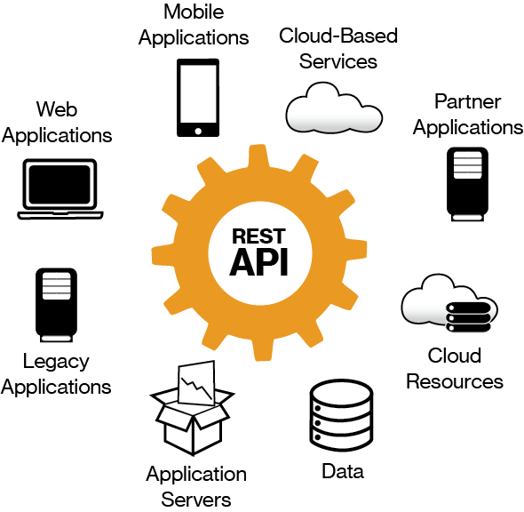

# REST API's

## API - Application Programming Interface

Termenul de **API** este acronimul de la Application Programing Interface care in limba română se poate traduce ca interfață de programare a aplicațiilor și reprezintș un set de reguli și specificații cu ajutorul cărora un program poate accesa și folosi resursele oferite de un alt program. Cu alte cuvinte, un program care oferă API-uri permite altor programe să interacționeze cu acesta automat, de la program la program sau de la program la sistem de operare, fără să fie nevoie de folosirea unei interfețe grafice de utilizare \(GUI\) și fără cunoștințe legate de arhitectura sau elemente de programare ale programului ci doar folosirea specificațiilor de utilizare a API-ului oferit.



## REST - Representational State Transfer

**REST** este un stil de arhitectură pentru sistemele informatice aflate într-o rețea.


## RESTful API

## HTTP - Hypertext Transfer Protocol

**Hypertext Transfer Protocol** este metoda cea mai des utilizată pentru accesarea informațiilor în Internet care sunt păstrate pe servere World Wide Web. Protocolul HTTP este un protocol de tip text, fiind protocolul "implicit" al WWW. Adică, dacă un URL nu conține partea de protocol, aceasta se consideră ca fiind http. HTTP presupune că pe calculatorul destinație rulează un program care înțelege protocolul. Fișierul trimis la destinație poate fi un document HTML, un fișier grafic, de sunet, animație sau video, de asemenea un program executabil pe server-ul respectiv sau și un editor de text.

### Cum funcționează HTTP

HTTP oferă o tehnică de comunicare prin care paginile web se pot transmite de la un computer aflat la distanță spre propriul computer. Dacă se apelează un link sau o adresă de web cum ar fi [http://girlsgoit.org/](http://girlsgoit.org), atunci se cere calculatorului host să afișeze o pagină web \(index.html sau altele\). În prima fază, adresa  www.girlsgoit.org este convertit de protocolul DNS într-o adresă IP. Urmează transferul prin protocolul TCP pe portul standard 80 al serverului HTTP, ca răspuns la cererea HTTP-GET. Informații suplimentare ca de ex. indicații pentru browser, limba dorită ș.a. se pot adăuga în header-ul pachetului HTTP. În urma cererii HTTP-GET urmează din partea serverului răspunsul cu datele cerute, ca de ex.: pagini în HTML, cu fișiere atașate ca imagini, fișiere de stil \(CSS\), scripturi \(Javascript\), dar pot fi și pagini generate dinamic. Dacă dintr-un anumit motiv informațiile nu pot fi transmise, atunci serverul trimite înapoi un mesaj de eroare. Modul exact de desfășurare a acestei acțiuni \(cerere și răspuns\) este stabilit în specificațiile HTTP.

### Metodele HTTP

Metodele HTTP furnizează operaţiile, cum ar fi crearea citirea, actualizarea şi ştergerea unei resurse din baza de date. În tablelul de mai jos găsiți cele mai utilizate metode folosite:

|  **Metodă HTTP** | **Descrierea** |
| :--- | :--- |
| GET | Extrage o resursă. |
| POST |  Creează o nouă resursă. |
| PUT | Actualizează o resursă existentă. |
| DELETE | Șterge o resursă. |

Pentru o listă mai detaliată a metodelor disponibile puteți accesa acest [link](https://developer.mozilla.org/en-US/docs/Web/HTTP/Methods).

### Mesaje de eroare HTTP

Codurile de stare a răspunsului HTTP indică dacă o anumită solicitare HTTP a fost finalizată cu succes. Răspunsurile sunt grupate în cinci clase: 

* 1xx - răspunsuri informaționale
* 2xx - răspunsuri reușite
* 3xx - redirecționări
* 4xx - erori de client
* 5xx - erori de server

Codurile de stare sunt definite în secțiunea [10 din RFC 2616](https://tools.ietf.org/html/rfc2616#section-10). Adițional, pentru o descriere mai detaliată, puteți accesa următorul [link](https://developer.mozilla.org/en-US/docs/Web/HTTP/Status).

## Django REST

Django REST framework este un set de instrumente puternic și flexibil pentru crearea API-urilor Web.

Pentru a începe a dezolta un REST API folosing Django REST, e nevoie de instalat Django și de configurat proiectul Django astfel încât șa folosim instrumentele oferite de Django REST pentru a crea un API. 

Pentru a ușura procesul de învățăre, vom folosi un proiect exemplu care va consta din un API pentru o aplicație de TODO. În imaginea de mai jos sunt reprezentate endpoint-urile pe care noi le vom crea și metodele HTTP care le vom folosi.


### Configurare proiect

Primul pas pentru crearea unei aplicații web folosind Django, e nevoie să creăm un nou proiect Django rulând următoarea comanda:



```text
django-admin.exe startproject todos_api
```



După care, în interiorul folder-ului creat de Django, todos\_api, rulam comanda de creare a unei aplicații Django:



```text
python manage.py startapp todos
```



Și nu uităm ca să adăugăm aplicația creată în lista `INSTALLED_APPS`  



```python
INSTALLED_APPS = [
    ...
    'todos',
]
```



Iar pentru că vom folosi Django REST, e nevoie de intalat acest pachet Python folosind `pip`



```text
pip install djangorestframework
```



Apoi, e nevoie de adăugat `django_rest` in lista `INSTALLED_APPS` în proiect.



```python
INSTALLED_APPS = [
    ...
    'rest_framework',
]
```



Urmatorul pas este să configurăm url-urile pentru proiectul nostru, iar pentru asta e nevoie de adăugat url-urile care urmează să le definim în aplicația noastră în proiect. Pentru asta, ne asigurăm că fișierul `urls.py` conține urmatorele informații:



```python
from django.contrib import admin
from django.urls import path, include

urlpatterns = [
    path('admin/', admin.site.urls),
    path('', include('todos.urls')),
]
```



Totodată, nu uităm să creăm fișierul `urls.py` în aplicația noastră cu următoarele linii de cod:



```python
from django.urls import path

urlpatterns = [
]
```



Ca ultim pas, rulăm comanda de aplicare a migrărilor în baza de date folosind:



```text
python manage.py migrate
```



Felicitări, am finalizat configurarea inițială a proiectului nostru. Pentru a ne asigura că totul funcționează corect, încercăm să pornim un server de test pe calculatorul nostru.



```text
python manage.py runserver
```



Iar dacă totul a rulat bine, în terminal ar trebui să vedem:



```text
Performing system checks...

System check identified no issues (0 silenced).
July 17, 2018 - 13:50:38
Django version 2.0.7, using settings 'todos_api.settings'
Starting development server at http://127.0.0.1:8000/
Quit the server with CTRL-BREAK.
```




