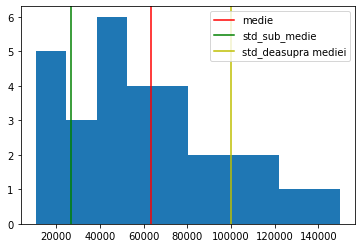
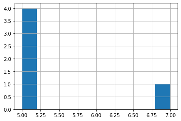
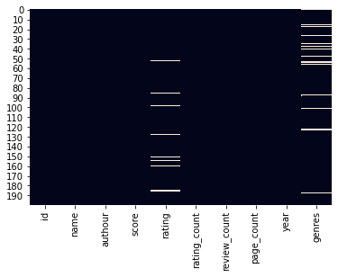
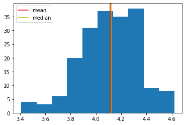
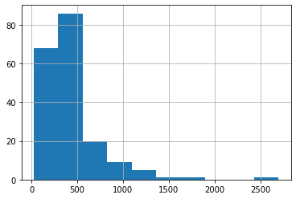
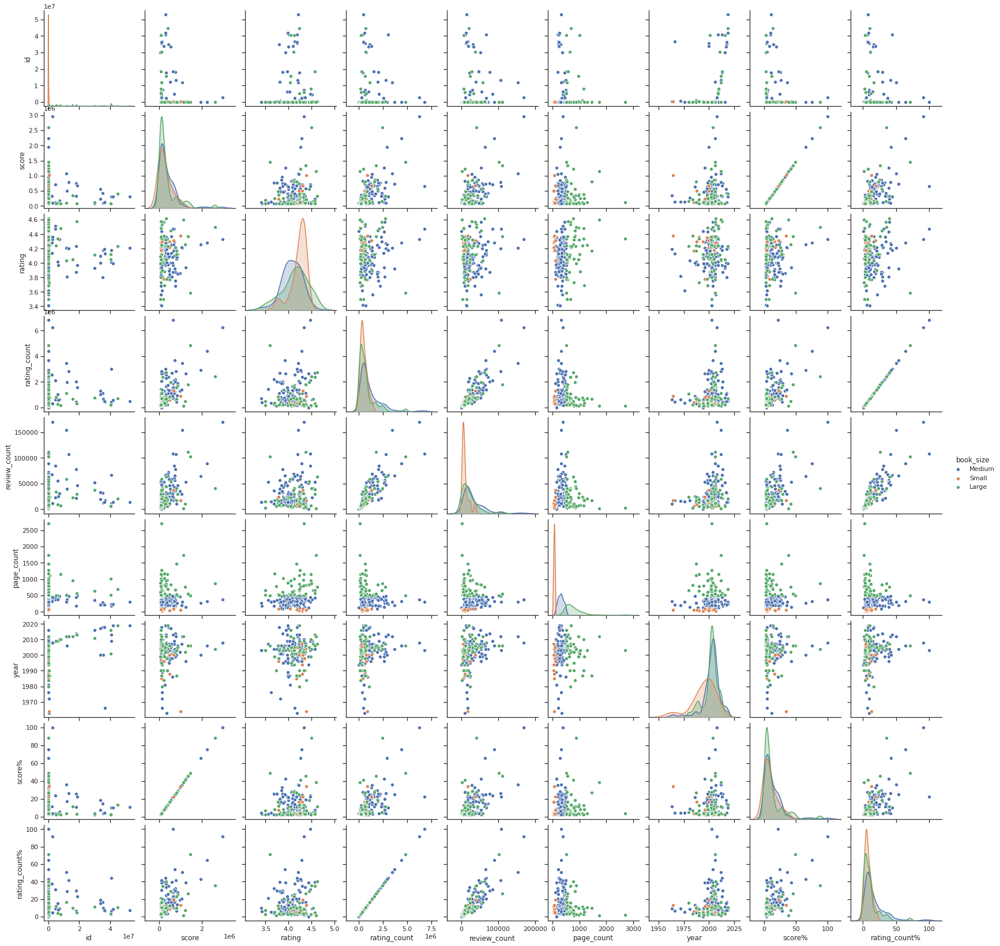

# Pandas

## Obiective

* Să înțelegeți care e diferența dintre Numpy și Pandas.
* Să știți cum să utilizați funcțiile din Pandas și metodele claselor pandas.Series, și pandas.DataFrame.
* Să înțelegeți conceptele statistice - std, Q1,Q2,Q3.
* Să știți cum să utilizați metodele de selectare din Pandas.
* Să fiți capabile să curățiți o bază de date.
* Să știți cum să modelați datele.

```python
import matplotlib.pyplot as plt
import numpy as np
```

## Pandas  🐼

### De ce Pandas?

Am văzut mai devreme că librăria Numpy ne oferă libertatea de a lucra mai ușor cu mai multe dimensiuni decât listele de liste. Cu ajutorul oparțiilor vectorizate putem mai rapid și mai ușor să transformăm datele decât folosind loop-ul `for`.


Totuși Numpy are câteva limitări:

* Numpy nu oferă posibilitatea de a avea denumirile de coloane
* Numpy permite de a avea doar un singur tip de date într-un array
* Nu conține metode gata facute\(pre-built\) care să faciliteze procesul de analiză a datelor.

Limitările de mai sus sunt rezolvate de Pandas. Pandas nu este o ”înlocuire” a librăriei Numpy, ci mai degrabă e o extensie a lui Numpy. Codul din spatele funcțiilor și metodelor din Pandas se bazează pe libraria Numpy astfel multe din conceptele anterior învățate le vom regăsi și aici.

## Import pandas

```python
import pandas as pd
```

Pandas are 2 clase principale: pandas.Series și pandas.DataFrame.

Care este diferența dintre aceste două clase?

## Pandas.DataFrame

DataFrame-ul e o structură primară a librăriei Pandas, bi-dimensională și heterogenă.

Putem să construim un DataFrame utilizând o listă de liste sau un array.

```python
pd.DataFrame(np.array([[1,2,3,4],
              [5,6,7,8],
              [9,10,11,12]]))
```

|  | 0 | 1 | 2 | 3 |
| :--- | :--- | :--- | :--- | :--- |
| 0 | 1 | 2 | 3 | 4 |
| 1 | 5 | 6 | 7 | 8 |
| 2 | 9 | 10 | 11 | 12 |

Putem să utilizăm un dicționar în crearea unui DataFrame.

```python
pd.DataFrame({'a':[1,2,3,4], 'b':[5,6,7,8], 'c':[9,10,11,12]})
```

|  | a | b | c |
| :--- | :--- | :--- | :--- |
| 0 | 1 | 5 | 9 |
| 1 | 2 | 6 | 10 |
| 2 | 3 | 7 | 11 |
| 3 | 4 | 8 | 12 |

Clasa DataFrame are și un parametru cu care putem să specificăm numele coloanelor într-o listă. De data asta atribuim DataFrame-ul unei variabile.

```python
df = pd.DataFrame([[1,2,3,4],
              [5,6,7,8],
              [9,10,11,12]], columns = ['a', 'b', 'c', 'd'])

df
```

|  | a | b | c | d |
| :--- | :--- | :--- | :--- | :--- |
| 0 | 1 | 2 | 3 | 4 |
| 1 | 5 | 6 | 7 | 8 |
| 2 | 9 | 10 | 11 | 12 |

Ce diferență este între primul, al doilea și al treilea tabel?

```python
# Creați un DataFrame cu 3 coloane și 2 rânduri, iar coloanele să aibă nume

df1 = pd.DataFrame({'a' : [1, 2], 'b': [3, 4], 'c':[5,6]})
df1
```

|  | a | b | c |
| :--- | :--- | :--- | :--- |
| 0 | 1 | 3 | 5 |
| 1 | 2 | 4 | 6 |

## Pandas.Series

Obiectul Series este un ndarray cu o singură dimensiune.

Ca să instanțiem un obiect Series putem folosi o listă de valori.

```python
pd.Series([1, 2, 3, 4])
```

```text
0    1
1    2
2    3
3    4
dtype: int64
```

Obiectul Series poate avea și un nume.

```python
pd.Series([1, 2, 3, 4], name = 'numbers')
```

```text
0    1
1    2
2    3
3    4
Name: numbers, dtype: int64
```

Un obiect Series poate fi și sintaxa de mai jos. Ce reprezintă sintaxa de mai jos?

```python
df['a']
```

```text
0    1
1    5
2    9
Name: a, dtype: int64
```

Sintaxa de mai sus reprezintă cea mai simplă modalitate de a selecta o coloană dintr-un DataFrame.

```python
# selectează coloana 'd' din tabelul df
df['d']
```

```text
0     4
1     8
2    12
Name: d, dtype: int64
```

Documentație:

* [pandas.Series](https://pandas.pydata.org/pandas-docs/stable/reference/api/pandas.Series.html)
* [pandas.DataFrame](https://pandas.pydata.org/pandas-docs/stable/reference/api/pandas.DataFrame.html)

## Elementele unui DataFrame


## Cum convertim din Pandas in Numpy?

```python
df = pd.DataFrame([[1,2,3,4],
              [5,6,7,8],
              [9,10,11,12]], columns = ['a', 'b', 'c', 'd'])
df
```

|  | a | b | c | d |
| :--- | :--- | :--- | :--- | :--- |
| 0 | 1 | 2 | 3 | 4 |
| 1 | 5 | 6 | 7 | 8 |
| 2 | 9 | 10 | 11 | 12 |

Metoda `to_numpy()` a clasei DataFrame convertește un obiect DataFrame într-un array.

```python
df.to_numpy()
```

```text
array([[ 1,  2,  3,  4],
       [ 5,  6,  7,  8],
       [ 9, 10, 11, 12]])
```

## Citirea unui fișier CSV cu Pandas

Pentru a accesa un set de date, putem să folosim funcția read\_csv\(\) care primește ca argument path-ul, sau ”calea” spre fișierul CSV.

Această funcție ne returnează un DataFrame.

Documentație: [pandas.read\_csv\(\)](https://pandas.pydata.org/pandas-docs/stable/reference/api/pandas.read_csv.html)

```python
books = pd.read_csv('https://girlsgoitpublic.z6.web.core.windows.net/books_to_be_cleaned.csv')
```

Metoda head\(\), aparține clasei DataFrame. Această metodă ne permite să vizualizăm implicit primele 5 rânduri din tabel.

Însă putem să vizualizăm și mai multe rânduri dacă specificăm acest parametru.

```python
# indică argumentul 10 in funcția head() și execută programul
# ce observi? dar daca scrii -5?

books.head()
```

|  | Id | Name | Authour | Score | Rating | Rating Count | Review Count | Page Count | Year | Genres |
| :--- | :--- | :--- | :--- | :--- | :--- | :--- | :--- | :--- | :--- | :--- |
| 0 | 22628 | The Perks of Being a Wallflower | Stephen Chbosky | 745557 | 4.20 | 1219410 | 56409 | 213p | 1999 | NaN |
| 1 | 77203 | The Kite Runner | Khaled Hosseini | 427631 | 4.30 | 2365531 | 72036 | 371p | 2004 | Fiction |
| 2 | 35545737 | A Walk to Remember | Nicholas Sparks | 104093 | 4.18 | 658664 | 12918 | 215p | 2000 | Romance |
| 3 | 32929 | Goodnight Moon | Margaret Wise Brown | 93488 | 4.28 | 296501 | 5729 | 32p | 2007 | Childrens |
| 4 | 153747 | Moby-Dick or, the Whale | Herman Melville | 200963 | 3.50 | 470744 | 15149 | 654p | 2003 | Classics |

Metoda tail\(\) este opusul metodei head\(\).

```python
books.tail()
```

|  | Id | Name | Authour | Score | Rating | Rating Count | Review Count | Page Count | Year | Genres |
| :--- | :--- | :--- | :--- | :--- | :--- | :--- | :--- | :--- | :--- | :--- |
| 195 | 17899948 | Rebecca | Daphne du Maurier | 328317 | 4.23 | 430751 | 22157 | 449p | 2013 | Classics |
| 196 | 32261 | Tess of the D'Urbervilles | Thomas Hardy | 88562 | 3.80 | 233821 | 8491 | 518p | 2003 | Classics |
| 197 | 7126 | The Count of Monte Cristo | Alexandre Dumas | 116688 | 4.25 | 731027 | 20622 | 1276p | 2003 | Classics |
| 198 | 17245 | Dracula | Bram Stoker | 636610 | 4.00 | 907768 | 24683 | 488p | 1986 | Classics |
| 199 | 662 | Atlas Shrugged | Ayn Rand | 247445 | 3.69 | 348149 | 17053 | 1168p | 1999 | Classics |

## Cum salvăm un DataFrame într-un fișier CSV?

Metoda `to_csv()` returnează un fișier CSV. Această metodă primește ca parametri numele fișierului. De asemenea specificăm parametrul `index` cu valoarea `False` ca să nu anuleze indexul exitent din DataFrame transformându-l într-o coloană și să indexeseze din nou rândurile.

```python
df.to_csv('df.csv', index=False)
```

## Atribute

Aceste atribute ne ajută să investigăm DataFrame-ului.

Atributul `columns` ne returnează o listă cu numele coloanelor din tabel.

```python
books.columns
```

```text
Index(['Id', 'Name', 'Authour', 'Score', 'Rating', 'Rating Count',
       'Review Count', 'Page Count', 'Year', 'Genres'],
      dtype='object')
```

Atributul `dtypes` ne ajută să investigăm ce tipuri de date avem în tabel.

```python
books.dtypes
```

```text
Id                int64
Name             object
Authour          object
Score             int64
Rating          float64
Rating Count      int64
Review Count      int64
Page Count       object
Year              int64
Genres           object
dtype: object
```

Atributul `index` ne returnează intervalul de indecși conținut de DataFrame-ul `books`.

```python
books.index
```

```text
RangeIndex(start=0, stop=200, step=1)
```

Atributul shape ne returnează un tuplu care conține numărul de rânduri și numărul de coloane.

```python
books.shape
```

```text
(200, 10)
```

```python
# selecteaza numărul de rânduri din tabelul books cu ajutorul atributului shape
books.shape[0]
```

```text
200
```

## Metode

### Metode de investigare a DataFrame-ului

```python
books.info()
```

```text
<class 'pandas.core.frame.DataFrame'>
RangeIndex: 200 entries, 0 to 199
Data columns (total 10 columns):
 #   Column        Non-Null Count  Dtype  
---  ------        --------------  -----  
 0   Id            200 non-null    int64  
 1   Name          200 non-null    object 
 2   Authour       200 non-null    object 
 3   Score         200 non-null    int64  
 4   Rating        191 non-null    float64
 5   Rating Count  200 non-null    int64  
 6   Review Count  200 non-null    int64  
 7   Page Count    200 non-null    object 
 8   Year          200 non-null    int64  
 9   Genres        186 non-null    object 
dtypes: float64(1), int64(5), object(4)
memory usage: 15.8+ KB
```

```python
# Ce informație ne oferă metoda info()?
```

Metoda `describe()` ne oferă informații statistice despre toate coloanele numerice.

```python
books.describe()
```

|  | Id | Score | Rating | Rating Count | Review Count | Year |
| :--- | :--- | :--- | :--- | :--- | :--- | :--- |
| count | 2.000000e+02 | 2.000000e+02 | 191.000000 | 2.000000e+02 | 200.000000 | 200.000000 |
| mean | 4.031287e+06 | 3.704144e+05 | 4.111152 | 1.001351e+06 | 28013.625000 | 2002.105000 |
| std | 1.050539e+07 | 4.211493e+05 | 0.234172 | 1.002018e+06 | 25818.271576 | 9.026147 |
| min | 1.000000e+00 | 7.125500e+04 | 3.410000 | 8.387000e+03 | 131.000000 | 1963.000000 |
| 25% | 5.123500e+03 | 1.046262e+05 | 3.970000 | 3.484505e+05 | 10847.000000 | 1999.750000 |
| 50% | 2.424650e+04 | 2.029340e+05 | 4.120000 | 6.543600e+05 | 19901.000000 | 2003.000000 |
| 75% | 2.756655e+05 | 4.999625e+05 | 4.270000 | 1.299898e+06 | 36667.500000 | 2006.000000 |
| max | 5.289286e+07 | 2.959668e+06 | 4.620000 | 6.808998e+06 | 169961.000000 | 2019.000000 |

#### Abaterea standarda

Ce este **std** sau **abaterea standardă** \(**standard deviation**\)?

Deja sunteți familiare cu histograma, știți ce înseamnă distribuția valorilor într-o histogramă. Un aspect interesant al distribuției este variabilitatea \(variability\) valorilor.

```python
a = [1, 1, 1, 1]
b = [1, 3, 3, 1]
c = [1, 1, 1, 1, 1, 1, 1, 1, 1, 1, 1, 19]

# In care din listele de mai sus, valorile variaza? In care variaza cel mai mult?
# Cat de mult variaza?
```

Ca sa ne dăm seama cât de mult variază valorile într-o distribuție trebuie să investigăm distanța valorilor de la media distribuției.


Ulterior însumând aceste distanțe, și împărțind totalul la numărul de valori din distribuție vom obține o medie aritmetică a distanțelor care ne va indica cât de mult variază valorile într-o distribuție.

```python
c = [1, 1, 1, 1, 1, 1, 1, 1, 1, 1, 1, 19]

c_mean = sum(c)/len(c)
distances = []
for num in c:
    distance = num - c_mean
    distances.append(distance)

distances
```

```text
[-1.5, -1.5, -1.5, -1.5, -1.5, -1.5, -1.5, -1.5, -1.5, -1.5, -1.5, 16.5]
```

```python
sum(distances)
```

```text
0.0
```

De ce am obținut suma = 0?

Din câte observăm suma totală a volorilor sub medie este egală cu suma totală a valorilor deasupra mediei.

Ce trebuie să facem ca să nu obținem suma = 0?

```python
# transformăm distanțele în valori absolute, astfel ne asigurăm că toate vor fi valori pozitive
distances = []
for num in c:
    distance = abs(num - c_mean)
    distances.append(distance)

distances
```

```text
[1.5, 1.5, 1.5, 1.5, 1.5, 1.5, 1.5, 1.5, 1.5, 1.5, 1.5, 16.5]
```

```python
sum(distances)
```

```text
33.0
```

```python
# Împărțim suma distanțelor absolute la numărul de valori din distribuție
sum(distances)/len(c)
```

```text
2.75
```

Valoarea de mai sus, 2.75, reprezintă **distanța medie absolută** \(**mean absolute distance**\), sau în statistică se mai numește **abaterea medie absolută** \(**mean absolute deviation**\).

O altă soluție de a evita suma = 0, e să ridicăm la puterea a doua toate distanțele.

```python
distances = []
for num in c:
    distance = (num - c_mean)**2
    distances.append(distance)

distances
```

```text
[2.25, 2.25, 2.25, 2.25, 2.25, 2.25, 2.25, 2.25, 2.25, 2.25, 2.25, 272.25]
```

Care este avantajul de a folosi valori pătratice față de valori absolute?

```python
# Împărțim suma distanțelor pătratice la numărul de valori din distribuție
sum(distances)/len(c)
```

```text
24.75
```

Valoarea 24.75 reprezintă **distanța medie patratică** \(**mean squared distance**\) sau **variația** \(**variance**\) valorilor într-o distribuție.

Acum această valoare trebuie să fie standardizată sau adusă la "starea normală" și vom face asta prin extragerea rădăcinii pătrate.

```python
import math
math.sqrt(sum(distances)/len(c))
```

```text
4.9749371855331
```

Valoarea ~4.97 am obținut-o extragând rădăcina pătrată din distanța medie pătratică, această valoare reprezintă **abaterea standardă** \(**standard deviation**\).

La ce ne ajută **abaterea standardă**?

Imaginați-vă că vreți să cumpărați o casă. Și prețul acestei case este de 60000 de euro. Vă întrebați dacă această casă este scumpă, sau nu, față de restul caselor de pe stradă. Să presupunem că avem această listă de prețuri ale caselor de pe această stradă.

```python
preturi = [10700, 120000, 20000, 35000, 78000, 45500, 90000, 100000, 19000, 60000, 40000, 51000, 55000, 72000,
           20500, 35500, 79500, 45500, 90500, 105000, 19500, 65000, 43000, 51500, 135000, 55500, 72500, 115000, 29000, 150000]
mean = sum(preturi)/len(preturi)
print(mean)

import statistics
standard_dev = statistics.stdev(preturi)
print(standard_dev)


plt.hist(preturi)
plt.axvline(mean, color = 'r', label = 'medie')
plt.axvline(mean - standard_dev, color = 'g', label = 'std_sub_medie')
plt.axvline(mean + standard_dev, color = 'y', label = 'std_deasupra mediei')
plt.legend()
```

```text
63623.333333333336
36599.94990889104


<matplotlib.legend.Legend at 0x7f0f8fe4dba8>
```



Unde se plasează 60000 de euro? Între axa verde și roșie, sau între axa roșie și galbenă? Observăm că 60000 de euro este un preț ușor mai mic decât media prețurilor caselor de pe stradă dar totuși nu e un preț foarte mic pentru că nu trece peste limita unei **abateri standarde** sub medie.


Surse adiționale:

* [Abatere standardă](https://ro.wikipedia.org/wiki/Abatere_standard)

#### Percentile

Ce sunt **percentilele**?

Percentila este o mărime care se folosește în statistică și indică câte procente din populația distribuită crescător după o anumită valoare se află până la aceasta.

De exemplu până la a 10 percentilă se află 10 procente din populație. După a 10-a percentilă se află 90% din populație.

A 25-a, 50-a, 75-a percentilă se mai numesc cuartile \(quartiles\): Q1, Q2, Q3.

```python
# Admitem că avem o populație de 10 persoane care au înălțimile de mai jos:
inaltimi = [150, 149, 168, 170, 190, 201, 182, 175, 163, 158]
```

```python
inaltimi_sortate = sorted(inaltimi)
inaltimi_sortate
```

```text
[149, 150, 158, 163, 168, 170, 175, 182, 190, 201]
```

```python
# La a câta percentilă se află persoana cu înălțimea 158? Ce înseamnă asta?

# Până la ce înălțime ajunge 50% din populație?

# Revenind la cărți: 
# Q1(25%) are valoarea rating-ului de 3.97. Ce inseamnă asta?
# Ce puteți să spuneți despre 75% din cărți si anul lor de editare?
```

Resurse utile: [Video varianta, standard deviation](https://www.youtube.com/watch?v=wDAd_QHKoOg)

### Metode: Series

```python
books['Rating'].max()
```

```text
4.62
```

```python
books['Rating'].min()
```

```text
3.41
```

```python
# Aflați minimul și maximul coloanei care indică numărul de pagini
# .....
```

```python
books['Rating'].sum()
```

```text
785.23
```

```python
# Aflați câte persoane în total au scris review-uri pentru cârți?
# ....
```

```python
books['Rating'].mean()
```

```text
4.111151832460733
```

```python
books['Rating'].median()
```

```text
4.12
```

```python
books['Rating'].mode()
```

```text
0    4.23
dtype: float64
```

Metoda value\_counts\(\) returnează frecvența valorilor dintr-o coloană.

```python
books['Rating'].value_counts()
# ce observați referitor la funcția mode() și valorile de mai jos?

# Parametri:
# normalize=True * 100
# sort = False
# ascending = True
# bins
# dropna = False
```

```text
4.23    7
4.12    5
4.36    5
3.98    5
4.26    5
       ..
3.69    1
3.95    1
4.54    1
3.83    1
3.77    1
Name: Rating, Length: 80, dtype: int64
```

Documentație: [Series.value\_counts\(\)](https://pandas.pydata.org/pandas-docs/stable/reference/api/pandas.Series.value_counts.html)

```python
# Aflați câte cărți avem reprezentative pentru fiecare gen? 
# Depistați dacă sunt date lipsă și arătați valorile în procente
# ...
```

```python
books['Rating'].sort_values(ascending=False)
```

```text
34     4.62
119    4.60
92     4.58
65     4.57
77     4.57
       ... 
151     NaN
155     NaN
160     NaN
185     NaN
186     NaN
Name: Rating, Length: 200, dtype: float64
```

```python
books['Authour'].unique()
```

```text
array(['Stephen Chbosky', 'Khaled Hosseini', 'Nicholas Sparks',
       'Margaret Wise Brown', 'Herman Melville', 'Cassandra Clare',
       'Mary Wollstonecraft Shelley', 'Dr. Seuss',
       'Gabriel García Márquez', 'Edgar Allan Poe', 'Louis Sachar',
       'Louisa May Alcott', 'Erich Maria Remarque', 'Richelle Mead',
       'Suzanne Collins', 'Rick Riordan', 'Arthur Conan Doyle',
       'William Goldman', "Madeleine L'Engle", 'Lewis Carroll',
       'Yann Martel', 'Jeffrey Eugenides', 'C.S. Lewis', 'Kahlil Gibran',
       'Alice Sebold', 'Jane Carruth', 'Fyodor Dostoyevsky',
       'Frank McCourt', 'Stephenie Meyer', 'William Golding',
       'Arthur Golden', 'Ken Follett', 'J.K. Rowling', 'Diana Gabaldon',
       'Eric Carle', 'Stieg Larsson', 'Umberto Eco', 'George R.R. Martin',
       'Patrick Rothfuss', 'Marion Zimmer Bradley', 'Jodi Picoult',
       'Alexandre Dumas', 'Franz Kafka', 'Wilson Rawls', 'Jack London',
       'J.D. Salinger', 'Kurt Vonnegut Jr.', 'Amy Tan', 'Ian McEwan',
       'Margaret Mitchell', 'Charles Dickens', 'Philip Pullman',
       'J.M. Barrie', 'Frank Herbert', 'George Orwell', 'Paulo Coelho',
       'Kathryn Stockett', 'John Steinbeck', 'S.E. Hinton', 'John Green',
       'Miguel de Cervantes Saavedra', 'John Irving', 'Betty  Smith',
       'Jay Asher', 'Charlotte Brontë', 'William Shakespeare',
       'Alan Moore', 'Stephen King', 'Christopher Paolini', 'Victor Hugo',
       'Elizabeth Gilbert', 'Hermann Hesse', 'Barbara Kingsolver',
       'Milan Kundera', 'Cormac McCarthy', 'Richard Bach', 'Homer',
       'Ernest Hemingway', 'Alice Walker', 'Antoine de Saint-Exupéry',
       'Margaret Atwood', 'Maurice Sendak', 'Dante Alighieri',
       'Agatha Christie', 'Katherine Paterson', 'A.A. Milne',
       'Norton Juster', 'Emily Brontë', 'Shel Silverstein', 'Roald Dahl',
       'Terry Pratchett', 'Jack Kerouac', 'Truman Capote',
       'Pearl S. Buck', 'Oscar Wilde', 'J.R.R. Tolkien', 'Joseph Conrad',
       'Anita Diamant', 'Colleen McCullough', 'Markus Zusak',
       'Zora Neale Hurston', 'Laura Ingalls Wilder', 'Neil Gaiman',
       'Richard  Adams', 'Geoffrey Chaucer', 'Nathaniel Hawthorne',
       'Larry McMurtry', 'Aldous Huxley', 'Frances Hodgson Burnett',
       'Joseph Heller', 'Mario Puzo', 'Veronica Roth', 'Gustave Flaubert',
       'Audrey Niffenegger', 'Douglas Adams', 'L.M. Montgomery',
       'Vladimir Nabokov', 'Anne Rice', 'Orson Scott Card', 'E.L. James',
       'Leo Tolstoy', 'Carlos Ruiz Zafón', 'Mitch Albom', 'Sara Gruen',
       'Mikhail Bulgakov', 'Ray Bradbury', 'Mark Twain',
       'F. Scott Fitzgerald', 'Michael Ende', 'E.B. White',
       'Patrick Süskind', 'Becca Fitzpatrick', 'Mark Haddon',
       'James Dashner', 'L. Frank Baum', 'Anthony Burgess', 'Ken Kesey',
       'Sylvia Plath', 'Daniel Keyes', 'Lois Lowry', 'James Joyce',
       'Dan Brown', 'Chuck Palahniuk', 'Jean M. Auel', 'Albert Camus',
       'Harper Lee', 'Reduced Shakespeare Company',
       'Robert Louis Stevenson', 'Jane Austen', 'Sue Monk Kidd',
       'Daphne du Maurier', 'Thomas Hardy', 'Bram Stoker', 'Ayn Rand'],
      dtype=object)
```

```python
books['Authour'].nunique()
```

```text
154
```

### Metode înlănțuite

Conceptul de metode înlănțuite permite aplicarea mai multor metode una peste rezultatul alteia într-o linie de cod.

```python
books['Rating'].value_counts()

# .sum()
```

```text
4.23    7
4.12    5
4.36    5
3.98    5
4.26    5
       ..
3.69    1
3.95    1
4.54    1
3.83    1
3.77    1
Name: Rating, Length: 80, dtype: int64
```

```python
books['Rating'].value_counts().head()
```

```text
4.23    7
4.12    5
4.36    5
3.98    5
4.26    5
Name: Rating, dtype: int64
```

```python
books['Rating'].value_counts().head().hist()
```



Pandas are încorporate metode de plotare bazate pe metodele din matplotlib.

## Selectarea cu loc\[\] și iloc\[\]

### loc\[\]

Loc este o proprietate prezentă și la clasa DataFrame, și la clasa Series. Această proprietate permite selectarea elementelor din DataFrame sau Series prin indexare.

```python
books.head()
```

|  | Id | Name | Authour | Score | Rating | Rating Count | Review Count | Page Count | Year | Genres |
| :--- | :--- | :--- | :--- | :--- | :--- | :--- | :--- | :--- | :--- | :--- |
| 0 | 22628 | The Perks of Being a Wallflower | Stephen Chbosky | 745557 | 4.20 | 1219410 | 56409 | 213p | 1999 | NaN |
| 1 | 77203 | The Kite Runner | Khaled Hosseini | 427631 | 4.30 | 2365531 | 72036 | 371p | 2004 | Fiction |
| 2 | 35545737 | A Walk to Remember | Nicholas Sparks | 104093 | 4.18 | 658664 | 12918 | 215p | 2000 | Romance |
| 3 | 32929 | Goodnight Moon | Margaret Wise Brown | 93488 | 4.28 | 296501 | 5729 | 32p | 2007 | Childrens |
| 4 | 153747 | Moby-Dick or, the Whale | Herman Melville | 200963 | 3.50 | 470744 | 15149 | 654p | 2003 | Classics |

```python
#sintaxa pentru selectarea unui item din DataFrame: 

# books.loc[row_label,column_label]

books.loc[0,'Id']
```

```text
22628
```

```python
# Selectăm o coloană

# books.loc[:,'Id']

# prescurtare convențională:
books['Id']
```

```text
0         22628
1         77203
2      35545737
3         32929
4        153747
         ...   
195    17899948
196       32261
197        7126
198       17245
199         662
Name: Id, Length: 200, dtype: int64
```

```python
# selectăm o listă de coloane
# books.loc[:,['Name', 'Score']]

# prescurtare convențională:
books[['Name', 'Score']]
```

|  | Name | Score |
| :--- | :--- | :--- |
| 0 | The Perks of Being a Wallflower | 745557 |
| 1 | The Kite Runner | 427631 |
| 2 | A Walk to Remember | 104093 |
| 3 | Goodnight Moon | 93488 |
| 4 | Moby-Dick or, the Whale | 200963 |
| ... | ... | ... |
| 195 | Rebecca | 328317 |
| 196 | Tess of the D'Urbervilles | 88562 |
| 197 | The Count of Monte Cristo | 116688 |
| 198 | Dracula | 636610 |
| 199 | Atlas Shrugged | 247445 |

200 rows × 2 columns

```python
# selectăm un slice de coloane
books.loc[:,'Id':'Authour']
```

|  | Id | Name | Authour |
| :--- | :--- | :--- | :--- |
| 0 | 22628 | The Perks of Being a Wallflower | Stephen Chbosky |
| 1 | 77203 | The Kite Runner | Khaled Hosseini |
| 2 | 35545737 | A Walk to Remember | Nicholas Sparks |
| 3 | 32929 | Goodnight Moon | Margaret Wise Brown |
| 4 | 153747 | Moby-Dick or, the Whale | Herman Melville |
| ... | ... | ... | ... |
| 195 | 17899948 | Rebecca | Daphne du Maurier |
| 196 | 32261 | Tess of the D'Urbervilles | Thomas Hardy |
| 197 | 7126 | The Count of Monte Cristo | Alexandre Dumas |
| 198 | 17245 | Dracula | Bram Stoker |
| 199 | 662 | Atlas Shrugged | Ayn Rand |

200 rows × 3 columns

```python
# selectează un rând
books.loc[0]
```

```text
Id                                        22628
Name            The Perks of Being a Wallflower
Authour                         Stephen Chbosky
Score                                    745557
Rating                                      4.2
Rating Count                            1219410
Review Count                              56409
Page Count                                 213p
Year                                       1999
Genres                                      NaN
Name: 0, dtype: object
```

```python
# selectează mai multe rânduri
books.loc[[2, 4, 6]]
```

|  | Id | Name | Authour | Score | Rating | Rating Count | Review Count | Page Count | Year | Genres |
| :--- | :--- | :--- | :--- | :--- | :--- | :--- | :--- | :--- | :--- | :--- |
| 2 | 35545737 | A Walk to Remember | Nicholas Sparks | 104093 | 4.18 | 658664 | 12918 | 215p | 2000 | Romance |
| 4 | 153747 | Moby-Dick or, the Whale | Herman Melville | 200963 | 3.50 | 470744 | 15149 | 654p | 2003 | Classics |
| 6 | 35031085 | Frankenstein: The 1818 Text | Mary Wollstonecraft Shelley | 430783 | 3.80 | 1132408 | 31805 | 288p | 2018 | Classics |

```python
# selectează un slice de rânduri dintr-un DataFrame
books.loc[0:2, 'Id':'Score']

# prescurtare convențională:
# books[0:2]
```

|  | Id | Name | Authour | Score |
| :--- | :--- | :--- | :--- | :--- |
| 0 | 22628 | The Perks of Being a Wallflower | Stephen Chbosky | 745557 |
| 1 | 77203 | The Kite Runner | Khaled Hosseini | 427631 |
| 2 | 35545737 | A Walk to Remember | Nicholas Sparks | 104093 |

```python
# exercițiu: vrem să selectăm de la rândul 2 până la 4 și de la coloana 'name' la coloana 'score'
books.loc[2:4, 'Name':'Score']
```

|  | Name | Authour | Score |
| :--- | :--- | :--- | :--- |
| 2 | A Walk to Remember | Nicholas Sparks | 104093 |
| 3 | Goodnight Moon | Margaret Wise Brown | 93488 |
| 4 | Moby-Dick or, the Whale | Herman Melville | 200963 |

```python
# selectează un item din Series
# books['Name'].loc[4]

# prescurtare convențională:
books['Name'][4]
```

```text
'Moby-Dick or, the Whale'
```

```python
# selectează o listă de itemi din Series
# books['Name'].loc[[2, 5, 8]]

# prescurtare convențională:
books['Name'][[2, 5, 8]]
```

```text
2                            A Walk to Remember
5    City of Bones (The Mortal Instruments, #1)
8                 One Hundred Years of Solitude
Name: Name, dtype: object
```

```python
# selectează un slice de itemi din Series
# books['Name'].loc[3:4]

# prescurtare convențională:
books['Name'][3:5]
```

```text
3             Goodnight Moon
4    Moby-Dick or, the Whale
Name: Name, dtype: object
```

```python
# selectează din coloana 'Score' itemii 3, 7, 2
books['Score'].loc[[3, 7, 2]]

# selectează din coloana 'Genres' de la al 9-lea pâna la al 15-lea item.
```

```text
3     93488
7     78563
2    104093
Name: Score, dtype: int64
```

```python
books['Genres'][9:16]
```

```text
9        Classics
10    Young Adult
11       Classics
12     Historical
13    Young Adult
14    Young Adult
15        Fantasy
Name: Genres, dtype: object
```


```python

```

### iloc\[\]

Iloc este la fel o proprietate a claselor DataFrame și Series. Cu iloc putem să selectăm coloanele sau rândurile doar după indecșii numerici.

```python
books.head()
```

|  | Id | Name | Authour | Score | Rating | Rating Count | Review Count | Page Count | Year | Genres |
| :--- | :--- | :--- | :--- | :--- | :--- | :--- | :--- | :--- | :--- | :--- |
| 0 | 22628 | The Perks of Being a Wallflower | Stephen Chbosky | 745557 | 4.20 | 1219410 | 56409 | 213p | 1999 | NaN |
| 1 | 77203 | The Kite Runner | Khaled Hosseini | 427631 | 4.30 | 2365531 | 72036 | 371p | 2004 | Fiction |
| 2 | 35545737 | A Walk to Remember | Nicholas Sparks | 104093 | 4.18 | 658664 | 12918 | 215p | 2000 | Romance |
| 3 | 32929 | Goodnight Moon | Margaret Wise Brown | 93488 | 4.28 | 296501 | 5729 | 32p | 2007 | Childrens |
| 4 | 153747 | Moby-Dick or, the Whale | Herman Melville | 200963 | 3.50 | 470744 | 15149 | 654p | 2003 | Classics |

```python
# sintaxa pentru iloc[]: df.iloc[row_index, column_index]

books.iloc[0, 0]
```

```text
22628
```

```python
books.iloc[[2, 4, 6]]
```

|  | Id | Name | Authour | Score | Rating | Rating Count | Review Count | Page Count | Year | Genres |
| :--- | :--- | :--- | :--- | :--- | :--- | :--- | :--- | :--- | :--- | :--- |
| 2 | 35545737 | A Walk to Remember | Nicholas Sparks | 104093 | 4.18 | 658664 | 12918 | 215p | 2000 | Romance |
| 4 | 153747 | Moby-Dick or, the Whale | Herman Melville | 200963 | 3.50 | 470744 | 15149 | 654p | 2003 | Classics |
| 6 | 35031085 | Frankenstein: The 1818 Text | Mary Wollstonecraft Shelley | 430783 | 3.80 | 1132408 | 31805 | 288p | 2018 | Classics |


```python
# Selectează din tabelul books de la rândul 2 la rândul 9 și de la coloana 1 la coloana 4
books.iloc[2:10, 1:5]
```

|  | Name | Authour | Score | Rating |
| :--- | :--- | :--- | :--- | :--- |
| 2 | A Walk to Remember | Nicholas Sparks | 104093 | 4.18 |
| 3 | Goodnight Moon | Margaret Wise Brown | 93488 | 4.28 |
| 4 | Moby-Dick or, the Whale | Herman Melville | 200963 | 3.50 |
| 5 | City of Bones \(The Mortal Instruments, \#1\) | Cassandra Clare | 713154 | 4.10 |
| 6 | Frankenstein: The 1818 Text | Mary Wollstonecraft Shelley | 430783 | 3.80 |
| 7 | Oh, the Places You'll Go! | Dr. Seuss | 78563 | 4.36 |
| 8 | One Hundred Years of Solitude | Gabriel García Márquez | 613129 | 4.08 |
| 9 | The Complete Stories and Poems | Edgar Allan Poe | 213957 | 4.38 |

## Selectearea prin indexarea cu boolean

O metodă pentru a selecta condiționat este folosirea indexării cu valori boolean.

```python
books['Year'] == 2006
```

```text
0      False
1      False
2      False
3      False
4      False
       ...  
195    False
196    False
197    False
198    False
199    False
Name: Year, Length: 200, dtype: bool
```

```python
bool_2006 = books['Year'] == 2006
bool_2006
```

```text
0      False
1      False
2      False
3      False
4      False
       ...  
195    False
196    False
197    False
198    False
199    False
Name: Year, Length: 200, dtype: bool
```

Cu ajutorul Seriei vom indexa în DataFrame doar rândurile cu valoarea True.


```python
books[bool_2006]
```

|  | Id | Name | Authour | Score | Rating | Rating Count | Review Count | Page Count | Year | Genres |
| :--- | :--- | :--- | :--- | :--- | :--- | :--- | :--- | :--- | :--- | :--- |
| 20 | 4214 | Life of Pi | Yann Martel | 485940 | 3.91 | 1309184 | 46807 | 460p | 2006 | Fiction |
| 24 | 12232938 | The Lovely Bones | Alice Sebold | 508104 | 3.81 | 1977504 | 40105 | 372p | 2006 | Fiction |
| 28 | 41865 | Twilight \(Twilight, \#1\) | Stephenie Meyer | 1452846 | 3.59 | 4839503 | 102492 | 501p | 2006 | Young Adult |
| 51 | 7763 | The Joy Luck Club | Amy Tan | 81845 | 3.93 | 590245 | 9020 | 288p | 2006 | Fiction |
| 64 | 28187 | The Lightning Thief \(Percy Jackson and the Oly... | Rick Riordan | 573399 | 4.25 | 1922316 | 58816 | 375p | 2006 | Fantasy |
| 69 | 14891 | A Tree Grows in Brooklyn | Betty Smith | 307886 | 4.27 | 380787 | 20170 | 496p | 2006 | Classics |
| 77 | 1 | Harry Potter and the Half-Blood Prince \(Harry ... | J.K. Rowling | 155771 | 4.57 | 2363861 | 38035 | 652p | 2006 | Fantasy |
| 86 | 99561 | Looking for Alaska | John Green | 138376 | NaN | 1084064 | 55417 | 221p | 2006 | Young Adult |
| 87 | 6288 | The Road | Cormac McCarthy | 298802 | 3.97 | 700221 | 45005 | 241p | 2006 | Fiction |
| 88 | 71728 | Jonathan Livingston Seagull | Richard Bach | 80428 | 3.84 | 196608 | 7693 | 112p | 2006 | NaN |
| 90 | 1381 | The Odyssey | Homer | 488592 | 3.77 | 844968 | 11868 | 541p | 2006 | Classics |
| 113 | 12067 | Good Omens: The Nice and Accurate Prophecies o... | Terry Pratchett | 90852 | 4.25 | 520130 | 26583 | 491p | 2006 | Fantasy |
| 123 | 19063 | The Book Thief | Markus Zusak | 1343484 | 4.37 | 1779061 | 111157 | 552p | 2006 | NaN |
| 125 | 37415 | Their Eyes Were Watching God | Zora Neale Hurston | 95935 | 3.92 | 253858 | 12964 | 219p | 2006 | Classics |
| 153 | 28186 | The Sea of Monsters \(Percy Jackson and the Oly... | Rick Riordan | 82179 | 4.24 | 717600 | 25902 | 279p | 2006 | Fantasy |
| 161 | 24583 | The Adventures of Tom Sawyer | Mark Twain | 146031 | 3.91 | 739818 | 9690 | 244p | 2006 | Classics |
| 175 | 6514 | The Bell Jar | Sylvia Plath | 345502 | 4.01 | 573995 | 22336 | 294p | 2006 | Classics |
| 177 | 3636 | The Giver \(The Giver, \#1\) | Lois Lowry | 407467 | 4.13 | 1729590 | 64308 | 208p | 2006 | Young Adult |
| 182 | 968 | The Da Vinci Code \(Robert Langdon, \#2\) | Dan Brown | 867513 | 3.85 | 1887312 | 46482 | 489p | 2006 | Fiction |
| 190 | 2657 | To Kill a Mockingbird | Harper Lee | 2235010 | 4.28 | 4377280 | 89241 | 324p | 2006 | Classics |


Indexarea boolean de fapt e selectarea unui slice de rânduri.

```python
# să ne amintim cum selectăm un slice într-un DataFrame 
books.loc[2:3, 'Name']
```

```text
2    A Walk to Remember
3        Goodnight Moon
Name: Name, dtype: object
```


```python
# același principiu îl folosim când vrem să selectăm doar numele cărților din anul 2006
books.loc[bool_2006, 'Name']
```

```text
20                                            Life of Pi
24                                      The Lovely Bones
28                               Twilight (Twilight, #1)
51                                     The Joy Luck Club
64     The Lightning Thief (Percy Jackson and the Oly...
69                              A Tree Grows in Brooklyn
77     Harry Potter and the Half-Blood Prince (Harry ...
86                                    Looking for Alaska
87                                              The Road
88                           Jonathan Livingston Seagull
90                                           The Odyssey
113    Good Omens: The Nice and Accurate Prophecies o...
123                                       The Book Thief
125                         Their Eyes Were Watching God
153    The Sea of Monsters (Percy Jackson and the Oly...
161                         The Adventures of Tom Sawyer
175                                         The Bell Jar
177                            The Giver (The Giver, #1)
182               The Da Vinci Code (Robert Langdon, #2)
190                                To Kill a Mockingbird
Name: Name, dtype: object
```

```python
# exercițiu: 
# 1. selectați toate cărțile din genul "Historical" și afișați doar numele acestora

# 2. selectați toate cărțile din genul 'Romance' și afișati numele și scorul acestora

# 3. selectați toate cărțile din genul 'Horror' care să conțină coloanele de la 'rating' până la 'page_count'
```

Variabila bool\_2006 e doar o variabilă. Putem să scriem expresia boolean direct în sintaxa de selectare.

`bool_2006 = books['Year'] == 2006`

expresia boolean: `books['Year'] == 2006`

```python
books.loc[books['Year']==2006, 'Name']
```

```text
20                                            Life of Pi
24                                      The Lovely Bones
28                               Twilight (Twilight, #1)
51                                     The Joy Luck Club
64     The Lightning Thief (Percy Jackson and the Oly...
69                              A Tree Grows in Brooklyn
77     Harry Potter and the Half-Blood Prince (Harry ...
86                                    Looking for Alaska
87                                              The Road
88                           Jonathan Livingston Seagull
90                                           The Odyssey
113    Good Omens: The Nice and Accurate Prophecies o...
123                                       The Book Thief
125                         Their Eyes Were Watching God
153    The Sea of Monsters (Percy Jackson and the Oly...
161                         The Adventures of Tom Sawyer
175                                         The Bell Jar
177                            The Giver (The Giver, #1)
182               The Da Vinci Code (Robert Langdon, #2)
190                                To Kill a Mockingbird
Name: Name, dtype: object
```

Ce alte expresii boolean mai cunoaștem? Putem să le folosim ca și condiții de selectare?

```python
# Enumerați exemple de expresii boolean și executați 3 selecții din tabel
```

## Selectarea cu operatorii boolean


Putem să indexăm și cu o expresii logice. Vom selecta toate cărțile din 2006 care au ratingul mai mare decât 4.

```python
books[(books['Year'] == 2006) & (books['Rating'] >= 4)]
```

|  | Id | Name | Authour | Score | Rating | Rating Count | Review Count | Page Count | Year | Genres |
| :--- | :--- | :--- | :--- | :--- | :--- | :--- | :--- | :--- | :--- | :--- |
| 64 | 28187 | The Lightning Thief \(Percy Jackson and the Oly... | Rick Riordan | 573399 | 4.25 | 1922316 | 58816 | 375p | 2006 | Fantasy |
| 69 | 14891 | A Tree Grows in Brooklyn | Betty Smith | 307886 | 4.27 | 380787 | 20170 | 496p | 2006 | Classics |
| 77 | 1 | Harry Potter and the Half-Blood Prince \(Harry ... | J.K. Rowling | 155771 | 4.57 | 2363861 | 38035 | 652p | 2006 | Fantasy |
| 113 | 12067 | Good Omens: The Nice and Accurate Prophecies o... | Terry Pratchett | 90852 | 4.25 | 520130 | 26583 | 491p | 2006 | Fantasy |
| 123 | 19063 | The Book Thief | Markus Zusak | 1343484 | 4.37 | 1779061 | 111157 | 552p | 2006 | NaN |
| 153 | 28186 | The Sea of Monsters \(Percy Jackson and the Oly... | Rick Riordan | 82179 | 4.24 | 717600 | 25902 | 279p | 2006 | Fantasy |
| 175 | 6514 | The Bell Jar | Sylvia Plath | 345502 | 4.01 | 573995 | 22336 | 294p | 2006 | Classics |
| 177 | 3636 | The Giver \(The Giver, \#1\) | Lois Lowry | 407467 | 4.13 | 1729590 | 64308 | 208p | 2006 | Young Adult |
| 190 | 2657 | To Kill a Mockingbird | Harper Lee | 2235010 | 4.28 | 4377280 | 89241 | 324p | 2006 | Classics |

Vom selecta cărțile care sunt din anul 2006 sau care au ratingul mai mare decât 4.

```python
books[(books['Year'] == 2006) | (books['Rating'] >= 4)]
```

|  | Id | Name | Authour | Score | Rating | Rating Count | Review Count | Page Count | Year | Genres |
| :--- | :--- | :--- | :--- | :--- | :--- | :--- | :--- | :--- | :--- | :--- |
| 0 | 22628 | The Perks of Being a Wallflower | Stephen Chbosky | 745557 | 4.20 | 1219410 | 56409 | 213p | 1999 | NaN |
| 1 | 77203 | The Kite Runner | Khaled Hosseini | 427631 | 4.30 | 2365531 | 72036 | 371p | 2004 | Fiction |
| 2 | 35545737 | A Walk to Remember | Nicholas Sparks | 104093 | 4.18 | 658664 | 12918 | 215p | 2000 | Romance |
| 3 | 32929 | Goodnight Moon | Margaret Wise Brown | 93488 | 4.28 | 296501 | 5729 | 32p | 2007 | Childrens |
| 5 | 256683 | City of Bones \(The Mortal Instruments, \#1\) | Cassandra Clare | 713154 | 4.10 | 1577035 | 60639 | 485p | 2007 | Fantasy |
| ... | ... | ... | ... | ... | ... | ... | ... | ... | ... | ... |
| 193 | 1885 | Pride and Prejudice | Jane Austen | 1942736 | 4.26 | 2905431 | 64486 | 279p | 2000 | Classics |
| 194 | 37435 | The Secret Life of Bees | Sue Monk Kidd | 178535 | 4.05 | 1098795 | 30073 | 302p | 2003 | Fiction |
| 195 | 17899948 | Rebecca | Daphne du Maurier | 328317 | 4.23 | 430751 | 22157 | 449p | 2013 | Classics |
| 197 | 7126 | The Count of Monte Cristo | Alexandre Dumas | 116688 | 4.25 | 731027 | 20622 | 1276p | 2003 | Classics |
| 198 | 17245 | Dracula | Bram Stoker | 636610 | 4.00 | 907768 | 24683 | 488p | 1986 | Classics |

144 rows × 10 columns

Vom selecta toate cărțile care nu au fost editate în anul 2006.

```python
books[~(books['Year'] == 2006)]
```

|  | Id | Name | Authour | Score | Rating | Rating Count | Review Count | Page Count | Year | Genres |
| :--- | :--- | :--- | :--- | :--- | :--- | :--- | :--- | :--- | :--- | :--- |
| 0 | 22628 | The Perks of Being a Wallflower | Stephen Chbosky | 745557 | 4.20 | 1219410 | 56409 | 213p | 1999 | NaN |
| 1 | 77203 | The Kite Runner | Khaled Hosseini | 427631 | 4.30 | 2365531 | 72036 | 371p | 2004 | Fiction |
| 2 | 35545737 | A Walk to Remember | Nicholas Sparks | 104093 | 4.18 | 658664 | 12918 | 215p | 2000 | Romance |
| 3 | 32929 | Goodnight Moon | Margaret Wise Brown | 93488 | 4.28 | 296501 | 5729 | 32p | 2007 | Childrens |
| 4 | 153747 | Moby-Dick or, the Whale | Herman Melville | 200963 | 3.50 | 470744 | 15149 | 654p | 2003 | Classics |
| ... | ... | ... | ... | ... | ... | ... | ... | ... | ... | ... |
| 195 | 17899948 | Rebecca | Daphne du Maurier | 328317 | 4.23 | 430751 | 22157 | 449p | 2013 | Classics |
| 196 | 32261 | Tess of the D'Urbervilles | Thomas Hardy | 88562 | 3.80 | 233821 | 8491 | 518p | 2003 | Classics |
| 197 | 7126 | The Count of Monte Cristo | Alexandre Dumas | 116688 | 4.25 | 731027 | 20622 | 1276p | 2003 | Classics |
| 198 | 17245 | Dracula | Bram Stoker | 636610 | 4.00 | 907768 | 24683 | 488p | 1986 | Classics |
| 199 | 662 | Atlas Shrugged | Ayn Rand | 247445 | 3.69 | 348149 | 17053 | 1168p | 1999 | Classics |

180 rows × 10 columns

```python
# selectează toate cărțile din genul Fiction care au Ratingul mai mic sau egal 3
```

## Înlocuirea datelor din coloană

Mai jos avem toată lista de genuri de cărți pe care le avem în setul de date books.

```python
books['Genres'].value_counts()
```

```text
Classics           72
Fiction            34
Fantasy            30
Young Adult        17
Childrens          11
Horror              4
Science Fiction     4
Romance             3
Historical          3
Nonfiction          3
Cultural            1
Plays               1
Mystery             1
Poetry              1
Sequential Art      1
Name: Genres, dtype: int64
```

Vrem să schimbăm valoarea 'Science Fiction' în 'SciFi'.

```python
books.loc[books['Genres']=='Science Fiction', 'Genres'] = 'SciFi'

books['Genres'].value_counts()
```

```text
Classics          72
Fiction           34
Fantasy           30
Young Adult       17
Childrens         11
SciFi              4
Horror             4
Romance            3
Historical         3
Nonfiction         3
Cultural           1
Plays              1
Mystery            1
Poetry             1
Sequential Art     1
Name: Genres, dtype: int64
```

## Crearea coloanelor noi

Avem DataFrame-ul df.

```python
df = pd.DataFrame([[1,2,3,4],
              [5,6,7,8],
              [9,10,11,12]], columns = ['a', 'b', 'c', 'd'])
df
```

|  | a | b | c | d |
| :--- | :--- | :--- | :--- | :--- |
| 0 | 1 | 2 | 3 | 4 |
| 1 | 5 | 6 | 7 | 8 |
| 2 | 9 | 10 | 11 | 12 |

Creăm o coloană în DataFrame-ul df care să conțină valori doar de 1.

```python
df['e'] = 1
```

```python
df
```

|  | a | b | c | d | e |
| :--- | :--- | :--- | :--- | :--- | :--- |
| 0 | 1 | 2 | 3 | 4 | 1 |
| 1 | 5 | 6 | 7 | 8 | 1 |
| 2 | 9 | 10 | 11 | 12 | 1 |

```python
# creați o coloană în DataFrame-ul df care va conține numere de la 1 la 3. Folosiți range().
# ....
```

## Operațiuni vectorizate

```python
df['de'] = df['d']+df['e']
```

```python
df
```

|  | a | b | c | d | e | de |
| :--- | :--- | :--- | :--- | :--- | :--- | :--- |
| 0 | 1 | 2 | 3 | 4 | 1 | 5 |
| 1 | 5 | 6 | 7 | 8 | 1 | 9 |
| 2 | 9 | 10 | 11 | 12 | 1 | 13 |

Operații:

* `series_a + series_b` - **Adunare**
* `series_a - series_b` - **Scădere**
* `series_a * series_b` - **înmulțire**
* `series_a / series_b` - **Împărțire**

Putem să folosim și alte operațiuni matematice.

```python
df['f'] = df['d']**df['de']
df
```

|  | a | b | c | d | e | de | f |
| :--- | :--- | :--- | :--- | :--- | :--- | :--- | :--- |
| 0 | 1 | 2 | 3 | 4 | 1 | 5 | 1024 |
| 1 | 5 | 6 | 7 | 8 | 1 | 9 | 134217728 |
| 2 | 9 | 10 | 11 | 12 | 1 | 13 | 106993205379072 |

Concatenare.

```python
df = pd.DataFrame([['a', 'b'],
              ['c', 'd'],
              ['e', 'f']], columns = ['A', 'B'])
df
```

|  | A | B |
| :--- | :--- | :--- |
| 0 | a | b |
| 1 | c | d |
| 2 | e | f |

```python
df['C'] = df['A'] + df['B']
df
```

|  | A | B | C |
| :--- | :--- | :--- | :--- |
| 0 | a | b | ab |
| 1 | c | d | cd |
| 2 | e | f | ef |

```python
# exercițiu: Aflati diferența dintre numărul de persoane care dau review și numărul de peroane care pun note. Creați o coloană nouă pentru rezultat.
# ....
```

## Curățirea datelor

### Modificarea denumirilor de coloane

```python
books.columns
```

```text
Index(['Id', 'Name', 'Authour', 'Score', 'Rating', 'Rating Count',
       'Review Count', 'Page Count', 'Year', 'Genres'],
      dtype='object')
```

Convențional numele coloanelor din Pandas trebuie sa fie în formatul `snake_case`.

Pentru a modifica numele coloanelor folosim metoda `rename()` în care specificăm la parametrul `columns` un dicționar în care cheile sunt numele coloanelor existente, iar valorile sunt numele coloanelor propuse.

```python
# Mai întâi creăm o copie a DataFrame-ului books.
books_copy = books.copy()
books_copy.rename(columns={
    'Id':'id',
    'Name':'name',
    'Authour':'authour',
    'Score':'score',
    'Rating':'rating',
    'Rating Count': 'rating_count',
    'Review Count': 'review_count',
    'Page Count': 'page_count',
    'Year':'year',
    'Genres':'genres'
    })
```

|  | id | name | authour | score | rating | rating\_count | review\_count | page\_count | year | genres |
| :--- | :--- | :--- | :--- | :--- | :--- | :--- | :--- | :--- | :--- | :--- |
| 0 | 22628 | The Perks of Being a Wallflower | Stephen Chbosky | 745557 | 4.20 | 1219410 | 56409 | 213p | 1999 | NaN |
| 1 | 77203 | The Kite Runner | Khaled Hosseini | 427631 | 4.30 | 2365531 | 72036 | 371p | 2004 | Fiction |
| 2 | 35545737 | A Walk to Remember | Nicholas Sparks | 104093 | 4.18 | 658664 | 12918 | 215p | 2000 | Romance |
| 3 | 32929 | Goodnight Moon | Margaret Wise Brown | 93488 | 4.28 | 296501 | 5729 | 32p | 2007 | Childrens |
| 4 | 153747 | Moby-Dick or, the Whale | Herman Melville | 200963 | 3.50 | 470744 | 15149 | 654p | 2003 | Classics |
| ... | ... | ... | ... | ... | ... | ... | ... | ... | ... | ... |
| 195 | 17899948 | Rebecca | Daphne du Maurier | 328317 | 4.23 | 430751 | 22157 | 449p | 2013 | Classics |
| 196 | 32261 | Tess of the D'Urbervilles | Thomas Hardy | 88562 | 3.80 | 233821 | 8491 | 518p | 2003 | Classics |
| 197 | 7126 | The Count of Monte Cristo | Alexandre Dumas | 116688 | 4.25 | 731027 | 20622 | 1276p | 2003 | Classics |
| 198 | 17245 | Dracula | Bram Stoker | 636610 | 4.00 | 907768 | 24683 | 488p | 1986 | Classics |
| 199 | 662 | Atlas Shrugged | Ayn Rand | 247445 | 3.69 | 348149 | 17053 | 1168p | 1999 | Classics |

200 rows × 10 columns

```python
books_copy

# ce observăm?
# modificările nu s-au salvat
```

|  | Id | Name | Authour | Score | Rating | Rating Count | Review Count | Page Count | Year | Genres |
| :--- | :--- | :--- | :--- | :--- | :--- | :--- | :--- | :--- | :--- | :--- |
| 0 | 22628 | The Perks of Being a Wallflower | Stephen Chbosky | 745557 | 4.20 | 1219410 | 56409 | 213p | 1999 | NaN |
| 1 | 77203 | The Kite Runner | Khaled Hosseini | 427631 | 4.30 | 2365531 | 72036 | 371p | 2004 | Fiction |
| 2 | 35545737 | A Walk to Remember | Nicholas Sparks | 104093 | 4.18 | 658664 | 12918 | 215p | 2000 | Romance |
| 3 | 32929 | Goodnight Moon | Margaret Wise Brown | 93488 | 4.28 | 296501 | 5729 | 32p | 2007 | Childrens |
| 4 | 153747 | Moby-Dick or, the Whale | Herman Melville | 200963 | 3.50 | 470744 | 15149 | 654p | 2003 | Classics |
| ... | ... | ... | ... | ... | ... | ... | ... | ... | ... | ... |
| 195 | 17899948 | Rebecca | Daphne du Maurier | 328317 | 4.23 | 430751 | 22157 | 449p | 2013 | Classics |
| 196 | 32261 | Tess of the D'Urbervilles | Thomas Hardy | 88562 | 3.80 | 233821 | 8491 | 518p | 2003 | Classics |
| 197 | 7126 | The Count of Monte Cristo | Alexandre Dumas | 116688 | 4.25 | 731027 | 20622 | 1276p | 2003 | Classics |
| 198 | 17245 | Dracula | Bram Stoker | 636610 | 4.00 | 907768 | 24683 | 488p | 1986 | Classics |
| 199 | 662 | Atlas Shrugged | Ayn Rand | 247445 | 3.69 | 348149 | 17053 | 1168p | 1999 | Classics |

200 rows × 10 columns

```python
# ce trebuie sa facem ca să salvăm modificările?
# .....
```

```python
# salvăm modificările:
# soluția 1
books_copy_renamed_col =  ...
```

```python
# salvăm modificările:
# soluția 2
books_copy.rename(columns={
    'Id':'id',
    'Name':'name',
    'Authour':'authour',
    'Score':'score',
    'Rating':'rating',
    'Rating Count': 'rating_count',
    'Review Count': 'review_count',
    'Page Count': 'page_count',
    'Year':'year',
    'Genres':'genres'
    }, inplace = True)
```

Dar atunci când avem un tabel cu vreo 80 de coloane cărora trebuie să le modificăm numele. Ar trebui să creăm un dicționar manual prea mare.

```python
books.head()
```

|  | Id | Name | Authour | Score | Rating | Rating Count | Review Count | Page Count | Year | Genres |
| :--- | :--- | :--- | :--- | :--- | :--- | :--- | :--- | :--- | :--- | :--- |
| 0 | 22628 | The Perks of Being a Wallflower | Stephen Chbosky | 745557 | 4.20 | 1219410 | 56409 | 213p | 1999 | NaN |
| 1 | 77203 | The Kite Runner | Khaled Hosseini | 427631 | 4.30 | 2365531 | 72036 | 371p | 2004 | Fiction |
| 2 | 35545737 | A Walk to Remember | Nicholas Sparks | 104093 | 4.18 | 658664 | 12918 | 215p | 2000 | Romance |
| 3 | 32929 | Goodnight Moon | Margaret Wise Brown | 93488 | 4.28 | 296501 | 5729 | 32p | 2007 | Childrens |
| 4 | 153747 | Moby-Dick or, the Whale | Herman Melville | 200963 | 3.50 | 470744 | 15149 | 654p | 2003 | Classics |

Sau o alternativă ar putea fi să utilizăm metodele Clasei `String`. De exemplu metoda `lower()`, transformă toate literele din string în litere mici.

```python
'Name'.lower()
```

```text
'name'
```

Iar cu ajutorul metodei replace\(\) putem să identificăm un caracter din string pe care vrem să-l înlocuim, îl menționăm ca prim parametru, iar al doilea parametru va fi caracterul cu care vrem să-l înlocuim. În cazul dat vom înlocui spațiul gol dintre 2 caractere cu `”_”`.

```python
'Rating Count'.replace(' ', '_')


# folosește conceptul de metode înlănțuite
# .lower()
```

```text
'Rating_Count'
```

Acum să scriem o funcție care utilizează cele 2 metode string de mai sus.

```python
def clean_col(col):
    col = col.replace(' ', '_').lower()
    return col
```

Ca să schimbăm numele coloanelor vom folosi un loop for ca să iterăm prin `books.columns` și vom apela funcția `*clean_col*` pentru fiecare string `books.columns`.

```python
# amintiți-vă ce returnează books.columns
# .....
```

```python
new_columns = []
for col in books.columns:
    column = clean_col(col)
    new_columns.append(column)

new_columns
```

```text
['id',
 'name',
 'authour',
 'score',
 'rating',
 'rating_count',
 'review_count',
 'page_count',
 'year',
 'genres']
```

Iar acum atribuim lui books.columns lista creată cu numele noi de coloane.

```python
books.columns = new_columns
```

```python
books.head()
```

|  | id | name | authour | score | rating | rating\_count | review\_count | page\_count | year | genres |
| :--- | :--- | :--- | :--- | :--- | :--- | :--- | :--- | :--- | :--- | :--- |
| 0 | 22628 | The Perks of Being a Wallflower | Stephen Chbosky | 745557 | 4.20 | 1219410 | 56409 | 213p | 1999 | NaN |
| 1 | 77203 | The Kite Runner | Khaled Hosseini | 427631 | 4.30 | 2365531 | 72036 | 371p | 2004 | Fiction |
| 2 | 35545737 | A Walk to Remember | Nicholas Sparks | 104093 | 4.18 | 658664 | 12918 | 215p | 2000 | Romance |
| 3 | 32929 | Goodnight Moon | Margaret Wise Brown | 93488 | 4.28 | 296501 | 5729 | 32p | 2007 | Childrens |
| 4 | 153747 | Moby-Dick or, the Whale | Herman Melville | 200963 | 3.50 | 470744 | 15149 | 654p | 2003 | Classics |

### Datele lipsă

Metoda `isnull()` ne returnează tabelul `books` cu valori boolean.

```python
books.isnull()
```

|  | id | name | authour | score | rating | rating\_count | review\_count | page\_count | year | genres |
| :--- | :--- | :--- | :--- | :--- | :--- | :--- | :--- | :--- | :--- | :--- |
| 0 | False | False | False | False | False | False | False | False | False | True |
| 1 | False | False | False | False | False | False | False | False | False | False |
| 2 | False | False | False | False | False | False | False | False | False | False |
| 3 | False | False | False | False | False | False | False | False | False | False |
| 4 | False | False | False | False | False | False | False | False | False | False |
| ... | ... | ... | ... | ... | ... | ... | ... | ... | ... | ... |
| 195 | False | False | False | False | False | False | False | False | False | False |
| 196 | False | False | False | False | False | False | False | False | False | False |
| 197 | False | False | False | False | False | False | False | False | False | False |
| 198 | False | False | False | False | False | False | False | False | False | False |
| 199 | False | False | False | False | False | False | False | False | False | False |

200 rows × 10 columns

```python
# folosim conceptul de metode inlanțuite. Ce observați?
books.isnull().sum()
```

```text
id               0
name             0
authour          0
score            0
rating           9
rating_count     0
review_count     0
page_count       0
year             0
genres          14
dtype: int64
```

#### Date numerice

**Ștergerea datelor**

Cea mai ușoară abordare e să ștergem datele lipsă. Putem să ștergem datele lipsă utilizând metoda dropna\(\).

```python
books_notnull = books.dropna()
books_notnull.info()

# observați ce s-a întâmplat cu datele? Câte date au fost șterse? Ce au fost șterse, rânduri, sau coloane?
```

```text
<class 'pandas.core.frame.DataFrame'>
Int64Index: 177 entries, 1 to 199
Data columns (total 10 columns):
 #   Column        Non-Null Count  Dtype  
---  ------        --------------  -----  
 0   id            177 non-null    int64  
 1   name          177 non-null    object 
 2   authour       177 non-null    object 
 3   score         177 non-null    int64  
 4   rating        177 non-null    float64
 5   rating_count  177 non-null    int64  
 6   review_count  177 non-null    int64  
 7   page_count    177 non-null    object 
 8   year          177 non-null    int64  
 9   genres        177 non-null    object 
dtypes: float64(1), int64(5), object(4)
memory usage: 15.2+ KB
```

Folosim librăria Seaborn ca să plotăm un grafic de tip heatmap, în care vedem cu culori deschise datele lipsă în dependență de coloane. Astfel putem să observăm anumite pattern-uri, de exemplu dacă datele lipsă din diferite coloane coincid după rânduri.

```python
import seaborn as sns

sns.heatmap(books.isnull(), cbar=False)
```

```text
/usr/local/lib/python3.6/dist-packages/statsmodels/tools/_testing.py:19: FutureWarning: pandas.util.testing is deprecated. Use the functions in the public API at pandas.testing instead.
  import pandas.util.testing as tm


<matplotlib.axes._subplots.AxesSubplot at 0x7f0f81c11be0>
```



Atunci când vrem să ștergem coloanele cu date lipsă, trebuie să specificăm în metoda `dropna()` parametrul `axis` cu valoarea `”columns”`.

```python
books.dropna(axis='columns')
```

|  | id | name | authour | score | rating\_count | review\_count | page\_count | year |
| :--- | :--- | :--- | :--- | :--- | :--- | :--- | :--- | :--- |
| 0 | 22628 | The Perks of Being a Wallflower | Stephen Chbosky | 745557 | 1219410 | 56409 | 213p | 1999 |
| 1 | 77203 | The Kite Runner | Khaled Hosseini | 427631 | 2365531 | 72036 | 371p | 2004 |
| 2 | 35545737 | A Walk to Remember | Nicholas Sparks | 104093 | 658664 | 12918 | 215p | 2000 |
| 3 | 32929 | Goodnight Moon | Margaret Wise Brown | 93488 | 296501 | 5729 | 32p | 2007 |
| 4 | 153747 | Moby-Dick or, the Whale | Herman Melville | 200963 | 470744 | 15149 | 654p | 2003 |
| ... | ... | ... | ... | ... | ... | ... | ... | ... |
| 195 | 17899948 | Rebecca | Daphne du Maurier | 328317 | 430751 | 22157 | 449p | 2013 |
| 196 | 32261 | Tess of the D'Urbervilles | Thomas Hardy | 88562 | 233821 | 8491 | 518p | 2003 |
| 197 | 7126 | The Count of Monte Cristo | Alexandre Dumas | 116688 | 731027 | 20622 | 1276p | 2003 |
| 198 | 17245 | Dracula | Bram Stoker | 636610 | 907768 | 24683 | 488p | 1986 |
| 199 | 662 | Atlas Shrugged | Ayn Rand | 247445 | 348149 | 17053 | 1168p | 1999 |

200 rows × 8 columns

Dacă vrem să ștergem rândurile cu datele lipsă care aparțin doar unei coloane anumite, menționăm în metoda `dropna()` parametrul `subset` care ia o listă de valori cu numele coloanelor care ne interesează.

```python
books.dropna(subset=['rating'])
```

|  | id | name | authour | score | rating | rating\_count | review\_count | page\_count | year | genres |
| :--- | :--- | :--- | :--- | :--- | :--- | :--- | :--- | :--- | :--- | :--- |
| 0 | 22628 | The Perks of Being a Wallflower | Stephen Chbosky | 745557 | 4.20 | 1219410 | 56409 | 213p | 1999 | NaN |
| 1 | 77203 | The Kite Runner | Khaled Hosseini | 427631 | 4.30 | 2365531 | 72036 | 371p | 2004 | Fiction |
| 2 | 35545737 | A Walk to Remember | Nicholas Sparks | 104093 | 4.18 | 658664 | 12918 | 215p | 2000 | Romance |
| 3 | 32929 | Goodnight Moon | Margaret Wise Brown | 93488 | 4.28 | 296501 | 5729 | 32p | 2007 | Childrens |
| 4 | 153747 | Moby-Dick or, the Whale | Herman Melville | 200963 | 3.50 | 470744 | 15149 | 654p | 2003 | Classics |
| ... | ... | ... | ... | ... | ... | ... | ... | ... | ... | ... |
| 195 | 17899948 | Rebecca | Daphne du Maurier | 328317 | 4.23 | 430751 | 22157 | 449p | 2013 | Classics |
| 196 | 32261 | Tess of the D'Urbervilles | Thomas Hardy | 88562 | 3.80 | 233821 | 8491 | 518p | 2003 | Classics |
| 197 | 7126 | The Count of Monte Cristo | Alexandre Dumas | 116688 | 4.25 | 731027 | 20622 | 1276p | 2003 | Classics |
| 198 | 17245 | Dracula | Bram Stoker | 636610 | 4.00 | 907768 | 24683 | 488p | 1986 | Classics |
| 199 | 662 | Atlas Shrugged | Ayn Rand | 247445 | 3.69 | 348149 | 17053 | 1168p | 1999 | Classics |

191 rows × 10 columns

```python
# Cum credeți care ar fi o abordare mai corectă? Să ștergem rânduri sau coloane? 
# În ce cazuri ați folosi o abordare sau alta?
```

O altă abordare este înlocuirea datelor lipsă cu valori.

**Estimarea valorilor lipsă**

Puteți să investigați setul de date și să estimați valorile lipsă bazându-vă pe dependențele față de valorile din alte coloane.


Dependența rating-ului față de celelalte valori este foarte mică, respectiv nu putem estima valorile lipsă după acest criteriu.

**Înlocuirea cu media valorilor din coloană.**

```python
books_miss_val1 = books.copy()
```

```python
rating_mean = books_miss_val1['rating'].mean()
rating_mean
```

```text
4.111151832460733
```

Metoda fillna\(\) înlocuiește toate valorile NaN cu valoarea care ne-o dorim noi. În cazul dat va fi media aritmetică a valorilor din coloana `”rating”`.

```python
books_miss_val1['rating'].fillna(rating_mean, inplace=True)
```

**Înlocuirea cu mediana valorilor din coloană.**

```python
books_miss_val2 = books.copy()
```

```python
rating_median = books_miss_val2['rating'].median()
rating_median
```

```text
4.12
```

```python
books_miss_val2['rating'].fillna(rating_median, inplace=True)
```

```python
plt.hist(books['rating']);
plt.axvline(books['rating'].mean(), color='r', label = "mean")
plt.axvline(books['rating'].median(), color='y', label = "median")
plt.legend()
```

```text
/usr/local/lib/python3.6/dist-packages/numpy/lib/histograms.py:839: RuntimeWarning: invalid value encountered in greater_equal
  keep = (tmp_a >= first_edge)
/usr/local/lib/python3.6/dist-packages/numpy/lib/histograms.py:840: RuntimeWarning: invalid value encountered in less_equal
  keep &= (tmp_a <= last_edge)


<matplotlib.legend.Legend at 0x7f0f81318978>
```



Ce abordare să folosiți?

Depinde de scopul proiectului.

Dacă aveți nevoie de o acuratețe maximă în date pentru a efectua studii statistice, atunci este indicat ca datele să fie șterse.

Dacă aceste date trebuie sa le folosiți pentru a antrena un model în Machine Learning și setul de date este foarte mic, atunci puteți sa înlocuiți aceste date cu media sau mediana.

Înlocuiți cu media aritmetică atunci când distribuția este aproximativ normală, pentru că media și mediana se află la mijloc și aproape coincid, respectiv valorile lor nu se vor schimba foarte mult.

Atunci cand aveți o distribuție asimetrică, cu multe valori extreme, este indicat să folosiți mediana, pentru că în cazul dat mediana se va afla în zona unde se concentrează cele mai multe valori, iar media aritmetică este mai deplasată spre valorile extreme, astfel dacă înlocuim datele lipsa cu media aritmetică, aceasta va influența distribuția.

Dacă datele poti fi estimate pe baza dependențelor față de alți parametri din setul de date, atunci asta ar fi o soluție care ne garantează valori cât de cât apropiate de realitate.

În cazul nostru, vom opta pentru ștergerea datelor.

```python
books.dropna(subset=['rating'], inplace = True)
```

```python
books.info()
```

```text
<class 'pandas.core.frame.DataFrame'>
Int64Index: 191 entries, 0 to 199
Data columns (total 10 columns):
 #   Column        Non-Null Count  Dtype  
---  ------        --------------  -----  
 0   id            191 non-null    int64  
 1   name          191 non-null    object 
 2   authour       191 non-null    object 
 3   score         191 non-null    int64  
 4   rating        191 non-null    float64
 5   rating_count  191 non-null    int64  
 6   review_count  191 non-null    int64  
 7   page_count    191 non-null    object 
 8   year          191 non-null    int64  
 9   genres        177 non-null    object 
dtypes: float64(1), int64(5), object(4)
memory usage: 16.4+ KB
```

#### Date categoriale

**Crearea categoriei valorilor lipsă.**

```python
books['genres'].value_counts(dropna = False)
```

```text
Classics          68
Fiction           34
Fantasy           27
Young Adult       16
NaN               14
Childrens         11
SciFi              4
Horror             4
Historical         3
Nonfiction         3
Romance            2
Cultural           1
Plays              1
Mystery            1
Poetry             1
Sequential Art     1
Name: genres, dtype: int64
```

Observăm ca avem 14 valori NaN în coloana Genres. Când avem valori lipsă de tip categoriale este indicat ca ele să fie transformate într-o categorie a datelor lipsă. În cazul dat această categorie se va numi `”Unknown”` \(Necunoscute\).

```python
books['genres'].fillna('Unknown', inplace = True)
```

```python
books.head()
```

|  | id | name | authour | score | rating | rating\_count | review\_count | page\_count | year | genres |
| :--- | :--- | :--- | :--- | :--- | :--- | :--- | :--- | :--- | :--- | :--- |
| 0 | 22628 | The Perks of Being a Wallflower | Stephen Chbosky | 745557 | 4.20 | 1219410 | 56409 | 213p | 1999 | Unknown |
| 1 | 77203 | The Kite Runner | Khaled Hosseini | 427631 | 4.30 | 2365531 | 72036 | 371p | 2004 | Fiction |
| 2 | 35545737 | A Walk to Remember | Nicholas Sparks | 104093 | 4.18 | 658664 | 12918 | 215p | 2000 | Romance |
| 3 | 32929 | Goodnight Moon | Margaret Wise Brown | 93488 | 4.28 | 296501 | 5729 | 32p | 2007 | Childrens |
| 4 | 153747 | Moby-Dick or, the Whale | Herman Melville | 200963 | 3.50 | 470744 | 15149 | 654p | 2003 | Classics |

```python
books.isnull().sum()
```

```text
id              0
name            0
authour         0
score           0
rating          0
rating_count    0
review_count    0
page_count      0
year            0
genres          0
dtype: int64
```

### Modificarea datelor

```python
books.info()

# ce observăm la tipurile de date?
```

```text
<class 'pandas.core.frame.DataFrame'>
Int64Index: 191 entries, 0 to 199
Data columns (total 10 columns):
 #   Column        Non-Null Count  Dtype  
---  ------        --------------  -----  
 0   id            191 non-null    int64  
 1   name          191 non-null    object 
 2   authour       191 non-null    object 
 3   score         191 non-null    int64  
 4   rating        191 non-null    float64
 5   rating_count  191 non-null    int64  
 6   review_count  191 non-null    int64  
 7   page_count    191 non-null    object 
 8   year          191 non-null    int64  
 9   genres        191 non-null    object 
dtypes: float64(1), int64(5), object(4)
memory usage: 16.4+ KB
```

```python
books['page_count'].head()

# ce date din tabel ar trebui modificate?
```

```text
0    213p
1    371p
2    215p
3     32p
4    654p
Name: page_count, dtype: object
```

Librăria Pandas conține o mulțime de **metode string vectorizate** pe care noi le putem folosi ca să manipulăm datele de tip `string`. Multe din ele îs similare cu metodele clasei String din Python.

Majoritatea metodelor string vectorizate sunt disponibile folosind accesorul `Series.str` ceea ce înseamnă că noi le putem accesa adaugând `str` între numele Seriei și numele metodei, conform sinatxei de mai jos:


Documentație: [Metode string vectorizate](https://pandas.pydata.org/pandas-docs/stable/user_guide/text.html#method-summary)

În cazul valorilor din coloana `'page_count'`, noi vrem să selectăm caracterul `'p'` și să-l înlocuim cu nimic, astfel încât să ne rămână în această coloană doar valori de tip integer. Acest lucru putem sa-l realizăm folosind metoda string `str.replace()`.

```python
books["page_count"].str.replace('p','')
```

```text
0       213
1       371
2       215
3        32
4       654
       ... 
195     449
196     518
197    1276
198     488
199    1168
Name: page_count, Length: 191, dtype: object
```

Următorul pas e să transformăm aceste valori în valori de tip integer cu ajutorul metodei astype\(\).

```python
books['page_count'] = books['page_count'].str.replace('p', '').astype('int')

# vom obține o eroare. de ce?
```

```python
# hai sa folosim aceste 2 metode "înlănțuit"
```

```python
books.info()
```

```text
<class 'pandas.core.frame.DataFrame'>
Int64Index: 191 entries, 0 to 199
Data columns (total 10 columns):
 #   Column        Non-Null Count  Dtype  
---  ------        --------------  -----  
 0   id            191 non-null    int64  
 1   name          191 non-null    object 
 2   authour       191 non-null    object 
 3   score         191 non-null    int64  
 4   rating        191 non-null    float64
 5   rating_count  191 non-null    int64  
 6   review_count  191 non-null    int64  
 7   page_count    191 non-null    int64  
 8   year          191 non-null    int64  
 9   genres        191 non-null    object 
dtypes: float64(1), int64(6), object(3)
memory usage: 16.4+ KB
```

### Verficarea existenței rândurilor duplicate

În dependeță de metoda de colectare a datelor variază consistența datelor în set. Deseori în set se pot găsi date care se repetă, acestea se numesc duplicate.

O metodă care ne ajută să le identificăm este `duplicated()`. Această metodă are parametrul `keep` care are valorile `'first'`, `'last'` sau `False`.

Folosim valoarea `'first'` atunci cand vrem să selectăm toate duplicatele în afară de primul.

Folosim valoarea `'last'` atunci când vrem să selectăm toate duplicatele în afară de ultimul.

Folosim valoarea `False` ca să selectăm toate duplicatele din setul de date.

```python
# books.duplicated(keep=False)

# utilizăm indexarea boolean ca să afișăm rândurile duplicate
# cum selectăm toate rândurile care nu sunt duplicate?
books[books.duplicated(keep=False)]
```

|  | id | name | authour | score | rating | rating\_count | review\_count | page\_count | year | genres |
| :--- | :--- | :--- | :--- | :--- | :--- | :--- | :--- | :--- | :--- | :--- |


Documentaie: [drop\_duplicates](https://pandas.pydata.org/pandas-docs/stable/reference/api/pandas.DataFrame.drop_duplicates.html)

```python
books.drop_duplicates(subset='name', inplace = True)
```

## DataFrame.groupby\(\)

1. Separarea în grupuri
2. Aplicarea unei funcții asupra fiecărui grup
3. Combinarea rezultatelor într-o structură de date

Pandas are o operație built-in pentru aceste 3 procese de mai sus. Operația `groupby` aplică procesul de _**”separare-aplicare-combinare”**_ asupra unui DataFrame și condensează acest proces în 2 pași: 1. Crează un obiect GroupBy 2. Aplică o funcție asupra obiectului GroupBy.

Obiectul GroupBy ne permite să separăm DataFrame-ul în grupuri, dar într-un mod abstract. Nu se produce nici o operațiune până când asupra obiectului nu se aplică o funcțe.


```python
# Creăm obiectul GroupBy.
grouped = books.groupby('genres')
grouped
```

Înainte de agregare\(=unire\), o să folosim metoda `get_group()` care aparține clasei DataFrameGroupBy. Această metodă ne permite să selectăm datele pentru un grup anumit.

```python
grouped.get_group('Classics')
```

|  | id | name | authour | score | rating | rating\_count | review\_count | page\_count | year | genres |
| :--- | :--- | :--- | :--- | :--- | :--- | :--- | :--- | :--- | :--- | :--- |
| 4 | 153747 | Moby-Dick or, the Whale | Herman Melville | 200963 | 3.50 | 470744 | 15149 | 654 | 2003 | Classics |
| 6 | 35031085 | Frankenstein: The 1818 Text | Mary Wollstonecraft Shelley | 430783 | 3.80 | 1132408 | 31805 | 288 | 2018 | Classics |
| 9 | 23919 | The Complete Stories and Poems | Edgar Allan Poe | 213957 | 4.38 | 213034 | 2166 | 821 | 1984 | Classics |
| 11 | 1934 | Little Women | Louisa May Alcott | 340652 | 4.08 | 1637926 | 29378 | 449 | 2004 | Classics |
| 19 | 24213 | Alice's Adventures in Wonderland & Through the... | Lewis Carroll | 825095 | 4.06 | 446019 | 10321 | 239 | 2000 | Classics |
| ... | ... | ... | ... | ... | ... | ... | ... | ... | ... | ... |
| 195 | 17899948 | Rebecca | Daphne du Maurier | 328317 | 4.23 | 430751 | 22157 | 449 | 2013 | Classics |
| 196 | 32261 | Tess of the D'Urbervilles | Thomas Hardy | 88562 | 3.80 | 233821 | 8491 | 518 | 2003 | Classics |
| 197 | 7126 | The Count of Monte Cristo | Alexandre Dumas | 116688 | 4.25 | 731027 | 20622 | 1276 | 2003 | Classics |
| 198 | 17245 | Dracula | Bram Stoker | 636610 | 4.00 | 907768 | 24683 | 488 | 1986 | Classics |
| 199 | 662 | Atlas Shrugged | Ayn Rand | 247445 | 3.69 | 348149 | 17053 | 1168 | 1999 | Classics |

68 rows × 10 columns

Acum să grupăm aceste grupuri folosind metoda `sum()`.

```python
grouped.sum()
```

|  | id | score | rating | rating\_count | review\_count | page\_count | year |
| :--- | :--- | :--- | :--- | :--- | :--- | :--- | :--- |
| genres |  |  |  |  |  |  |  |
| Childrens | 1043945 | 3097363 | 47.19 | 5538095 | 97202 | 878 | 21933 |
| Classics | 207659489 | 27940853 | 270.39 | 60793160 | 1445289 | 30084 | 136033 |
| Cultural | 7144 | 748386 | 4.22 | 604962 | 18302 | 671 | 2002 |
| Fantasy | 61867472 | 10901437 | 117.11 | 41654719 | 943451 | 14352 | 54131 |
| Fiction | 134737368 | 10567705 | 139.38 | 32195941 | 1096432 | 14056 | 68111 |
| Historical | 365729 | 681659 | 12.48 | 1491980 | 59886 | 1608 | 5994 |
| Horror | 1035120 | 855307 | 16.81 | 2934501 | 77510 | 3270 | 7961 |
| Mystery | 16299 | 157229 | 4.26 | 776718 | 31245 | 264 | 2004 |
| Nonfiction | 195043 | 355939 | 11.74 | 2713505 | 94842 | 921 | 6001 |
| Plays | 1423 | 107208 | 4.44 | 8387 | 131 | 137 | 1994 |
| Poetry | 2547 | 86141 | 4.23 | 226839 | 9199 | 127 | 2010 |
| Romance | 69193868 | 330261 | 8.28 | 1960017 | 32645 | 442 | 4000 |
| SciFi | 45529435 | 2265723 | 17.11 | 3493204 | 98022 | 2020 | 8032 |
| Sequential Art | 472331 | 114982 | 4.36 | 479760 | 13770 | 416 | 2005 |
| Unknown | 115383431 | 4698484 | 57.26 | 8797566 | 390736 | 6117 | 28052 |
| Young Adult | 142467241 | 7889683 | 65.97 | 25512111 | 881068 | 6718 | 32141 |

Folosim metoda `size()` când vrem să aflăm dimensiunea fiecărui grup.

```python
grouped.size()
```

```text
genres
Childrens         11
Classics          68
Cultural           1
Fantasy           27
Fiction           34
Historical         3
Horror             4
Mystery            1
Nonfiction         3
Plays              1
Poetry             1
Romance            2
SciFi              4
Sequential Art     1
Unknown           14
Young Adult       16
dtype: int64
```

```python
# transformăm în DataFrame
grouped_df = pd.DataFrame(grouped.size(), columns=['size'])
grouped_df

# observați ce fel de index avem
```

|  | size |
| :--- | :--- |
| genres |  |
| Childrens | 11 |
| Classics | 68 |
| Cultural | 1 |
| Fantasy | 27 |
| Fiction | 34 |
| Historical | 3 |
| Horror | 4 |
| Mystery | 1 |
| Nonfiction | 3 |
| Plays | 1 |
| Poetry | 1 |
| Romance | 2 |
| SciFi | 4 |
| Sequential Art | 1 |
| Unknown | 14 |
| Young Adult | 16 |

```python
# putem să agregăm datele doar pentru o sigură coloană
grouped['review_count'].max()
```

```text
genres
Childrens          17375
Classics           89241
Cultural           18302
Fantasy           108606
Fiction            84112
Historical         30707
Horror             24460
Mystery            31245
Nonfiction         53431
Plays                131
Poetry              9199
Romance            19727
SciFi              42828
Sequential Art     13770
Unknown           111157
Young Adult       169961
Name: review_count, dtype: int64
```

```python
# creăm o coloană nouă
grouped_df['reviews_max'] =  grouped['review_count'].max()
```

```python
grouped_df.head()
```

|  | size | reviews\_max |
| :--- | :--- | :--- |
| genres |  |  |
| Childrens | 11 | 17375 |
| Classics | 68 | 89241 |
| Cultural | 1 | 18302 |
| Fantasy | 27 | 108606 |
| Fiction | 34 | 84112 |

Putem să grupăm datele după mai multe coloane.

```python
books.groupby(['genres', 'year']).mean().head(20)
```

|  |  | id | score | rating | rating\_count | review\_count | page\_count |
| :--- | :--- | :--- | :--- | :--- | :--- | :--- | :--- |
| genres | year |  |  |  |  |  |  |
| Childrens | 1964 | 370493.0 | 1.012345e+06 | 4.380 | 882195.000000 | 17375.0 | 64.000000 |
| 1985 | 233093.0 | 1.188860e+05 | 4.170 | 411113.000000 | 5702.0 | 61.000000 |  |
| 1988 | 23772.0 | 4.941850e+05 | 4.300 | 595769.000000 | 9208.0 | 62.000000 |  |
| 1990 | 191139.0 | 7.856300e+04 | 4.360 | 318637.000000 | 5158.0 | 44.000000 |  |
| 1994 | 4948.0 | 1.360590e+05 | 4.300 | 384386.000000 | 7754.0 | 26.000000 |  |
| 1998 | 23886.0 | 2.120750e+05 | 4.335 | 445791.000000 | 9979.5 | 156.000000 |  |
| 2000 | 19543.0 | 4.998120e+05 | 4.220 | 794735.000000 | 11579.0 | 37.000000 |  |
| 2004 | 113946.0 | 9.734000e+04 | 4.370 | 320590.000000 | 3146.0 | 64.000000 |  |
| 2005 | 6310.0 | 1.425350e+05 | 4.140 | 642587.000000 | 11592.0 | 176.000000 |  |
| 2007 | 32929.0 | 9.348800e+04 | 4.280 | 296501.000000 | 5729.0 | 32.000000 |  |
| Classics | 1963 | 332613.0 | 3.467220e+05 | 4.190 | 618823.000000 | 10614.0 | 325.000000 |
| 1972 | 485894.0 | 1.381860e+05 | 3.820 | 613496.000000 | 16702.0 | 201.000000 |  |
| 1976 | 70401.0 | 1.399490e+05 | 3.620 | 340371.000000 | 14644.0 | 307.000000 |  |
| 1981 | 52036.0 | 2.697250e+05 | 4.030 | 563652.000000 | 16851.0 | 152.000000 |  |
| 1984 | 23919.0 | 2.139570e+05 | 4.380 | 213034.000000 | 2166.0 | 821.000000 |  |
| 1986 | 17245.0 | 6.366100e+05 | 4.000 | 907768.000000 | 24683.0 | 488.000000 |  |
| 1987 | 24280.0 | 8.039670e+05 | 4.170 | 670386.000000 | 17090.0 | 1463.000000 |  |
| 1989 | 49552.0 | 1.540520e+05 | 3.980 | 681177.000000 | 22324.0 | 123.000000 |  |
| 1990 | 338798.0 | 7.695700e+04 | 3.730 | 107514.000000 | 6603.0 | 783.000000 |  |
| 1995 | 83451.0 | 2.219493e+05 | 3.980 | 372193.666667 | 13313.0 | 427.666667 |  |

## GroupBy.agg\(\)

Atunci când vrem să aplicăm mai multe metode asupra grupurilor putem folosi metoda `agg()`.


```python
grouped.agg(np.sum)

# observați că atunci când o metodă este utilizată ca parametru nu mai folosim "()".
```

|  | id | score | rating | rating\_count | review\_count | page\_count | year |
| :--- | :--- | :--- | :--- | :--- | :--- | :--- | :--- |
| genres |  |  |  |  |  |  |  |
| Childrens | 1043945 | 3097363 | 47.19 | 5538095 | 97202 | 878 | 21933 |
| Classics | 207659489 | 27940853 | 270.39 | 60793160 | 1445289 | 30084 | 136033 |
| Cultural | 7144 | 748386 | 4.22 | 604962 | 18302 | 671 | 2002 |
| Fantasy | 61867472 | 10901437 | 117.11 | 41654719 | 943451 | 14352 | 54131 |
| Fiction | 134737368 | 10567705 | 139.38 | 32195941 | 1096432 | 14056 | 68111 |
| Historical | 365729 | 681659 | 12.48 | 1491980 | 59886 | 1608 | 5994 |
| Horror | 1035120 | 855307 | 16.81 | 2934501 | 77510 | 3270 | 7961 |
| Mystery | 16299 | 157229 | 4.26 | 776718 | 31245 | 264 | 2004 |
| Nonfiction | 195043 | 355939 | 11.74 | 2713505 | 94842 | 921 | 6001 |
| Plays | 1423 | 107208 | 4.44 | 8387 | 131 | 137 | 1994 |
| Poetry | 2547 | 86141 | 4.23 | 226839 | 9199 | 127 | 2010 |
| Romance | 69193868 | 330261 | 8.28 | 1960017 | 32645 | 442 | 4000 |
| SciFi | 45529435 | 2265723 | 17.11 | 3493204 | 98022 | 2020 | 8032 |
| Sequential Art | 472331 | 114982 | 4.36 | 479760 | 13770 | 416 | 2005 |
| Unknown | 115383431 | 4698484 | 57.26 | 8797566 | 390736 | 6117 | 28052 |
| Young Adult | 142467241 | 7889683 | 65.97 | 25512111 | 881068 | 6718 | 32141 |

```python
grouped['score'].agg([np.sum, np.mean, np.max])
```

|  | sum | mean | amax |
| :--- | :--- | :--- | :--- |
| genres |  |  |  |
| Childrens | 3097363 | 281578.454545 | 1012345 |
| Classics | 27940853 | 410894.897059 | 2235010 |
| Cultural | 748386 | 748386.000000 | 748386 |
| Fantasy | 10901437 | 403756.925926 | 2603171 |
| Fiction | 10567705 | 310814.852941 | 867513 |
| Historical | 681659 | 227219.666667 | 388909 |
| Horror | 855307 | 213826.750000 | 386882 |
| Mystery | 157229 | 157229.000000 | 157229 |
| Nonfiction | 355939 | 118646.333333 | 134797 |
| Plays | 107208 | 107208.000000 | 107208 |
| Poetry | 86141 | 86141.000000 | 86141 |
| Romance | 330261 | 165130.500000 | 226168 |
| SciFi | 2265723 | 566430.750000 | 1051406 |
| Sequential Art | 114982 | 114982.000000 | 114982 |
| Unknown | 4698484 | 335606.000000 | 1343484 |
| Young Adult | 7889683 | 493105.187500 | 2959668 |

Putem să creăm propria noastră funcție și s-o aplicăm asupra grupurilor.

```python
def diff_min_max(x):
    diff = x.max() - x.min()
    return diff
```

```python
grouped['rating'].agg([diff_min_max])
```

|  | diff\_min\_max |
| :--- | :--- |
| genres |  |
| Childrens | 0.24 |
| Classics | 0.97 |
| Cultural | 0.00 |
| Fantasy | 0.72 |
| Fiction | 0.68 |
| Historical | 0.34 |
| Horror | 0.34 |
| Mystery | 0.00 |
| Nonfiction | 0.55 |
| Plays | 0.00 |
| Poetry | 0.00 |
| Romance | 0.08 |
| SciFi | 0.14 |
| Sequential Art | 0.00 |
| Unknown | 0.53 |
| Young Adult | 0.89 |

Documentație: [Group by](https://pandas.pydata.org/pandas-docs/stable/user_guide/groupby.html)

## Series, Dataframe: map\(\), apply\(\), applymap\(\)

```python
books.head()
```

|  | id | name | authour | score | rating | rating\_count | review\_count | page\_count | year | genres |
| :--- | :--- | :--- | :--- | :--- | :--- | :--- | :--- | :--- | :--- | :--- |
| 0 | 22628 | The Perks of Being a Wallflower | Stephen Chbosky | 745557 | 4.20 | 1219410 | 56409 | 213 | 1999 | Unknown |
| 1 | 77203 | The Kite Runner | Khaled Hosseini | 427631 | 4.30 | 2365531 | 72036 | 371 | 2004 | Fiction |
| 2 | 35545737 | A Walk to Remember | Nicholas Sparks | 104093 | 4.18 | 658664 | 12918 | 215 | 2000 | Romance |
| 3 | 32929 | Goodnight Moon | Margaret Wise Brown | 93488 | 4.28 | 296501 | 5729 | 32 | 2007 | Childrens |
| 4 | 153747 | Moby-Dick or, the Whale | Herman Melville | 200963 | 3.50 | 470744 | 15149 | 654 | 2003 | Classics |

```python
books['page_count'].hist()
```



Vrem să categorizăm cărțile din setul nostru de date în cărți mici, medii și mari în dependență de numărul lor de pagini.

```python
def eticheta(book):
    if book <= 100:
        return 'Small'
    if 100 < book <= 500:
        return 'Medium'
    if book > 500:
        return 'Large'
```

Putem să aplicăm asupra datelor o instrucțiune foarte specifică cu ajutorul metodei `map()`, care aparține clasei Series.

```python
# creăm o nouă coloană în setul de date books
books['book_size'] = books['page_count'].map(eticheta)
```

```python
books.head()
```

|  | id | name | authour | score | rating | rating\_count | review\_count | page\_count | year | genres | book\_size |
| :--- | :--- | :--- | :--- | :--- | :--- | :--- | :--- | :--- | :--- | :--- | :--- |
| 0 | 22628 | The Perks of Being a Wallflower | Stephen Chbosky | 745557 | 4.20 | 1219410 | 56409 | 213 | 1999 | Unknown | Medium |
| 1 | 77203 | The Kite Runner | Khaled Hosseini | 427631 | 4.30 | 2365531 | 72036 | 371 | 2004 | Fiction | Medium |
| 2 | 35545737 | A Walk to Remember | Nicholas Sparks | 104093 | 4.18 | 658664 | 12918 | 215 | 2000 | Romance | Medium |
| 3 | 32929 | Goodnight Moon | Margaret Wise Brown | 93488 | 4.28 | 296501 | 5729 | 32 | 2007 | Childrens | Small |
| 4 | 153747 | Moby-Dick or, the Whale | Herman Melville | 200963 | 3.50 | 470744 | 15149 | 654 | 2003 | Classics | Large |

În cazul în care vrem să avem mai mulți parametri în funcția noastră vom utiliza metoda `apply()` a clasei Series. Face același lucru ca și metoda `map()`, doar că acceptă mai mulți parametri.

```python
def eticheta_2(book, x, y):
    if book <= x:
        return 'Small'
    if x < book <= y:
        return 'Medium'
    if book > y:
        return 'Large'
```

```python
books['review_count'].describe()
```

```text
count       191.000000
mean      27694.921466
std       25972.632881
min         131.000000
25%       10632.500000
50%       19767.000000
75%       35001.500000
max      169961.000000
Name: review_count, dtype: float64
```

```python
# creăm o coloană nouă în DataFrame-ul books.
books['review_number'] = books['review_count'].apply(eticheta_2, x=10632, y=35001)
```

```python
books.head()
```

|  | id | name | authour | score | rating | rating\_count | review\_count | page\_count | year | genres | book\_size | review\_number |
| :--- | :--- | :--- | :--- | :--- | :--- | :--- | :--- | :--- | :--- | :--- | :--- | :--- |
| 0 | 22628 | The Perks of Being a Wallflower | Stephen Chbosky | 745557 | 4.20 | 1219410 | 56409 | 213 | 1999 | Unknown | Medium | Large |
| 1 | 77203 | The Kite Runner | Khaled Hosseini | 427631 | 4.30 | 2365531 | 72036 | 371 | 2004 | Fiction | Medium | Large |
| 2 | 35545737 | A Walk to Remember | Nicholas Sparks | 104093 | 4.18 | 658664 | 12918 | 215 | 2000 | Romance | Medium | Medium |
| 3 | 32929 | Goodnight Moon | Margaret Wise Brown | 93488 | 4.28 | 296501 | 5729 | 32 | 2007 | Childrens | Small | Small |
| 4 | 153747 | Moby-Dick or, the Whale | Herman Melville | 200963 | 3.50 | 470744 | 15149 | 654 | 2003 | Classics | Large | Medium |

Mai jos avem o funcție care va transforma toate datele din coloană în procentaje față de valoarea maximă din aceeași coloană.

```python
def scaling(valoare, col):
    scaled_val = valoare/books[col].max()*100
    return scaled_val
```

```python
# creăm o coloană nouă în DataFrame-ul books
books['score%'] = books['score'].apply(scaling, col='score')
```

```python
books.head()
```

|  | id | name | authour | score | rating | rating\_count | review\_count | page\_count | year | genres | book\_size | review\_number | score% |
| :--- | :--- | :--- | :--- | :--- | :--- | :--- | :--- | :--- | :--- | :--- | :--- | :--- | :--- |
| 0 | 22628 | The Perks of Being a Wallflower | Stephen Chbosky | 745557 | 4.20 | 1219410 | 56409 | 213 | 1999 | Unknown | Medium | Large | 25.190562 |
| 1 | 77203 | The Kite Runner | Khaled Hosseini | 427631 | 4.30 | 2365531 | 72036 | 371 | 2004 | Fiction | Medium | Large | 14.448614 |
| 2 | 35545737 | A Walk to Remember | Nicholas Sparks | 104093 | 4.18 | 658664 | 12918 | 215 | 2000 | Romance | Medium | Medium | 3.517050 |
| 3 | 32929 | Goodnight Moon | Margaret Wise Brown | 93488 | 4.28 | 296501 | 5729 | 32 | 2007 | Childrens | Small | Small | 3.158733 |
| 4 | 153747 | Moby-Dick or, the Whale | Herman Melville | 200963 | 3.50 | 470744 | 15149 | 654 | 2003 | Classics | Large | Medium | 6.790052 |

```python
# creați o coloana care arată procentajul valorilor din rating_count față de valoarea maxima din rating_count
books['rating_count%'] = books['rating_count'].apply(scaling, col = 'rating_count')
```

```python
books.head()
```

|  | id | name | authour | score | rating | rating\_count | review\_count | page\_count | year | genres | book\_size | review\_number | score% | rating\_count% |
| :--- | :--- | :--- | :--- | :--- | :--- | :--- | :--- | :--- | :--- | :--- | :--- | :--- | :--- | :--- |
| 0 | 22628 | The Perks of Being a Wallflower | Stephen Chbosky | 745557 | 4.20 | 1219410 | 56409 | 213 | 1999 | Unknown | Medium | Large | 25.190562 | 17.908802 |
| 1 | 77203 | The Kite Runner | Khaled Hosseini | 427631 | 4.30 | 2365531 | 72036 | 371 | 2004 | Fiction | Medium | Large | 14.448614 | 34.741250 |
| 2 | 35545737 | A Walk to Remember | Nicholas Sparks | 104093 | 4.18 | 658664 | 12918 | 215 | 2000 | Romance | Medium | Medium | 3.517050 | 9.673435 |
| 3 | 32929 | Goodnight Moon | Margaret Wise Brown | 93488 | 4.28 | 296501 | 5729 | 32 | 2007 | Childrens | Small | Small | 3.158733 | 4.354547 |
| 4 | 153747 | Moby-Dick or, the Whale | Herman Melville | 200963 | 3.50 | 470744 | 15149 | 654 | 2003 | Classics | Large | Medium | 6.790052 | 6.913558 |

```python
col = ['score%', 'rating_count%']

books[col].describe()
# observați cum selectăm doar 2 coloane din DataFrame-ul books
```

|  | score% | rating\_count% |
| :--- | :--- | :--- |
| count | 191.000000 | 191.000000 |
| mean | 12.524109 | 14.546617 |
| std | 14.346202 | 14.907528 |
| min | 2.407534 | 0.123175 |
| 25% | 3.556919 | 4.953056 |
| 50% | 6.923243 | 9.515218 |
| 75% | 16.792373 | 18.754470 |
| max | 100.000000 | 100.000000 |

```python
def eticheta_3(book):
    if book <= 5:
        return 'Small'
    if 5 < book <= 20:
        return 'Medium'
    if book > 20:
        return 'Large'
```

Pentru a putea aplica o funcție specifică asupra mai multor coloane vom folosi metoda `applymap()` care aparține clasei Dataframe.

```python
transformed_col = books[['score%', 'rating_count%']].applymap(eticheta_3)
transformed_col
```

|  | score% | rating\_count% |
| :--- | :--- | :--- |
| 0 | Large | Medium |
| 1 | Medium | Large |
| 2 | Small | Medium |
| 3 | Small | Small |
| 4 | Medium | Medium |
| ... | ... | ... |
| 195 | Medium | Medium |
| 196 | Small | Small |
| 197 | Small | Medium |
| 198 | Large | Medium |
| 199 | Medium | Medium |

191 rows × 2 columns

Clasa DataFrame la fel are o metodă `apply()` care transformă datele pe o axă fie că e Axa 1 sau Axa 0\(_column-wise, row-wise_\) a unui DataFrame, spre deosebire de celelalte metode: `Series.map()`, `Series.apply()` și `DataFrame.applymap()` care transformă element cu element\(_elemnt-wise_\).

```python
# Acum vom calcula câte valori de Small, Medium și Large avem în transformed_col
transformed_col.apply(pd.value_counts)
```

|  | score% | rating\_count% |
| :--- | :--- | :--- |
| Large | 40 | 43 |
| Medium | 67 | 99 |
| Small | 84 | 49 |

## pandas.concat\(\)

Funcția concat\(\) concatenează 2 tabele pe axa 0 sau pe axa 1.

### Axis 0 - verticală. \(implicit\)


```python
df1 = pd.DataFrame([[1, 'Marc', 9],[2, 'Mioara', 10],[3, 'Maxim', 7]], columns = ['id','elev', 'nota'])
df1
```

|  | id | elev | nota |
| :--- | :--- | :--- | :--- |
| 0 | 1 | Marc | 9 |
| 1 | 2 | Mioara | 10 |
| 2 | 3 | Maxim | 7 |

```python
df2 = pd.DataFrame([[4, 'Monica', 7],[5, 'Maxim', 9],[6, 'Maia', 8]], columns = ['id','elev', 'nota'])
df2
```

|  | id | elev | nota |
| :--- | :--- | :--- | :--- |
| 0 | 4 | Monica | 7 |
| 1 | 5 | Maxim | 9 |
| 2 | 6 | Maia | 8 |

```python
elevi = pd.concat([df1, df2],  ignore_index=True)
elevi
```

|  | id | elev | nota |
| :--- | :--- | :--- | :--- |
| 0 | 1 | Marc | 9 |
| 1 | 2 | Mioara | 10 |
| 2 | 3 | Maxim | 7 |
| 3 | 4 | Monica | 7 |
| 4 | 5 | Maxim | 9 |
| 5 | 6 | Maia | 8 |

### Axis 1 - orizontală

```python
materii = pd.DataFrame([['Matematica', 5], ['L.Romana', 7], ['Informatica', 6], ['Desen', 9], ['Fizica', 7], ['Istorie', 10]], 
             columns = ['materie', 'clasa'])

materii
```

|  | materie | clasa |
| :--- | :--- | :--- |
| 0 | Matematica | 5 |
| 1 | L.Romana | 7 |
| 2 | Informatica | 6 |
| 3 | Desen | 9 |
| 4 | Fizica | 7 |
| 5 | Istorie | 10 |

```python
situatia_scolara = pd.concat([elevi, materii], axis=1)
situatia_scolara
```

|  | id | elev | nota | materie | clasa |
| :--- | :--- | :--- | :--- | :--- | :--- |
| 0 | 1 | Marc | 9 | Matematica | 5 |
| 1 | 2 | Mioara | 10 | L.Romana | 7 |
| 2 | 3 | Maxim | 7 | Informatica | 6 |
| 3 | 4 | Monica | 7 | Desen | 9 |
| 4 | 5 | Maxim | 9 | Fizica | 7 |
| 5 | 6 | Maia | 8 | Istorie | 10 |

Ce s-ar fi întâmplat dacă în tabelul `materii` ar mai fi existat un rând?

```python
# Concatenați tabelul books cu tabelul transformed_col
new_tabel = pd.concat([books, transformed_col], axis=1)
```

```python
new_tabel.info()
```

```text
<class 'pandas.core.frame.DataFrame'>
Int64Index: 191 entries, 0 to 199
Data columns (total 16 columns):
 #   Column         Non-Null Count  Dtype  
---  ------         --------------  -----  
 0   id             191 non-null    int64  
 1   name           191 non-null    object 
 2   authour        191 non-null    object 
 3   score          191 non-null    int64  
 4   rating         191 non-null    float64
 5   rating_count   191 non-null    int64  
 6   review_count   191 non-null    int64  
 7   page_count     191 non-null    int64  
 8   year           191 non-null    int64  
 9   genres         191 non-null    object 
 10  book_size      191 non-null    object 
 11  review_number  191 non-null    object 
 12  score%         191 non-null    float64
 13  rating_count%  191 non-null    float64
 14  score%         191 non-null    object 
 15  rating_count%  191 non-null    object 
dtypes: float64(3), int64(6), object(7)
memory usage: 30.4+ KB
```

## pandas.merge\(\)

```python
absente = pd.DataFrame([[3, 'Maxim', 30], [6, 'Maia', 0], [2, 'Mioara', 57], [1, 'Marc', 124], [5, 'Maxim', 0], [7, 'Marica', 21]], columns=['id', 'nume', 'absente'])
absente
```

|  | id | nume | absente |
| :--- | :--- | :--- | :--- |
| 0 | 3 | Maxim | 30 |
| 1 | 6 | Maia | 0 |
| 2 | 2 | Mioara | 57 |
| 3 | 1 | Marc | 124 |
| 4 | 5 | Maxim | 0 |
| 5 | 7 | Marica | 21 |

```python
pd.merge(left = situatia_scolara, right = absente, left_on = 'elev', right_on = 'nume', how = 'left')

# ce s-a întâmplat în tabelul de mai jos?
# de ce sunt mai multe rânduri?
```

|  | id\_x | elev | nota | materie | clasa | id\_y | nume | absente |
| :--- | :--- | :--- | :--- | :--- | :--- | :--- | :--- | :--- |
| 0 | 1 | Marc | 9 | Matematica | 5 | 1.0 | Marc | 124.0 |
| 1 | 2 | Mioara | 10 | L.Romana | 7 | 2.0 | Mioara | 57.0 |
| 2 | 3 | Maxim | 7 | Informatica | 6 | 3.0 | Maxim | 30.0 |
| 3 | 3 | Maxim | 7 | Informatica | 6 | 5.0 | Maxim | 0.0 |
| 4 | 4 | Monica | 7 | Desen | 9 | NaN | NaN | NaN |
| 5 | 5 | Maxim | 9 | Fizica | 7 | 3.0 | Maxim | 30.0 |
| 6 | 5 | Maxim | 9 | Fizica | 7 | 5.0 | Maxim | 0.0 |
| 7 | 6 | Maia | 8 | Istorie | 10 | 6.0 | Maia | 0.0 |

```python
pd.merge(left = situatia_scolara, right = absente, on = 'id', how = 'left')
```

|  | id | elev | nota | materie | clasa | nume | absente |
| :--- | :--- | :--- | :--- | :--- | :--- | :--- | :--- |
| 0 | 1 | Marc | 9 | Matematica | 5 | Marc | 124.0 |
| 1 | 2 | Mioara | 10 | L.Romana | 7 | Mioara | 57.0 |
| 2 | 3 | Maxim | 7 | Informatica | 6 | Maxim | 30.0 |
| 3 | 4 | Monica | 7 | Desen | 9 | NaN | NaN |
| 4 | 5 | Maxim | 9 | Fizica | 7 | Maxim | 0.0 |
| 5 | 6 | Maia | 8 | Istorie | 10 | Maia | 0.0 |


```python
# Uniți cele doua tabele: situatia_scolara și absențe folosind intersecția 'right'
```

```python
# Uniți cele două tabele: situatia_scolara și absențe folosind intersecția 'inner'
```

```python
# Uniți cele două tabele: situatia_scolara și absențe folosind intersecția 'outer'
```

Ce observați?

## Seaborn

Seaborn este o librărie a lui Python, de vizualizare bazată pe Matplotlib. Această librărie oferă grafice cu stiluri predefinite.

```python
import seaborn as sns
```

```python
sns.set(style="ticks")

sns.pairplot(books, hue="book_size")
```



Accesând acest link puteți găsi galeria de grafice Seaborn și codul lor de implementare: [Seaborn](https://seaborn.pydata.org/examples/index.html)

```python

```

