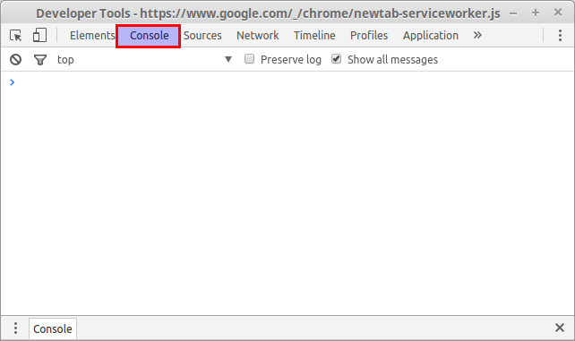
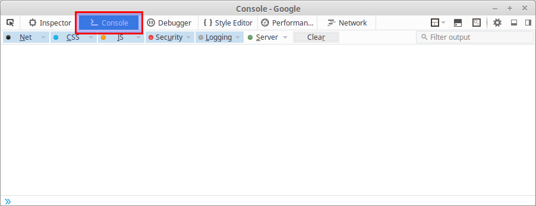
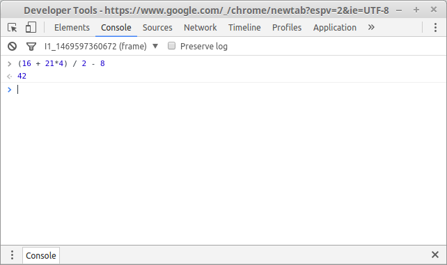

# JavaScript

Stiati voi oare ca aveti un puterea unui limbaj de programare in aplicatia folosita zi de zi - browserul vostru?

Acest limbaj se numeste `javascript`. Haideti sa incercam sa vedem cum il putem dresa sa ne asculte!

## Experiments

Cel mai simplu mod sa incepeti sa experimentati cu `javascript` este sa deschideti consola browserului vostru si sa incepeti a scrie direct acolo. In Firefox sau Chrome, pentru a porni consola, tastati in orice pagina `F12`, si treceti la tab'ul `Console` in fereastra magica deschisa.

Chrome: 

Firefox:  In firefox instructiunile javascript le puteti scrie jos.

Sa testam cateva operatii matematice. Scrieti urmatoarea linie in consola si tastati \[Enter\]:

```javascript
(16 + 21*4) / 2 - 8
```

Obtinem raspunsul la univers si tot absolut: 

Desigur putem folosi consola din browser si javascript ca un calculator in continuare, dar... e totusi un limbaj intreg, poate mult mai multe!

## Variabile

Javascript e un limbaj de programare. Orice limbaj de programare are notiunea de variabila. Variabila este ceva ce poate sa se schimbe, e variabila :\).Cu ajutorul lor puteti salva diferite date   de diferite tipuri. Ii setati o valoare, apoi puteti sa-i setati alta, daca vreti. Puteti sa cititi valoarea ei accesandu-i numele. Variabila e elementul cheie a oricarui limbaj de programare, in Pascal la fel aveti variabile, si au exact acelasi rol.

Pentru a defini o variabila, cu valoarea 10, puteti scrie urmatorul rand:

```javascript
var number = 10;
```

Aici am declarat variabila `number` cu valoarea `10`. Observati ca nu am zis de ce tip e `number` - Javascript e un limbaj dinamic, el incearca sa inteleaga automat de ce tip sunt variabilelel, in cazul dat - un numar.

Putem folosi aceasta variabila in alte declaratii:

```javascript
var otherNumber = number + 5;
```

Desigur, `otherNumber` va avea valoarea 15.

Pentru a defini un sir de caractere doar punem in jurul textului ghilimele simple sau duble:

```javascript
var h = "Hello "
var w = 'World!'
console.log(h + w)
```

Observati ca nu am pus `;` la sfasitul instructiunilor de data asta, in javascript `;` la sfarsit sunt optionale, limbajul le cere doar in cazuri rare cand nu poate deduce singur cand se termina o instructiune si se incepe alta.   
Functia `console.log()` afiseaza ceva la consola, in cazul dat ea va afisa `Hello World!`

Pentru a uni 2 elemente de tip sir folosim operatorul +.

Variabilele de tip boolean \(de logica\) se definesc la fel de simplu:

Operatorul **NOT** inverseaza valoarea curenta a variabilei de tip boolean\( daca e true, obtinem false si invers\).

Operatorul  **\| \|**: obtinem true in cazul in care macar una dintre variabile este true.

Operatorul **&&:** obtinem true atunci cand ambele variabile sunt true,

```javascript
var test = true
test = !test            // operatia NOT (negare), inverseaza valoarea
test = test || true     // operatia OR  (sau)
test = test && false    // operatia AND (si)

console.log(test == true)   // testam pentru egalitate
console.log(test != true)   // testam pentru inegalitate
```

## IF \(Conditionale\)

In javascript putem pune o conditie, care ne va permite sa executam diferite actiuni in dependenta daca conditia asta se adevereste sau nu:

```javascript
var a = 10
if (a < 20) {
    console.log(a + ' e mai mic ca 20')
}
```

> Hint: cand apasati \[Enter\] consola, Chrome incearca sa execute instructiunea, si daca ea nu-i finisata, da eroare. Ca sa scrieti o instructiune pe mai multe randuri, tastati \[Shift + Enter\]

Observati ca e construit din cuvantul cheie **`if`**, intre `(...)` se pune conditia pe care o verificam, dupa care intre `{ ... }` scriem instructiunile care sa se execute in caz ca conditia dintre `(...)` e adevarata \`

Putem adauga `else` la conditia `if` pentru a specifica instructiuni care sa se execute in caz daca conditia nu e adevarata:

```javascript
let b = 25     // declaram variabila b cu valoarea 25  
       
if (b < 20) {  // in (...) verificam daca valoarea lui b este mai mica ca 20 (25 < 20) obtinem false
    console.log(b + ' e mai mic ca 20')            // se executa daca b < 20, adica true
} else {
    console.log(b + ' e mai mare sau egal cu 20')  // se executa daca !(b < 20), adica b >=20 
}
```

Instructiunea `else if` ne permite sa adaugam o noua conditie in caz ca conditia `if` nu e adevarata:

```javascript
let c = 30

if (c < 30) {
    console.log(c + ' e mai mic ca 30')   // se executa daca c < 30
} else if (c > 30) {
    console.log(c + ' e mai mare ca 30')  // se executa daca c > 30
} else {
    console.log(c + ' este egal cu 30')   // se executa daca c == 30
}
```

## Switch

Instructiunea `switch` ne permite sa executam unul din mai multe blocuri posibile, in dependenta de conditie:

```javascript
let dayIndex = 3;   // declaram o variabila cu valoarea 3 care reprezinta nr zilei in saptamana
switch (dayIndex) { 

    case 1:             //false
        day = "Monday";
        break;
    case 2:             //false
        day = "Tuesday";
        break;
    case 3:             //true , se executa codul care urmeaza pana la break
        day = "Wednesday";
        break;
    case 4:
        day = "Thursday";
        break;
    case 5:
        day = "Friday";
        break;
    case 6:
        day = "Saturday";
        break;
    case 7:
        day = "Sunday";
        break;
}

console.log(day);
```

**break** ne permite sa oprim executarea blocului de cod curent. In cazul dat break nu face altceva decat muta punctul executarii la sfarsitul blocului switch. In caz contrar se vor exxecuta toate blocurile **case** care urmeaza.

Optional instructiunea **switch** poate contine si blocul **default** care se executa atunci cand nici una din valorilor specificate in **case** nu corespunde.

```javascript
default:
    console.log("nici una din valori nu corespunde");
```

## Cicluri \(for, while\)

Orice limbaj de programare are posibilitatea de a executa instructiuni in ciclic. Javascript are cateva:

Ciclul `while` ne permite sa executam un grup de instructiuni de multe ori atat timp cat o conditie e adevarata:

```javascript
let i = 0;

while (i < 10) {
    console.log(i)
    i++             // adunam 1 la i, echivalent cu i = i + 1
}
```

Codul de mai sus va afisa la consola cifrele de la 0 la 9, deoarece in momentul cand  variabila `i` va deveni egala cu `10`, conditia va fi falsa si executarea se va finisa

Ciclul `for` echivalent al blocului de mai sus ar fi:

```javascript
for (i = 0; i < 10; i++) {
    console.log(i)
}
```

Observati ca el combina 3 instructiuni in paranteze:

```text
for (instructiune1; instructiune2; instructiune3;) {
    ...
}
```

* `instructiune1` - e initializarea unei variabile, deobicei
* `instructiune2` - e conditia de continuitate, exact ca in while
* `instructiune3` - e instructiunea care sa o execute dupa fiecare ciclu \(deobicei e o crestere/descrestere a variabilei\)

Oricare din aceste instructiuni poate fi omisa, daca nu e relevanta, ba mai mult, pot fi omise toate 3!

```javascript
for (;;) {      // ciclu infinit
    ...
}

while (true) {  // la fel ciclu infinit
    ... 
}
```

## Functii

Cand vrem sa reutilizam o bucata de cod, ar fi bine sa-l putem grupa si defini sub un nume, ca sa-l putem dupa asta apela dupa acest nume. Acesta e rolul functiilor!

Functia in javascript se defineste foarte simplu:

```javascript
function max(a, b) {    // functia cu numele 'max' si cu 2 parametri 'a' si 'b'
    if (a > b) {
        return a        // intoarcem un raspuns
    } else {
        return b        // intoarcem un raspuns
    }
}
```

Sa apelam aceasta functie  la fel de simplu:

```javascript
max(3, 5)
```

Observati ca folosim numele functiei, si intre paranteze specificam valorile pentru parametrii functiei, ca valori putem transmite si alte variabile, desigur.

## Arrays

Un array in javascript e o colectie de elemente, grupate sub o singura variabila:

```javascript
var nothing = []    // array gol
var fruits = ['apple', 'orange', 'carrot', 'kiwi']  // array cu valori
var primes = [2, 3, 5, 7] // array de numere
```

Un array se defineste prin paranteze patrate `[...]`, si poate contine zero sau mai multe valori.

Pentru a accesa un element din array, il referim dupa indexul lui \(ordinea in array\):

```javascript
console.log('first prime is ' + primes[0])      // accesam numarul '2'
console.log(fruits[2] + ' is not a fruit!')     // accesam cuvantl 'carrot'
```

Pentru a schimba valoarea unui element putem sa-l accesam si sa-i setam indata valoarea:

```javascript
fruits[2] = 'mango'     // setam valoarea pentru al 3'lea element din array
console.log(fruits[2] + ' is a fruit! maybe')
```

> Nota: In marea majoritate a limbajelor de programare, numaratoare se incepe intotdeauna de la 0!. Deci primul element e `arr[0]`, al doilea e `arr[1]`, etc.

Un array in javascript are multe proprietati si functii interesante:

Pentru a afla lungimea unui array \(cate elemente contine\) putem scrie:

```javascript
fruits.length;
```

Pentru a adauga un nou element la array putem scrie:

```javascript
fruits.push('cherry')       // adaugam un element nou la sfarsit
fruits.unshift('lemon')     // adaugam un element nou la inceput
```

Pentru a sterge un element din array putem scrie:

```javascript
fruits.pop()     // stergem un element de la sfarsitul array'ului
fruits.shift()   // adaugam un element de la inceputul array'ului
```

Pentru a face modificari in mijlocul unui array putem folosi metoda splice:

```javascript
fruits.splice(2, 0, 'banana')   // adaugam o 'banana' pe pozitia a treia in array
fruits.splice(3, 1)             // stergem al 4-lea element
```

## Objects

In viata reala o masina e obiect, masa, scaun, etc.. Ele au proprietati \(nume, marca, culoare, etc\) , si actiuni \(merge, opreste, etc\) care poti face cu ele.

Un obiect in javascript e un container pentru mai multe proprietati si functii. Functiile in cadrul obiectelor mai sunt numite si metode.

Definirea unui obiect, ca si toate celelalte, e foarte simpla :wink: :

```javascript
var empty = {}      // obiect gol
var car = {type:'Fiat', model:'500', color:'white'} // obiect cu mai multe proprietati
```

Observati ca proprietatile in obiect se seteaza sub forma de pereche: `cheie : valoare`, separate prin virgula. cheia e ca numele unei variabile din obiect, prin ea valoarea va fi accesata.

Pentru a accesa proprietatile obiectului car creat, scriem:

```javascript
console.log(car.type)   // afiseaza 'Fiat'
car.model = '600'       // setam o noua valoare pentru model
car.engine = 2000       // adaugam o noua proprietate engine cu valoarea 2000
```

Toate proprietatile si functiile obiectelor se acceseaza prin `.`. In acest moment, probabil, incepeti sa va dati seama ca si la array am accesat functii prin `.` - da, un array este un obiect in javascript, si nu doar el!

un sir de caractere, sau cum il vom numi in continuare - string, la fel e un obiect:

```javascript
var string = 'Salut Lume! ce mai faceti?'
console.log(string.length)                  // lungimea string'ului

var pos = string.search("Lume") 
console.log('cuvantul Lume se incepe pe pozitia ' + pos)

var str2 = string.substring(6, 11)
console.log(str2)                           // va afisa 'Lume!'

string = string.replace("Lume", "Oameni")   // Trebuie sa atribuim rezultatul cuiva, 
                                            // nu se schimba insasi string'ul sursa
console.log(string)                         // va afisa string cu cuvantul 'Lume' inlocuit de 'Oameni'
```

Obiectul String are mult mai multe metode decat sunt prezentate aici, array la fel. Insa cel mai fain, e ca puteti sa extindeti orice obiect si cu functionalitatea voastra, dupa dorinta!

Ca sa definim metode pentru un obiect nou:

```javascript
var car = {
    type: 'Fiat',
    color: 'white',
    repaint: function(color) { // 'repaint' va fi numele functiei, si va cere un parametru
        this.color = color;    // 'this' permite sa accesam proprietatile si functiile din obiectul curent, 
                               // ca o variabila catre sine
    }

console.log(car.color)  // afiseaza 'white'
car.repaint('red')
console.log(car.color)  // afiseaza 'red'
}
```

Ca sa definim metode si proprietati noi pentru un obiect existent:

```javascript
car.model = '500'   // doar scriem numele proprietatii dorite si-i dam o valoare,
                    // se va adauga automat!

car.drive = function(dist) {
    console.log('brim brim brim, mergem ' + dist + ' km')
}

console.log(car.model)  // observam ca avem proprietatea noua 'model'
car.drive(20)           // observam ca avem metoda noua 'drive()'
```

Sa stergem proprietati si metode dintr-un obiect e la fel de simplu:

```javascript
delete car.model    // stergem proprietatea model din car

delete car.drive    // stergem metoda drive() din car
```

