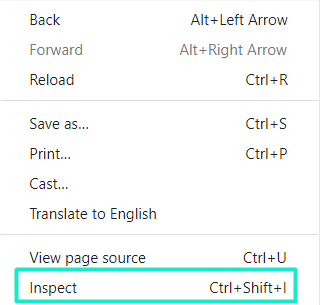
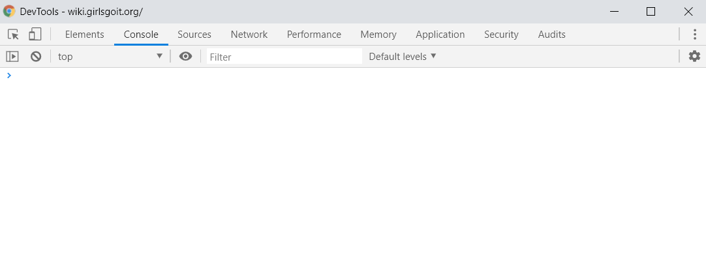
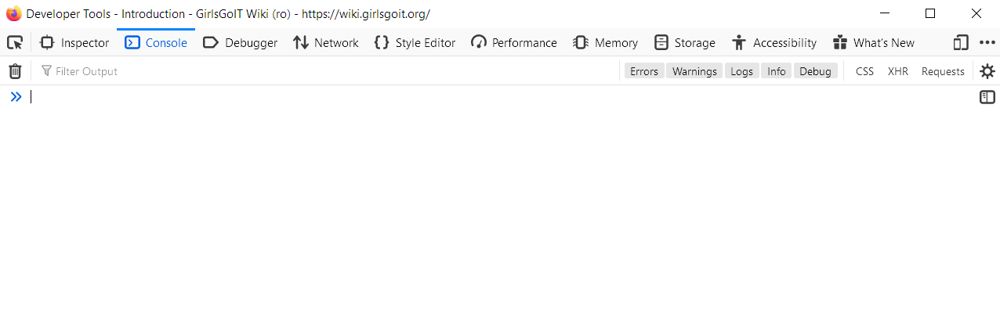
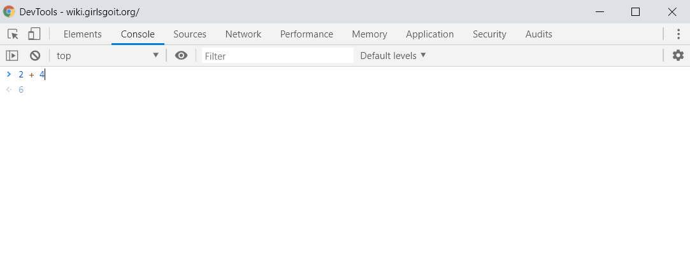

# Consola Browser'ului

Codul JavaScript poate fi rulat în consola browserului. Consola iți permite să execuți instrucțiuni JavaScript rapid și ușor. 

Consola poate fi accesată în mai multe modalități. Una din modalități este formând o combinație de taste. În Google Chrome, formează combinația **Ctrl+Shift+J**, în Mozilla Firefox **Ctrl+Shift+K.** 

O altă modalitate este cu ajutorul opțiunii **inspect**. Accesează **inspect** formând click dreapta în orice regiune a paginii și selectând inspect din meniul contextual.

În fereastra care s-a deschis, selectează tabul **Console**.

Consola face parte din setul de instrumente Developer Tools sau DevTools. Acest set de instrumente te ajută la dezvoltarea paginilor web.

În consolă pot fi introduse orice instrucțiuni JavaScript. În dependență de instrucțiunile introduse, rezultatul va fi afișat mai jos.

## Mai departe

În următorul capitol vom învăța despre elementele principale a oricărui limbaj - variabile și operatori



