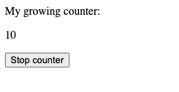

# DOM & Window API

O utilizare des întâlnită a funcțiilor în JavaScript e apelarea lor la anumite evenimente care se întâmplă în pagina web. Pentru asta mai întâi trebuie să întelegem cum e reprezentată o pagină web în Browser și ce instrumente (API) ne oferă el la dispoziție.

## DOM

DOM (Document Object Model) e un API (set de funcții si atribute) ce ne permite să interacționăm cu documentul HTML. pentru asta el reprezintă pagina ca un obiect ierarhic.

.png>)

Pentru a accesa conținutul documentului HTML, avem acces la o variabilă **`document`**, din care putem citi ca atribute toată informația care ne interesează.


### Elemente cu ID

Când declarăm un attribut id la un element html, acel element devine accesibil ca o variabilă cu același nume în JavaScript:


Astfel putem modifica conținutul dinamic în dependentă de o logică care o definim, ceea ce ne oferă o putere nemaipomenită, putem face paginile cu conținut dinamic!

### Input Value

Un alt exemplu de elemente în HTML sunt **`<input>`**, care ne permit sa citim valori care sunt introduse de utilizatori:



Observați că putem atât citi cât și seta valori pentru un input accesând atributul `value`


### Creare și manipulare DOM

Este foarte bine cunoscută metoda prin care afișăm careva elemente HTML în pagină. Dacă dorim să avem o imagine, deschidem un fișier HTML și scriem în el tag-ul **\** cu toate atributele necesare. Destul de simplu dar, în același timp static.

Dacă avem un aplicație care în urma unei interacțiuni a utilizatorului ar trebui să afișăm elemente noi, nu mai putem folosi metoda static de scriere a HTML-ului. Ca la oricare alt eveniment, trebuie să reacționăm și dinamic să creăm, și includem în pagină elemente HTML noi, care nu există inițial în acel document.

Să luăm ca exemplu Crunchyroll.&#x20;

.png>)

Fiecare show din listă este o informație dinamică. Nu putem ști la momentul creării documentului HTML ce este folosit pentru această pagină, cât și ce show-uri anume trebuie să-i prezentăm utilizatorului. Ea poate fi diferită în dependență de utilizator, timp, țară și mulți alți factori.

Pagina este încărcată inițial goală, este cerută lista de show-uri și când sunt primite, în JavaScript se creează elemente noi HTML și se includ în DOM.

Crearea unui element se face prin funcția **document.createElement**.

.png>)

**"div"** - poate fi înlocuit cu orice alt nume de tag. După executare, un element este creat și păstrat în variabilă și memoria. La acest pas nimic încă nu sa schimbat în DOM.

Având un element creat, avem acces la toate proprietățile unui element HTML ce ne permite să-l creăm în tocmai cum avem nevoie. De exemplu:

* **newDiv.classList** - citim lista de clase de pe element
* **newDiv.classList.remove("foo")** - ștergem de pe element o clasă
* **newDiv.classList.add("anotherclass")** - adăugăm pe element clasa nouă
* **newDiv.style.color = 'red'** - dăm elementului o culoare roșie. **color** poate fi înlocuit cu orice altă proprietate CSS
* **newDiv.innerText = 'Hello World'** - introducem un text în element
* etc...

După ce creăm și modelăm elementul, ca să fie văzut de utilizator trebuie să-l introducem în DOM. Pentru asta avem nevoie de un element ca să îl folosim ca ancoră, în baza căruia vom decide unde în DOM va apărea elementul.

Avem la dispoziție câteva variante: &#x20;

.png>)

Având inițial un element în DOM, îl selectăm și folosim ca ancoră pentru a introduce în pagină elementul creat dinamic.

#### Element.append()

.png>)

Apelând funcția **append** pe elementul ancoră, trimitem ca parametru elementul creat dinamic. Acesta va fi adăugat în DOM la sfârșitul elementului. Deci, după executarea codului de mai sus am avea în final structura dată HTML:&#x20;

.png>)

#### Element.prepend()

.png>)

Apelând funcția **prepend** pe elementul ancoră, trimitem ca parametru elementul crea dinamic. Acesta va fi adăugat în DOM la începutul elementului. Deci, după executarea codului de mai sus am avea în final structura dată HTML:

.png>)


Metodele date deasemenea pot fi apelate pe un element nou creat. Asta ne permite să creăm dinamic un element mai complex înainte de al introduce în dom.

.png>)

Executând codul de mai sus, am avea în final structura dată HTML:

.png>)

## Evenimente DOM

În general avem 3 tipuri principale de evenimente în browser:

* **Mouse events** - click, hover, drag…
* **Keyboard events** - keydown, keyup, keypress…
* **Media events** - play, pause, ended, seeking...

Pentru a putea defini acțiuni care să se întâmple când un eveniment apare, trebuie să definim așa numitele ”Event Handlers”, care sunt doar niște funcții obișnuite!


Pentru a lega o funcție de un eveniment, trebuie sa-i spunem Browser-ului să o execute. Exemplul clasic e o acțiune la click pe un buton:


.png>)

.png>)

Atât! prin aceste câteva linii de cod am creat o acțiune care se va executa doar când utilizatorul va apăsa click pe buton.

### Event objects

Funcțiile care sunt apelate ca rezultat a unui event, vor primi automat un paramter, deserori numit **event,** **evt** sau **e**. Acesta poate fi folosit pentru a accesa informații adiționale și de a adăuga posibilități noi. De [exemplu](https://mdn.github.io/learning-area/javascript/building-blocks/events/random-color-eventobject.html):

.png>)

În funcția _bgChange_, folosim event object(**e**) pentru a seta o culoare de background nouă, la fiecare click pe **e.target** - acesta fiind butonul care a fost apăsat. Proprietatea **target** de pe event object întotdeauna este o referință către elementul care s-a produs evenimentul.

Exemple informații foarte utile ce sunt disponibile folosind event object ar fi:

* **e.target** - foarte folositor atunci când folosim un event handler pe mai multe elemente și dorim să reacționăm diferit în dependență de cine a produs evenimentul.&#x20;
* **e.\[ctrlKey, altKey, shiftKey]** - ne oferă posibilitatea să aflăm dacă atunci când sa produs evenimentul, era apăsat una din tastele din listă, reprezentat printr-o valoare de tip boolean
* **e.clientX** și **e.clientY** - indică poziția cursorului în pagină pe axa **X** și **Y**

Pentru a explora mai multe proprietăți disponibile, creează un event listener și afișează la consolă event object.

.png>)

### Cum selectăm elementele în JS

Pentru a manipula HTML din JS, adăuga eveniment etc., trebuie să selectăm cumva elmenetele în JS pentru a putea indica cu exacitate, de ce element avem nevoie. Sunt câteva funcții ce ne permit să facem asta.

**document.getElementById(id)**  - funcția dată ne permite să selectăm un element după ID-ul său

.png>)

.png>)

**document.querySelector(id or class)** - funcția dată ne permite să selectăm un element HTML după id-ul sau classa acestuia

.png>)

![Folosind selectore cu \[ # \] și \[ . \] care se folosesc și în CSS, putem selecta elementele dorite](<../../.gitbook/assets/image (285).png>)

### Vreau mai mult!

Pentru a folosi evenimente și funcționalități mai complexe si avansate, deobicei nu se folosește JavaScript curat, e folosită o librărie care ușurează mult lucrul cu aceste evenimente, dar acum am învățat baza și ce stă în spatele la orice librărie modernă pentru aplicațiile web.&#x20;

Exemplu de librării (Frameworks) moderne care permit să construim aplicații dinamice sunt: **React, Vue.js, Angular**

## Window API

Interfata **Window** reprezinta o fereastra care contine un `DOM document` despre care ati studiat mai sus. De fiecare data cind ati utilizat obiectul `document` , el reprezinta o referinta anume la DOM document incarcat in acea fereastra in care va aflati.\
\
Sunt o serie larga de instructiuni pe care voi cu siguranta le-ati utilizat, fara a sti neaparat ca ele sunt oferite anume de interfata Window -  **`console`**(`console.log()`), **`document`**(`document.getElementById()`, `document.write()`).  Aceste obiecte ni se ofera in limbajul JavaScript cu usurinta, fara a fi nevoiti sa precizam ca fac parte din interfata **Window**.\
\
Sunt cateva alte proprietati si functii importante care adauga dinamicitate si v-ar putea fi de folos cu siguranta in dezvoltarea unei interactiuni mai avansate cu utilizatorul

1. `setTimeout(functionName, x)` - functie care apeleaza functionName peste x milisecunde si returneaza un id.
2. `setInterval(functionName, x)` - functie care apeleaza functionName in fiecare x milisecunde si returneaza un id.
3. `clearInterval(x)` - function care opreste si sterge din functiune un setTimeout sau setInterval dupa un id - **x**
4. `alert(x)` - functie care porneste un alert box cu un mesaj **x** si un buton OK.
5. `prompt(x, y)` - function care porneste un prompt box care se aseamana cu un alert doar ca are un mesaj (**x**) care de regula este o intrebare pentru a introduce un raspuns si un camp pentru input (care poate avea o valoare prestabilita - **y - optionala**), pentru a introduce acel raspuns**.** \
   ****Aceasta functie returneaza **textul**/respunsul introdus de utilizator.
6. `innerWidth` - proprietate care reprezinta valoarea latimii paginii.
7. `innerHeight` - proprietate care reprezinta valoarea inaltimii paginii.


## Functia setTimeout()

Aceasta functie este utila pentru a amina executarea unei functi pentru o anumite perioada de timp.

```javascript
function printHello() {
    console.log('Hello my friend!');
}

setTimeout(printHello, 3000);  // printHello() va fi apelata peste 3 secunde (3000 milisecunde)
```

Deci in exemplul de mai sus **Hello my friend!** va aparea in consola dupa ce se executa programul peste **3** secunde (3000 milisecunde)

Pentru a clarifica lucrurile - orice functie poate fi apelata de nenumarate ori, respectiv putem apela setTimeout(printHello, x), unde x numarul de milisecunde de cate ori vrem.\


```javascript
setTimeout(printHello, 1000); // Hello my friend va aparea peste 1 secunda
setTimeout(printHello, 2000); // Hello my friend va aparea peste 2 secunda
setTimeout(printHello, 4000); // Hello my friend va aparea peste 4 secunda
```

Mai mult ca atit putem apela aceiasi functie cu acelasi numar de milisecunde - in acelasi moment (ele vor aparea intr-un mod necontrolat de noi, putem spune aleator).

```javascript
setTimeout(printHello, 2000); // Hello my friend va aparea peste 2 secunda
setTimeout(printHello, 2000); // Hello my friend va aparea peste 2 secunda
```

Ordinea executarii acestor 2 chemari de functii nu este clar, in diferite executari a programului ea poate fi inversata.

## Functia setInterval()

Aceasta functie este utila pentru executa o functie repetitiv, la o anumita perioada de timp (milisecunde).

```javascript
function printHello() {
    console.log('Hello my friend!');
}

setInterval(printHello, 3000);  // printHello() va fi apelata din 3 in 3 secunde (3000 milisecunde)
```

Aceasta functie urmeaza a fi apelata din 3 in 3 secunde, teoretic la inifinit. Toate principiile explicate cu `setTimeout()` se aplica si aici - referitor la apelarea nenumarata si apelarea pentru aceiasi functie si aceiasi perioada de timp.

## Functia clearInterval() si clearTimeout()

Aceasta functie permite oprirea programatica a functiilor `setTimeout()` sau `setInterval()`.

La fiecare apelare a uneia din aceste functii se creeaza un identificator unic, pentru a fi posibila oprirea apelarii lor. Acest identificator este returnat odata ce se apeleaza functia.

```javascript
function printHello() {
    console.log('Hello my friend!');
}

const id = setInterval(printHello, 3000); 

clearInterval(id); // opreste executarea intervalului de mai sus cu acest id
```

Daca functia `clearInterval()` este apelata inainte de 3 secunde in acest care - atunci printHello() nu va fi apelata niciodata.\
\
Aceasta functie isi are sensul in anumite conditii (**if**) care noi le-am dori.

### Exemplu cind de folosit clearTimeout()

This code will create a counter and increment it each 2 seconds glad to setInterval from line 9 of `index.js` file.

When clicking the stop button the counter growing will stop because it will trigger the `stopCounter()`function which clears the interval created above.




```markup
<!DOCTYPE html>
<html>
<body>

<p>My growing counter:</p>
<p id="counter-text">1</p>
<button onclick="stopCounter()">Stop counter</button>

<script src="./index.js"></script>

</body>
</html>

```



```javascript
let counter = 1;

function incrementCounter() {
  counter+=1;
  document.getElementById("counter-text").innerHTML = counter;
}

var id = setInterval(incrementCounter, 2000);

function stopCounter() {
  clearInterval(id);
}
```


#### Functia clearTimeout() este analogica la `clearInterval()` doar ca se foloseste asupra la `setTimeout()`.
