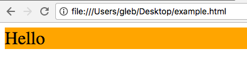
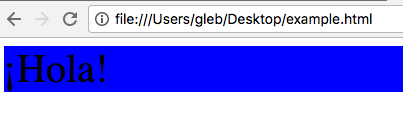
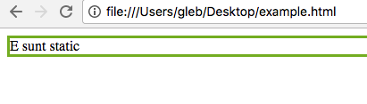
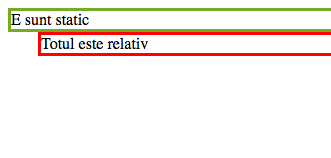
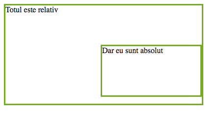
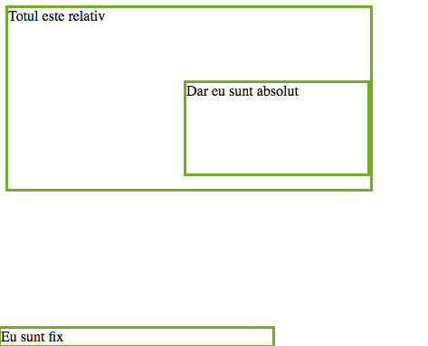
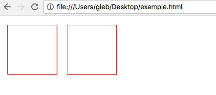

# CSS

## Ce este CSS?

Lecția trecută am studiat cum să creăm o pagină web cu ajutorul HTML. Însă HTML este limbajul care definește structura documentului și nu ne oferă posibilitatea de a face pagina noastră să arate frumos.

În ajutor ne poate veni CSS—Cascading style sheets.

CSS este un standard care definește modul în care vor fi afișate elementele din pagina noastră.

Pentru început să creăm un document HTML `index.html` pe care îl vom folosi în calitate de bază pentru site-ul tău.

Documentul tău HTML va arăta în felul următor:

```markup
<!DOCTYPE html>
<html>
<head>
    <title></title>
</head>
<body>

</body>
</html>
```

## Sintaxa CSS

### Selectori

Pentru a începe lucrul, trebuie să înțelegem sintaxa CSS.

Aceasta este una simplă și arată în felul următor:


Aceasta constă dintr-un selector și proprietățile aplicate acestuia, sub formă de perechi chei – valoare. În calitate de selector pot servi diferite elemente HTML, tag-uri, clase și orice combinații între acestea.

Sună complicat?

Să vedem un exemplu. Vom crea un paragraf nou și vom seta culoarea textului să fie roșie și de dimensiunea `25px`. Pentru aceasta utilizăm deja cunoscutul HTML: adăugăm tagul `p` în tag-ul `body`.

```markup
<p>Salut</p>
```

Acum urmează să stilizăm HTML-ul cu CSS. Pentru aceasta vom adăuga în `head` un tag special `style`, unde vom descrie stilul dorit:

```markup
<style type="text/css">
    p {
        color: red;
        font-size: 25px
    }
</style>
```

Acum deschide fișierul `index.html` în browser-ul tău preferat și vei vedea următorul rezultat.


Arată mai bine decât fără stil, așa-i?

### Selectori utilizând clase

Pe motiv că în calitate de selector am luat tag-ul `p`, deocamdată oricare tag `p` din documentul HTML va fi stilizat utilizând definiția noastră în CSS. Dacă dorim să aplicăm un anumit stil doar elementelor care au careva proprietăți comune, în calitate de selector putem să luăm o clasă.

De exemplu, să creăm un container `div` de clasa `my-class`:

```markup
<div class='my-class'>Hello</div>
```

Apoi vom adăuga un selector pentru clasa `my-class` înăuntrul tag-ului `style` din HTML:

```css
.my-class {
    background-color: orange;
    font-size: 30px;
}
```

Fă refresh la pagina din browser și vei vedea următorul rezultat:



### Selectori utilizând ID

În calitate de selector poate fi utilizat și un ID \(identificator unic pentru orice element HTML\).

Pentru a exemplifica, vom modifica puțin `div`-ul din exemplul precedent: în loc de atributul `class` vom scrie un `id` al elementului:

```markup
<div id='my-id'>¡Hola!</div>
```

Iar pentru a stiliza, vom mai adăuga un selector pentru `id`:

```css
#my-id {
    background-color: blue;
    font-size: 40px;
}
```

În exemplul dat, ID-ul elementului `div` este `my-id`. Reactualizează pagina din browser și vei vedea următorul rezultat:



### Selectori multipli

Până acum definițiile noastre pentru stil erau identice pentru toate elementele cu același tag și clasă. De aceea, pentru a putea fi și mai specifici, putem să combinăm mai mulți selectori într-unul.

De exemplu, următorul selector va stiliza în mod corespunzător toate elementele cu clasa `my-paragraph-class` ale căror părinte este un element `div` cu clasa `my-class`:

```css
div.my-class .my-paragraph-class {
    color: red;
    background-color: cian;
    text-align: center;
}
```

```markup
<div class="my-class">
  <p class="my-paragraph-class">Bonjour</p>
<div>
```

Ai remarcat structura? Dacă dorești să alegi/setezi un selector pentru un element `child` \(copil\) care este _înăuntrul_ altui element `parent` \(părinte\), trebuie doar să înlănțui selectorul părintelui și al copilului, separându-le prin spații:

```css
parent child {
    key: value;
}
```

Mai multe despre selectori poți să afli [aici](https://www.w3schools.com/cssref/css_selectors.asp).

## Cum să folosesc CSS?

Sunt 3 metode cum poți stiliza HTML-ul cu CSS:

1. Incluzi CSS-ul într-un fișier extern cu extensia `.css` \(external style sheet\).

   De asemenea, vei _lega_ documentul CSS `style.css` de cel HTML, folosind tag-ul `<link rel="stylesheet" type="text/css" href="style.css">`. Atrage atenția la atributul `href`---acesta arată calea spre fișierul `.css`.

2. Folosești tagul `style` în `head`-ul al documentului HTML \(internal style sheet\):

   ```css
   <style> p { text-indent: 25px; } </style>
   ```

În interiorul `style` poți lista mai multe declarații de stil.

1. Folosești atributul `style` pentru fiecare tag din document \(inline style\):

```markup
<p style="text-indent: 25px">Hola!</p>
```

Când lucrezi cu stiluri trebuie să ții minte două reguli: 1. pentru același selector se aplică ultimul stil declarat; 2. fiecare metodă de declarare a stilului are prioritatea sa: inline style este cel mai prioritar, apoi urmează internal style și doar la sfârșit external style.

## Culori și background

Pentru a seta culoarea unui text, poți folosi proprietatea `color` care poate să primească următoarele tipuri de valori:

1. numele culorii: `red`, `green`, `blue`;
2. codul hexadecimal al culorii: `#ff00ff`;
3. codul RBG `rgb(255, 0, 0)`.

De exemplu, poți seta culoarea roșie a textului în trei metode:

```css
p {
    color: #ff0000;
    color: rgb(255, 0, 0);
    color: red;
}
```

Pentru a seta culoarea de fundal a unui element folosește proprietatea `background-color`:

```css
div {
    background-color: lightblue;
}
```

Imagine pe fundal?

Dacă dorești să plasezi o imagine pe fundal, ai la îndemână proprietatea `background-image` unde trebuie sa specifici adresa imaginii.

```css
div {
    background-image: url("paper.gif");
}
```

## Stilizarea textelor și fonturi

### Fontul

Pentru a seta un font pentru text, poți folosi proprietatea `font-family`.

```css
p {
    font-family: "Times New Roman";
}
```

Aceasta va seta fontul _Times New Roman_.

Dar ce dacă pe calculator nu este instalat _Times New Roman_? Pentru a rezolva această problemă, poți înlănțui mai multe fonturi:

```css
p {
    font-family: "Times New Roman", Times, serif;
}
```

Acum se va seta _Times New Roman_ pentru elementul tău. În caz că acest font lipsește pe calculatorul utilizatorului, se va aplica fontul _Times_, iar dacă nici acesta nu este prezent, se va recurge la familia de fonturi _serif_.

### Mărimea fontului

Pentru a controla mărimea fontului de folos îți va fi proprietatea `font-size`, unde poți indica în pixeli \(`px`\) înălțimea textului:

```css
h1 {
    font-size: 40px;
}
```

Mai multe despre fonturi poți să afli [aici](https://www.w3schools.com/css/css_font.asp).

### Alte proprietăți

Dacă dorești să schimbi modul în care arată textul, poți folosi următoarele proprietăți:

| Proprietatea | Descrierea |
| --- | --- |
| color | Setează culoarea textului |
| letter-spacing | Mărește sau micșoreaza spațiul între litere |
| line-height | Setează înălțimea liniei |
| text-align | Specifică alinierea orizontală a textului |
| text-decoration | Specifică modul de decorare a textului |
| text-indent | Setează indentarea primei linii a textului |

Mai multe despre proprietățile CSS care specifică cum va arăta textul poți să afli [aici](https://www.w3schools.com/css/css_text.asp).

## Box model


Box model este un concept care ne permite ușor să vizualizăm și să înțelegem conceptul de margin, padding, border și width / height a unui element HTML.

În box model un element HTML este reprezentat prin niște _cutii_, ele fiind:

* margin - distanța în jurul elementului, este transparentă;
* border - chenarul elementului;
* padding - distanța între conținutul elementului și chenar;
* conținutul - spațiul unde este afișat textul interior / imaginea.

Înălțimea și lungimea elementului HTML se calculează în dependență de cele 4 componente.

De exemplu, avem un element cu următoarele proprietăți:

```css
div {
    width: 320px;
    padding: 10px;
    border: 5px solid gray;
    margin: 0; 
}
```

Lățimea acestuia va fi de 350px: 320px + 20px \(left + right padding\) + 10px \(left + right border\) + 0px \(left + right margin\).

Despre parametrii proprietăților din box model poți citi suplimentar [aici](https://www.w3schools.com/css/css_margin.asp) și [aici](https://www.w3schools.com/css/css_padding.asp).

## Poziționare

Până acum am discutat despre cum vor arăta elementele paginii, dar nu am menționat în ce ordine ele vor apărea pe ecran și _unde_ trebuie să se afle un anumit element.

Pentru aceste scopuri în CSS există proprietatea _position_. Aceasta specifică metoda prin care un element HTML va fi poziționat în pagină.

Există 4 posibile valori pentru proprietatea _position_:

**static** – elementul este poziționat după setarea implicită a browser-ului;

```css
div.static {
 position: static;
 border: 3px solid #73AD21;
}
```



**relative** _–_ elementul este poziționat relativ față de poziția lui inițială, însa ocupa spațiul rezervat;

```css
div.relative {
    position: relative;
    left: 30px;
    border: 3px solid red;
}
```



**absolute** – elementul este poziționat absolut față de primul părinte cu poziția _relative_ sau, dacă acesta nu este, față de elementul body al documentului HTML;

```css
div.relative {
    position: relative;
    width: 400px;
    height: 200px;
    border: 3px solid #73AD21;
} 
div.absolute {
    position: absolute;
    top: 80px;
    right: 0;
    width: 200px;
    height: 100px;
    border: 3px solid #73AD21;
}
```



**fixed** __– specifică poziționarea fixă pe pagină, asta înseamnă că elementul va rămâne constant pe ecran, chiar dacă facem scroll.

```css
div.fixed {
    position: fixed;
    bottom: 0;
    right: 0;
    width: 300px;
    border: 3px solid #73AD21;
}
```



## Float

Cu toate că avem deja posibilitatea să mișcăm elementele în pagină, este foarte anevoios să aliniem elementele pe orizontală.

Soluția ușoară pentru această problemă este proprietatea CSS _float_. Aceasta ne permite să creăm elemente plutitoare poziționate unul lângă altul, orizontal. Cu ajutorul acestei proprietăți putem crea galerii de imagini, liste de noutăți și alte elemente.

Astfel, elementele HTML cu proprietatea `float: left` se vor aranja orizontal unul după altul.

```css
.float {
    width: 100px;
    height: 100px;
    border: 1px solid red;
    margin: 10px;
    float: left;
 }
```

```markup
<div class='float'></div>
<div class='float'></div>
```



Odată cu libertatea de a plasa elementele pe orizontală apare problema cu elementele statice care apar mai jos în documentul HTML. În mod special, dacă acestea sunt statice, ele se vor suprapune cu elementele plutitoare.

De exemplu, dacă la exemplul de mai sus adăugăm un element  după elementele cu clasa _float_, el se va suprapune cu elementele plutitoare.


Pentru a evita această suprapunere trebuie să atribuim elementului care urmează după elementele plutitoare proprietatea `clear: both`:

```css
.float {
    width: 100px;
    height: 100px;
    border: 1px solid red;
    margin: 10px;
    float: left;
 }
 .element {
    height: 200px;
    width: 200px;
    background-color: orange;
    clear: both;
 }
```

```markup
<div class='float'></div>
<div class='float'></div>
<div class='element'></div>
```


## Pseudo-clase și pseudo-elemente

### Ce reprezintă pseudo-clasele în CSS?

Pseudo-clasele sunt utilizate pentru a defini o stare specială a unui element HTML. Spre exemplu, ele pot fi utilizate pentru:

* a stiliza un element atunci cînd mouse-ul este deasupra
* a stiliza link-urile accesate și neaccesate diferit
* a stiliza un element atunci cînd deține focus-ul

### Syntax

Sintaxa pentru a utiliza pseudo-clasele în CSS este:

```css
selector:pseudo-class {
    property:value;
}
```

### Pseudo-clase pentru link-uri

Link-urile pot fi afișate în diferite moduri:

```css
/* unvisited link */
a:link {
    color: #FF0000;
}
/* visited link */
a:visited {
    color: #00FF00;
}
/* mouse over link */
a:hover {
    color: #FF00FF;
}
/* selected link */
a:active {
    color: #0000FF;
}
```

> `a:hover` trebuie să fie definită după `a:link` și `a:visited` pentru a avea efect, totodată, `a:active` trebuie să fie definită după `a:hover`.

Pentru demo click [**aici**](https://jsfiddle.net/dfpno9ta/)

### Pseudo-clasele pot fi folosite împreună cu clasele CSS

Pseudo-clasele pot fi combinate cu clasese definite de tine.

```css
a.my-class:pseudo-class {
    property:value;
}
```

### Hover asupra unui `<div>`

Iată un exemplu de a utiliza pseudo-clasa `:hover` asupta unui element `div`.

```css
div:hover {
    background-color: red;
}
```

Pentru demo click [**aici**](https://jsfiddle.net/xbn8rbd2/)

### Pseudo-clasa `:first-child`

Pseudo-clasa `:first-child` se utilizează pentru a selecta primul element copil al fiecărui element.

```css
/*match the first <p> element*/
p:first-child {
    color: blue;
}
/*match the first <i> element in all <p> elements*/
p i:first-child {
    color: blue;
}
```

Pentru demo click [**aici**](https://jsfiddle.net/7byabsx2/)

### Pseudo-clasa `:nth-child(n)`

Această pseudo-clasa se utilizează pentru a selecta fiecare element care este copilul n-lea al elementului părinte. `n` poate fi valoare, cuvînt cheie, funcție.

```css
/*select every <p> element that is the second child of its parent*/
p:nth-child(2) {
    background: red;
}
/*select odd and even p elements*/
p:nth-child(odd) {
    background: red;
}
p:nth-child(even) {
    background: blue;
}
```

Pentru demo click [**aici**](https://jsfiddle.net/kkr0vu9r/)

## Tranzițtii CSS

Tranzițiile CSS oferă programatorului un mod de a controla viteza de animare atunci cînd sunt schimbate proprietățile CSS ale elementelor HTML. Pentru a utiliza tranzițiile, este nevoie de a specifica două lucruri:

* proprietatea CSS la care dorești să aplici efectul
* durata efectului

> Dacă durata efectului nu va fi specificată, atunci tranziția nu se va aplica deoarece valoarea implicită pentru dutară este 0.

### Exemplu

În exemplul de mai jos, putem observa că atunci cînd cursorul va fi peste un element `div`, se va modifica lungimea lui cu o durată de 2 secunde.

```css
div {
    width: 100px;
    height: 100px;
    background: red;
    transition: width 2s;
}
div:hover {
    width: 300px;
}
```

Pentru demo click [**aici**](https://jsfiddle.net/yvknekh9/)

### Tranziții cu întîrziere

Exemplul de mai jos demonstrează cum de utilizat proprietatea `transition-delay`.

```css
div {
    width: 100px;
    height: 100px;
    background: red;
    transition: width 3s;
    transition-delay: 1s;
}

div:hover {
    width: 300px;
}
```

Pentru demo click [**aici**](https://jsfiddle.net/7z3ww5fj/)

### Tranziții + Transformări

```css
div {
    width: 100px;
    height: 100px;
    background: red;
    transition: width 2s, height 2s, transform 2s;
}

div:hover {
    width: 300px;
    height: 300px;
    transform: rotate(180deg);
}
```

Pentru demo click [**aici**](https://jsfiddle.net/smqurzas/)**.**

### Blur Menu

Pentru că sunt foarte multe lucruri care pot fi efectuate cu tranzițiile și transformările în CSS, o să experimentăm cu scopul de a realiza un efect de blur asupra unei bare de meniu.

```css
body{
  background-image:
    url("http://tympanus.net/Tutorials/BlurMenu/images/pattern.png"),
    url("http://tympanus.net/Tutorials/BlurMenu/images/1.jpg");
}
.bmenu{
    padding: 0px;
    margin: 0 0 10px 0;
    position: relative;
}
.bmenu li{
    color: black;
    font-size: 50px;
    display: block;
}
.bmenu li a{
    color: transparent;
    display: block;
    text-transform: uppercase;
    text-shadow: 0px 0px 5px #fff;
    letter-spacing: 1px;
    -webkit-transition: all 0.3s ease-in-out;
    -moz-transition: all 0.3s ease-in-out;
    -o-transition: all 0.3s ease-in-out;
    -ms-transition: all 0.3s ease-in-out;
    transition: all 0.3s ease-in-out;
}
.bmenu:hover li a{
    text-shadow: 0px 0px 5px #0d1a3a;
}
.bmenu li a:hover{
    color: #fff;
    text-shadow: 0px 0px 1px #fff;
    padding-left: 10px;
}
```

Elementele HTML:

```markup
<ul class="bmenu">
  <li><a href="#">About</a></li>
  <li><a href="#">Illustrations</a></li>
  <li><a href="#">Photography</a></li>
  <li><a href="#">Web Design</a></li>
  <li><a href="#">Personal Projects</a></li>
  <li><a href="#">Contact</a></li>
</ul>
```

Pentru demo click [**aici**](https://jsfiddle.net/28d7yvdx/)

## Specificitate

Specificitatea determină care stiluri trebuie aplicate atunci când au fost aplicate mai mult de o regulă. Bântuie părerea că importanța unui slector este direct proporțională cu lungimea acestuia, dar cu părere de rău realitatea stă departe de această afirmație.

### Punctajul selectorelor

Pentru a calcula specificitatea unui selectore putem folosi tabelul de mai jos.

| Tag | 1 punct |
| --- | --- | --- | --- |
| Clasă | 10 puncte |
| ID | 100 puncte |
| Inline | 1000 puncte |

### Un exemplu?

| **Selector** | **Specificitate** |
| --- | --- | --- | --- | --- | --- | --- | --- | --- | --- |
| \* { } | 0 \(selector universal\) |
| li { } | 1 \(un tag\) |
| ul li { } | 2 \(două tag-uri\) |
| ul ol li.red { } | 13 \(o clasă și trei tag-uri\) |
| li.red.level { } | 21 \(două clase și un tag\) |
| style=“” | 1000 puncte \(inline / pe tag\) |
| .sith | 10 \(o clasă\) |
| \#sith | 100 \(un ID\) |
| body \#darkside .sith p { } | 112 \(un ID, o clasă și două tag-uri\) |

În acest [exemplu](https://jsfiddle.net/gxep08g0/) putem vedea cum 6 clase nu sunt în stare să „bată” un singur ID.

### Cum pot exersa?

Noi am pregătit un [joc interactiv](http://apps.vsart.me/csswar/) care ilustrează comportamentele selectorelor CSS în diferite situații. Pentru a savura pe deplin aventura, vreau să vă recomand să parcurgeți un scurt ghid de introducere în acest joc.

## Resurse

* [W3Schools](https://www.w3schools.com/css/)
* [CodeCademy](https://www.codecademy.com/)
* [CSS Tricks](https://css-tricks.com/)
* [Workshop](https://github.com/girlsgoit/CSS-Workshop/archive/master.zip)

