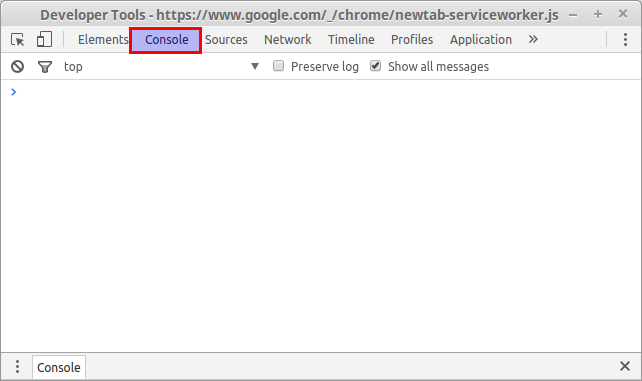
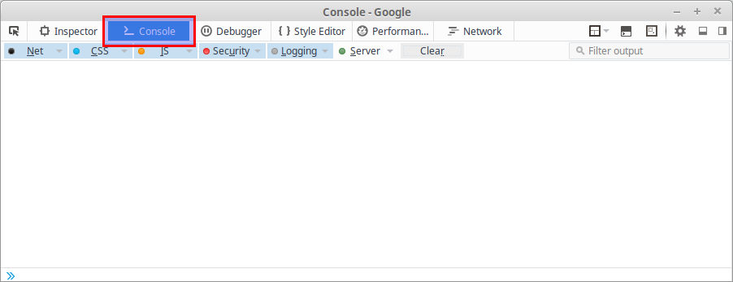
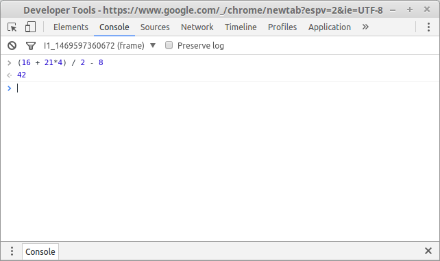

# Javascript

Stiati voi oare ca aveti un puterea unui limbaj de programare in aplicatia folosita zi de zi - browserul vostru?

Acest limbaj se numeste `javascript`. Haideti sa incercam sa vedem cum il putem dresa sa ne asculte!

## Experiments

Cel mai simplu mod sa incepeti sa experimentati cu `javascript` este sa deschideti consola browserului vostru si sa incepeti a scrie direct acolo. In Firefox sau Chrome, pentru a porni consola, tastati in orice pagina `F12`, si treceti la tab'ul `Console` in fereastra magica deschisa.

Chrome: 

Firefox:  In firefox instructiunile javascript le puteti scrie jos.

Sa testam cateva operatii matematice. Scrieti urmatoarea linie in consola si tastati \[Enter\]:

```javascript
(16 + 21*4) / 2 - 8
```

Obtinem raspunsul la univers si tot absolut: 

Desigur putem folosi consola din browser si javascript ca un calculator in continuare, dar... e totusi un limbaj intreg, poate mult mai multe!

## Variabile

Javascript e un limbaj de programare. Orice limbaj de programare are notiunea de variabila. Variabila este ceva ce poate sa se schimbe, e variabila :\). Ii setati o valoare, apoi puteti sa-i setati alta, daca vreti. Puteti sa cititi valoarea ei accesandu-i numele, puteti s-o transmiteti ca parametru la functii, etc. Variabila e elementul cheie a oricarui limbaj de programare, in Pascal la fel aveti variabile, si au fix acelasi rol.

Pentru a defini o variabila, cu valoarea 10, puteti scrie asa:

```javascript
var number = 10;
```

Aici am declarat variabila `number` cu valoarea `10`. Observati ca nu am zis de ce tip e `number` - Javascript e un limbaj dinamic, el incearca sa inteleaga automat de ce tip sunt variabilelel, in cazul dat - un numar.

Putem folosi aceasta variabila in alte declaratii:

```javascript
var otherNumber = number + 5;
```

Desigur `otherNumber` va avea valoarea 15.

Pentru a defini un sir de caractere doar punem in jurul textului ghilimele simple sau duble:

```javascript
var h = "Hello "
var w = 'World!'
console.log(h + w)
```

Observati ca nu am pus `;` la sfasitul instructiunilor de data asta, in javascript `;` la sfarsit sunt optionale, limbajul le cere doar in cazuri rare cand nu poate deduce singur cand se termina o instructiune si se incepe alta.   
Functia `console.log()` afiseaza ceva la consola, in cazul dat ea va afisa `Hello World!`.

Variabilele de tip boolean \(de logica\) se definesc la fel de simplu:

```javascript
var test = true
test = !test            // operatia NOT (negare)
test = test || true     // operatia OR  (sau)
test = test && false    // operatia AND (si)

console.log(test == true)   // testam pentru egalitate
console.log(test != true)   // testam pentru inegalitate
```

## IF \(Conditionale\)

In javascript putem pune o conditie, care ne va permite sa executam diferite actiuni in dependenta daca conditia asta se adevereste sau nu:

```javascript
var a = 10
if (a < 20) {
    console.log(a + ' e mai mic ca 20')
}
```

> Hint: cand apasati \[Enter\] consola, Chrome incearca sa execute instructiunea, si daca ea nu-i finisata, da eroare. Ca sa scrieti o instructiune pe mai multe randuri, tastati \[Shift + Enter\]

Observati ca e construit din cuvantul cheie `if`, intre `(...)` se pune conditia care o verificam, dupa care intre `{ ... }` scriem instructiunile care sa se execute in caz ca conditia intre `(...)` e adevarata \`

Putem adauga `else` la conditia `if` pentru a specifica instructiuni care sa se execute in caz daca conditia nu e adevarata:

```javascript
var b = 25
if (b < 20) {
    console.log(b + ' e mai mic ca 20')            // se executa daca b < 20
} else {
    console.log(b + ' e mai mare sau egal cu 20')  // se executa daca !(b < 20), adica b >=20
}
```

Instructiunea `else if` ne permite sa adaugam o noua conditie in caz ca conditia `if` nu e adevarata:

```javascript
var c = 30
if (c < 30) {
    console.log(c + ' e mai mic ca 30')   // se executa daca c < 30
} else if (c > 30) {
    console.log(c + ' e mai mare ca 30')  // se executa daca c > 30
} else {
    console.log(c + ' este egal cu 30')   // se executa daca c == 30
}
```

## Switch

Instructiunea `switch` ne permite sa executam unul din mai multe blocuri in dependenta de conditie:

```javascript
var day;
switch (new Date().getDay()) { 
    case 0:
        day = "Sunday";
        break;
    case 1:
        day = "Monday";
        break;
    case 2:
        day = "Tuesday";
        break;
    case 3:
        day = "Wednesday";
        break;
    case 4:
        day = "Thursday";
        break;
    case 5:
        day = "Friday";
        break;
    case 6:
        day = "Saturday";
}

console.log(day);
```

Instructiunea `new Date().getDay()` ne permite sa obtinem ziua curenta a saptamanii ca un numar de la 0 la 6.

## Cicluri \(for, while\)

Orice limbaj de programare are notiunea de a executa instructiuni in ciclu. Javascript are cateva:

Ciclul `while` ne permite sa executam un grup de instructiuni de multe ori atat timp cat o conditie e adevarata:

```javascript
var i = 0;
while (i < 10) {
    console.log(i)
    i++             // adunam 1 la i, echivalent cu i = i + 1
}
```

Codul de mai sus va afisa la consola cifrele de la 0 la 9, deoarece in momentul cand va fi variabila `i` va deveni `10`, conditia va fi falsa

Ciclul `for` echivalent al blocului de mai sus ar fi:

```javascript
for (i = 0; i < 10; i++) {
    console.log(i)
}
```

Observati ca el combina 3 instructiuni intre paranteze:

```text
for (instructiune1; instructiune2; instructiune3;) {
    ...
}
```

* `instructiune1` - e initializarea unei variabile, deobicei
* `instructiune2` - e conditia de continuitate, fix ca in while
* `instructiune3` - e instructiunea care sa o execute dupa fiecare ciclu \(deobicei e o crestere/descrestere a variabilei\)

Oricare din aceste instructiuni poate fi omisa, daca nu e relevanta, ba mai mult, pot fi omise toate 3!

```javascript
for (;;) {      // ciclu infinit
    ...
}

while (true) {  // la fel ciclu infinit
    ... 
}
```

## Functii

Cand vrem sa reutilizam o bucata de cod, ar fi bine sa-l putem grupa si defini sub un nume, ca sa-l putem dupa asta apela dupa acest nume. Acesta e rolul functiilor!

Functia in javascript se defineste foarte simplu:

```javascript
function max(a, b) {    // functia cu numele 'max' si cu 2 parametri 'a' si 'b'
    if (a > b) {
        return a        // intoarcem un raspuns
    } else {
        return b        // intoarcem un raspuns
    }
}
```

Sa apelam aceasta functie e la fel de simplu:

```javascript
max(3, 5)
```

Observati ca folosim numele functiei, si intre paranteze specificam valorile pentru parametrii functiei, ca valori putem transmite si alte variabile, desigur.

## Arrays

Un array in javascript e o colectie de elemente, grupate sub o singura variabila:

```javascript
var nothing = []    // array gol
var fruits = ['apple', 'orange', 'carrot', 'kiwi']  // array cu valori
var primes = [2, 3, 5, 7] // array de numere
```

Un array se defineste prin paranteze patrate `[...]`, si poate contine zero sau mai multe valori.

Pentru a accesa un element din array, il referim dupa indexul lui \(ordinea in array\):

```javascript
console.log('first prime is ' + primes[0])      // accesam numarul '2'
console.log(fruits[2] + ' is not a fruit!')     // accesam cuvantl 'carrot'
```

Pentru a schimba valoarea unui element putem sa-l accesam si sa-i setam indata valoarea:

```javascript
fruits[2] = 'mango'     // setam valoarea pentru al 3'lea element din array
console.log(fruits[2] + ' is a fruit! maybe')
```

> Nota: In marea majoritate a limbajelor de programare, numaratoare se incepe intotdeauna de la 0!. Deci primul element e `arr[0]`, al doilea e `arr[1]`, etc.

Un array in javascript are multe proprietati si functii interesante:

Pentru a afla lungimea unui array \(cate elemente contine\) putem scrie:

```javascript
fruits.length;
```

Pentru a adauga un nou element la array putem scrie:

```javascript
fruits.push('cherry')       // adaugam un element nou la sfarsit
fruits.unshift('lemon')     // adaugam un element nou la inceput
```

Pentru a sterge un element din array putem scrie:

```javascript
fruits.pop()     // stergem un element de la sfarsitul array'ului
fruits.shift()   // adaugam un element de la inceputul array'ului
```

Pentru a face modificari in mijlocul unui array putem folosi metoda splice:

```javascript
fruits.splice(2, 0, 'banana')   // adaugam o 'banana' pe pozitia a treia in array
fruits.splice(3, 1)             // stergem al 4-lea element
```

## Objects

In viata reala o masina e obiect, masa, scaun, etc.. Ele au proprietati \(nume, marca, culoare, etc\) , si actiuni \(merge, opreste, etc\) care poti face cu ele.

Un obiect in javascript e un container pentru mai multe proprietati si functii. Functiile in cadrul obiectelor mai sunt numite si metode.

Definirea unui obiect, ca si toate celelalte, e foarte simpla :wink: :

```javascript
var empty = {}      // obiect gol
var car = {type:'Fiat', model:'500', color:'white'} // obiect cu mai multe proprietati
```

Observati ca proprietatile in obiect se seteaza sub forma de pereche: `cheie : valoare`, separate prin virgula. cheia e ca numele unei variabile din obiect, prin ea valoarea va fi accesata.

Pentru a accesa proprietatile obiectului car creat, scriem:

```javascript
console.log(car.type)   // afiseaza 'Fiat'
car.model = '600'       // setam o noua valoare pentru model
car.engine = 2000       // adaugam o noua proprietate engine cu valoarea 2000
```

Toate proprietatile si functiile obiectelor se acceseaza prin `.`. In acest moment, probabil, incepeti sa va dati seama ca si la array am accesat functii prin `.` - da, un array este un obiect in javascript, si nu doar el!

un sir de caractere, sau cum il vom numi in continuare - string, la fel e un obiect:

```javascript
var string = 'Salut Lume! ce mai faceti?'
console.log(string.length)                  // lungimea string'ului

var pos = string.search("Lume") 
console.log('cuvantul Lume se incepe pe pozitia ' + pos)

var str2 = string.substring(6, 11)
console.log(str2)                           // va afisa 'Lume!'

string = string.replace("Lume", "Oameni")   // Trebuie sa atribuim rezultatul cuiva, 
                                            // nu se schimba insasi string'ul sursa
console.log(string)                         // va afisa string cu cuvantul 'Lume' inlocuit de 'Oameni'
```

Obiectul String are mult mai multe metode decat sunt prezentate aici, array la fel. Insa cel mai fain, e ca puteti sa extindeti orice obiect si cu functionalitatea voastra, dupa dorinta!

Ca sa definim metode pentru un obiect nou:

```javascript
var car = {
    type: 'Fiat',
    color: 'white',
    repaint: function(color) { // 'repaint' va fi numele functiei, si va cere un parametru
        this.color = color;    // 'this' permite sa accesam proprietatile si functiile din obiectul curent, 
                               // ca o variabila catre sine
    }

console.log(car.color)  // afiseaza 'white'
car.repaint('red')
console.log(car.color)  // afiseaza 'red'
}
```

Ca sa definim metode si proprietati noi pentru un obiect existent:

```javascript
car.model = '500'   // doar scriem numele proprietatii dorite si-i dam o valoare,
                    // se va adauga automat!

car.drive = function(dist) {
    console.log('brim brim brim, mergem ' + dist + ' km')
}

console.log(car.model)  // observam ca avem proprietatea noua 'model'
car.drive(20)           // observam ca avem metoda noua 'drive()'
```

Sa stergem proprietati si metode dintr-un obiect e la fel de simplu:

```javascript
delete car.model    // stergem proprietatea model din car

delete car.drive    // stergem metoda drive() din car
```

