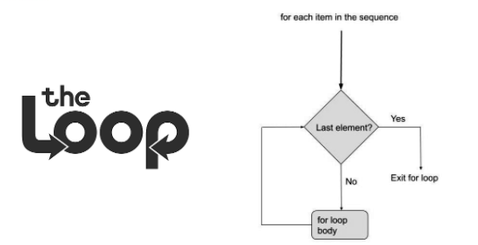
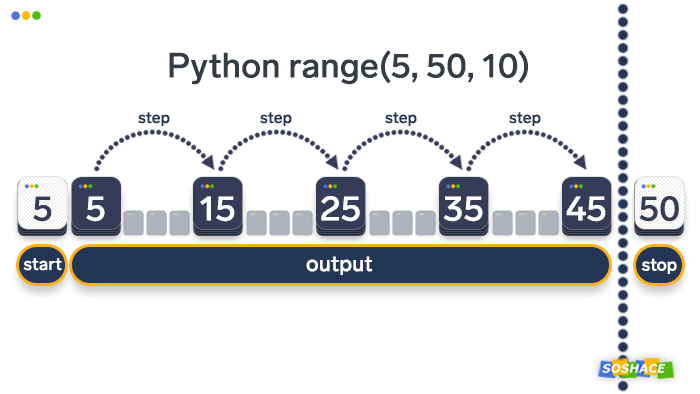
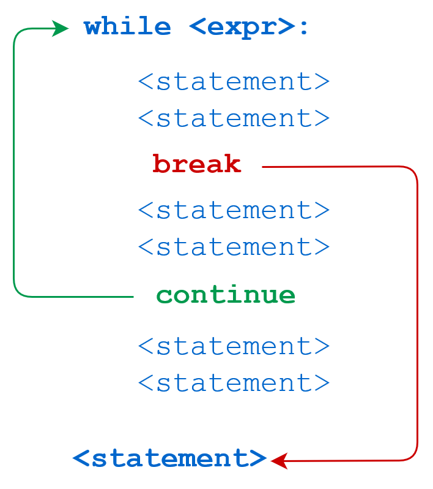

# Cicluri for

#### **`For` your health**  **✌️  `While` you are happy** 💖


 Există două scenarii de iterare a unui cod: [**definit** ](cicluri-for.md#for-loop)și [**indefinit**](cicluri-for.md#while-loop).


## For loop 

Cea mai bună metodă de a _itera_ în _Python_ este `for loop`. Dar ce înseamnă să iterezi?


Când un proces sau o secvență de program este executată multiplu, adică repetată, atunci această secvență se numește **iterată**.


`For loop` reprezintă o metodă de iterare, care repetă aceeași bucată de cod pentru a determina mai multe valori ale acelorași variabile.  Ciclul `for` produce o iterare definită.

 **Structura buclei for:**



### `For x in list_name`

```python
numbers  = [7, 9, 12, 54, 99]

print "This list contains: "

for num in numbers:
    print(num)
```

În exemplul de mai sus, la fiecare iterație, variabila `num` va fi următoarea valoare din lista `numbers`. Astfel, prima dată, `num` va fi `7`, a doua oară - va fi `9`, apoi `12`, `54`, `99`, iar după asta iterația se va termina, deoarece nu mai există valori în listă.

```python
my_list = [3, 6, 9, 5, 1, 0]

for number in my_list:
    doubled = number * 2               # instructiunea 1  
    print(doubled)                     # instructiunea 2 ...
```


Observați că instrucțiunea iterativă `for`, la fel ca și instrucțiunea condițională `if` \(sau `elif`, `else`\), necesită două puncte \( : \) la sfârșit de linie, respectiv necesită ca și codul ce urmează să fie indentat


```python
fructe = ["măr", "banană", "ananas"]
for x in fructe:
  print(x)
```

```python
    for name in ["Joe", "Amy", "Brad", "Angelina", "Zuki", "Thandi", "Paris"]:
    print("Hi", name, "Please come to my party on Saturday!")
```

#### ✨AVANSĂM!✨ 

```python
votes = [8575855, 5555, 54433, 1001, 14000]
votes_good = 10000
for x in votes:
    if x < votes_good:
        votes.remove(x)
print(votes)
```

### `For x in range()`


`range` este o funcție care primește un parametru `n` și returnează o listă de la `0` la `n-1`.


```python
# range (start=0 , stop=10)
for i in range(10):
    print(i)
```

Această sintaxă ne spune următoarele: _"pentru fiecare număr_ `i` _din range de la_ `0` _la_ `10`_, afișează_ `i`_"_.




```python
# range(start=2, stop =12)
for i in range (2, 12):
    print(i)
```

```python
#range (start = 10, stop = 0, step = -1)
for i in range(10, 0, -1):
    print(i)
```


Mai mult despre for loop poti citi [aici](https://pynative.com/python-for-loop/)


## While loop


Bucla `while` este folosită pentru a itera o secțiune de cod atât timp cât condiția este adevărată.


 Bucla `while` este o buclă indefinită.  Această buclă ține cont de indentarea codului.

 **Structura buclei While:**




```python
# Acest exemplu va executa „total = total + 1” până când valoarea condiția
# total < 100 va fi falsă, 
total = 0
while total < 100:     
    total = total + 1

print(total)
```

Odată ce variabila `total` a ajuns la valoarea de 100, programul se va opri și va afișa `100`

```python
total = 0
for total in range(100): 
    total = total + 1
    
print(total)    
```

Ultima valoare din `range(100)` va fi numărul 99, respectiv variabila total va primi valoarea `99 + 1` = 100. Programul va afișa `100`.

#### _Ciclul infinit_

```python
a = 1

while True:
    a = a + 1
    print(a)
```


Orice număr cu excepția lui 0, are valoarea `True`, respectiv doar 0 are valoarea `False`.


### Declarație de control `break`

Declarația `break` este folosită pentru a ieși din o structură repetitivă. 


O instrucțiune dată într-o buclă termină imediat bucla.


```python
n = 5
while n > 0:
    n = n - 1
    if n == 2: # Când n va avea valoarea 2, programul se va ieși din bucla while.
        break
    print(n)
```

### Declarație de control `continue`

```python
n = 5
while n > 0:
    n = n - 1 #sau n-=1
    if n == 2:  # Când n va avea valoarea 2, programul va ignora print(n) 
        continue
    print(n)
```

 **Folosirea condiției `else`**

Condiția _else_ poate fi folosită și în cadrul buclei While.

```python
n = 5
while n > 0: 
    n = n - 1
    print(n)
else:
    print('Bucla s-a terminat')
```

Mai multe despre cicluri: [while ](https://www.w3schools.com/python/python_while_loops.asp), [for](https://www.w3schools.com/python/python_for_loops.asp), si mai multe resurse \([while](https://realpython.com/python-while-loop/), [for](https://www.programiz.com/python-programming/for-loop)\)

> **The** [**function** ](functii.md)**name should define everything the function does.**

