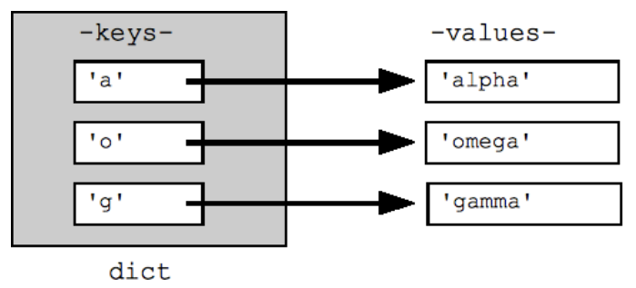

# Dictionare

Un dicționar în Python este o colecție de data _neordonată, modificabilă, care nu permite duplicate_.


 Are formatul: **{ cheie : valoare }**


### Intro

```python
d = {"cheie1": "valoare", "cheie2": "valoare2"}
print(d)
```

Un **dicționar** este asemănător cu o listă, doar că în cazul dicționarelor puteți să accesați valorile prin intermediul unei chei, și nu prin intermediul unui index. O **cheie** poate fi un `string` sau un număr. 

> #### Dicționarele sunt utile pentru asemenea lucruri ca: lista numerelor de telefoane \(având perechile _nume - număr_\), pagini de logare \(având perechile _adresa de e-mail - nume de utilizator_\) și nu doar!



### Dicționar gol

```python
dict_clear = {}
```

### Accesarea elementelor

Putem accesa un element prin cheie \(accesarea unei valori din dicționar după o cheie e aceeași cum am accesa valorile din liste după indecși\)

```python
d = {"cheie1": "câine", "cheie2": "valoare2"}
print(d["cheie1"])
print(d["cheie2"])
```


 La fel putem accesa un element prin cheie utilizând metoda **.get**:


```python
d = {"cheie1": "câine", "cheie2": "valoare2"}

print(d["cheie2"])
print(d.get("cheie3"))
```

### Daca cheie este in dicționar

Cum verificăm dacă în următorul dicționar există cheia "cheie3"?

```python
dictionar = {"cheie1": "valoare1", "cheie2": "valoare2"}

if "valoare1" in dictionar:
  print("valoare1 exista")
else:
  print("valoare1 nu exista")
```

### Modificarea valorilor

 Modificăm valorile din dicționar prin accesul la **cheie.**

```python
d = {"cheie1": "valoare", "cheie2": "valoare2"}
print(d)

d["cheie1"] = "O noua valoare!"
print(d)
```

### Adăugarea valorilor

La fel ca listele, dicționarele sunt "flexibile". Aceasta înseamnă că ele pot fi schimbate după ce au fost create. Un avantaj al acestui fapt este ceea că putem adăuga în dicționarele deja create noi perechi _cheie-valoare_, în felul următor: 

```python
d = {"cheie1": "tort", "cheie2": "valoare2"}
print(d)

d["cheie_noua"] = "valoare_noua"
print(d)
```

### Ștergerea elementelor


`.pop()` și `del` - Șterge elementul cu ajutorul indexului specificat

`.popitem()` - Șterge ultimul element 


`.pop(cheie)`

```python
culori = {"verde":1, "galben":2, "rosu":3, "albastru":4}
print(culori)
print()

print("Dicționarul culori după ștergerea culorii albastru:")

culori.pop("albastru")
print(culori)
```

`del name_dict['cheie']`

```python
culori = {"verde":1, "galben":2, "rosu":3, "albastru":4}
print(culori)
print()

print("Dicționarul culori după ștergerea culorii rosu:")

del culori['rosu']

print(culori)
```

`.popitem()`

```python
culori = {"verde":1, "galben":2, "rosu":3, "albastru":4}
print(culori)
print()

print("Dicționarul culori după ștergerea ultimului element:")

culori.popitem()
print(culori)
```

### Ștergera dicționarului


* `.clear()` - șterge conținutul dicționarului
* `del` - șterge dicționarul în sine


`.clear()`

```python
dictionar = {1:"a", 2:"b", 3:"c"}
print(dictionar)

dictionar.clear()
print(dictionar)
```

`del name_dict`

```python
dictionar = {1:"a", 2:"b", 3:"c"}
print(dictionar)

del dictionar
print(dictionar)
```

### Copierea dicționarului


.copy\(\) - Copie elementele dintr-un dicționar în alt dicționar


Daca vom utiliza **dict2 = dict1, nu este corect**, deoarece variabila dict1 este o referință la structura de date creată. Când atribuim unei noi variabile o variabilă existentă, se copiază referința, nu elementele.

```python
dict1 = {1:"a", 2:"b", 3:"c"}

dict2 = dict1
print(dict2)

dict2[1] = "A"
print("dict1 ", dict1)
print("dict2 ", dict2)
```

`.copy()`

```python
dict1 = {1:"a", 2:"b", 3:"c"}

dict2 = dict1.copy()
print(dict2)

dict2[1]="A"
print("dict1 ", dict1)
print("dict2 ", dict2)
```

### Accesarea elementlor .2

 Putem accesa **cheile** unui dicționar cu [**for**](cicluri-for.md#for-loop) ****

```python
dictionar = {"cheie1": "valoare", "cheie2": "valoare2", "cheie3": "valoare"}

for cheie in dictionar:
  print(cheie)
```


 Însă pentru a accesa **valorile**, utilizăm metoda **`.values()`**


```python
dictionar = {"cheie1": "valoare", "cheie2": "valoare2", "cheie3": "valoare3"}

for valoare in dictionar.values():
  print(valoare)
```


 Pentru a accesa și **cheile** și **valorile** utilizăm metoda **`.items()`**


```python
dictionar = {"cheie1": "valoare", "cheie2": "valoare2"}

for cheie, valoare in dictionar.items():
  print("Cheie:", cheie)
  print("Valoare:", valoare)
  print()
```

### Dicționar si tipuri de date

 Putem avea **diferite tipuri de date ca valori.** Şi **diferite tipuri de date chei.** _Deci putem avea dicționare cu **tipuri de date mixte**!_

```python
d = {1: "valoare1", "cheie2": "valoare2", 3.3: 3, 5: "ceva" }
print(d)
```

Putem avea liste drept valori ale dicționarului

```python
autori_carti = {
    "J.K.Rowling": ["Harry Potter 1", "Fantastic Beasts and Where To Find Them"], 
    "Dan Brown": ["Codul lui Da Vinci", "Fortareata digitala"]
    }
```


Accesarea unui element din dicționar de așa fel este similară cu accesarea valorilor dintr-o listă 2-Dimensională


```python
autori_carti["J.K.Rowling"][0]
```

Mai multe despre dicționare:  \([+nested dictionary](https://www.geeksforgeeks.org/python-dictionary/),  [more info](https://realpython.com/python-dicts/)\)

> Code -- a [set ](seturi.md)of symbols whose primary purpose is to restrict comprehension.

