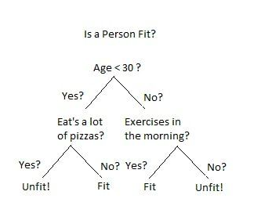

# If...else


*  Scrie un program care va afișa "a este egal cu b si c este egal d", dacă într-adevăr `a` este egal cu `b` și `c` este egal cu `d`. Dacă aceasta nu este adevărat, atunci transformă variabilele in așa fel, încât afirmația de mai sus să fie adevărată. Și mai verifica o data daca a este egal cu b si daca c este egal cu d. Daca intr-un final aceste afirmatii vor fi egale, printeaza "acum a este egal cu b si c este egal d".

```python
#1
a = 5
b = '5'~
c = 10
d = 10.5

if a == b and c == d:
    print('a este egal cu b si c este egal d')
else:
    if a == int(b) and c == int(d):
        print('acum a este egal cu b si c este egal d')
```

* Scrie un program care verifica daca valoarea variabilei a este modulul lui 10 sau nu. Daca da atunci afiseaza 'a nu este modulul lui 10', daca nu, atunci afiseaza 'a este modulul lui 10'.

```python
#2
a = input()
a = int(a)
if a % 10 != 0:
    print('a nu este modulul lui 10')
else:
    print('a este modulul lui 10')
```

* Un an este un an bisect dacă este divizibil cu 4. Dacă anul poate fi împărțit în mod egal la 100, NU este un an bisect, cu excepția cazului în care anul este, de asemenea, divizibil în mod egal cu 400. Atunci este un an bisect. Scrieți cod care solicită utilizatorului să introducă un an și să scoată `True` dacă este un an bisect sau `False` în caz contrar. Folosiți declarațiile `if`.

```python
year = int(input())
if year % 4 == 0 and (year % 100 != 0 or year % 400 == 0):
    print(True)
else:
    print(False)
```

* Creați un condițional, astfel încât dacă `„Friendly”` este în `w`, atunci `„Friendly is here!”` ar trebui să fie atribuită variabilei `wrd`. Dacă nu, verificați dacă `„Friend”`este în `w`. Dacă da, stringul `„Friend is here!”` ar trebui să fie atribuită variabilei `wrd`, altfel `„No variation of friend is in here.”`. ar trebui să fie atribuită variabilei `wrd`. \(Luați în considerare, de asemenea, contează ordinea afirmațiilor dvs.\)

```python
w = "Friendship is a wonderful human experience!"

if 'Friendly' in w:
    wrd = 'Friendly is here!'
    print(wrd)
elif 'Friend' in w:
    wrd = 'Friend is here!'
    print(wrd)
else:
    wrd = 'No variation of friend is in here.'
    print(wrd)
```


Acum incearcă să scrii condiții de sine stător 


1. Creaza un program care sa verifice daca 2 persoane au aceleasi interese\(hobby-uri\) sau nu. Programul trebuie sa primeasca drept `input` interesele a doua persoane. Daca au interese comune atunci programul trebuie sa afiseze `"Yeeey! Avem interese comune!"`, daca ele vor fi diferite atunci programul trebuie sa afiseze `"Hmmm! Avem interese diferite!"`.
2. Scrie un program utilizând instrucțiunile if/else care sa urmeze aceeasi logica ca si schema\(arborele\) de mai jos, avand conditiile mentionate in celula de mai jos:
   1. `age = 35` 
   2. `pizza_eater = False` 
   3. `morning_exercises = True`



