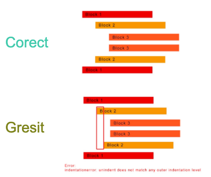
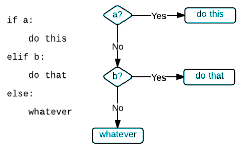

# Flow control

La fel ca în viața reală, uneori codul nostru trebuie să fie capabil să ia decizii.

Până acum, tot ce am scris împreună în _Python_ putea să urmeze doar un singur fir logic: fie că am adunat două numere sau fie că am afișat ceva. Codul nostru, însă, nu putea lua decizii de sine-stătător în privința a ce instrucțiuni să execute în dependență de o careva condiție. Conceptul de **Control Flow** oferă posibilitate programului de a alege ce să facă.

Pentru a intra în esența conceptului de Control Flow, trebuie să definim câteva noțiuni importante.


[Operatori de comparatie](operatori.md#comparatoarele) au un rol major in conceptul de Control Flow.


## **Operațiile Boolean**

Operațiile `boolean` compară careva afirmații, rezultatul acestei comparații fiind o valoare `boolean`. Există trei operații `boolean`:

### `and`

And verifică dacă _ambele_ afirmații sunt `True`. 


_De exemplu:_ 

Eu voi cumpăra pâine: 

1. Dacă voi avea bani  **ȘI \(AND\)**  2. Dacă va fi pâine la magazin


### `or`

Or verifică dacă _cel puțin_ o afirmație este `True`.


_De exemplu:_ 

Eu voi fi fericit/fericită:

1. Dacă se termina pandemia    **SAU \(OR\)**  2. Dacă mă vaccinez


### `not`

Not este _opusul_ afirmației.


_De exemplu:_ 

Eu voi sta acasă dacă:

 **NU \(NOT\)**  se deschide școala


În acest context, aflați că:

```python
 - True  and True  este True;
 - True  and False este False;
 - False and True  este False;
 - False and False este False;

 - True  or True  este True;
 - True  or False este True;
 - False or True  este True;
 - False or False este False;

 - Not True  este False;
 - Not False este True.
```

Să mergem mai departe.

Să zicem că avem următoarea expresie _Python_: `1 < 2 and 2 < 3`.

Rezultatul acestei expresii va fi `True` sau `False`? Pentru a răspunde la această întrebare, să apelăm la tabelul de mai sus.

`1 < 2` este `True`. `2 < 3` este la fel `True`. `True and True` ce va fi? Corect! `True`!

Dar care vor fi rezultatele următoarelor expresii? `1 < 2 and 2 > 3` \(_False_\) `1 < 2 or 2 > 3` \(_True_\) `1 > 2 or 2 > 3` \(_False_\) `not False` \(_True_\) `not 41 > 40` \(_False_\)


Operațiile `boolean` nu sunt pur și simplu evaluate de la stânga la dreapta. La fel ca operațiile aritmetice, operațiile `boolean` au o ordine de execuție:

1. `not` este evaluat primul;
2. `and` este evaluat al doilea;
3. `or` este evaluat ultimul.


De exemplu, `True or not False and False` returnează `True`. De ce?

`not` este evaluat primul, astfel noi avem `True or True and False`. Deoarece `and`-ul e următorul evaluat, avem `True or False`. Așa după cum am văzut mai sus, `True or False` este `True`, astfel valoarea finală este `True`!

## **Sintaxa condiționalelor**

Dacă tot am învățat mai devreme cum să comparăm datele între ele, acum putem să punem și condiții.

Condiția `if` este considerată cea mai simplă dintre cele trei și ia o decizie în funcție dacă condiția e adevărată sau nu. Dacă condiția este adevărată, imprimă expresia indentată. Dacă condiția este falsă, omite imprimarea expresiei indentate. 

```python
if 100 == 100:          # specificam conditia, si ne amintim sa punem ':'
    print("I'm happy!")   # toate instructiunile care urmeaza dupa ':'  
                        # trebuie sa fie indentate!!!
                        # daca conditia este adevarata, executam instructiunea
```


 Este foarte important să **indentăm** corect codul când folosim conditionalul if.


In caz contrar vom obține eroarea de mai jos.

```python
# de ce avem eroare?
if 100 == 150:         
print("I'm happy!")
```

Dar ce înseamnă indentare?


**Indentarea** se referă la spațiile de la începutul unei linii de cod.


În cazul în care în alte limbaje de programare indentarea în cod este doar pentru lizibilitate, indentarea în Python este foarte importantă.

Python folosește indentare pentru a indica un bloc de cod.

Pentru a deplasa o linie de cod spre dreapta la distanța cerută de Python, utilizăm tasta `tab`



 Sa vedem care e structura **condiționalului if**




Când folosim `else`?

Când avem doar 2 opțiuni.


De exemplu vrem să ne logăm pe pagina noastră de Facebook și trebuie să ne introducem numele. În spatele acestei funcționalități se află un `if` care verifică dacă numele pe care l-am introdus se află în sistemul Facebook-ului sau nu.

```python
# Hai sa improvizam aici un astfel de algoritm
in_facebook_system_name = 'Anna'
my_name = 'Ana'

if my_name == in_facebook_system_name:
    print('Numele este corect')
else:
    print('Numele este gresit')
```


Dar dacă avem mai mult de 2 opțiuni?

Atunci folosim `elif` care e defapt e `else + if`.


```python
# vrem sa stim cat de accesibil este pretul unei inghetate pentru bugetul nostru
ice_cream_price = 50
accessibility = ''

if ice_cream_price == 0:
    accessibility = 'Gratuit'
elif ice_cream_price <= 10:
    accessibility = 'Mediu'
else:
    accessibility = 'Scump'
 

print(accessibility) # observati ca print() se afla in afara if-ului
```

> **Some day, someone will construct a** [**list** ](liste.md)**of 500 Great Programming Quotes, and this will be one of them.**

