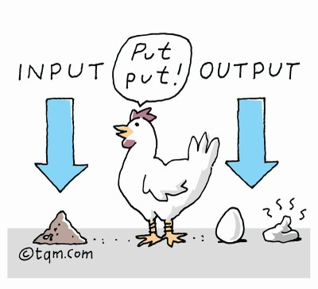

# Funcții

Funcțiile sunt foarte utile pentru reutilizarea codului. Acestea ne permit să definim un bloc de cod care poate fi utilizat în mod repetat într-un program.

Python oferă mai multe funcții încorporate, cum ar fi `print ()`, `len ()` sau `type ()`, dar putem defini propriile funcții pe care să le utilizăm în cadrul programelor.

Funcția reprezintă un bloc de cod care cere un input, îl prelucrează, și-l returnează sub formă de output. Cu alte cuvinte, funcția cere de la noi careva parametri cu care face niște operații. În urma acestor operații efectuate asupra parametrilor, funcția ne returnează rezultatul dorit.


Pe scurt:

* O funcție este un bloc de cod, ce poate fi folosit mai târziu în program.
* Structura funcției ține cont de indentarea codului.
* Este folosit pentru reducerea volumului și izolarea de cod scris.




### Sintaxa funcțiilor

Funcțiile sunt constituite din două componente.

```python
# def numele_funcției(<argumentele folosite în funcție, despărțite prin virgilă>):
#    <instrucțiuni>

#numele_funcției()
```

1️⃣ Primul component este **header**-ul funcției, care include: cuvântul-cheie `def`, **numele** funcției și **parametrii** pe care-i transmiteți funcției. Parametrii sunt opționali. 

2️⃣ Al doilea component este **corpul** funcției, care descrie, propriu-zis, ce face funcția voastră. Corpul funcției trebuie să fie **indentat**, la fel ca și în cazul instrucțiunilor condiționale. _\(Vă amintiți de indentarea condiționalelor?\)_ 

3️⃣ __Pentru a **apela** funcția dată, se scrie numele ei, urmat de două paranteze `( )`.


Vedeți mai jos un exemplu de funcție fără parametri:

```python
# header-ul unei functii fara parametri
def hello(): 
  print('Hello') #corpul funcției

# apelarea funcției
hello() 
```

Putem trimite informații unei funcții prin intermediul **argumentelor**. O funție poate avea unul sau mai multe argumente.

```python
#O funcție cu un singur argument
def hello_function(name):
  print ('Hello ',  name)

# apelarea functiei hello_function cu argumentul Maria si Ioana
hello_function('Maria')
hello_function('Ioana')
```

```python
# o functie cu 2 argumente
def func(name, rol):
  print(name, 'este', rol)

func('Alexandru', 'trainer') 
```


Putem trimite orice tip de date ca argumente unei funcții \(string, integer, listă, dicționar etc.\).


De exemplu. dacă trimiteți o listă ca argument, aceasta va rămâne o listă atunci când apelăm funcția.

```python
def functie_de_salut(studenti):
  for student in studenti:
    print ('Salut,', student)

functie_de_salut(['Ion', 'Maria', 'Alex','Eva', 'Dana'])
```


Dacă avem mai multe argumente pe care dorim să le folosim, _adăugăm un asterisc în fața argumentului din paranteze_


```python
# argumentele cu asterisc(var args) se indica tot timpul dupa argumentele obisnuite

def say_hello_to(greeting, *names):
    for name in names:
        print(greeting + name)


say_hello_to("Salut ", "Tetris", "Larnaca", "Abu", "Candi", "Loki")
say_hello_to("hi, ", "Tudor", "Anton")
```


În Python deosebim câteva tipuri de argumente:

* Positional Arguments
* Keyword Arguments
* Default Arguments


### Positional Arguments

Cele mai frecvente sunt argumentele de poziție \(Positional Arguments\), ale căror valori sunt într-o anumită ordine.

```python
def func(name, rol):
  print(name, 'este', rol)

func('Ion', 'trainer')  
```

### Keyword Arguments

Pentru a evita confuzia argumentelor poziționale, putem folosi numele parametrilor \(Keyword Arguments\)

```python
def func(name, rol):
  print(name, 'este', rol)

func (rol='studenta', name = 'Maria')
```

### Default Arguments

Putem specifica valori default pentru argumente atunci când definim o funcție.

```python
def func(name, rol='student'):
  print(name, 'este', rol)

func('Irina', 'trainer')

func('Dan')
```

### Returnarea unei valori

 Pentru a returna o valoare întro funcție, utilizam pur declarația `return`. 


Odată executată o declarația `return`, nimic altceva în corpul funcției nu este executat.


```python
# Suma a 2-a valori
def sum(a, b):
    return a + b

x = sum(5, 4)
print(x)
```

#### Dacă vrem să returnăm mai multe valori

```python
def imparte(x, y):
    partea_intreaga = x / y
    partea_intreaga = int(partea_intreaga)

    restul = x % y
    
    return partea_intreaga, restul

intreg, rest = imparte(10, 8)
# Variabila „intreg” ia valoarea variabilei „partea_intreaga” iar
# variabila „rest” ia valoarea variabilei „restul” din functia imparte()
print("partea intreaga " + str(intreg))
print("restul " + str(rest))

```


Numărul variabilelor de la `return`, în cazul nostru 2, trebuie să coincidă cu numărul variabilelor declarate după funcție.  
Adica, în cazul nostru variabila `intreg` va primi aceeași valoare pe care o are variabila `partea_intreaga` _\(intreg = partea\_intreaga_\), iar, analog, _rest = restul_ .


Ca rezultat vom primi afișat:  
`partea intreaga 1  
restul 2`

Mai multe despre funcții \([documentație](https://docs.python.org/3/tutorial/controlflow.html#defining-functions), [site](https://www.geeksforgeeks.org/python-functions/)\)

