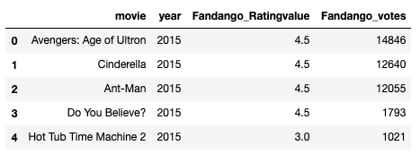
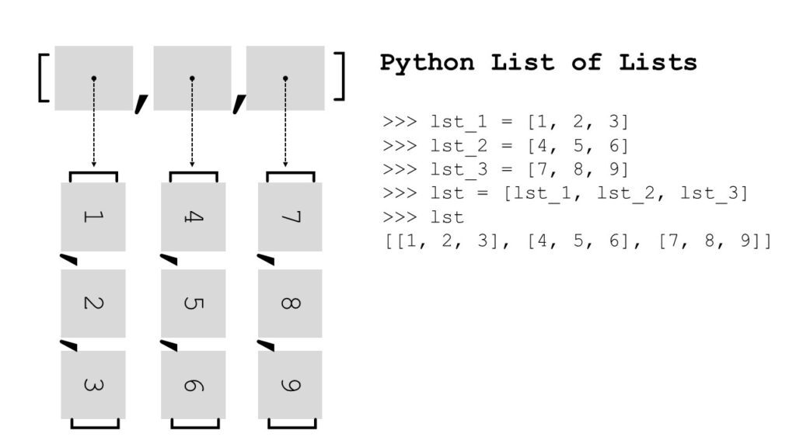
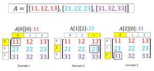

# Liste

Mai jos avem un tabel cu date de pe portalul de filme fandango.com



Pentru a putea opera cu datele din acest tabel, trebuie să le stocam în variabile.

```python
movie_row0 = 'Avengers: Age of Ultron'
year_row0 = 2015
rating_value_row0 = 4.5
votes_row0 = 14846 
```

Dacă am crea câte o variabilă pentru fiecare valoare din acest tabel, am avea 20 de variabile. Prea multe!

În schimb putem să creăm o **lista** de valori.

```python
row0 = ['Avengers: Age of Ultron', 2015, 4.5, 14846]

# sau

movies = ['Avengers: Age of Ultron', 'Cinderella', 'Ant-Man', 
          'Do You Believe?', 'Hot Tub Time Machine 2']
```

Observați că itemii sunt scriși între paranteze pătrate. O listă poate fi și goală

```python
lista_goala = []
```

## Intro


* Listele sunt structuri de date în care putem să stocăm mai multe valori.
* Listele au o ordine, pot fi editate și permit duplicate.
* O listă poate conține toate tipurile de valori.


```python
lista_mea = [ False, 56.4, 4, 'Ford', 1j]
print(type(lista_mea))
len(lista_mea) # funcția care ne permite să vedem lungimea listei
```

Puteți accesa un item al listei după index-ul său. Un **index** e ca o adresă care identifică locul itemului în listă. Index-ul se scrie direct după numele listei, în paranteze pătrate, cam așa: `nume_lista[index]`. Puteți să accesați primul element al unei liste în felul următor: `nume_lista[0]`. Al doilea item îl accesați așa: `nume_lista[1]`. Programatorii iubesc să numere de la zero.



Este necesar să știm că prima poziție la indexare este 0.


### Accesăm mai multe variabile

 Dar dacă dorim să accesăm mai multe variabile în același timp?

```python
# Va printa elementele din listă cu indexul 2, 3 și 4.
print(lista_mea[2:5])
# 4, 'Ford', 1j
```

```python
# Va printa elementele din listă de la început până la cel cu indexul 3 inclusiv.
print(lista_mea[:4])
# False, 56.4, 4, 'Ford'
```

```python
# Va printa elementele de la cel cu indexul 3 până la sfârșit.
print(lista_mea[3:])
# 'Ford', 1j
```

#### Cum verificăm dacă un element există în lista noastră?

```python
if 4 in lista_mea:
    print('Da, aceste element există în listă')
else:
    print('Nu, acest element nu există în listă')
```

### Înlocuirea elementelor

 Cum înlocuim un element din listă?

```python
lista_mea[2]='Joi'
print(lista_mea)
```

### Adăugarea elementelor

 Cum adăugăm elemente la lista noastră?


* `.append()` - Pentru a adăuga un element la un index nespecificat**,** în coada de listă
* `.insert()` - Pentru a adăuga un element la un index specificat


`.append(var)`

```python
my_list = []  #lista goala
x = 7
b = 10

my_list.append(x)
my_list.append(b)
my_list.append(9)  

print(my_list)
```

`.insert(index, var)` - va adăuga variabila`var` pe poziția cu numărul `index` în lista noastră.

```python
lista_mea.insert(1, "Luni")
print(lista_mea)
```

### Extinderea listei

`list1.extend(list2)` va concatena \(adăuga\) elementele din lista 2 - `list2`în lista 1 - `list1`.

```python
lista_ta = [True, "Marte"]
lista_mea.extend(lista_ta)
print(lista_mea)
```

### Ștergerea elementelor


* `.remove()` - Șterge elementul specificat
* `.pop()` și `del` - Șterge elementul cu ajutorul indexului specificat


`.remove(var)`

```python
lista_mea.remove("Marte")
print(lista_mea)
```

`.pop(index)`

```python
lista_mea.remove(3)
print(lista_mea)
```

`del name_list[index]`

```python
del lista_mea[3]
print(lista_mea)
```

### Ștergerea listei


* `.clear()` - șterge conținutul listei
* `del` - șterge lista în sine


`.clear()`

```python
lista_ta.clear()
print(lista_ta)
```

`del name_list`

```python
del lista_mea
print(lista_mea)
```


Observăm că în acest caz primim o eroare, deoarece încercăm să afișăm o listă ștearsă.


### Lungimea listei 

 Cum aflăm câte elemente se află într-o listă?

```python
lista_mea = [1,2,3,4,5]
print(len(lista_mea))
```

### Sortarea listei

Mai jos aveți o listă, numită `culori`, care conține 4 itemi. Această listă fi sortată în ordine alfabetică. Asta nu e complicat! Priviți aici:

```python
culori = [ 'negru', 'rosu', 'albastru', 'verde' ]
culori.sort()

# se va afisa ['albastru', 'galben', 'negru', 'rosu', 'verde']
```

#### Mai multe [aici](https://developers.google.com/edu/python/lists), si [aici](https://www.w3schools.com/python/python_lists.asp).

## Listă de liste



```python
# avem stocate valorile din fiecare rând al tabelului
# în câte o listă.

header = ['name', 'gender', 'eye_color', 'race', 
'hair_color', 'height', 'alignement', 'weight']
r1 = ['Black Widow', 'Female', 'green', 'Human', 
'Auburn', 170.0, 'good', 59.0]
r2 = ['Thanos', 'Male', 'red', 'Eternal', 
'No Hair', 201.0, 'bad', 443.0]
r3 = ['Deadpool', 'Male', 'brown', 'Mutant', 
'No Hair', 188.0, 'neutral', 95.0]
r4 = ['Captain Marvel','Female','blue','Human-Kree',
'Blond',180.0,'good',74.0]
r5 = ['Doctor Strange', 'Male', 'grey', 'Human', 
'Black', 188.0, 'good', 81.0]
r6 = ['Iron Man', 'Male', 'blue', 'Human',
 'Black', 198.0, 'good', 191.0]
r7 = ['Thor', 'Male', 'blue', 'Asgardian', 
'Blond', 198.0, 'good', 288.0]
r8 = ['Venom','Male','blue','Symbiote',
'Strawberry Blond',191.0,'bad',117.0]

# în baza de date originală sunt 215 eroi
# asta ar însemna 215 rânduri respectiv 215 variabile

# mai jos avem o singură variabilă pentru toate rândurile
marvel = [header, r1, r2, r3, r4, r5, r6, r7, r8]

# haideți să investigăm cum arată lista marvel
marvel
```

### Selectarea elementelor

```python
# accesăm un element din lista de liste exact așa 
# cum accesăm într-o listă obișnuită un element

print(marvel[2])
print(marvel[2:4])

# ce observați? ce s-a afișat?
```

Dar cum accesăm un element din lista unei liste?

Mai jos avem o listă de liste reprezentată ca o matrice. Observați că unui element din lista de liste îi corespund indecșii conform cu poziția sa în matrice.

Respectiv primului element dintr-o listă din listă s-ar poziționa în rândul 0 și coloana 0.

În exemplul 2 avem un element din rândul 1, coloana 2.



```python
# mai întâi haideți să accesăm denumirile 
# coloanelor lui marvel
marvel[0]           
# primul rând l-am rezervat pentru numele coloanelor 
```

```python
# numele primului erou
print(marvel[1][0])
```

**Eat. Sleep. C&lt;&gt;ding.** [**Repeat**](cicluri-for.md)**.**

