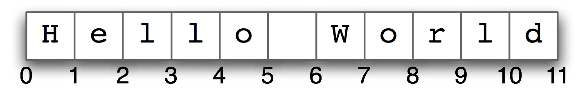

# Operatori

De matematică nu scăpați nici în programare. Partea bună este că programarea vă ajută să faceți operațiile matematice simplu și rapid. Putem să adunăm, scădem, înmulțim, împărțim și nu doar!

### Operații matematice de bază

```python
# adunare
15 + 25
```

```python
# scadere
25 - 15 
```

```python
# imapartire
20 / 3.5
```

```python
# inmultire
3 * 5
```

### Operații avansate

```python
# ridicare la putere
5 ** 2
```

```python
# restul imparțirii
40 % 15
```

### Comparatoarele


Semne de comparație vor avea rezultat de tip `bool`


```python
# semnul mai mare
print(25 > 15)
# semnul mai mic
print(25 < 15)
# semnul mai mic sau egal
print(25 <= 25)
# semnul mai mare sau egal
print(10 >= 5)
```


**Atrageți atenția că `==` compară dacă două lucruri sunt egale, pe când `=` atribuie o valoare unei variabile.**


```python
# check la egalitate
30 == 30

#check la inegalitate
30 != 30
```

## Strings .2

### **Accesarea după index**

Trebuie să cunoașteți că toate caracterele dintr-un `string` sunt aranjate într-o ordine. Această ordine presupune ca fiecărui caracter din `string` să-i fie atribuit un număr. Acest număr este numit **index**. Să analizăm diagrama de mai jos:



`String`-ul `"Hello World"` are 12 caractere, enumerate de la 0 la 11. Observați că și caracterului spațiu \(de după virgulă\) îi este atribuit un index \(indicele 5\).

Prin urmare, dacă doriți să accesați caracterul `"w"`din `string`-ul `"Hello World"`, trebuie pur și simplu să scrieți `"Hello World"[7]` \(pentru că enumerarea începe tot timpul de la 0!\).

Pentru a însuși această logică mai bine, vă aduc un exemplu simplu:

```python
p = "pix"[0]
e = "creion"[2]
```

În acest exemplu, am creat o variabilă nouă numită `p` și i-am atribuit "p" – caracterul de la index-ul zero al `string`-ului `"pix"`. Apoi, am creat o variabilă nouă, numită `e`, căreia i-am atribuit caracterul cu index-ul 2 din `string`-ul `"creion"`. În Python, enumerarea începe de la zero, și nu de la unu

### Concatenare 

Să mergem mai departe! Voi deja cunoașteți `string`-urile! De asemenea, voi deja cunoașteți și operațiile aritmetice din _Python_! Zic să combinăm aceste două concepte!

Haideți să analizăm următoarea linie de cod:

```python
# la ce mai putem sa folosim anumiti operatori?
# concatenare

string = 'Numele meu este '
name = ' Alexandra'
phrase = string + name

print(phrase)
```

Combinarea `string`-urilor în felul dat și presupune **concatenarea**. 


Putem să concatenăm `string` -urile chiar și în `print()`

Sau putem sa multiplicăm un `string` : `print('a' * 55)`


```python
print('Aceasta ' + 'este' + ' o' + ' propozitie')
```

```python
# ce va afisa functia print() de mai jos?
print('b ' * 5)
```

### **Formatarea `string`-urilor**

Dacă vreți să afișați o variabilă cu un `string`, să știți că există o metodă mai bună decât concatenarea.

```python
nume = "Mihai"
print("Salut, %s" % (nume))
```

Operatorul `%` scris după un `string` este folosit pentru a combina `string`-urile cu variabilele. Operatorul `%` înlocuiește toate `%s` din `string` cu variabilele scrise după acesta.

Ce credeți că se va afișa în urma executării acestui program?

```python
str_1 = "Norvegia"
str_2 = "tara"
print("Haidem in %s. Este o %s frumoasa." % (str_1, str_2))
```

Cred că deja ați intuit că numărul operatorilor `%` dintr-un `string` trebuie să fie egal cu numărul variabilelor dintre paranteze.

```python
print("%s viitoare se va %s %s!" % ("Luna", "numi", "septembrie"))
# se va afisa "Luna viitoare se va numi septembrie".
```

> **“Computers are good at following** [**instructions** ](flow-control.md)**but not at reading your mind.”**

