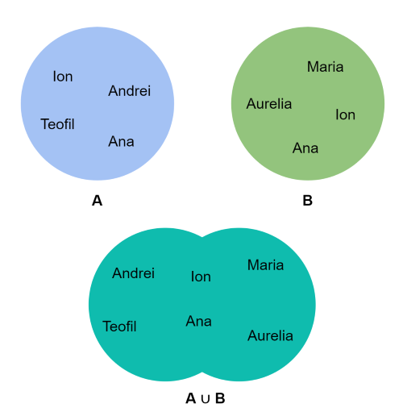
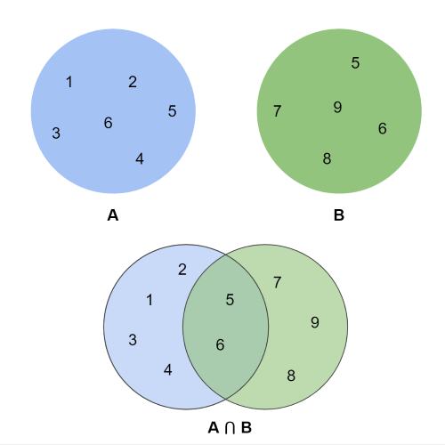
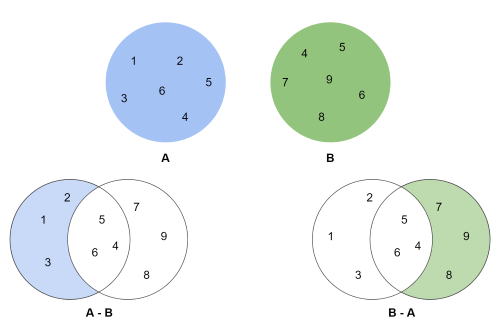

# Seturi

**Setul** se utilizează pentru a stoca colecții de date. Un set e o colecție de date **neordonată** și **neindexată**.

Pentru a înțelege mai bine seturile trebuie să cunoașteți că acesta reprezintă noțiunea matematică a unei _mulțimi_.

```python
this_set = {"apple", "banana", "cherry"}
print(this_set)
```


 Elementele setului sunt _neordonate_ și _nu permit valori duplicate_.


**Elemente neordonate** înseamnă că elementele dintr-un set nu au o ordine definită. Acestea pot apărea într-o ordine diferită de fiecare dată când le utilizați și nu pot fi apelate sau modificate prin index.


**Nu pot avea Valori duplicate** - Seturile nu pot avea două elemente cu aceeași valoare.


_Însă avantajul major al unui set, spre deosebire de o listă, este că are o metodă extrem de optimizată pentru a verifica dacă un anumit element se conține în set._

### Intro

```python
#elemente neordonate
this_set = {"apple", "banana", "cherry"}
print(this_set[1]) # error
```

```python
#nu pot avea valori duplicate, valorile duplicate sunt ignorate
this_set = {"apple", "banana", "cherry", "apple"}

print(this_set)
```

**Elementele setului** pot fi de orice tip de date. La fel un set poate conține diferite tipuri de date. Tipul de date în așa fel de seturi este '`set`'

```python
set1 = {"apple", "banana", "cherry"}
set2 = {1, 5, 7, 9, 3}
set3 = {True, False, False}
set4 = {"abc", 34, True, 40, "male"}
```

### Set gol

```python
a = set()
```

### Accesarea elemetelor


Accesarea elementelor in set se produce numai in ciclu \( setul nu este ordonat\)


```python
girls = {"Ana", "Aurelia", "Maria"} 

for name in girls:
    print(name)
```

### Verificarea prezenței unui element în set

```python
girls = {"Ana", "Aurelia", "Maria"} 

print("Anastasia" in girls) #False
print("Ana" in girls) #True
```

### Adăugarea valorilor


`.add()` - Inserarea unui element nou în set


`.add(value)`

```python
myset = {"a", "b", "c"} 
print(myset) 

myset.add("d") 
print(myset)

myset.add("a")
print(myset)
```

### Ștergerea elementelor


`.remove()` - Șterge elemntul din set după valoare \( Dacă nu este in set va fi erroare\)

`.discard()` - Șterge elemntul din set după valoare \( Dacă nu este in set erroare nu va fi\)


`.remove(value)`

```python
boys = {"Ion", "Andrei", "Teofil"} 

boys.remove('Teofil')
boys.remove('Alexandru') # error

print(boys)
```

`.discard(value)`

```python
boys = {"Ion", "Andrei", "Teofil"} 

boys.remove('Teofil')
boys.remove('Alexandru') # NO Value NO Error

print(boys)
```

### Adaugarea elementelor din alt set


`.update()` - Adaugă elemente din alt set sau din listă, dicționar ș.a.


`.update()` for sets

```python
fruits = {"apple", "banana", "cherry"}
tropical = {"pineapple", "mango", "papaya"}

fruits.update(tropical)

print(fruits)
```

`.update()` for iterables

```python
fruit_set = {"apple", "banana", "cherry"}
fruit_list = ["kiwi", "orange"]

fruit_set.update(fruit_list)

print(fruit_set)
```

### Unirea seturilor

Doua seturi pot fi unite folosind metoda `union()`. Setul obținut ca rezultat al acestei operații v-a fi un alt set care v-a conține toate elementele din primul set și toate elementele din al doilea set, _dar fara duplicate._

```python
set_1 = {"Ion", "Andrei", "Teofil", "Ana"} 
set_2 = {"Ana", "Aurelia", "Maria", "Ion"} 

names = set_1.union(set_2) 

print(names) 
```



### Intersecția seturilor

**Intersecția** a două seturi se face folosind metoda `intersection()`. Setul obținut ca rezultat al acestei operații v-a fi un alt set care v-a _conține elementele comune din ambele setur_i.

```python
set_1 = {1, 2, 3, 4, 5, 6}
set_2 = {5, 6, 7, 8, 9}

common = set_1.intersection(set_2)

print(common)
```



### Diferența din seturi

 **Diferența** a două seturi se poate determina folosind metoda `difference()`. Ca rezultat, obținem un set care v-a conține _elementele care aparțin primului set și nu aparțin setului al doilea._

```python
set_1 = {1, 2, 3, 4, 5, 6}
set_2 = {4, 5, 6, 7, 8, 9}

difference_1 = set_1.difference(set_2)
print(difference_1)

difference_2 = set_2.difference(set_1)
print(difference_2)
```



### Convertirea listei in set

`set(name_list)`

```python
names = ["Ion", "Andrei", "Teofil", "Ion"]
print(names)

unique_names = set(names)
print(unique_names)
```

Mai multe informații \([documentație](https://docs.python.org/2/library/sets.html), [more info](https://realpython.com/python-sets/)\)

> Nostalgia is a [file ](fisiere.md)that removes the rough edges from the good old days.

