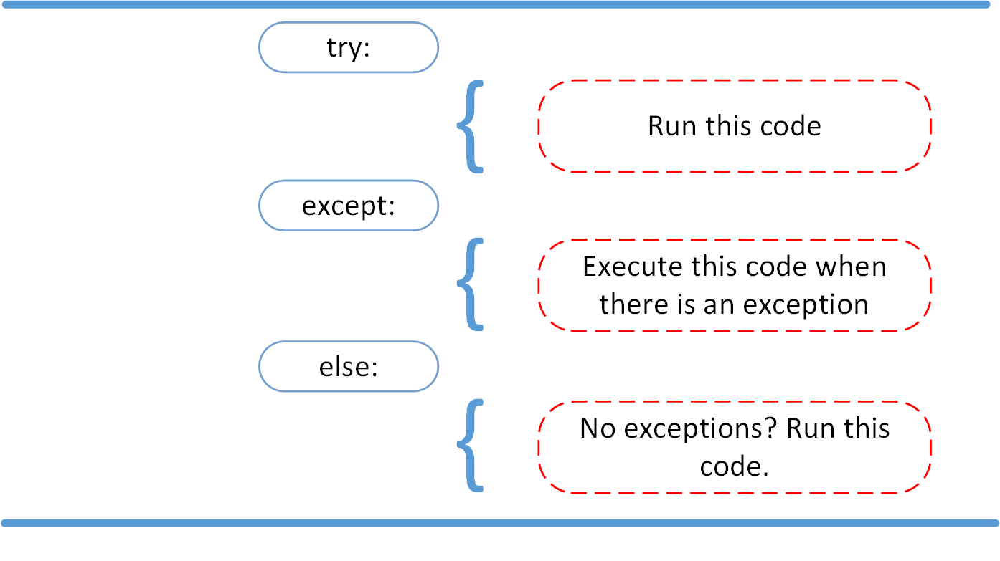

# Try-except-finally. Lambda

## Try- except

Declarațiile Try, Except, Finally ne permit să manevrăm erorile din programul nostru fără dificultăți.



###  **Structură:**

```python
try:
  #Codul care conține erori
except:
  #Codul care va rula în cazul în care codul precedent conține erori
else:
  #Codul care va rula în cazul în care nu există erori
finally:
  #Codul care întodeauna se execută indiferent dacă a apărut sau nu eroare
```

### **Exemplu** 

```python
# Exemplu cand avem erori

numbers = [3, 5, 7, 10, '3', 5, '5', '9']

new_numbers = []
for n in numbers:
    n = n + 10
    new_numbers.append(n)
```

#### Cum soluționăm

```python
numbers = [3, 5, 7, 10, '3', 5, '5', '9']

new_numbers = []
for n in numbers:
    print('---------')
    try:
        n = n + 10
        new_numbers.append(n)
        print("Poate ma execut da poate nu vreau")
        
    except TypeError:   
    # prindem eroarea TypeError, care o vedem aruncata in celula de mai sus
        print('ERRRRRROAOAAAAAARE')
        # n = str(n) + 10
        # new_numbers.append(n)
    else:
        print("Codul s-a executat fără erori")
    finally:
        print("Eu poate si nu vreau dar nimeni nu ma intreaba, ma execut intotdeauna")
```


## Lambda


* Lambda este o funcție anonimă, ce nu are nume.
* Funcția Lambda conține doar o expresie.
* Funcția Lambda poate conține multiple variabile.


### Structiră:

```python
#lambda <variabilele folosite în expresie> : <expresie>
```

### Utilizarea

```python
hello = lambda * x : print("Hello,", x[1]) #funcție
hello('Mia', 'Lia') # apelarea fucției
```

```python
(lambda x : x + 1)(1) #functia și apelarea funcției in o linie
```

```python
hello = lambda * x : print("Hello,", x[1])
hello('Mia', 'Lia') #Output Lia
```

 **De ce am utiliza funcția Lambda?**


Funcția Lambda este folositoare atunci când vrem să definim o funcție intr-o singura linie de cod.


```python
fruits = [('banane', 3), ('portocale', 2), ('mere', 5), ('pere', 7), ('gutui', 4)]

print(sorted(fruits))

# Sortarea dupa al doilea element
print(sorted(fruits, key = lambda x: x[1]))
```

Mai multe informații: Try-except\( [site](https://realpython.com/python-exceptions/), [documentation](https://docs.python.org/3/tutorial/errors.html)\) [Lambda](https://www.programiz.com/python-programming/anonymous-function)

