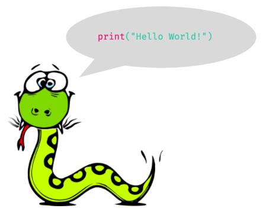

# Variabile

## Sintaxa Python

Ca orice limba Python are regulile sale de scriere.

Hai sa invatam cateva reguli mai jos.



Pentru a scrie și executa toate exercițiile propuse mai jos, veți folosi editorul de text Visual Studio Code.

Deschideți Visual Code Studio și mergeți la bara de meniuri de sus. Selectați `File -> New File`. După ce vi s-a deschis un fișier nou, apăsați `Ctrl + s` pe tastatură. Salvați fișierul sub orice denumire doriți, dar neapărat cu extensia `.py`. Eu o să-mi numesc fișierul `test.py`. Puteți face și voi la fel. Selectați mapa în care veți salva fișierul și apăsați `Save`.  Acum, sunteți gata să efectuați exercițiile propuse la această sesiune.

Pentru început, executați următoarea instrucțiune:

```python
print("Hello world") 
```

Instrucțiunea `print` este simplă și foarte des utilizată, practic în orice program. Ea nu face nimic altceva decât să afișeze la ecran informația pe care i-o transmiteți \(în cazul nostru, numele vostru\).

Pentru a face acest lucru, copiați textul de mai sus \(dar cu numele vostru între ghilimele\) și apăsați `Ctrl + F5` pe tastatură. În partea de jos a editorului de text trebuie să vă apară consola, unde vă veți vedea numele afișat.

```python
# Python știe matematica :)
5 + 5
```

```python
# Care e diferența dintre codul celulei de mai sus și codul acestei celule?
print(1 + 2) 
print(2 + 4)
```

```python
# Afișează în două rânduri separate rezultatele acestor expresii matematice: 
# 25 - 48
# 487 + 56  
print(25 - 48)
print(487 - 56)
```

## Variabile în Python

Mai devreme am învățat cum să calculăm în Python expresii simple matematice și să afișăm texte. Acum o să învățăm cum să salvăm valori în Python.

Putem păstra anumite **valori**, atribuindu-le unor **variabile**.  Sau cu alte cuvinte, o **variabilă** este ca un **nume** pentru o **valoare**.

```python
# Care sunt variabilele din codul de mai jos?
x = 5
varsta = 25
limbaj_de_programare = "python"

print(x, limbaj_de_programare)
```


**Variabile** : etichete atașate datelor \(inclusiv text sau chiar cod\).


Variabilele reprezintă un element important în programare. O **variabilă** reprezintă o valoare care se poate schimba de mai multe ori în timpul execuției unui program. Gândiți-vă la o variabilă ca la o cutie. Atunci când creați variabila, cutia este goală. Când îi atribuiți variabilei o valoare, e ca și cum ați pune în cutie un obiect, să zicem un pix. Peste o perioadă de timp, decideți să nu mai păstrați pixul în cutie, de aia puneți un creion în loc. Acest proces se numește _realocare de date_.

```python
# Avem numele 'Ilinca' atribuit variabilei name
name = 'Ilinca'
print(name)
```

```python
# Acum atribuim numele 'Marina' la fel variabilei name
name = 'Angela'
print(name, name)
# Ce s-a întâmplat cu numele 'Ilinca'? De ce?
```


Puteți observa că de data aceasta am folosit   '  '  \(single quotes\) în loc de   **"  "**  \(double quotes\) - în Pyhton acestea au același rol, deci nu contează pe care dintre ele le folosim.  


O variabilă poate avea un nume scurt \(precum `x` și `y`\) sau un nume mai descriptiv \(`age`, `name`, `total_volume`\).


 Reguli pentru variabilele Python:

* O variabilă trebuie să înceapă cu o literă sau un caracter de subliniere: „ \_ ”
* O variabilă nu poate să înceapă cu un număr
* O variabilă nu poate conține decât caractere alfa-numerice și scrise \(A-z, 0-9 și \_\)
* Denumirile de variabilă sunt sensibile la majuscule/case-sensitive \(name, Name și NAME sunt trei variabile diferite\)


```python
#definirea corectă a variabilelor:
my_var = "John" #snake_case - varianta recomandata
myvar = "John"
_my_var = "John"
myVar = "John"
MYVAR = "John" 
myvar2 = "John"
```

> **Nota bene**: Pentru ca să înțelegeți mai bine conceptul de variabilă, gândiți-vă la constante, adică la opusul variabilelor. O constantă este pur și simplu o valoare care este ... constantă, cu alte cuvinte - o valoare care nu se modifică, în acest sens, constantele sunt opusul variabilelor, deoarece valoarea unei variabile se poate modifica pe durata execuției unui program. Constantele au o valoare fixă pe tot parcursul rulării. O constantă arhi-cunoscută este _PI_ care are o valoare fixă \(de aproximativ 3.14 \) pe care nu o putem schimba deloc în timpul execuției.

## Comentarii

Ați observat că am utilizat semnul `#` înaintea unei linii de cod. În această linie de cod eu am dat niște explicații a ceea ce fac eu în program. Semnul `#` semnifică începutul unui comentariu. Un **comentariu** este o linie de cod pe care _Python_ o ignoră. Comentariile sunt utile doar pentru oameni pentru ca să înțeleagă ce fac unele bucăți mai mari și mai complicate de cod.


La ce bun s-au inventat comentariile? Comentariile fac programul vostru mai ușor de înțeles. Când vă uitați la codul pe care l-ați scris cu ceva timp în urmă sau alții doresc să colaboreze cu voi, ei pot citi comentariile și astfel percep foarte repede ce anume face programul vostru.


## Input

Python folosește funcția `input()` pentru a primi date de la utilizator, adică pentru a introduce una sau mai multe valori in program.

#### Exemplu:

```python
print('Cum te numești?')
name = input() # Aici atribuim variabilei name valoarea introdusă la tastatură
# cu ajutorul funcției input.
print('Salut ' + name) 
```

Ați observat că programul v-a cerut să introduceți de la tastatură un text, acest text este atribuit automat variabilei _name_ din programul nostru.

```python
name = input('Cum te numești? ')
print('Salut ' + name)
# Ce crezi că face acest cod?


# Exact! Același lucru, doar că mai simplificat.
```

> **“It's easy to make mistakes that only come out much later, after you've already implemented a lot of code. You'll realize „ Oh I should have used a different** [**type of data**](tipuri-de-date.md) **structure.” Start over from scratch.”**  
> _-- Guido van Rossum_

