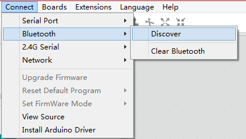

# 2.2 Senzori

## **Senzor de citire**

Cea mai ușoară modalitate de a afla ce valoare dă un senzor este de a avea un Sprite \(în mod implicit panda\)  spune care este. În  "Looks" există un bloc "say":


Desigur, dacă îi ceri pandei să spună "Hello!", Panda va spune "Hello!".  Poți înlocui acest text cu numele oricărui senzor pe care dorești să îl citești. Aceasta este pentru senzorul cu ultrasunete:


Senzorul de urmărire a liniei:


Senzorul  de lumină:


Pentru senzorii de tip plug-in, trebuie să te asiguri că portul selectat este același port ca și portul în care ai conectat senzorul.

Acum, poți face clic pe acest bloc și iți va spune valoarea senzorului. Pentru a face actualizarea continuă, poți pune acest bloc într-o ciclu/buclă infinită \(forever loop\) :


_Challenge:_

1. Găsește o modalitate de a afișa simultan valorile a mai multor senzori.  
2. Afla intervalul de valori posibile pentru toți senzorii.


## **Senzor de lumina**

Senzorul de lumină de pe placa mCore măsoară lumina - cu cât este mai luminos, cu atât este mai mare valoarea, cu cât este mai întunecat, cu atât este mai mică valoarea. Intervalul senzorului de lumină este 0-1023.

În această lecție, vei programa mBot-ul să redea o notă în cazul în care simte că există multă lumină și să redea o altă notă dacă simte că nu este prea multă lumină. Pentru aceasta, vei avea nevoie de blocul "IF". Când folosim un "IF" în programare, există 3 părți la ceea ce scriem:

"IF" în sine   
Conditia   
Codul care se execută, dacă condiția este îndeplinită.

Deci, trebuie să scrii ceva de genul:   
Pseudocode

```c
If (condition)
---- Do this code
```

Primul lucru pe care vreau să-l faci în această lecție este să faci ca mBot-ul sa ăinterpreteze un sunet dacă este întunecat. Deci, condiția este "it is dark", iar codul este "play sound":

```text
If (it is dark)
---- Play sound.
```

Amintește-ți că senzorul de lumină returnează o valoare între 0 și 1023, unde numerele mari reprezintă un mediu luminos. Aș spune că o citire a senzorului de lumină mai mică de 500 reprezintă un mediu întunecat. Așadar, poți scrie codul ca:

```text
If (the value on the light sensor IS LESS THAN 500)
---- Play sound.
```

Pentru a scri asta în mBlock, ai nevoie de:

1. Un "IF" 


2. O condiție. Condiția din acest exemplu este compusă din 2 părți. Ai nevoie de blocul verde "less than " din scriptul "Operators":


Și ai nevoie de senzorul de lumină "Block" de la "Robtots":


Condiția este "senzorul de lumină este mai mic de 500", pentru a putea pune blocul senzorului de lumină în partea stângă a blocului "less than" și scrie "500" în partea dreaptă. Când pui blocul albastru în interiorul blocului verde, asigură-te că partea stângă a blocului albastru este aliniată cu spațiul corespunzător al blocului verde. Când spațiul din blocul verde are un contur alb, este gata să primească blocul albastru:


Și când e lipit, arată așa: 


În cele din urmă, avem nevoie de un cod care va fi rulat dacă condiția este îndeplinită:


Într-un final, codul ar trebui să arate așa:


Când se execută acest cod, acesta va testa condiția o dată și apoi va înceta să ruleze. Dacă dorim să continuăm să redă, muzica în timp ce e întuneric, poți adăuga un ciclu infinit\(forever loop\). De asemenea, nu uita să incluzi un comentariu descriptiv:


Deci, dacă ai fi vrut să citească nota C4 în întuneric, dar nu D4 în lumină. Pentru aceasta, ai putea folosi un bloc de control "if / else":


_Challenge_:

1. Elaborează un program în care robotul rulează înainte în lumină și se oprește în întuneric.
2. Elaborează un program în care robotul dansează în întuneric \(creați-vă cu mișcările de dans\) și se oprește la lumină.
3. Elaborează un program în care robotul merge la viteze diferite, în funcție de lumină - cu cât este mai luminos, cu atât mai repede merge.
4. Elaborează un program care redă o mulțime de note diferite - cu cât este mai multă lumină sesizată, cu atât este mai înaltă nota.


## **Senzorul Ultrasonic**

Senzorul ultrasonic măsoară distanța. Unul dintre "ochi" transmite un sunet, iar celălalt așteaptă revenirea ecoului sunetului. Din momentul efectuării acestui proces, distanța obiectului de la senzor poate fi calculată. Senzorul cu ultrasunete are o gamă de 3-400 cm. Dacă un obiect este în afara acestui interval, senzorul va reveni la o valoare de 400.


În această lecție, vreau ca robotul să meargă înainte până când se apropie de un obiect, apoi să se îndepărteze de obiect și să meargă într-o nouă direcție:

```text
Forever:
---- If an object is detected
---- ---- Turn to a new direction
---- Else
---- ---- Go forward
```

Și în cod, care arată astfel:


Testând acest lucru, vei descoperi că robotul nu se răsucește suficient când a întâlnește un obiect, așa că trebuie adăugi o comandă de așteptare după rândul său. Acum mi-ar plăcea să te întorci într-o direcție aleatorie - uneori la dreaptă, alteori la stânga. Există un bloc Operator pe care îl poți folosi doar pentru a face acest lucru:


Robotul poate să se rotească numai la stânga sau la dreapta, deci vei alege un număr aleator între 0 și 1. Dacă numărul aleatoriu este 0, atunci robotul se va întoarce la stânga. Dacă numărul aleatoriu este 1, atunci robotul se va întoarce la dreapta. Atunci comportamentul de întoarcere va arăta astfel:


**Challenge**:

1. Puteți pune codul de mai sus împreună pentru a realiza programul finalizat? 
2. Puteți scrie un program care urmează unui obiect? Deci, dacă obiectul este prea apropiat, robotul merge înapoi, dacă obiectul este departe, el merge înainte și dacă obiectul nu este aproape sau departe, robotul se oprește. 
3. Puteți schimba programul de la întrebarea 2, pentru a face robotul să se miște la viteze diferite?


## Line Follower-ul


Line follower-ul are 2 senzori care detectează o suprafață albă \(în intervalul de 1-2 cm\). Funcționează prin emiterea luminii IR \(InfraRed\) și înregistrează cât reflectă înapoi. Dacă este reflectat înapoi mai mult, se poate deduce că este aproape de o suprafață albă. Dacă este reflectat înapoi mai puțin, se poate deduce că suprafața este neagră sau senzorul nu este aproape de o suprafață.

O suprafață luminoasă reflectă o multă lumină infraroșie înapoi la receptor:


O suprafață întunecată reflectă puțină lumină înapoi către receptor:


În mBlock există 2 blocuri asociate cu line follower-ul:


Primul bloc va returna un număr între 0 și 3 pe baza următoarelor valori:


Cel de-al doilea bloc va returna fie adevărat, fie fals.

Folosind blocul "Line Follower" pentru a programa: Dacă vrem ca robotul nostru să urmeze o linie neagră, avem următorul pseudocod:

```text
If( line follower = 0)
---- Go forward
Else if (line follower = 1)
---- Turn Left
Else if(line follower = 2)
---- Turn Right
Else if(line follower = 3)
---- Aaargh!! Help!! Where is the line?
```

Deci, să punem acum acest lucru în codul mBlock:


Și, nu funcționează - robotul deviază deseori de pe pistă. Acest lucru se datorează faptului că acest program este rulat de la mBlock IDE. Amintește-ți că este nevoie de timp ca semnalele și comenzile să fie trimise de la robot la computer și din nou înapoi. În acest caz, această întârziere interferează cu modul în care robotul execută linia următoare. Trebuie să încarci acest program pe placă pentru a reduce această întârziere. Apoi programul va funcționa. Pentru mBot, folosește blocul "mBot program", du-te în modul Arduino și "Upload to Arduino":



Acum, robotul urmărește cu succes linia.

Folosind blocul "Line Follower \(port\) \(side\) Este \(Black / White\)" pentru a programa: 

Utilizând acest bloc:

```text
If((Right is black) AND (Left is black))
---- Go forward
Else if((Right is white) AND (Left is black))
---- Turn Left
Else ((Right is black) AND (Left is white))
---- Turn Right
Else ((Right is white) AND (Left is white))
---- Aaargh!! I’m lost AGAIN?!?
```

Deci, pentru aceasta avem nevoie de un bloc "and" pentru a combina cele două afirmații condiționale:


Așa că codul final arată așa:


_Challenge:_

1. Robotul se mișcă nu se rotește ușor. De ce este asta? Il poti repara?
2.  Poți scrie un program astfel încât robotul să se deplaseze în jurul unei mese \(albe\) într-o manieră aleatorie fără a cădea? \(Amintiți-vă că senzorul de urmărire a liniei detectează dacă lumina este reflectată sau nu\) 
3. Scrie un program care urmează o linie și evită obiectele - dacă detectează un obstacol, robotul trebuie să oprească motoarele și să aștepte eliminarea obiectului.

###  {#title1}

###  {#title1}

###  {#title1}

###  {#title1}

## Theremin-ul Ultrasonic

Theramin-ul este un instrument muzical care interpretează notele în funcție de unde sunt mâinile muzicianului.

```text
If an object is less than 10cm away
---- Play a high note
Else If an object is less than 20cm away
---- Play a lower note
Else If an object is less than 30cm away
---- Play a lower note
Else If...
```

Începutul programului ar trebui să arate așa:


_Challenge:_

1.Termină programul. Fă-l atât de lung sau cât de scurt vrei și apoi să te joci cu el.  
2.Notele mai înalte sunt redate mai rapid decât notele joase. De ce? Poți schimba programul astfel încât toate notele să fie redate la aceeași viteză?


**Sumo mBot**

Pregătește-l pe mBot  de lupta în vechea arta japoneză de lupte sumo. Programează robotul pentru a căuta adversarul \(cu ajutorul senzorului cu ultrasunete\) și, atunci când este găsit, atacă!

NOTĂ: Această lecție este destinată utilizării cu 2 mBots care se luptă pe o masă. Rețineți că mBot-ul poate cădea de pe masă. Trebuie luate măsuri adecvate pentru a se asigura că nu se produc daune în timpul desfășurării acestei activități.

Amintește-ți valorile care sunt returnate de către senzorul de urmărire a liniei:


Deci există 2 senzori diferiți care afectează comportamentul mBot-ului. Acest lucru poate fi afișat în următorul tabel:


Acum ai acțiunile clar definite, poțiscrie un pseudocode pentru programul tău:

```text
Forever {
---- While (the robot has not detected an edge) {
---- ---- If (an enemy is detected)
---- ---- ---- Charge
---- ---- Else
---- ---- ---- Move forward
---- }
---- Turn
}
```

Transferarea acestuia în cod arată astfel:


Challenge:

1. Utilizează LED-urile și buzzer-ul pentru a semnala diferite acțiuni.
2. Fă o competiție. Poți modifica codul pentru a face mBot să facă mai bine în competiție?

