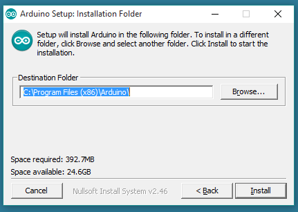
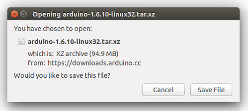
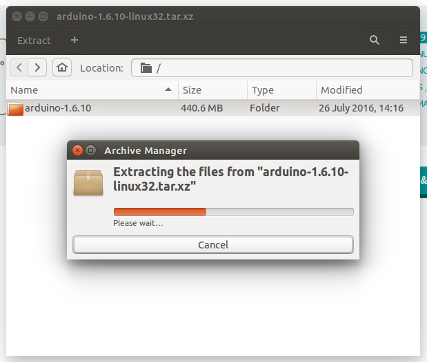
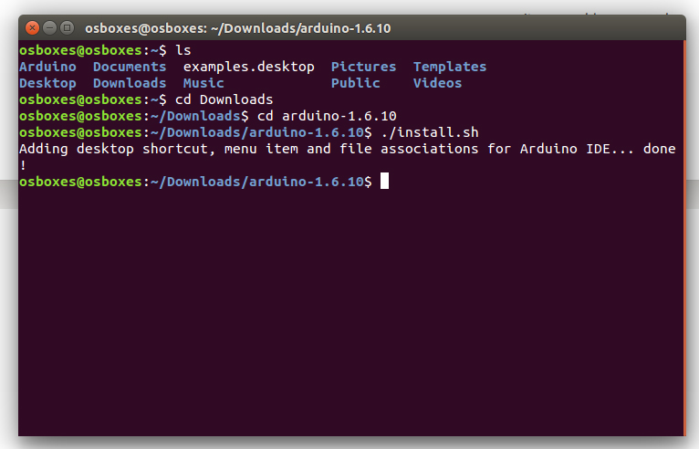
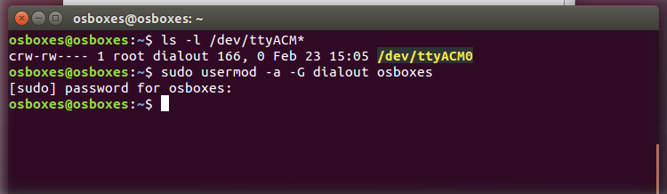

# 3.0.1 Instalare Arduino IDE

## Windows

Ghid oficial \(în engleză\): [https://www.arduino.cc/en/Guide/Windows](https://www.arduino.cc/en/Guide/Windows)

Poți lua ultima versiune de la pagina [https://www.arduino.cc/en/Main/Software](https://www.arduino.cc/en/Main/Software) . Poți alege dintre Installer \(.exe\) sau pachetul Zip. Îți recomandăm să alegi Installer, aceasta instalează direct tot de ce ai nevoie pentru ca să utilizezi Software-ul Arduino \(IDE\), inclusiv driverele. Cu pachetul Zip trebuie să îți instalezi driverele manual, de asemenea, este util în cazul în care dorești să creezi o instalare portabilă. \(pentru a vedea cum se crează instalarea portabilă, accesați  link-ul: [https://www.arduino.cc/en/Guide/PortableIDE](https://www.arduino.cc/en/Guide/PortableIDE)\).

Când descărcarea se îndeplinește, urmează instalarea unde trebuie să permiți procesul de instalare a driver-ului atunci când primești o notificare de la sistemul de operare

  


Procesul extrage și instalează toate documentele necesare pentru executarea corectă a Software-ului Arduino \(IDE\).

_Gata, poți lucra! :\)_

## Linux \(Ubuntu și alte distibuții Debian\)

Ghid oficial \(în engleză\): [https://www.arduino.cc/en/Guide/Linux](https://www.arduino.cc/en/Guide/Linux)

## MacOSX

Ghid oficial \(în engleză\): [https://www.arduino.cc/en/Guide/MacOSX](https://www.arduino.cc/en/Guide/MacOSX)

