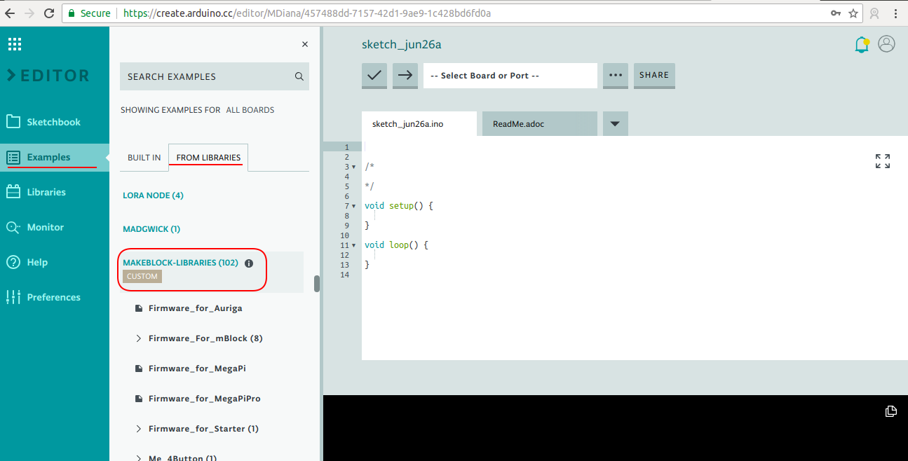
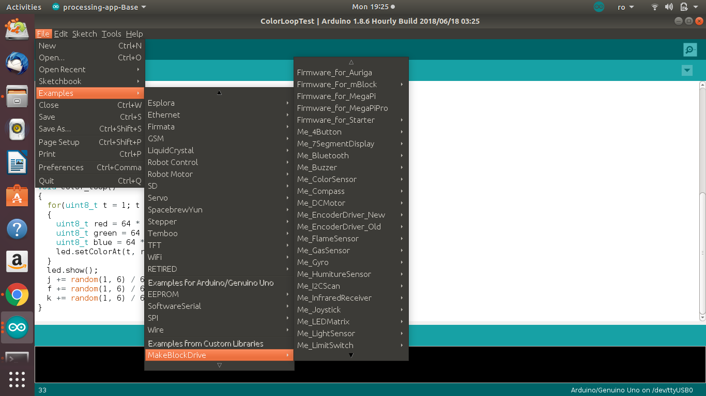
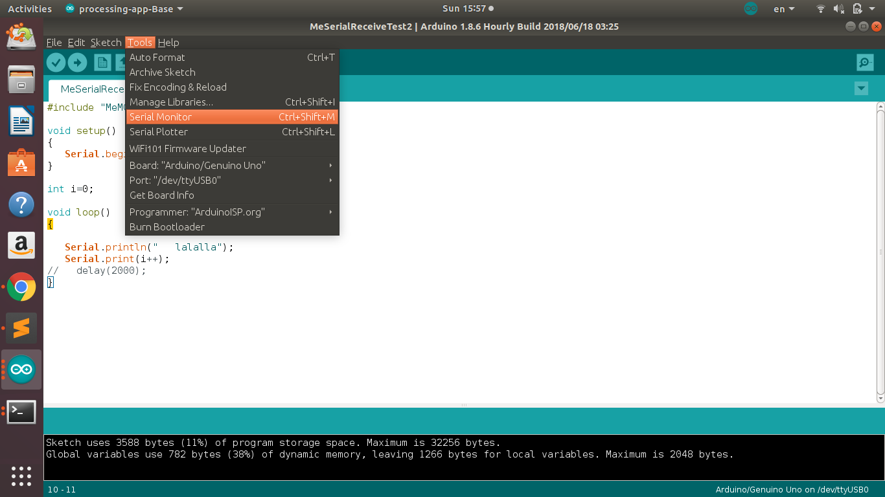
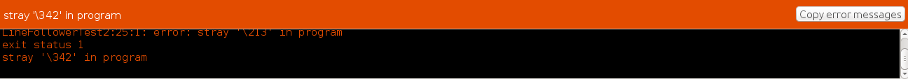

# 3.3 Exemple Arduino - mBot

## Setări și configurări

Board\(plăcuță\): **Arduino/Genuino Uno**  
Bibliotecă: **"MeMCore.h"**

## Exemple predefinite

Biblioteca pentru roboței deja conține câteva exemple de programe, de unde putem să ne inspirăm. Exemplele le găsești în meniul **File-&gt;Examples-&gt;MakeBlockDrive**





## Biblioteca \(librăria\) MeMCore.h

Funcțiile specifice pentru controlul mBotului se găsesc în biblioteca **MeMCore.h.**

```text
#include "MeMCore.h"
```


Această linie de cod trebuie să se găsească **obligatoriu** la inceputul fiecărui program Arduino scris pentru **mBot**



Dacă vrei să lucrezi cu alți roboți decât mBot, va trebui să găsești biblioteca specială pe care să o incluzi pentru roboțeii respectivi. MeMCore.h nu va merge


## Delay

**delay\(\)** este o funcție care face o pauză. Robotul așteaptă câteva milisecunde înainte de a trece la următoarea instrucțiune din program. 

```text
delay(nr_de_milisecunde)
```


Atenție! Dacă robotul execută o acțiune înainte de delay \(de exemplu, merge înainte\), delay-ul nu va opri robotul, doar programul va aștepta înainte să execute următoarea linie de cod


## Serial monitor

Uneori, avem nevoie ca robotul să transmită anumite mesaje, statusuri către calculator. De exemplu, vrem să știm valorile trmise de către senzorul de distanță. Pentru transmiterea acestor **mesaje de la robot la calculator**, utilizăm **comunicarea serială**\(print USB\) și **serial monitor**.

#### Setări inițiale

Pentru a lucra cu serial monitor, va trebui să inițializăm mai întâi comunicarea. Acest lucru su face cu ajutorul obiectului **Serial** și funcției **begin**\(\). Funcția begin\(\) primește ca parametru o valoare \(noi o sa lucram cu 9600\), numită **rată de transfer \(baud rate\)**.

```text
Serial.begin(9600);
```

Această linie de cod va fi plasată în interiorul funcției setup\(\):

```text
void setup() 
{
   Serial.begin(9600);
}
```

#### Trimiterea mesajelor

Transmiterea propriu-zisă a mesajelor se realizează prin utilizarea funcției **Serial.print\("mesaj"\)** sau **Serial.println\("mesaj"\)**.

```text
Serial.print("Hello GirlsGoIT!")
```

```text
Serial.println("Hello GirlsGoIT!")
```

```text
// Următoarele 2 randuri printează "GirlsGoIT" pe o singură linie
Serial.print("Girls")
Serial.print("GoIT")

// Următoarele 2 randuri printează "Girls GoIT" pe 2 linii separate
Serial.println("Girls")
Serial.println("GoIT")
```


**println** este o prescurtare de la "print new line", astfel  această funcție printează un mesaj începând cu o linie nouă


#### Un exemplu de program complet

```text
#include "MeMCore.h"

void setup() 
{
   Serial.begin(9600);
}

void loop()
{
   Serial.println("lalalla");
}
```

#### Accesarea mesajelor

Pentru a vedea mesajele trimise de către roboțel către calculator, accesează meniul **Tools &gt; Serial monitor.**



## Motoare

Declarăm obiectele:

```text
MeDCMotor motor1(M1);
MeDCMotor motor2(M2);
```


În dependență de cum ai conectat motoarele, M1 va fi motorul din stânga sau dreapta și M2 invers


#### Funcțiii

```text
motor1.run(viteza);       // Mergi
```

```text
motor1.stop();        //Oprește
```

#### Exemplu de program complet

```text
#include "MeMCore.h"

MeDCMotor motor1(M1);
MeDCMotor motor2(M2);

uint8_t motorSpeed = 100;
int ADJUST_MOTOR_LEFT = -1;
int ADJUST_MOTOR_RIGHT = 1;

void setup()
{
   motor1.run(ADJUST_MOTOR_LEFT * motorSpeed); /* value: between -255 and 255. */
   motor2.run(ADJUST_MOTOR_RIGHT * motorSpeed); /* value: between -255 and 255. */
  
  delay(2000);
  
  motor1.stop();
  motor2.stop();
}

void loop()
{
}
```

## Sunet \(buzzzer\)

#### Exemplul oficial de la Makeblock:

```text
/**
 * \par Copyright (C), 2012-2016, MakeBlock
 * @file    MbotBuzzerTest2.ino
 * @author  MakeBlock
 * @version V1.0.0
 * @date    2015/11/19
 * @brief   Description: this file is sample code for buzzer
 *
 * Function List:
 * 1. void buzzerOn()
 * 2. void buzzerOff()
 *
 * \par History:
 * <pre>
 * `<Author>`         `<Time>`        `<Version>`        `<Descr>`
 * forfish             2015/11/19    1.0.0          add some descriptions
 * </pre>
 */

#include  "MeMCore.h"

/*************************************************
 * Public Constants
 *************************************************/

#define NOTE_B0  31
#define NOTE_C1  33
#define NOTE_CS1 35
#define NOTE_D1  37
#define NOTE_DS1 39
#define NOTE_E1  41
#define NOTE_F1  44
#define NOTE_FS1 46
#define NOTE_G1  49
#define NOTE_GS1 52
#define NOTE_A1  55
#define NOTE_AS1 58
#define NOTE_B1  62
#define NOTE_C2  65
#define NOTE_CS2 69
#define NOTE_D2  73
#define NOTE_DS2 78
#define NOTE_E2  82
#define NOTE_F2  87
#define NOTE_FS2 93
#define NOTE_G2  98
#define NOTE_GS2 104
#define NOTE_A2  110
#define NOTE_AS2 117
#define NOTE_B2  123
#define NOTE_C3  131
#define NOTE_CS3 139
#define NOTE_D3  147
#define NOTE_DS3 156
#define NOTE_E3  165
#define NOTE_F3  175
#define NOTE_FS3 185
#define NOTE_G3  196
#define NOTE_GS3 208
#define NOTE_A3  220
#define NOTE_AS3 233
#define NOTE_B3  247
#define NOTE_C4  262
#define NOTE_CS4 277
#define NOTE_D4  294
#define NOTE_DS4 311
#define NOTE_E4  330
#define NOTE_F4  349
#define NOTE_FS4 370
#define NOTE_G4  392
#define NOTE_GS4 415
#define NOTE_A4  440
#define NOTE_AS4 466
#define NOTE_B4  494
#define NOTE_C5  523
#define NOTE_CS5 554
#define NOTE_D5  587
#define NOTE_DS5 622
#define NOTE_E5  659
#define NOTE_F5  698
#define NOTE_FS5 740
#define NOTE_G5  784
#define NOTE_GS5 831
#define NOTE_A5  880
#define NOTE_AS5 932
#define NOTE_B5  988
#define NOTE_C6  1047
#define NOTE_CS6 1109
#define NOTE_D6  1175
#define NOTE_DS6 1245
#define NOTE_E6  1319
#define NOTE_F6  1397
#define NOTE_FS6 1480
#define NOTE_G6  1568
#define NOTE_GS6 1661
#define NOTE_A6  1760
#define NOTE_AS6 1865
#define NOTE_B6  1976
#define NOTE_C7  2093
#define NOTE_CS7 2217
#define NOTE_D7  2349
#define NOTE_DS7 2489
#define NOTE_E7  2637
#define NOTE_F7  2794
#define NOTE_FS7 2960
#define NOTE_G7  3136
#define NOTE_GS7 3322
#define NOTE_A7  3520
#define NOTE_AS7 3729
#define NOTE_B7  3951
#define NOTE_C8  4186
#define NOTE_CS8 4435
#define NOTE_D8  4699
#define NOTE_DS8 4978

MeBuzzer buzzer;

void setup() {

}

void loop() {
  play();//Play the music.
  delay(300);//Pause for a while.
}

// notes in the melody:
int melody[] = {
NOTE_G4,//5  
NOTE_G4,//5
NOTE_A4,//6
NOTE_G4,//5
NOTE_C5,//1.
NOTE_B4,//7
0,
NOTE_G4,//5
NOTE_G4,//5
NOTE_A4,//6
NOTE_G4,//5
NOTE_D5,//2.
NOTE_C5,//1.
0,
NOTE_G4,//5
NOTE_G4,//5
NOTE_G5,//5.
NOTE_E5,//3.
NOTE_C5,//1.
NOTE_B4,//7
NOTE_A4,//6
0,
NOTE_F5,//4.
NOTE_F5,//4.
NOTE_E5,//3.
NOTE_C5,//1.
NOTE_D5,//2.
NOTE_C5,//1.
0,
};

int noteDurations[] = {
  8,8,4,4,4,4,
  4,
  8,8,4,4,4,4,
  4,
  8,8,4,4,4,4,2,
  8,
  8,8,4,4,4,2,
  4,
};

void play()
{
    for (int thisNote = 0; thisNote < 29; thisNote++) {

    // to calculate the note duration, take one second 
    // divided by the note type.
    //e.g. quarter note = 1000 / 4, eighth note = 1000/8, etc.
    int noteDuration = 1000/noteDurations[thisNote];
    buzzer.tone(melody[thisNote],noteDuration);

    // to distinguish the notes, set a minimum time between them.
    // the note's duration + 30% seems to work well:
    int pauseBetweenNotes = noteDuration * 1.30;
    delay(pauseBetweenNotes);
    // stop the tone playing:
    buzzer.noTone();
  }
}
```

## Sonar \(sensor de distanță\)

#### Cum declarăm obiectul senzorului în program

```text
MeUltrasonicSensor ultraSensor(PORT_3); /* Ultrasonic module can ONLY be connected to port 3, 4, 6, 7, 8 of base shield. */
```

Pentru a afla valoarea în cm a distanței până la un obiect, folosim funcțoa **distanceCm**\(\)

```text
int distanta = ultraSensor.distanceCm()
```

#### Exemplu de program complet \(bazat  pe exemplul oficial\)

```text
#include "MeMCore.h"

MeUltrasonicSensor ultraSensor(PORT_3); /* Ultrasonic module can ONLY be connected to port 3, 4, 6, 7, 8 of base shield. */

void setup()
{
  Serial.begin(9600);
}

void loop()
{
  Serial.print("Distanta : ");
  Serial.print(ultraSensor.distanceCm() );
  Serial.println(" cm");
  delay(100); /* the minimal measure interval is 100 milliseconds */
}
```

## Line follow sensor

#### Exemplul oficial de la Makeblock:

```text
/**
 * \par Copyright (C), 2012-2016, MakeBlock
 * @file    LineFollowerTest.ino
 * @author  MakeBlock
 * @version V1.0.0
 * @date    2015/09/09
 * @brief   Description: this file is sample code for Me line follower module.
 *
 * Function List:
 * 1. uint8_t MeLineFollower::readSensors(void)
 *
 * \par History:
 * <pre>
 * `<Author>`         `<Time>`        `<Version>`        `<Descr>`
 * Mark Yan         2015/09/09    1.0.0            Rebuild the old lib.
 * </pre>
 */
#include "MeMCore.h"

MeLineFollower lineFinder(PORT_2); /* Line Finder module can only be connected to PORT_3, PORT_4, PORT_5, PORT_6 of base shield. */

void setup()
{
  Serial.begin(9600);
}

void loop()
{
  int sensorState = lineFinder.readSensors();
  switch(sensorState)
  {
    case S1_IN_S2_IN: Serial.println("Sensor 1 and 2 are inside of black line"); break;
    case S1_IN_S2_OUT: Serial.println("Sensor 2 is outside of black line"); break;
    case S1_OUT_S2_IN: Serial.println("Sensor 1 is outside of black line"); break;
    case S1_OUT_S2_OUT: Serial.println("Sensor 1 and 2 are outside of black line"); break;
    default: break;
  }
  delay(200);
}

```

## Întrebări frecvente

### Error: stray '\342' in program


Dacă îți apare eroarea din imaginea de mai jos, este din cauza că ai făcut copy-paste de pe wiki și au apărut niște simboluri invizibile. Încearcă să ștergi spațiile de pe liniile care par libere și problema va dispărea.




