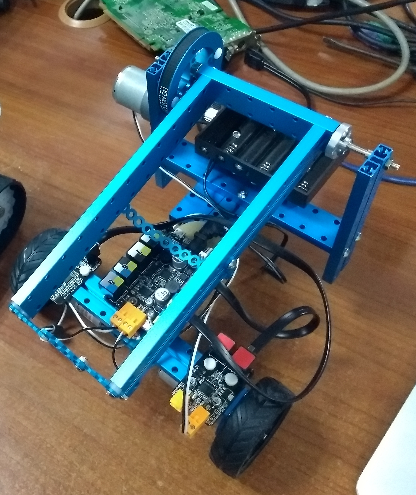

# Custom robot



### Setări și configurări

Board \(plăcuță\): **Arduino/Genuino Uno**  
Bibliotecă: **MeMCore.h**

```text
#include "MeMCore.h"
```

### Motoare

#### Configurare \(la început, înainte de stup\)

```text
MeDCMotor motor1(M1);
MeDCMotor motor2(M2);
```

#### Utilizare \(în interiorul funcției setup\(\) {...} sau loop\(\) {.....}

Pentru a porni motoarele:

```text
motor1.run(motorSpeed); /* valori: intre -255 si 255. */
motor2.run(-motorSpeed); /* valori: intre -255 si 255. */
```


Atenție, ca roboțelul să meargă în aceeași direcție \(înainte sau înapoi\), e nevoie ca motoarele să se rotească în direcții opuse. De aceea la motor2 punem -\(minus\) motorSpeed.


Pentru a opri motoarele:

```text
motor1.stop();
motor2.stop();
```

### Motoare pentru sticlă/vas

#### Configurare

```text
MeDCMotor brat(PORT_1);
```

Mișcă în sus:

```text
brat.run(-motorSpeed);   /* valori: intre -255 si 255. */
delay(4000);
brat.stop();
```

Mișcă în jos:

```text
brat.run(motorSpeed);   /* valori: intre -255 si 255. */
delay(1000);
brat.stop();
```

## Exemplu de program complet

Inițial brațul trebuie să fie în jos. Robotul o să ridice brațul în sus, apoi merge 5 secunde inainte, apoi mișcă brațul în jos.

```text
#include "MeOrion.h"

// brat robotic - pe port 1
MeDCMotor brat(PORT_1);
// motoare
MeDCMotor motor1(M1);
MeDCMotor motor2(M2);

uint8_t motorSpeed = 100;

void sus() {
  brat.run(-motorSpeed); /* valori: intre -255 si 255. */
  delay(4000);
  brat.stop();
}

void jos(){
  brat.run(motorSpeed); /* valori: intre -255 si 255. */
  delay(1000);
  brat.stop();
}

void moveFwd() {
    motor1.run(-motorSpeed); /* valori: intre -255 si 255. */
    motor2.run(motorSpeed); /* valori: intre -255 si 255. */
}

void moveBackward() {
    motor1.run(motorSpeed); /* valori: intre -255 si 255. */
    motor2.run(-motorSpeed); /* valori: intre -255 si 255. */
}
void stopMovement() {
  motor1.stop();
  motor2.stop();
}

// Initializare - actiunile se executa o singura data
void setup()
{
  moveFwd();
  delay(3000);
  stopMovement();
  delay(1000);
  jos();
  delay(2000);
  sus();
}

// Loop - instructiunile se repeta la infinit
void loop()
{
  
}


```

