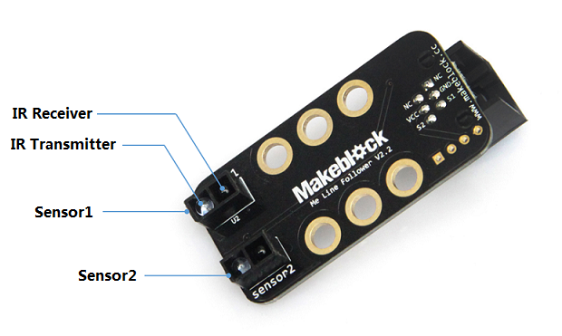
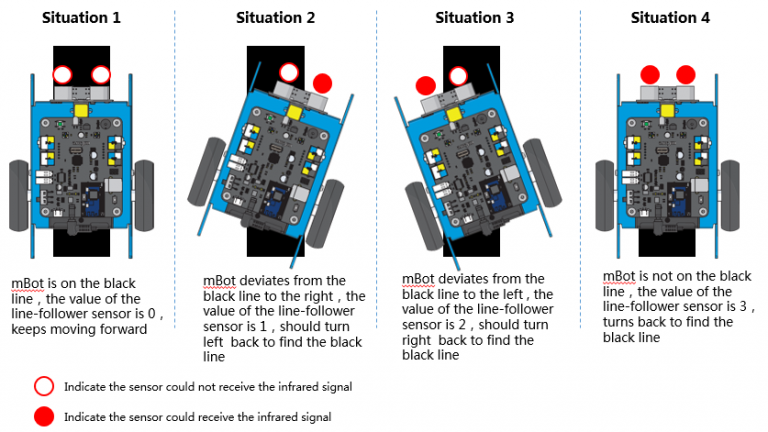
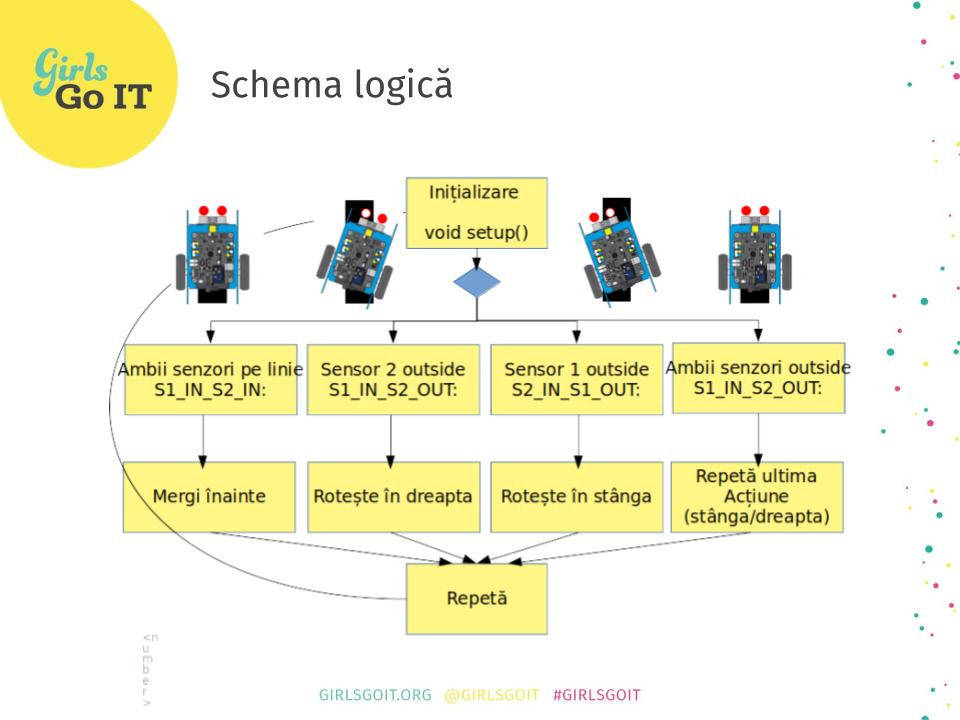

# 3.4 Line follow - Arduino

### Sensorul de line follow



### 4 cazuri posibile



### Schema logică a programului



## O versiune a codului final \(linia albă\)

```text
#include "MeMCore.h"

MeLineFollower lineFinder(PORT_2); /* Line Finder module can only be connected to PORT_3, PORT_4, PORT_5, PORT_6 of base shield. */

MeDCMotor motor1(M1);
MeDCMotor motor2(M2);

float MOTOR1_TUNE = -1.0;
float MOTOR2_TUNE = 1.0;

uint8_t motorSpeed = 100;

bool prev_move_left = false;
bool prev_move_fwd = true;

void setup()
{
  // Optional: robotul porneste de la un buton
  pinMode(7, INPUT); //Define button pin as input
  while (analogRead(7) > 100) {
    delay(50); //Wait till button pressed to start.
  }
 
  // setez comunicarea prin portul serial
  Serial.begin(9600);
}

void activateLeftMotor() {
   motor1.run(MOTOR1_TUNE*motorSpeed); /* value: between -255 and 255. */
}

void activateRightMotor() {
   motor2.run(MOTOR2_TUNE*motorSpeed); /* value: between -255 and 255. */
}

void stopLeftMotor() {
   motor1.stop();
}

void stopRightMotor() {
   motor2.stop();
}

void turnLeft() {
  activateLeftMotor();
  stopRightMotor();
}

void turnRight() {
  activateRightMotor();
  stopLeftMotor();
}


void bothMotorsRun() {
  activateRightMotor();
  activateLeftMotor();
 }

void loop()
{
  int sensorState1 = lineFinder.readSensors();

  int sensorState = 1;
  
  if(sensorState1==S1_IN_S2_IN) {
    sensorState = S1_OUT_S2_OUT;
  }
  else if(sensorState1==S1_IN_S2_OUT) {
    sensorState = S1_OUT_S2_IN;
  }
  else if(sensorState1==S1_OUT_S2_IN) {
    sensorState = S1_IN_S2_OUT;
  }
  else if(sensorState1==S1_OUT_S2_OUT) {
    sensorState = S1_IN_S2_IN;
  }
  
  switch(sensorState)
  {
    case S1_IN_S2_IN: 
      Serial.println("Sensor 1 and 2 are inside of black line"); 
      bothMotorsRun();
      prev_move_left = false;
      prev_move_fwd = true;
      break;
    
    case S1_IN_S2_OUT: 
      Serial.println("Sensor 2 is outside of black line");
      turnRight();
      prev_move_left = false;
      prev_move_fwd = false;
      break;
      
    case S1_OUT_S2_IN: 
      Serial.println("Sensor 2 is outside of black line"); 
      prev_move_left = true;
      prev_move_fwd = false;
      turnLeft();
      break;
    
    case S1_OUT_S2_OUT: 
      if(prev_move_fwd) {
        bothMotorsRun();
      }
      else if(prev_move_left) {
        turnLeft();
      } else {
        turnRight();
      } 
      
      Serial.println("Sensor 1 and 2 are outside of black line"); 
      break;
    
    default: break;
  }
}
```

## O versiune a codului final \(linia neagră\):


 Codul tău final poate arăta altfel. Nu e nevoie să copiezi acest cod. Aici ai doar un exemplu din care să te inspiri


```
#include "MeMCore.h"

MeLineFollower lineFinder(PORT_2); /* Line Finder module can only be connected to PORT_3, PORT_4, PORT_5, PORT_6 of base shield. */

MeDCMotor motor1(M1);
MeDCMotor motor2(M2);

float MOTOR1_TUNE = -1.0;
float MOTOR2_TUNE = 1.0;

uint8_t motorSpeed = 100;

bool prev_move_left = false;
bool prev_move_fwd = true;

void setup()
{
  // Optional: robotul porneste de la un buton
  pinMode(7, INPUT); //Define button pin as input
  while (analogRead(7) > 100) {
    delay(50); //Wait till button pressed to start.
  }
  
  // setez comunicarea prin portul serial
  Serial.begin(9600);
}

void activateLeftMotor() {
   motor1.run(MOTOR1_TUNE*motorSpeed); /* value: between -255 and 255. */
}

void activateRightMotor() {
   motor2.run(MOTOR2_TUNE*motorSpeed); /* value: between -255 and 255. */
}

void stopLeftMotor() {
   motor1.stop();
}

void stopRightMotor() {
   motor2.stop();
}

void turnLeft() {
  activateLeftMotor();
  stopRightMotor();
}

void turnRight() {
  activateRightMotor();
  stopLeftMotor();
}


void bothMotorsRun() {
  activateRightMotor();
  activateLeftMotor();
 }

void loop()
{
  int sensorState = lineFinder.readSensors();
  
  switch(sensorState)
  {
    case S1_IN_S2_IN: 
      Serial.println("Sensor 1 and 2 are inside of black line"); 
      bothMotorsRun();
      prev_move_left = false;
      prev_move_fwd = true;
      break;
    
    case S1_IN_S2_OUT: 
      Serial.println("Sensor 2 is outside of black line");
      turnRight();
      prev_move_left = false;
      prev_move_fwd = false;
      break;
      
    case S1_OUT_S2_IN: 
      Serial.println("Sensor 2 is outside of black line"); 
      prev_move_left = true;
      prev_move_fwd = false;
      turnLeft();
      break;
    
    case S1_OUT_S2_OUT: 
      if(prev_move_fwd) {
        bothMotorsRun();
      }
      else if(prev_move_left) {
        turnLeft();
      } else {
        turnRight();
      } 
      
      Serial.println("Sensor 1 and 2 are outside of black line"); 
      break;
    
    default: break;
  }
  
}
```


