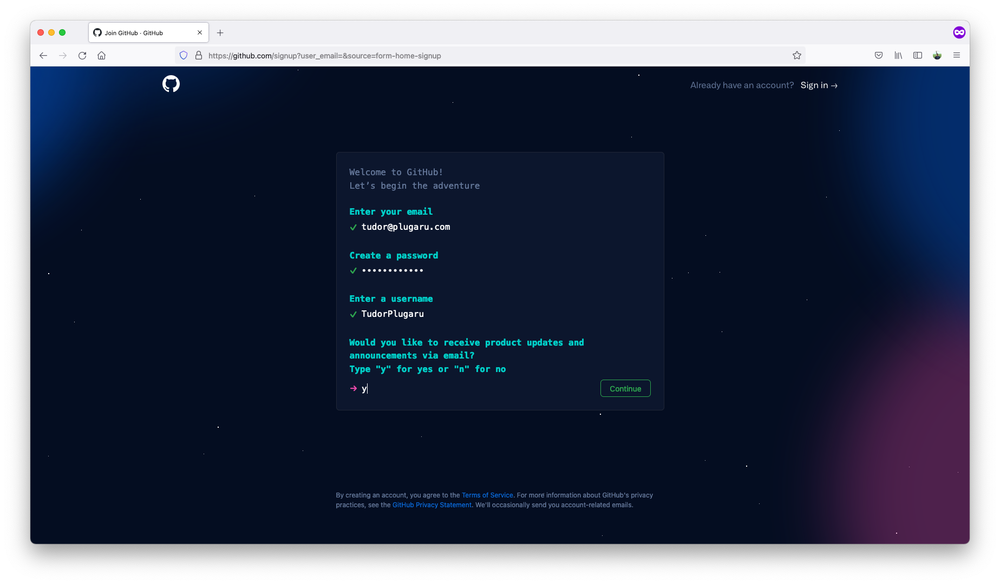

# GitHub

## Ce este GitHub și pentru ce se utilizează?

Ți s-a întâmplat vreodată să vrei să te întorci la o versiune anterioară a codului? Poate ai vrut să repari ceva și de fapt ai stricat mai tare proiectul, sau poate ai lucrat cu cineva în echipă și a șters codul tău?

Imaginează-ți că există un așa sistem, care îți permite să salvezi diferite versiuni ale codului și să revii la versiuni anterioare, simplificând în același timp și procesul de programare în echipă. Fiecare persoană lucrează separat pe calculatorul personal, iar codul se salvează online, și vă permite să vedeți modificările făcute de fiecare, să reveniți la versiunile anterioare și să aveți asigurarea că proiectul vostru va fi salvat online, chiar dacă se defectează calculatoarele personale. Ar fi super, așa-i?

Ei bine, așa sisteme există, iar unul dintre ele este GitHub.

## Cum facem un cont pe GitHub?

Foarte simplu, intrăm pe [https://github.com/](https://github.com/) și apăsăm butonul verde "**Sign up for GitHub".**

Completam toate câmpurile necesare pentru a ne înregistra.

În final, verificăm adresa de email pentru a confirma crearea contului GitHub.

Felicitări 🎉, acum faci parte din cea mai mare rețea de socializare pentru programatori 🤓

## Terminologie 

Înainte de a începe aș vrea să definim câteva concepte ce vor apărea destul de frecvent în această serie:

* **Repository**: este un spațiu de stocare pentru proiectul vostru care conține atât codul în sine cât și istoricul modificărilor și ramificațiile acestuia \(branch-uri\).
* **Branch**: versiunile de cod pot fi împărțite pe ramuri. Fiecare ramură va avea o copie a codului din momentul creării acesteia, iar toate modificările vor fi făcute asupra acestei copii până considerăm că este pregătită să fie inclusă din nou în ramura principală. Orice repository va avea cel puțin un branch \(o ramură\) numit prin convenție `main`.
* **Commit**: odată ce considerăm că modificările noastre sunt finale, putem crea un commit care să le conțină. Un commit va conține codul modificat și va putea fi accesat printr-un identificator unic \(_hash_\). Un repository va avea o înlănțuire de astfel de commituri care împreună vor forma un _istoric al modificărilor_.
* **Push**: în Git, un commit odată creat este păstrat local. Pentru ca restul echipei să vadă modificările aduse de commitul nostru, trebuie să _împingem_ \(push\) acele modificări către sistemul central.
* **Pull**: dacă un membru al echipei a efectuat o modificare asupra codului printr-un commit împins în sistemul central, noi nu vom avea acea modificare în copia noastră locală. Astfel, înainte de a ne împinge propriile modificări către serverul central, trebuie ca mai întâi să _tragem_ \(_pull_\) toate commit-urile apărute cât timp lucram la funcționalitatea noastră. În acest mod ne asigurăm că atunci când împingem propriul commit, vom include în acesta atât modificările noastre cât și ale echipei.

