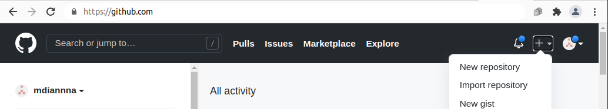
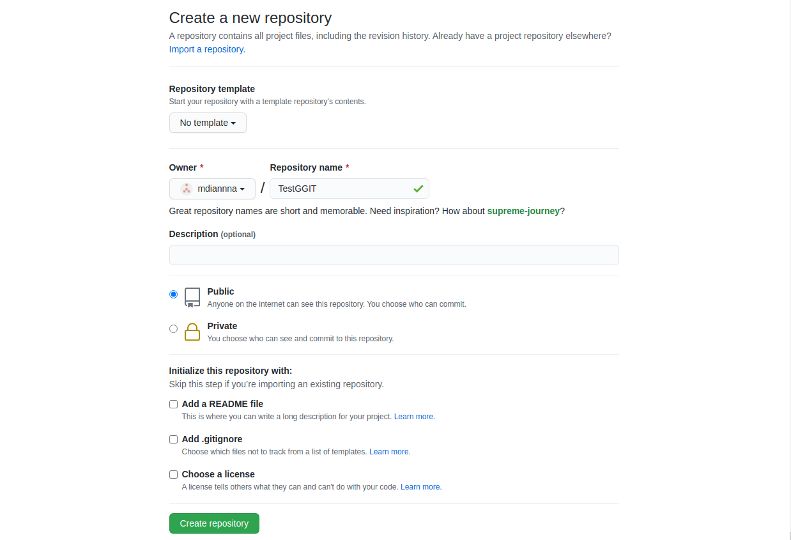
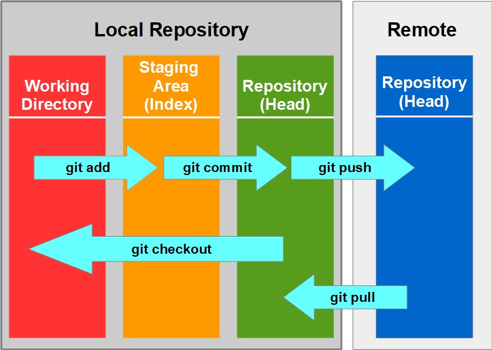

# Github

## Ce este Github şi pentru ce se utilizează

Ţi s-a întâmplat vreodată să vrei să te întorci la o versiune anterioară a codului? Poate ai vrut să repari ceva şi de fapt ai stricat mai tare proiectul, sau poate ai lucrat cu cineva în echipă şi a şters codul tău?

Imaginează-ţi că există un aşa sistem, care îţi permite să salvezi diferite versiuni ale codului şi să revii la versiuni anterioare, simplificând în acelaşi timp şi procesul de programare în echipă. Fiecare persoană lucrează separat pe calculatorul personal, iar codul se salvează online, şi vă permite să vedeţi modificările făcute de fiecare, să reveniţi la versiunile anterioare şi să aveţi asigurarea că proiectul vostru va fi salvat online, chiar dacă se strică calculatoarele personale. Ar fi super, aşa-i?

Ei bine, aşa sisteme există, iar unul dintre ele este _**Github**_.

### Cum facem un cont pe Github

Foarte simplu, intrăm pe [https://github.com/](https://github.com/) şi apăsăm butonul verde _**Sign up for Github**_, după care completăm toate câmpurile necesare.


### Cum creăm un repozitoriu online pe Github

Vom intra pe github.com, ne vom loga cu utilizatorul creat, şi în partea dreaptă a paginii vom găsi butonul + \(plus\), după care vom selecta prima opţiune - _**New repository**_



după care vom completa toate câmpurile necesare:



### Cum iniţializăm un proiect de pe calculatorul personal cu Github

```
echo "#Nume proiect" >> README.md
git init .
git add README.md
git commit -m "first commit"

git branch -M main
git remote add origin git@github.com:mdiannna/NumeRepo.git
git push -u origin main
```

### Comenzi pentru a salva codul online pe Github

#### 1. git add

Prima comandă o vom folosi ca să selectăm ce fişiere vrem să fie trimise pe Github online în versiunea curentă.

dacă am modificat un singur fişier:

```text
git add <numefisier>
```

sau dacă am modificat mai multe fişiere şi vrem să le salvăm pe toate:

```text
git add .
```

#### 2. git commit

```text
git commit -m "un mesaj scurt cu descrierea modificărilor"
```

#### 3. git push

```text
git push origin main
```


În unele cazuri, pentru versiuni mai vechi de Github, vom scrie _**master**_ în loc de _**main**_



Dacă lucrăm pe alt branch decât main, vom scrie numele branch-ului pe care lucrăm în loc de main


### Comenzi pentru a descărca ultimele modificări pe calculatorul personal

```text
git pull origin main
```


Dacă lucrăm pe alt branch decât main, vom scrie numele branch-ului pe care lucrăm în loc de main


### Github Cheatsheets




 Github de fapt oferă mai multe posibilităţi şi are mai multe comenzi, însă în acest tutorial am prezentat doar funcţionalităţile de bază, cu care vom lucra la proiecte. Dacă vrei să afli mai multe, google it! :\)



