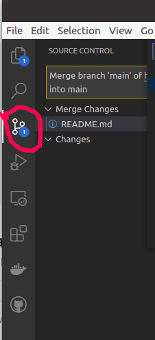
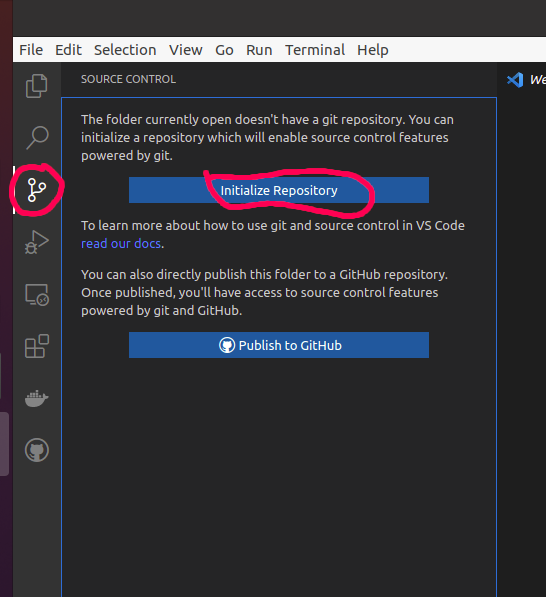
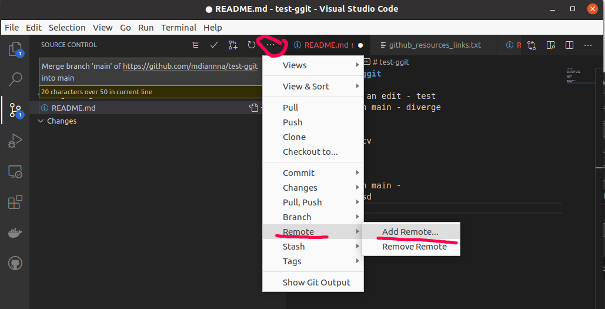
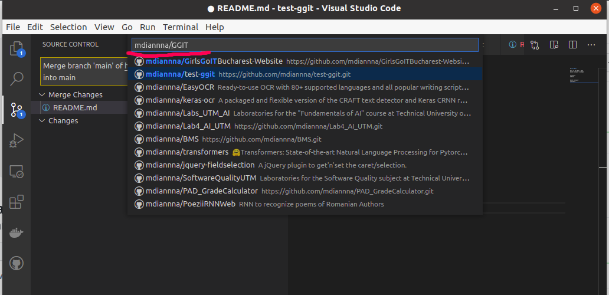
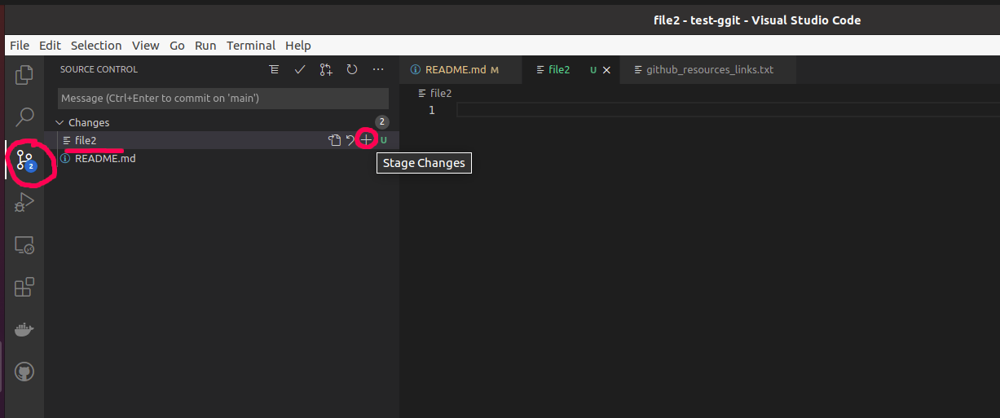
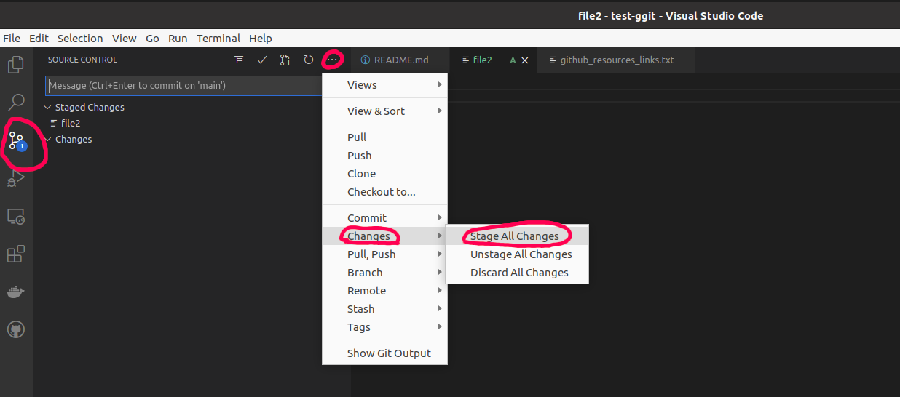
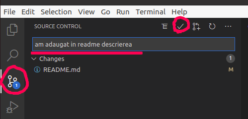
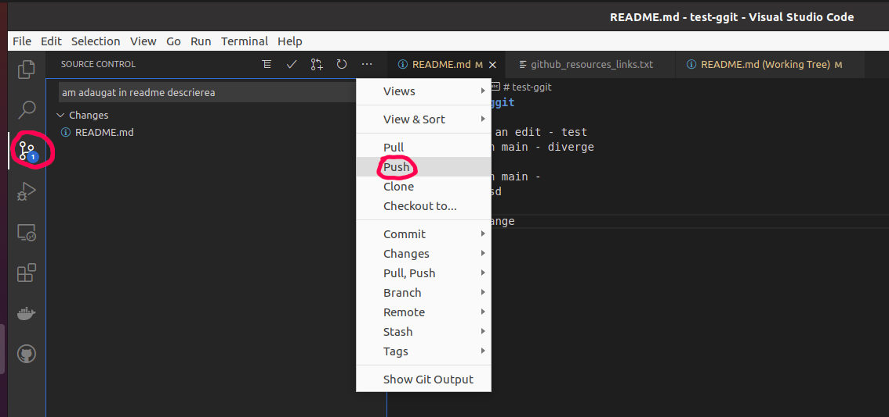
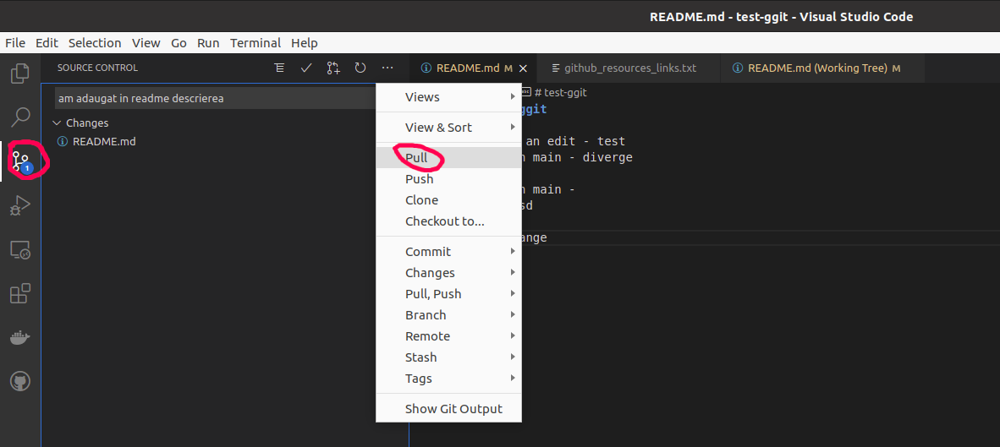

# Github

## Ce este Github și pentru ce se utilizează

Ți s-a întâmplat vreodată să vrei să te întorci la o versiune anterioară a codului? Poate ai vrut să repari ceva și de fapt ai stricat mai tare proiectul, sau poate ai lucrat cu cineva în echipă și a șters codul tău?

Imaginează-ți că există un așa sistem, care îți permite să salvezi diferite versiuni ale codului și să revii la versiuni anterioare, simplificând în același timp și procesul de programare în echipă. Fiecare persoană lucrează separat pe calculatorul personal, iar codul se salvează online, și vă permite să vedeți modificările făcute de fiecare, să reveniți la versiunile anterioare și să aveți asigurarea că proiectul vostru va fi salvat online, chiar dacă se strică calculatoarele personale. Ar fi super, așa-i?

Ei bine, așa sisteme există, iar unul dintre ele este _**Github**_.

### Cum facem un cont pe Github

Foarte simplu, intrăm pe [https://github.com/](https://github.com/) și apăsăm butonul verde _**Sign up for Github**_, după care completăm toate câmpurile necesare.


### Cum creăm un repozitoriu online pe Github

Vom intra pe github.com, ne vom loga cu utilizatorul creat, și în partea dreaptă a paginii vom găsi butonul + \(plus\), după care vom selecta prima opțiune - _**New repository**_


după care vom completa toate câmpurile necesare:


### Giithub+VSCode

În Visual Studio Code avem un tab special pentru Github, încercuit cu roșu în imaginea de mai jos:




Dacă nu aveţi git instalat deja pe calculator, este nevoie de instalat Git separat de pe link-ul [https://git-scm.com/](https://git-scm.com/). În unele cazuri, Visual Studio Code vă poate recomanda un link către website-ul git-scm.


### 

### Cum iniţializăm un proiect de pe calculatorul personal cu Github

```
echo "#Nume proiect" >> README.md
git init .
git add README.md
git commit -m "first commit"

git branch -M main
git remote add origin git@github.com:mdiannna/NumeRepo.git
git push -u origin main
```

#### DIn VSCode:

Pentru a iniţializa Github din VSCode, vom deschide folderul proiectului, şi în tabul pentru Github vom apăsa butonul _**Initialize Repository:**_



După aceasta, vom selecta din meniu opțiunea _**... &gt; Remote &gt; Add remote...:**_



După care vom scrie în căsuța de search numele repozitoriului creat pe Github \(de pe site-ul github.com\)



### Comenzi pentru a salva codul online pe Github

#### 1. git add

Prima comandă o vom folosi ca să selectăm ce fișiere vrem să fie trimise pe Github online în versiunea curentă.

Dacă am modificat un singur fișier:

```text
git add <numefisier>
```

sau dacă am modificat mai multe fișiere și vrem să le salvăm pe toate:

```text
git add .
```

Atunci când lucrăm cu VSCode, comanda _**add**_ pentru un singur fișier se face accesând butonul "+" de lângă numele fișierelor apărute în Changes, ca în imaginea de mai jos.



Pentru a adăuga toate fișierele în versiunea ce va fi trimisă pe Github, vom accesa meniul _**... &gt; Changes &gt; Stage all changes**_, ca în imaginea de mai jos:



#### 2. git commit

prima modalitate de a face commit este din terminal, scriind comanda:

```text
git commit -m "un mesaj scurt cu descrierea modificărilor"
```

SAU, pentru a face commit din VSCode, in partea stângă vom vedea o casetă de text si mai jos la "Changes" fișierele care au fost modificate. E necesar să scriem mesajul pentru commit în caseta respectivă, și apoi să apăsăm butonul bifă-



#### 3. git push

```text
git push origin main
```


În unele cazuri vom scrie _**master**_ în loc de _**main**_



Dacă lucrăm pe alt branch decât main, vom scrie numele branch-ului pe care lucrăm în loc de main


Alternativ, din VSCode:




Atenţie! Dacă nu merge opţiunea Push, atunci încercaţi opţiunea de mai jos _**Pull, Push &gt; Push to...**_ după care selectaţi linkul respectiv


### Comenzi pentru a descărca ultimele modificări pe calculatorul personal

```text
git pull origin main
```


Dacă lucrăm pe alt branch decât main, vom scrie numele branch-ului pe care lucrăm în loc de main


Alternativ, din VSCode:




Dacă nu merge opţiunea _**Pull**,_ încercaţi opţiunea _**Pull, Push &gt; Pull from ...**_ şi selectaţi link-ul către repozitoriul github din meniu


### Github Cheatsheets



 Github de fapt oferă mai multe posibilităţi şi are mai multe comenzi, însă în acest tutorial am prezentat doar funcţionalităţile de bază, cu care vom lucra la proiecte. Dacă vrei să afli mai multe, google it! :\)



