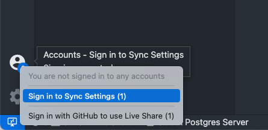
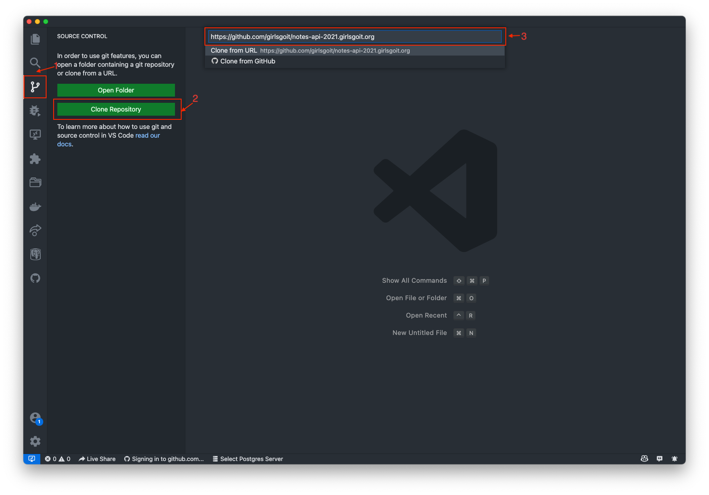
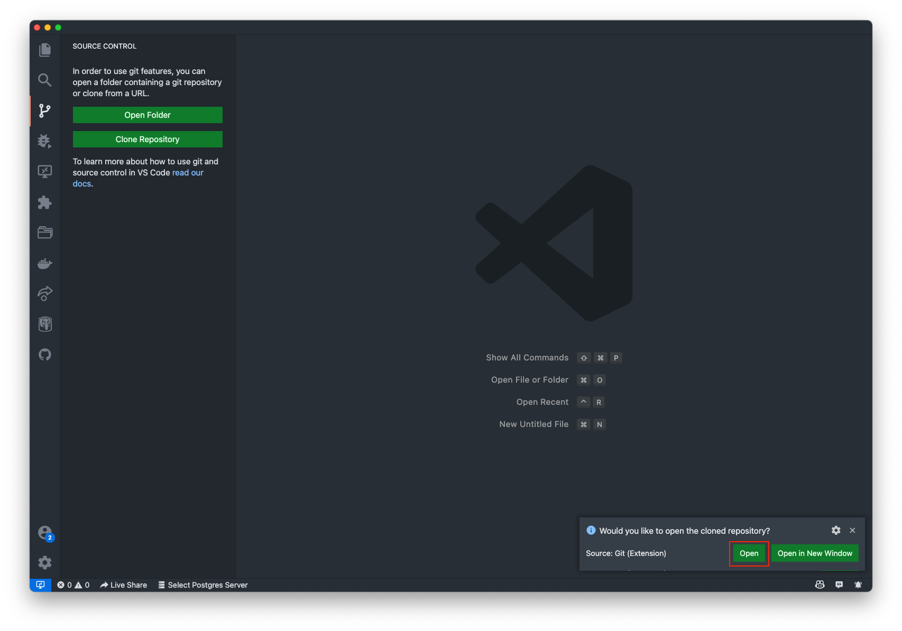
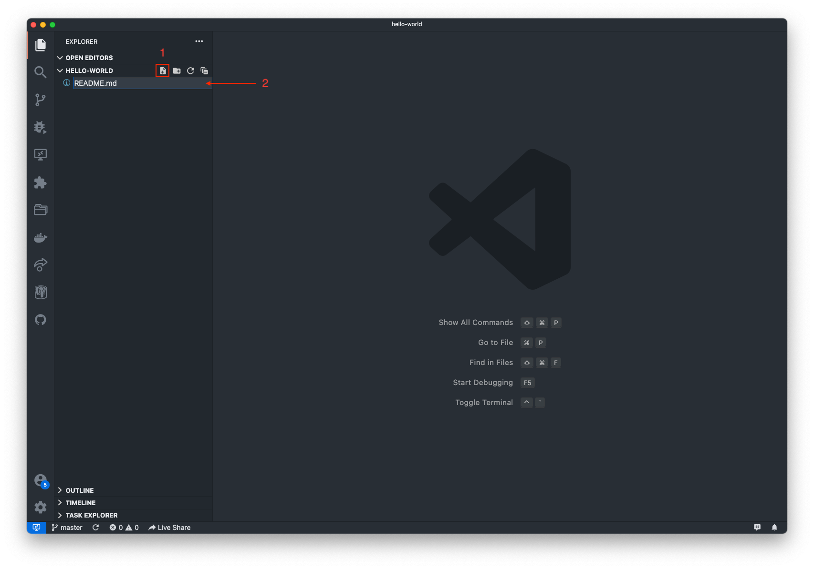
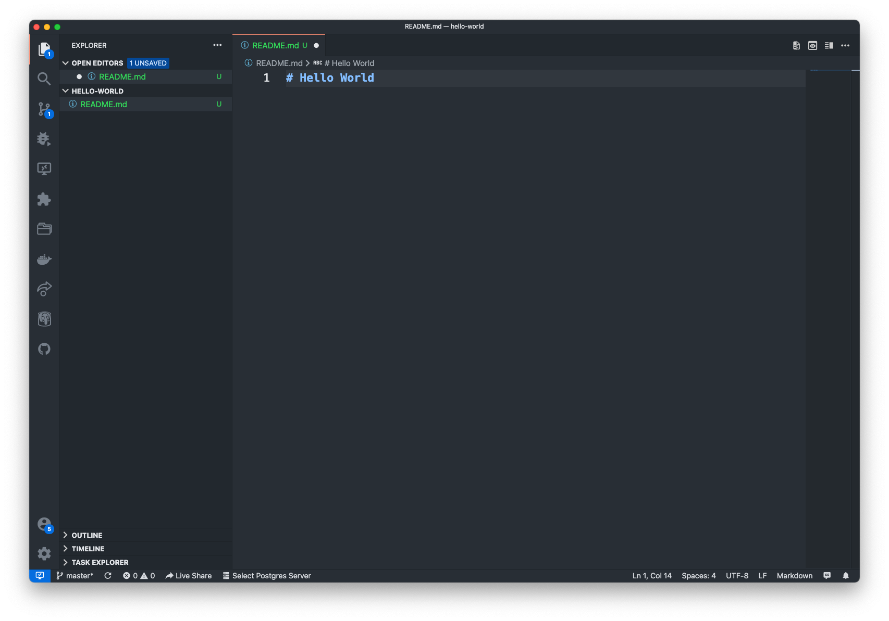
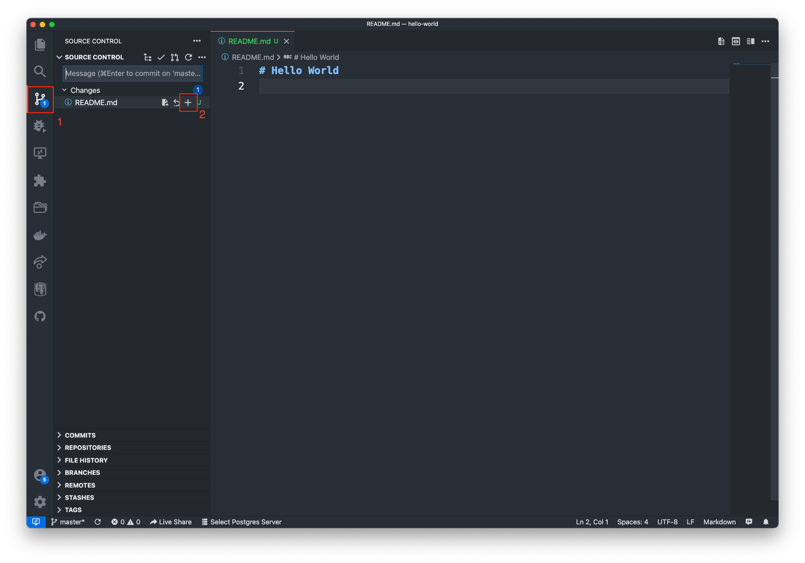
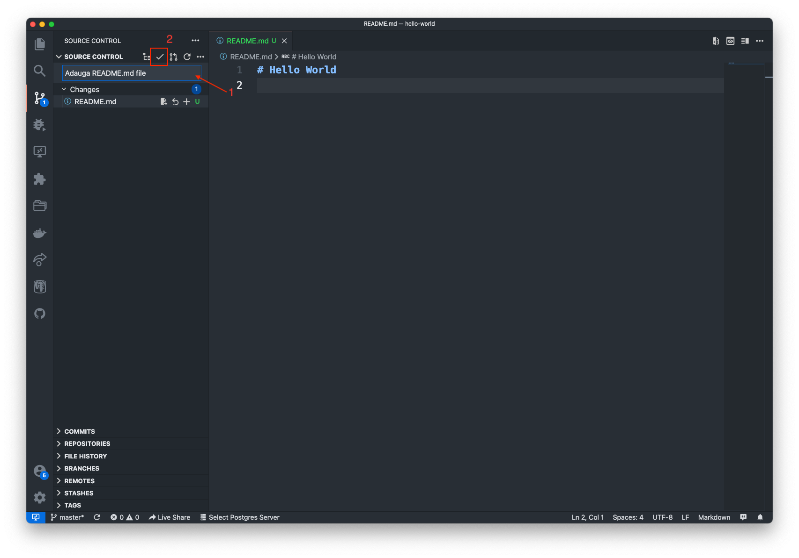
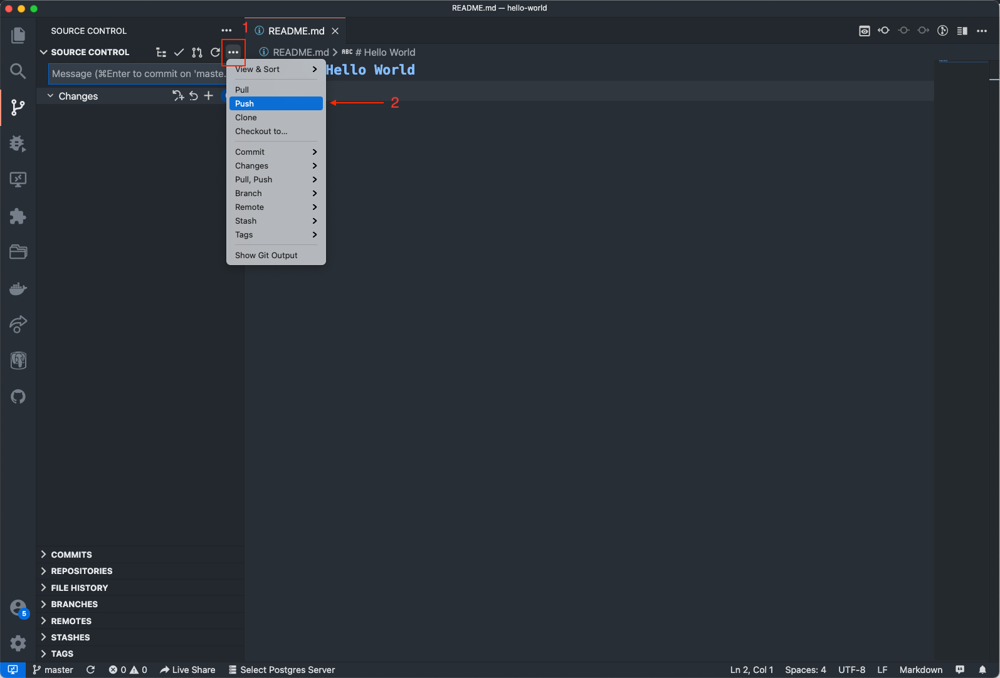
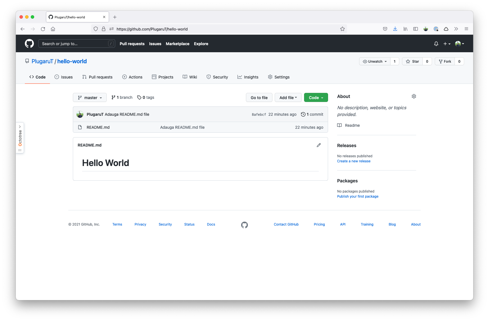

# GitHub

## Ce este GitHub și pentru ce se utilizează?

Ți s-a întâmplat vreodată să vrei să te întorci la o versiune anterioară a codului? Poate ai vrut să repari ceva și de fapt ai stricat mai tare proiectul, sau poate ai lucrat cu cineva în echipă și a șters codul tău?

Imaginează-ți că există un așa sistem, care îți permite să salvezi diferite versiuni ale codului și să revii la versiuni anterioare, simplificând în același timp și procesul de programare în echipă. Fiecare persoană lucrează separat pe calculatorul personal, iar codul se salvează online, și vă permite să vedeți modificările făcute de fiecare, să reveniți la versiunile anterioare și să aveți asigurarea că proiectul vostru va fi salvat online, chiar dacă se defectează calculatoarele personale. Ar fi super, așa-i?

Ei bine, așa sisteme există, iar unul dintre ele este GitHub.

## Cum facem un cont pe GitHub?

Foarte simplu, intrăm pe [https://github.com/](https://github.com/) și apăsăm butonul verde "**Sign up for GitHub".**

Completam toate câmpurile necesare pentru a ne înregistra.

În final, verificăm adresa de email pentru a confirma crearea contului GitHub.

Felicitări 🎉, acum faci parte din cea mai mare rețea de socializare pentru programatori 🤓

## Terminologie&#x20;

Înainte de a începe aș vrea să definim câteva concepte ce vor apărea destul de frecvent în această serie:

* **Repository**: este un spațiu de stocare pentru proiectul vostru care conține atât codul în sine cât și istoricul modificărilor și ramificațiile acestuia (branch-uri).
* **Branch**: versiunile de cod pot fi împărțite pe ramuri. Fiecare ramură va avea o copie a codului din momentul creării acesteia, iar toate modificările vor fi făcute asupra acestei copii până considerăm că este pregătită să fie inclusă din nou în ramura principală. Orice repository va avea cel puțin un branch (o ramură) numit prin convenție `main`.
* **Commit**: odată ce considerăm că modificările noastre sunt finale, putem crea un commit care să le conțină. Un commit va conține codul modificat și va putea fi accesat printr-un identificator unic (_hash_). Un repository va avea o înlănțuire de astfel de commituri care împreună vor forma un _istoric al modificărilor_.
* **Push**: în Git, un commit odată creat este păstrat local. Pentru ca restul echipei să vadă modificările aduse de commitul nostru, trebuie să _împingem_ (push) acele modificări către sistemul central.
* **Pull**: dacă un membru al echipei a efectuat o modificare asupra codului printr-un commit împins în sistemul central, noi nu vom avea acea modificare în copia noastră locală. Astfel, înainte de a ne împinge propriile modificări către serverul central, trebuie ca mai întâi să _tragem_ (_pull_) toate commit-urile apărute cât timp lucram la funcționalitatea noastră. În acest mod ne asigurăm că atunci când împingem propriul commit, vom include în acesta atât modificările noastre cât și ale echipei.

## GitHub + Visual Studio Code

Următorul pas este sa deschidem editorul nostru de cod, Visual Studio Code. In cazul in care nu îl ai instalat, vezi tutorialul de [aici](visual-studio-code.md).

Deschidem Visual Studio Code(VSCode) si folosim contul nostru de GitHub pentru a integra VSCode cu GitHub.

Apăsăm pe butonul "omuleț" si selectam "**Sign in to Sync Settings**"

O sa fim redirecționați in browser, pentru a integra contul GitHub cu VSCode.&#x20;

După ce am efectuat integrarea, urmează sa clonam repozitoriul pe care îl vom folosi pe tot parcursul evenimentului.

In imaginea de mai sus, apăsăm butonul "Source Control" **(1)**, apoi pe butonul "Clone Repository" **(2)**. In secțiunea **(3)**, e nevoie de introduceți link către repozitoriu pe care îl vom folosi pentru a colabora la proiect. Link-ul dat îl puteți lua din GitHub.

## Cum cream un repozitoriu pe GitHub?

În colțul din dreapta sus al oricărei pagini, utilizați meniul derulant și selectați **New repository**.

.png>)

Definiți un nume pentru depozitul dvs. și o descriere opțională.

.png>)

Alegeți o vizibilitate a repozitoriului. Pentru mai multe informații, consultați [„](https://docs.github.com/en/github/creating-cloning-and-archiving-repositories/about-repository-visibility)[About repository visibility](https://docs.github.com/en/github/creating-cloning-and-archiving-repositories/about-repository-visibility)[”](https://docs.github.com/en/github/creating-cloning-and-archiving-repositories/about-repository-visibility).

.png>)

Click **Create repository**.

.png>)

\
Cum clonam un repozitoriu?
--------------------------

O dată ce am creat un repozitoriu pe GitHub, numit `hello-world` urmează sa îl clonam pe calculatorul personal folosind VSCode.

.png>)

In imaginea de mai sus, apăsăm butonul "Source Control" **(1)**, apoi pe butonul "Clone Repository" **(2)**. In secțiunea **(3)**, e nevoie de introduceți link către repozitoriu pe care l-ai creat mai devreme. Link-ul dat îl puteți lua din GitHub.

O dată ce VSCode a clonat repozitoriul, apăsam butonul "Open" pentru a deschide repozitoriul. Momentan, repozitoriul nostru este gol.

## Cum facem commit la modificările personale?

Haide sa adaugăm un fișier in repozitoriul nostru, care, momentan este gol.

Cream un fișier nou **(1)** si ii setam numele "README.md" **(2)**, apoi apăsam tasta "Enter".

Deschidem fișierul nou creat si adaugăm ceva text in el.&#x20;

Nu uitam sa salvam fișierul nou creat folosind meniul `File -> Save`, sau, shortcut-ul `Ctrl + S`

O dată ce am creat fișierul, hai sa facem un commit si sa îl facem public pe GitHub.

Mergem in secțiunea "Source Control" **(1)**, iar apoi, facem "stage" **(2)** la modificările făcute. „Stage" înseamna ca urmează sa facem un commit.

Pentru ca dorim sa facem un commit, e nevoie sa definim ce modificări conține acel commit. Hai sa facem asta.&#x20;

In caseta de text **(1)** introducem mesajul dorit. Iar apoi, apăsam butonul bifa **(2)**.

O dată ce am făcut acest commit, hai sa facem si "Push" pe GitHub. Apăsam "···" **(1)** iar apoi selectam "Push" **(2)**.

Hai sa verificam daca modificările noastre sunt publice pe GitHub. Mergem in browser, accesam [http://github.com/ ](http://github.com/)si verificam in contul personal, repozitoriul creat de noi "hello-world". Ar trebui sa vezi aproximativ așa:

Felicitări 🎉, acum cunoști cum sa colaborezi cu alți programatori folosind `git` si GitHub.

## Resurse

* [Crearea, clonarea si arhivarea repozitoriilor](https://docs.github.com/en/github/creating-cloning-and-archiving-repositories)
* [Commite modificările tale în proiect](https://docs.github.com/en/github/committing-changes-to-your-project)
