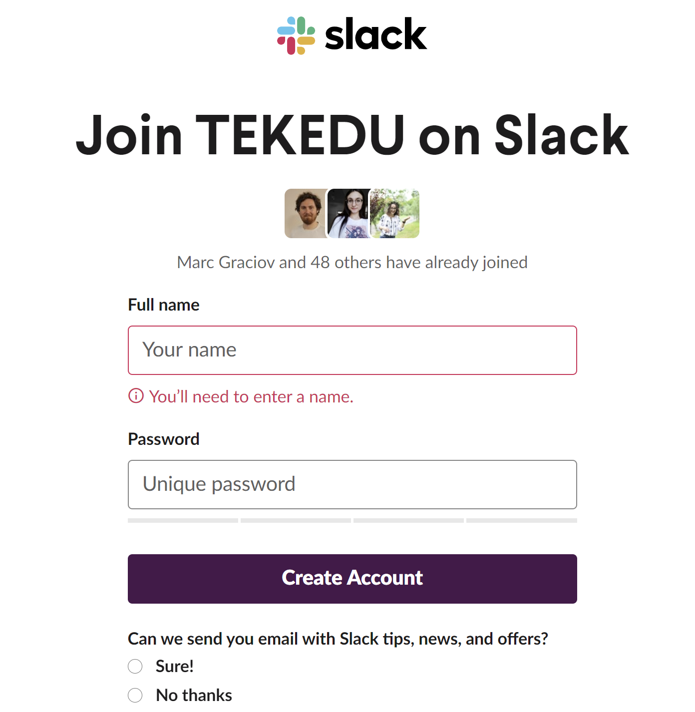
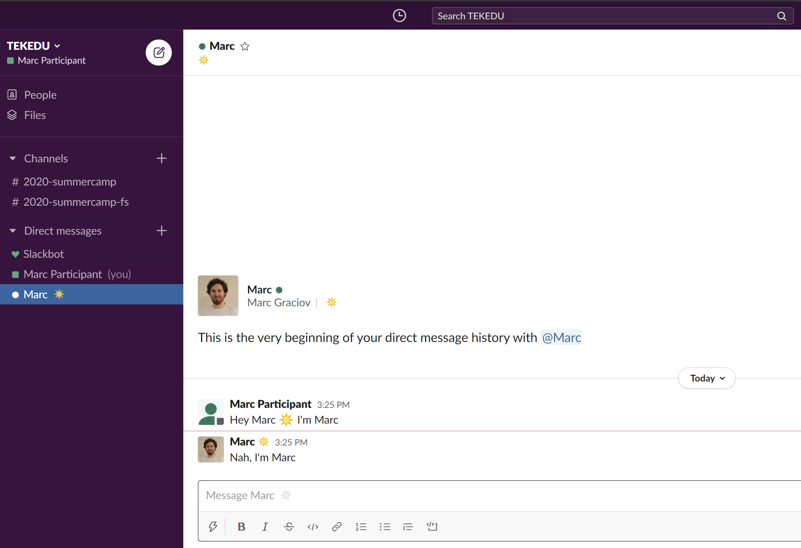
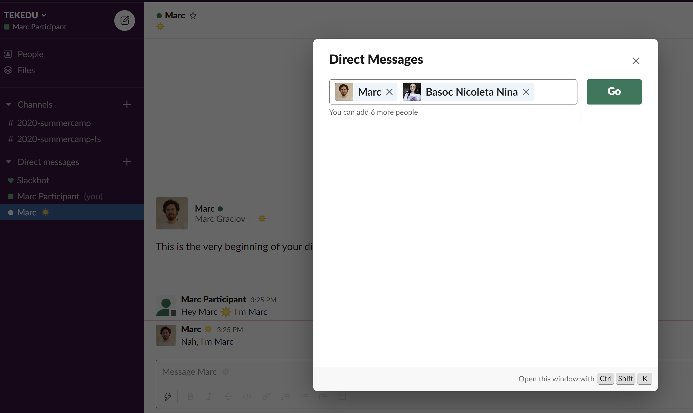

# Slack

## Înregistrare

### 1. Email

Veți primi un email cu invitația pe slack:

### 2. Înregistrare

Dați click pe butonul `Join Now`, care vă va duce pe pagina de înregistrare, unde numele si alegeți o parolă. Țineți minte această parolă :\) 

### 3. Workspace

După acest pas, veți vedea așa numitul workspace:

În partea stângă aveți 2 grupuri importante:

* **Channels** - grupuri globale care vor include un grup general \(toți participanții\) și grupul track-ului vostru
* **Direct Messages** - mesaje directe între voi, puteți organiza și mesaje in grup

Ca regulă generală - **Channels** vor fi create de mentori, iar mesajele directe deja le veți crea oricând aveți nevoie să comunicați cu cineva direct sau într-un mic grup. 

Pentru a porni un mesaj direct nou, apăsați pe `+` la **Direct Messages** și alegeți cu cine vreți să porniți un mesaj direct:

## Aplicația desktop

Până acum am văzut cum arata **Slack** în browser, dar el e mult mai comod dacă descărcați varianta offline. Pentru asta trebuie să-l descarcăm și să configurăm **Workspace-ul**

### **1. Descărcarea aplicației**

Pentru a instala aplicația desktop, mergeți pe link-ul de mai jos, după care descărcați și instalați aplicația. La acest pas nu are nimic deosebit ce ar trebui să faceți, doar o instalați ca și orice altă aplicație.



### 2. Configurarea aplicației

După ce instalați aplicația Slack, vă întâlnește fereastra de autentificare:

Dați click pe **Sign In -** următoarea fereastră o să vă întrebe să alegeți un **workspace** în care să vă autentificați:

Observați jos că deja apare **TEKEDU**, ca unul care e deja autentificat, dați click pe el.

În final sunteți prezentat cu aceeași fereastră de workspace, dar deja în aplicație, salutați lumea! 

### Extra

Dacă nu ați avut alegere la etapa anterioară să alegeți **TEKEDU** ca un workspace în care deja sunteți autentificați:

1. scrieți `tekedu` în câmpul `your-workspace-url`
2. Introduceți emailul personal și parola de slack care ați ales-o la pasul **2. Înregistrare**

Dacă vreți să folosiți doar aplicația în browser, o puteți accesa oricând pe link-ul



